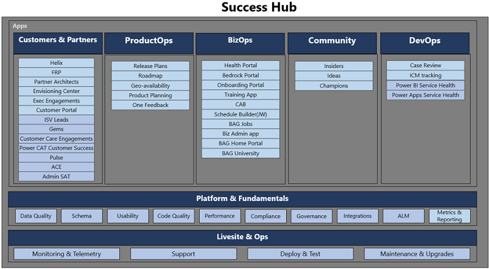

# Digitalizing Business Application Group 

To holistically digitalize a large organization like Business Application Group (BAG), we need to automate all the four aspects of the digital feedback loop shown below.

> [!div class="mx-imgBorder"] 
> 

1. Transforming products to enhance the offerings, for example, publishing release notes on upcoming release wave deliveries.
2. Engaging with the customers and partners to boost the business growth, for example, customer engagements or taking feedback and ideas from the customers. 
3. Empowering its own people to improve an organization’s performance.
4. Optimizing the business operations to achieve better efficiency, for example, automating business reviews.

To digitalize all the four aspects discussed above, we have divided our apps into various workstreams. Each workstream is focused on a specific persona:

:::image type="content" source="media/successhub-persona-focused-workstreams.png" alt-text="Persona focused workstreams":::

This is how 35+ apps are modelled across these 5 workstreams. 

> [!div class="mx-imgBorder"] 
> 

Apps are adding the data in Microsoft Dataverse utilizing the data shared by other apps to improve the app experience using automation and intelligence. Data can also be used to provide cost-cutting scenarios on how the data gets leveraged by various apps.

**Product development scenario**

1. Microsoft engages and interacts with the customer. There are numerous apps in customer and partner workstream, for example, customer engagement, exec engagement, Fast Track apps, Power CAT, etc. Each of these is focused on a specific persona.
2. Microsoft gathers feedback from the customers. There are numerous apps in Customer & Partners, and Community work streams, for example, Ideas, Pulse, Heartbeat (for Fast Track). 
3. Aggregate and prioritize feedback/asks using Fusion/One feedback app in the ProductOps workstream.
4. Implement the feature feedback/asks using product planning with apps in the ProductOps workstream.
5. Announce the plan to the customers using the release plan app in the ProductOps workstream exec reviews. This is automated using the bedrock portal which is part of BizOps workstream.

**Supportability scenarios**

1. Customer creates a support request. This is done with D4M part of the DevOps workstream.
2. Engineer reviews the case to prevent future cases. This is done with the Case review app which is part of the DevOps workstream.
3. Product team plans for the work to be done. This is done with product planning app in Product Ops workstream.
4. Close the loop with customers who face the issue with apps in the Customer & Partner workstream.
5. Close the loop with customers who gave the feedback with apps in the Customer & Partner workstream.

## Success Hub co-development model

Challenge of the co-development model is to enable everyone to co-develop (at scale) and yet don’t disturb other apps. To make it scalable, we have divided this problem per workstream. As discussed earlier, we have 5 workstreams focused on app development and appointed workstream leads to ensure all the apps in that workstream are honoring the governance process as well as getting the right support from the Success Hub team.
Whenever any major changes are requested by an app, it needs to go through the following 5 steps, to get into production.

image

As we have 35+ apps working on the platform, it is not scalable to review all the changes e.g. changing a text box color in the app, might not impact any other app. Hence, we are focused more on the changes associated to any changes in the entity. Rest all the other changes are tagged as small scope, and its optional for the app teams to review them with the Success Hub team. 

Now, changes to the entity can be of two types:

1. Creating a new entity: Many a times, app teams want to create their own entity and be independent. But if we let that happen it will create multiple entities for the same work and will lead to confusions. Reconciling these entities in future will take enormous time and efforts, compared to asking app teams to adopt the ones which are available OR modifying the current entities to meet the needs of all the app teams.
2. Changes to a Shared entity: There can be two type of changes in shared entity.
    1. Changing the schema: This needs alignment across the apps which are already using the entity. 
    2. Changing the data e.g. Taxonomy: Since the apps are sharing the data in the entity, its necessary to have single team manage that or at least govern it. 

## Deployment (ALM) & Live site 

Success Hub follows a weekly deployment cycle where CDS components are reviewed in a PR review meeting and subsequently deployed to Test every Wednesday. Partner teams have two days to validate their apps and solution changes in the Test environment. Post validation we obtain a sign off from partner teams and deploy these components to Production environment on Monday. 

Power Platform also enable us to automate our support process, where emails to the support alias are tracked in a ticketing system. These items are reviewed in a “Live Site Review” every week to understand the health of the Success Hub and identify repair items/trends of user queries.

To monitor the health of components, we have:
 
- Dev-Test-UAT-Prod ALM model
  - Dev environment (per app)
  - Test environment (Single instance)
  - UAT environment (Single instance)
  - PROD environment (Single instance)
  - POC environment for teams to just try out!
- Build and Release Pipeline are managed through Azure DevOps, using ‘Power Platform Build Tools’
- Dev & Test environments are refreshed every week (automated fashion) with every weekly build.
- Automated tests run in Test environments & UAT environments. This ensures smoother co-development.
- Every app is a solution and is on the way of becoming Managed solution.

## Security & Compliance Integration 

- High Volume of Read Only data -> There are instances in Success Hub where data is needed only for reference purposes. One such example is the DAU, WAU and MAU of Tenants. This data is used to understand usage but never modified within Success Hub. We use Virtual entities to render such data which can be high volume and read only in nature.  
- High Volume of RW data -> While Flows meet most of our integration needs, there are scenarios where advanced Azure capabilities are needed, for e.g. invoking Azure Functions. For these, we use Logic Apps. 
- Simple integration -> Flows are used extensively to build integrations as well as business logic within our org. 
- Specific roles are created to honor security.
- Regular compliance reviews at Success Hub level. 
- Success Hub stores lot of sensitive information. 
- App team doesn’t need to do compliance reviews if they are using existing data entities and integrations.

## Integration with other data sources 

For business apps, we often need data from various data sources and Dataverse provides a great way to integrate with other data sources using virtual entity, etc. For We have integration with following type of data sources

1. Microsoft Customer, sales & partner data (MSX, LCS, Customer Service, etc.)
2. DevOps & Serviceability (Azure DevOps, ICM, etc.)
3. Organization hierarchy and user profiles (AAD & Graph)

## Support & Maintenance Support channels 

- Wiki/Guidance & Weekly Office hours to ask questions 
- Maintenance (alerting and monitoring) done by single team (Platform workstream). 
- Telemetry Dashboard to track performance and health metrics

All of these functionalities enable developing, supporting, and maintaining any app.
