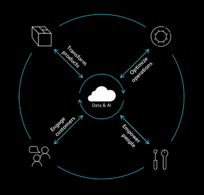
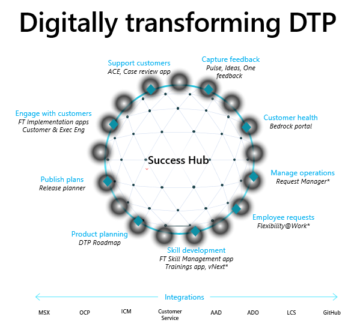

# Digitizing the Business Applications Group 

To holistically digitize a large organization like the Digital Transformation Platform (DTP) at Microsoft, we need to automate all four aspects of the digital feedback loop.

- **Transforming** products to enhance our offerings&mdash;for example, publishing release notes about upcoming release wave deliverables.
- **Engaging** with customers and partners to boost business growth&mdash;for example, customer engagements and taking feedback and ideas from customers. 
- **Empowering** our own people to improve our organization's performance.
- **Optimizing** business operations to achieve better efficiency&mdash;for example, by automating business reviews.

Here is an example of apps developed on Success Hub; bringing the digital feedback loop to reality in our organization.

  

## Workstreams and personas

To digitize all four aspects of the feedback loop, we divide our apps into various workstreams. Each workstream is focused on a specific persona, as shown in the following image.

:::image type="content" source="media/successhub-persona-focused-workstreams.png" alt-text="Diagram showing five persona-focused workstreams: DevOps, ProductOps, Customers & Partners, Community, and BizOps" border="false":::

The following image shows how 35 apps are modeled across these five workstreams.

:::image type="complex" border="false" source="media/successhub-apps-modelled-across-workstreams.png" alt-text="Apps modeled across workstreams.":::
Five workstreams listed, each with business apps. Platform and Fundamentals list - Data quality, Schema, Usability, etc. Livesite and Ops list - Monitoring and telemetry, Support, Deploy and test, Maintenance upgrades.
:::image-end:::

Apps add data in Microsoft Dataverse, using the data shared by other apps to improve the app experience with automation and intelligence. Data can also be used to provide cost-cutting scenarios for how the data gets used by various apps.

### Product development scenario

1. Microsoft engages and interacts with the customer. There are numerous apps in the Customers & Partners workstream, for example, customer engagement, executive engagement, FastTrack apps, and Power CAT. Each of these is focused on a specific persona.
2. Microsoft gathers feedback from customers. There are numerous apps in the Customers & Partners and Community workstreams, for example, Ideas, Pulse, and Heartbeat (for FastTrack). 
3. Aggregate and prioritize feedback and asks by using the Fusion/One feedback app in the ProductOps workstream.
4. Implement the feature feedback and asks by using product planning apps in the ProductOps workstream.
5. Announce the plan to the customers by using the release plan app in the ProductOps workstream executive reviews. This is automated by using the bedrock portal, which is part of the BusinessOps workstream.

### Supportability scenario

1. A customer creates a support request. This is done with the D4M part of the DevOps workstream.
2. An engineer reviews the case to prevent future cases. This is done with the Case review app, which is part of the DevOps workstream.
3. The product team plans for the work to be done. This is done with the product planning app in the Product Ops workstream.
4. Close the loop with customers who face the issue by using apps in the Customers & Partners workstream.
5. Close the loop with customers who gave the feedback by using apps in the Customers & Partners workstream.

## Success Hub co-development model

The challenge of the co-development model is to enable everyone to co-develop, at scale, and not disturb other apps. To make this scalable, we divide the problem by workstream. For each of the five workstreams that are focused on app development, we appoint workstream leads. Their job is to ensure that all the apps in that workstream honor the governance process and, in addition, get the right support from the Success Hub team.

Whenever any major changes are requested for an app, it needs to go through the following five steps to get into production.

1. Scope alignment: Review high-level user experience and schema changes. 
2. Update Microsoft Azure DevOps: Add feature and user stories, and update them with schema changes. 
3. Partner approval: Approval mail sent to affected stakeholders. 
4. Workstream lead sign-off: Sign-off on the changes by the workstream leads. 
5. Changes deployed: PR reviews and verifies schema changes and work items.

Because we have about 35 apps working on the platform, it's not scalable for us to review all the changes. Some changes&mdash;for example, adding an icon for a custom table or changing the sorting in a custom view for a custom table&mdash;might not affect any other app, and those are tagged as small scope; it's optional for the app teams to review them with the Success Hub team. Our main focus is to assess any changes associated with tables.

We're interested in knowing when teams make the following types of changes around tables:

- **Creating a new table**: Many times, app teams want to create their own table and work independently with the data. But if we let that happen, multiple tables can be created for the same work, leading to confusion. Reconciling these tables takes significant time and effort, compared to asking app teams to adopt tables that are already available or modifying current tables to meet their&mdash;and all app teams'&mdash;needs.

- **Changes to a shared table**: These are of two types:

  - **Changing the schema**: This needs alignment across the apps that are already using the table. 
  - **Changing the data (for example, Taxonomy)**: Because apps are sharing the data in the table, it's necessary to have a single team manage that data, or at least create governance rules for it.

## Deployment and live site

Success Hub follows a weekly deployment cycle where Microsoft Dataverse components are reviewed in a partner meeting and subsequently deployed to a test environment every Wednesday. Partner teams have two days to validate their apps and solution changes in the test environment. After validation, we obtain sign-off from the partner teams and deploy these components to a production environment the next Monday. 

Microsoft Power Platform also enables us to automate our support process, where emails to the support alias are tracked in a ticketing system. These items are reviewed in a live site review every week to understand the health of the Success Hub and identify repair items and the trends of user queries.

To monitor the health of components, we use the following:
 
- An application lifecycle management (ALM) model, which consists of the following:
  - Development environment (per app)
  - Test environment (single environment)
  - User acceptance testing (UAT) environment (single environment)
  - Production environment (single environment)
  - Proof-of-concept environment for teams to try out their apps
- The build and release pipelines are managed through Azure DevOps by using Power Platform Build Tools.
- Dev and test environments are refreshed every week in an automated fashion through weekly builds.
- Automated tests are run in test environments and UAT environments. This helps ensure smoother co-development.
- Every app is a solution and is in the process of becoming a managed solution.

## Security and compliance integration

After security and compliance integration is finished, it can be used by any app in development. This integration has the following characteristics:

- A high volume of read-only data: In some instances in Success Hub, we only need data for reference purposes&mdash;for example, the daily, monthly, and weekly active user metrics for a tenant. This data is used to understand usage, but never modified in Success Hub. We use virtual tables to render such data, which is often high-volume and read-only.  
- A high volume of read-write data: While Power Automate flows meet most of our integration needs, advanced Azure capabilities are needed in some scenarios, for example invoking Azure Functions. For these, we use Azure Logic Apps. 
- Simple integration: Flows are used extensively to build integrations in addition to business logic in our organization. 
- Specific roles are created to honor security.
- We hold regular compliance reviews at the Success Hub level because Success Hub stores a lot of sensitive information.
- App teams don't need to do compliance reviews if they're using existing data tables and integrations.

## Integration with other data sources

For business apps, we often need data from various data sources. Microsoft Dataverse provides a great way to integrate with other data sources by using virtual tables. We integrate with the following types of data sources:

- Microsoft customer, sales, and partner data (for example, Microsoft Sales Experience, Lifecycle Services, Customer Service)
- DevOps and Serviceability (Azure DevOps and IcM Incident Management, for example)
- Organization hierarchy and user profiles (Azure Active Directory and Microsoft Graph)

## Support and maintenance channels

The following channels enable any app to be developed, supported, and maintained:

- Wiki, guidance, and weekly office hours for asking questions 
- Maintenance (alerting and monitoring) done by a single team (Microsoft Power Platform workstream)
- Telemetry dashboard to track performance and health metrics
