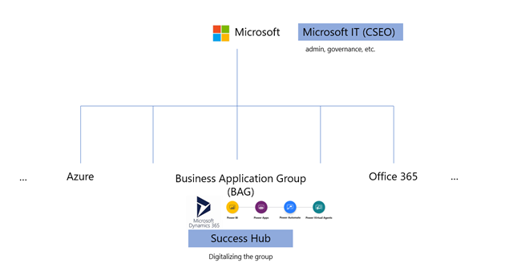

# Overview of Success Hub

Traditionally, in larger organizations, there have been central IT teams to develop and manage business applications. These IT teams were maintaining an ever-growing backlog with no way for each of the requirements to be developed. This lead to productivity loss across the organization making it necessary for sub organizations to have their own teams for their digitalization. Microsoft Power Apps and Power Platform empower individuals in the organization to develop apps for their team’s business needs and not to be blocked on a central IT team. But, with every employee developing apps on their own, there arises problems of reusability – both for the data and apps at the organization level along with support and maintenance. For organization digitalization, we need to look beyond a specific team’s needs and implement things for the organization.

In Microsoft there are multiple sub-divisions/organizations focused on specific products/services. One of them is the Business Application Group (BAG) which is focused on product development of Microsoft Dynamics 365 and Power Platform. BAG has more than 5,000 people with custom needs of its own. Success Hub is a platform enabling digitalization for BAG, whereas Microsoft IT (CSEO) plays the role of Center of Excellence enabling Power Platform governance and environment strategy for all of Microsoft. 

> [!div class="mx-imgBorder"] 
> 

## What is Success Hub?

Success Hub is a platform based on Microsoft Dataverse, where teams within BAG can develop their apps and share/reuse the data from other apps and systems. There are about 35+ business apps on the platform which are developed by 20+ teams. It has enabled BAG to achieve the balance between agility and governance.

> [!div class="mx-imgBorder"] 
> 

## Advantages of using Success Hub

The following are some advantages of using Success Hub when compared to development by Central IT and individual employees:

> [!div class="mx-imgBorder"] 
> 

<!--
<table>
<thead>
  <tr>
    <th rowspan="2"></th>
    <th>Microsoft</th>
    <th colspan="2">Business Application Group</th>
  </tr>
  <tr>
    <td><strong>Central IT  (Center of Excellence)</strong></td>
    <td><strong>Success Hub</strong></td>
    <td><strong>Individual employees</strong></td>
  </tr>
</thead>
<tbody>
  <tr>
    <td><strong>App development</strong></td>
    <td>Central IT team Bottlenecked on one team</td>
    <td>Individual employees/teams Not bottlenecked on single team</td>
    <td>Individual employees/teams Not bottlenecked on single team</td>
  </tr>
  <tr>
    <td><strong>Data storage and governance</strong></td>
    <td>Central IT team</td>
    <td>Sucess Hub team</td>
    <td>Individual employees/teams Data doesn't talk to each other</td>
  </tr>
  <tr>
    <td><strong>Integration</strong></td>
    <td>Central IT team</td>
    <td>Success Hub team No need to duplicate the efforts</td>
    <td>Individual employees/teams Multiple efforts for the same thing</td>
  </tr>
  <tr>
    <td><strong>Compliance and security</strong></td>
    <td>Central IT team</td>
    <td>Success Hub team No need to duplicate the efforts</td>
    <td>Individual employees/teams Multiple efforts for the same thing</td>
  </tr>
  <tr>
    <td><strong>Support and maintenance</strong></td>
    <td>Central IT team Bottlenecked on one team</td>
    <td>Success Hub team + Individual teams No need to duplicate the efforts</td>
    <td>Individual employees/teams Not bottlenecked on single team</td>
  </tr>
</tbody>
</table>
-->

Success Hub provides the following:

- **Shared apps and data**: Since the data is stored in a single Microsoft Dataverse instance, many apps uses the same data for their apps. For example, tables like Account, Contacts, and Product are widely used across multiple apps. 
- **Integration with other data sources**: Apps do need data from other systems within Microsoft - for example, sales data, support data, etc. These integrations are already enabled within Success hub for any app to use it.
- **[Governance for co-development](../adoption/admin-best-practices.md)**: Governance model for multiple teams to co-develop at the same time on the platform.
- **[Application lifecycle management (ALM)](../../alm/overview-alm.md)**: ALM features provides (for example, dev environments, deployments, etc.) for teams to get started quickly.
- **Compliance and security**: Success Hub platform takes care of the compliance, security, and privacy reviews on a regular basis.
- **Support and maintenance**: App teams can leverage designated support and live site team and channels.

### See also
[Digitalizing Business Application Group](digitalizing-business-application-group.md)