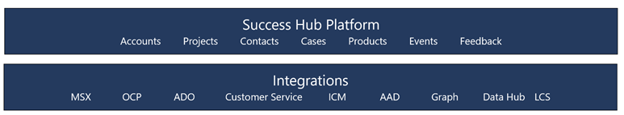

# Overview of Success Hub

Traditionally, larger organizations have relied on central IT teams to develop and manage business applications. As the backlog of applications inevitably grows, a central IT team can be hard-pressed to maintain the applications, much less analyze how they might be developed to meet the requirements of the larger organization. This can lead to productivity loss across an organization, making it necessary for subdivisions to devote their own teams to the digitizing effort.

Power Apps and Microsoft Power Platform empower individuals in an organization to develop apps for their team's business needs without being blocked by a central IT team. But, with employees developing apps on their own, the problem of reusability&mdash;both for data and for apps at the organization level&mdash;arises, along with the challenges of supporting and maintaining the apps. For organization digitization, we need to look beyond the needs of a specific team and implement a digitization strategy for the entire organization.

At Microsoft, multiple subdivisions focus on specific products and services. One of these is the Business Applications Group (BAG), which is focused on Dynamics 365 and Microsoft Power Platform. BAG has more than 5,000 people who have custom needs of their own. The Success Hub platform enables digitization for BAG, and Microsoft Central IT plays the role of a Center of Excellence, enabling the Microsoft Power Platform governance and environment strategy for all of Microsoft.

:::image type="complex" source="media/successhub-org-chart.png" alt-text="Org chart showing Success Hub supports the BAG group.":::
   "Org chart showing various groups reporting into Microsoft Corporation, which is supported by Central IT. Success Hub supports the BAG group."
:::image-end:::

## What is Success Hub?

Success Hub is a platform based on Microsoft Dataverse. Teams in BAG develop their apps on Success Hub, and share or reuse data from other apps and systems. About 35 business apps on the platform have been developed by 20 or so teams. This has enabled BAG to achieve a balance between agility and governance.

> [!div class="mx-imgBorder"] 
> 

## Advantages of using Success Hub

The following table summarizes the advantages of using Success Hub compared to development by central IT and individual employees.

<table>
<thead>
<tr>
    <td>&nbsp;</td>
    <td><strong>Central IT  (Center of Excellence)</strong></td>
    <td><strong>Success Hub</strong></td>
    <td><strong>Individual employees and teams</strong></td>
  </tr>
</thead>
<tbody>
  <tr>
    <td><strong>App development</strong></td>
    <td>Disadvantage  <i>Bottlenecked on one team</i></td>
    <td>Advantage <i>Individual employees and teams aren't&nbsp;bottlenecked&nbsp;by a single team</i></td>
    <td>Advantage <i>Not bottlenecked by a single team</i></td>
  </tr>
  <tr>
    <td><strong>Data storage and governance</strong></td>
    <td>Advantage</td>
    <td>Advantage</td>
    <td>Disadvantage <i>Data in one app doesn't talk to other apps</i></td>
  </tr>
  <tr>
    <td><strong>Integration</strong></td>
    <td>Advantage</td>
    <td>Advantage <i>No need to duplicate efforts</i></td>
    <td>Disadvantage <i>Multiple efforts to do the same thing</i></td>
  </tr>
  <tr>
    <td><strong>Compliance and security</strong></td>
    <td>Advantage</td>
    <td>Advantage <i>No need to duplicate efforts</i></td>
    <td>Disadvantage <i>Multiple efforts to do the same thing</i></td>
  </tr>
  <tr>
    <td><strong>Support and maintenance</strong></td>
    <td>Disadvantage <i>Bottlenecked on one team</i></td>
    <td>Advantage <i>No need to duplicate efforts with individual teams</i></td>
    <td>Advantage <i>Not bottlenecked by a single team</i></td>
  </tr>
</tbody>
</table>

- **Shared apps and data**: Because data is stored in a single Microsoft Dataverse instance, the same data tables&mdash;for example, Account, Contact, and Product&mdash;can be widely shared across multiple apps. 
- **Integration with other data sources**: Apps do need data from other systems in Microsoft&mdash;for example, sales and support data. These integrations are already enabled in Success Hub for any app to use.
- **[Governance for co-development](../adoption/admin-best-practices.md)**: The governance model allows for multiple teams to co-develop at the same time on the platform.
- **[Application lifecycle management (ALM)](../../alm/overview-alm.md)**: ALM features (such as dev environments and deployments) are provided to help teams get started quickly.
- **Compliance and security**: Success Hub takes care of compliance, security, and privacy reviews on a regular basis.
- **Support and maintenance**: App teams can take advantage of designated support and live site reviews.

### See also

[Digitizing the Business Applications Group](digitizing-business-application-group.md)
