---
title: |

  Microsoft Dataverse for Teams – Governance playbook
---

# Contents

Introduction 4

Purpose of this playbook 4

Scope of this playbook 4

Chapter 1: Overview 5

Key components 5

Where do I start? 6

Step by step – Install the apps 6

Install and extend the sample apps 9

Create your first app 9

Step by step – Create your first app 9

Create your first bot 11

Step by step – Build your first bot 11

Licensing 11

Architecture Overview 11

Tables in Dataverse for Teams 11

Manage 12

What admin roles are required? 12

Where do I perform admin tasks? 13

Learn environment and capacity limits 14

Publishing Apps 14

Step by step – Publish an app in Microsoft Teams 14

Step by step – Share a broad distribution app 15

Publishing Chatbots 15

Step by step – Share a bot with your teammates 15

Step by step – Share a bot with your organization 16

Use Teams setup policies to improve adoption. 17

Step by Step - Using a Policy 17

Secure 26

Discovering your current state 26

What environments exist? 26

What apps and flows already exist? 26

Layers of Security 27

Setup Team's app permission policies 27

Controlling Power Platform Apps 28

Example Strategy - Encourage app and chatbot building 29

Example Strategy - Control app and chatbot building 29

Considerations when using permission policies 29

Step by step – Disable for all users in global default policy 30

Step by step – Allow specific Users/Groups to create 32

Enable users to install bots in Microsoft Teams 35

Enable users to install bots built by their teammates 35

Approve org-wide bots for users to install 36

Setup DLP policies for connector usage 36

Strategies for creating DLP policies 37

Share a pilot app with several users 38

Call to action 38

Monitor and Alert 38

Install CoE starter kit in Dataverse for Teams 38

Monitor capacity & adoption. 38

Step by step – Govern environment creation 39

Use audit logs to review installation activity 39

Upgrade 39

Benefits of upgrading 39

After upgrading 40

Accessing upgraded environment in Power VIrtual Agents 40

Nuture and educate 40

Next Steps 41

**Error! Hyperlink reference not valid.** **Error! Hyperlink reference not valid.** **Error! Hyperlink reference not valid.** **Error! Hyperlink reference not valid.** **Error! Hyperlink reference not valid.** **Error! Hyperlink reference not valid.** **Error! Hyperlink reference not valid.** **Error! Hyperlink reference not valid.** **Error! Hyperlink reference not valid.** **Error! Hyperlink reference not valid.** **Error! Hyperlink reference not valid.** **Error! Hyperlink reference not valid.** **Error! Hyperlink reference not valid.** **Error! Hyperlink reference not valid.** **Error! Hyperlink reference not valid.** **Error! Hyperlink reference not valid.** **Error! Hyperlink reference not valid.** **Error! Hyperlink reference not valid.** **Error! Hyperlink reference not valid.** **Error! Hyperlink reference not valid.** **Error! Hyperlink reference not valid.** **Error! Hyperlink reference not valid.** **Error! Hyperlink reference not valid.** **Error! Hyperlink reference not valid.** **Error! Hyperlink reference not valid.** **Error! Hyperlink reference not valid.** **Error! Hyperlink reference not valid.** **Error! Hyperlink reference not valid.** **Error! Hyperlink reference not valid.** **Error! Hyperlink reference not valid.** **Error! Hyperlink reference not valid.** **Error! Hyperlink reference not valid.** **Error! Hyperlink reference not valid.** **Error! Hyperlink reference not valid.** **Error! Hyperlink reference not valid.** **Error! Hyperlink reference not valid.** **Error! Hyperlink reference not valid.** **Error! Hyperlink reference not valid.** **Error! Hyperlink reference not valid.** **Error! Hyperlink reference not valid.** **Error! Hyperlink reference not valid.** **Error! Hyperlink reference not valid.** **Error! Hyperlink reference not valid.** **Error! Hyperlink reference not valid.** **Error! Hyperlink reference not valid.** **Error! Hyperlink reference not valid.** **Error! Hyperlink reference not valid.** **Error! Hyperlink reference not valid.** **Error! Hyperlink reference not valid.** **Error! Hyperlink reference not valid.** **Error! Hyperlink reference not valid.** **Error! Hyperlink reference not valid.**

# Introduction

Microsoft Dataverse for Teams brings an essential subset of Dataverse capabilities to Microsoft Teams users. This includes embedded Microsoft Power Platform tools like Power Apps and Power Virtual Agents that can be used to build low code solutions without leaving Teams.

This low-code data platform is rapidly changing the way organizations around the world build apps and innovate business processes. Organization users and business guests can collaborate in Teams and interact using custom apps and chatbots from within the Teams app.

Microsoft provides several sample template apps that provide a starting point for building apps around real-world business scenarios. The sample apps can quickly be deployed to any of your Teams channels without any changes. They can also be tailored for specific business needs and deployed organization wide without the complex licensing that is common for custom applications. For example, the Inspections app is perfect for any business that does regular area inspections to ensure their staff is meeting their goals.

Although this opens up many business productivity scenarios for Teams users, administrators of Teams and Power Platform need to balance this with sensible protection and put adequate governance guardrails in place to ensure long-term sustenance of the apps and environments.

This playbook includes guidance on how to approach managing, securing, and monitoring your organization for Power Apps and Power Virtual Agents in Microsoft Teams.

## Purpose of this playbook

This playbook is targeted toward the person or department responsible for planning, securing, deploying, and supporting applications built on the platform. In many organizations this is the Microsoft Teams tenant administrator or Power Platform administrator. The goal of the playbook is to help you understand what is currently in your environment, how to proactively plan for applications being developed and deployed, and finally how to handle day-to-day administrative tasks to manage deployments.

In this playbook, we will cover key concepts, platform architecture, and decisions that will be necessary. Where possible we will help you develop best practices for your organization to ensure successful deployments and high productivity for users using the platform.

## Scope of this playbook

Unless specifically noted, all features mentioned in this playbook are available as of July 2021.

The following topics are out of scope for this playbook:

-   Power BI and other parts of the broader Microsoft Power Platform.

-   Power Apps fundamentals for building applications.

-   Power Virtual Agents fundamentals for building bots.

-   ISV deployment scenarios, which are handled differently from enterprise deployment scenarios.

-   Performance tuning of applications.

Please visit [<u>https://docs.microsoft.com/en-us/power-platform/</u>](https://docs.microsoft.com/en-us/power-platform/) to learn more about these topics.

# Chapter 1: Overview

In this section of the playbook, we will introduce you to Microsoft Dataverse for Teams and how it works with Microsoft Teams. If your organization already uses the Power Platform components standalone many of the concepts of using them with Teams will be familiar.

## Key components

Microsoft Dataverse for Teams has several key concepts/components you should be aware of and for many of them we will reference later in the playbook. Here are some of the key ones to get started:

| Component            | Description                                                                                                                                                                                                                                                                                                                                                                                                                                                                                                                                             |
|----------------------|---------------------------------------------------------------------------------------------------------------------------------------------------------------------------------------------------------------------------------------------------------------------------------------------------------------------------------------------------------------------------------------------------------------------------------------------------------------------------------------------------------------------------------------------------------|
| Power Apps           | Power Apps is the toolset for low-code app development. By installing the Teams App users can build Power Apps from inside their Teams client. This is the starting point for building new solutions. Sample apps can also be installed from here and customized.                                                                                                                                                                                                                                                                                       |
| Power Automate       | Automated workflows that orchestrate across services using connectors. Automations can be triggered to run when events occur in other systems and services or scheduled to run at a specific time. Cloud flows can be used as part of a Microsoft Dataverse for Teams solution.                                                                                                                                                                                                                                                                         |
| Power BI             | Power BI offers capabilities to help you discover and explore insights from your data including automated machine learning for predictive modelling, new AI visualizations with decomposition trees for detailed root cause analysis drill downs, and easier ways for everyone to interact with their data using the new Q&A visualization. Use of Power BI with Teams requires separate [licensing](https://docs.microsoft.com/en-us/power-bi/collaborate-share/service-collaborate-microsoft-teams).                                                  |
| Power Virtual Agents | Power Virtual Agents empowers subject matter experts to easily create powerful bots using a guided, no-code graphical interface without the need for data scientists or developers. By installing the Power Virtual Agents Teams App users can easily build bots from inside their Microsoft Teams client.                                                                                                                                                                                                                                              |
| Dataverse            | A mature data platform to manage data used by business applications, Dataverse is the platform that sits under the Dynamics 365 Sales, Service and Marketing business applications and is offered as a service to the platform. Dataverse provides built-in capabilities for business rules, workflows, calculated and rollup fields and more. Dataverse secures data using a configurable security model. Microsoft Dataverse for Teams includes an essential subset of Dataverse capabilities and can be upgraded to the full capabilities as needed. |
| Connectors           | There are hundreds of connectors that make it easy for application builders to connect to both Microsoft and 3rd party services, from Dataverse to Dropbox. The connectors allow apps and flows to easily use API (application programming interfaces) services without any developer knowledge. Custom connectors can also be configured to allow use of Azure API Management APIs to allow integration of organizations internal APIs.                                                                                                     |
| AI Builder           | AI Builder is a platform capability that allows easily adding AI to Power Automate, Power Apps, and Dynamics 1st Party Apps. This enables makers to automate tasks and predict outcomes without having to involve data scientists.                                                                                                                                                                                                                                                                                                           |

## Where do I start?

You can start by exploring what is available in the product. The first step is to install and try out the apps to understand how and what your users can do with the product.

You can use the new Power Apps and Power Virtual Agents apps found in the Teams app store to create canvas apps and chatbots within Teams backed by Dataverse for Teams, the built-in, low-code data platform for Teams. Dataverse for Teams empowers users to build custom apps, bots, and workflows—by using Power Apps, Power Virtual Agents, and Power Automate, respectively—all within the Teams interface.

### Step by step – Install the apps

1.  Go to the Teams app store and search for Power Apps or Power Virtual Agents.

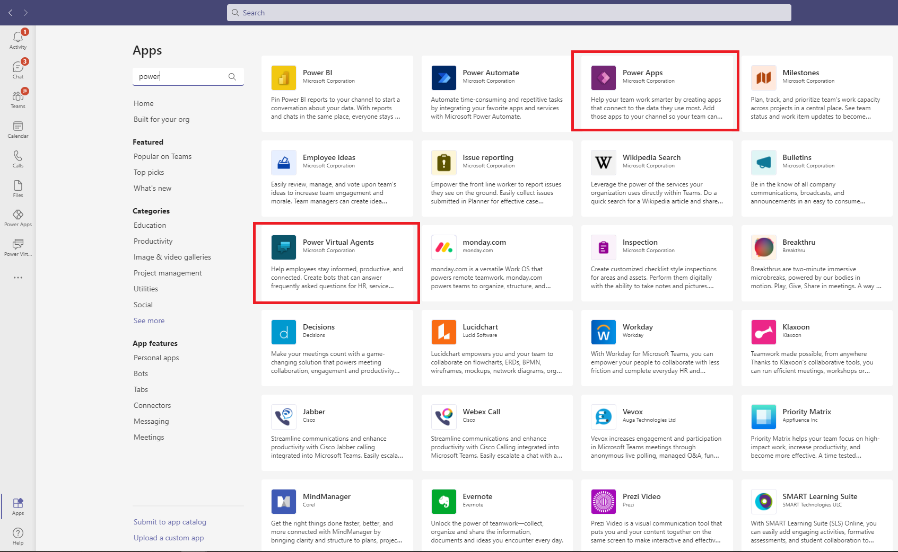

2.  Add the Power Apps or Power Virtual Agents apps as a personal app.

3.  Launch Power Apps or Power Virtual Agents apps from the left rail to start making apps or chatbots.

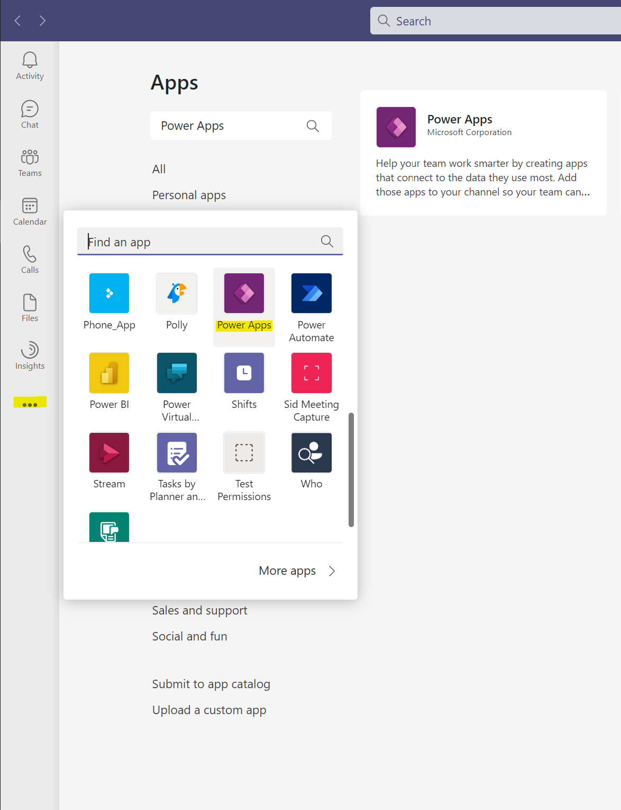

More information can be found at [Power Apps and Microsoft Teams integration - Overview - Power Apps \| Microsoft Docs](https://docs.microsoft.com/en-us/powerapps/teams/overview) and [Power Virtual Agents app in Microsoft Teams \| Microsoft Docs](https://docs.microsoft.com/power-virtual-agents/teams/fundamentals-what-is-power-virtual-agents-teams).

## Install and extend the sample apps

Alternatively, you can also start from one of the out of the box sample apps that are available with the product. These sample apps are fully functional apps based on real customer need. These apps can be used as is or can be extended using the Power Apps app.

| App                    | Description                                                                                                                                                         |
|------------------------|---------------------------------------------------------------------------------------------------------------------------------------------------------------------|
| Boards (preview)       | A simple way to connect and share with people in your organization with similar interests. More [details](https://docs.microsoft.com/en-us/powerapps/teams/boards). |
| Bulletins              | Manager and user apps for company communications. More [details](https://docs.microsoft.com/en-us/powerapps/teams/bulletins).                                       |
| Employee Ideas         | App for campaigns and ideas. More [details](https://docs.microsoft.com/en-us/powerapps/teams/employee-ideas).                                                       |
| Inspections            | Manager and user apps for area inspections. More [details](https://docs.microsoft.com/en-us/powerapps/teams/inspection).                                            |
| Issue Reporting        | Manager and user apps for issue reporting. More [details](https://docs.microsoft.com/en-us/powerapps/teams/issue-reporting).                                        |
| Milestones             | App to keep track of projects, and initiatives. More [details](https://docs.microsoft.com/en-us/powerapps/teams/milestones).                                        |
| Perspectives (preview) | A simple way to add topics and extend the topics with Q&A for discussions. More [details](https://docs.microsoft.com/en-us/powerapps/teams/perspectives).           |
| Profile+ (preview)     | Quickly find out about people in your organization. More [details](https://docs.microsoft.com/en-us/powerapps/teams/profile-app).                                   |

More information on sample apps can be found at [Use sample apps from the Teams store - Power Apps \| Microsoft Docs](https://docs.microsoft.com/en-us/powerapps/teams/use-sample-apps-from-teams-store)

If you prefer to disable users from installing sample apps, you can do so using Teams' permission policies. You can follow the instructions/steps listed under [Setup Team's app permission policies](#setup-teams-app-permission-policies).

## Create your first app

Identify a business scenario that can be solved with an app. If you find yourself using Excel to capture data from multiple people, then you have a suitable use case to convert into an app.

### Step by step – Create your first app

Once you have a scenario, you can use the instructions in the below document to get started with the app development. [Create your first app in Teams - Power Apps \| Microsoft Docs](https://docs.microsoft.com/en-us/powerapps/teams/create-first-app)

## Create your first bot

Chatbots increases organization efficiency and lower operation cost by answering common questions and taking meaningful actions. From org-wide scenarios such as HR, IT, facility bots to bots built specifically for a team such as a FAQ bot for operations, Power Virtual Agents empowers subject matter experts to easily create and manage bots.

### Step by step – Build your first bot

Once you have identified a scenario, you can quickly get started by following an example from [Build a sample HR bot \| Microsoft Docs](https://docs.microsoft.com/power-virtual-agents/teams/fundamentals-get-started-teams).

## Licensing

Microsoft Dataverse for Teams is available as part of select Microsoft 365 subscriptions with Microsoft Power Platform and Microsoft Teams capabilities, excluding plans for US government environments (GCC, GCC High and DoD) and EDU A1 and SUB SKUs.

Separate licensing of Power Apps, Power Virtual Agents, Power Automate, and Dataverse is not required for most Teams scenarios.

There are capacity limits that include number of Power Platform requests, number of Dataverse for Teams environments that are controlled by the number of licensed users and their type of license. Using basic governance practices, you can ensure this capacity is available for important organization needs.

Each Dataverse for Teams environment can have 2GB of data or 1,000,000 rows of data.

Normal Power Platform add-on licenses for requests and storage don't apply to Dataverse for Teams environments, however you can upgrade to a full Dataverse capability as we discuss later in the playbook.

For full details on licensing see page 26 in the [license guide](https://go.microsoft.com/fwlink/?LinkId=2085130&clcid=0x409).

## Architecture Overview

When you build an app or chatbot from the apps in Teams the first app or chatbot created causes a Power Platform environment to be created and associated with the team. That environment will be used to track all the Power Platform resources like apps, chatbots and flows. The environment also includes the Dataverse data store that is used by apps and chatbots to store their configuration and business data. As apps and flows use connectors the configured connection is associated with the environment.

### Tables in Dataverse for Teams

Dataverse for Teams tables provide the ability to create, populate, and query data within Dataverse for Teams. Tables represent different types of entities important to an organization, such as a table to store products or another to store orders. Each of the tables has columns that contain the data and can have different data types to accommodate different types of data.

A business solution might have multiple tables that are used together in an application. Table data can reference other table data in the solution by defining relationships.

Table security is aligned with how security is handled in Teams, with a focus on Owners, Members and Guests. Each group of users can be assigned permissions of Full access, Collaborate, Reference, Private or none.

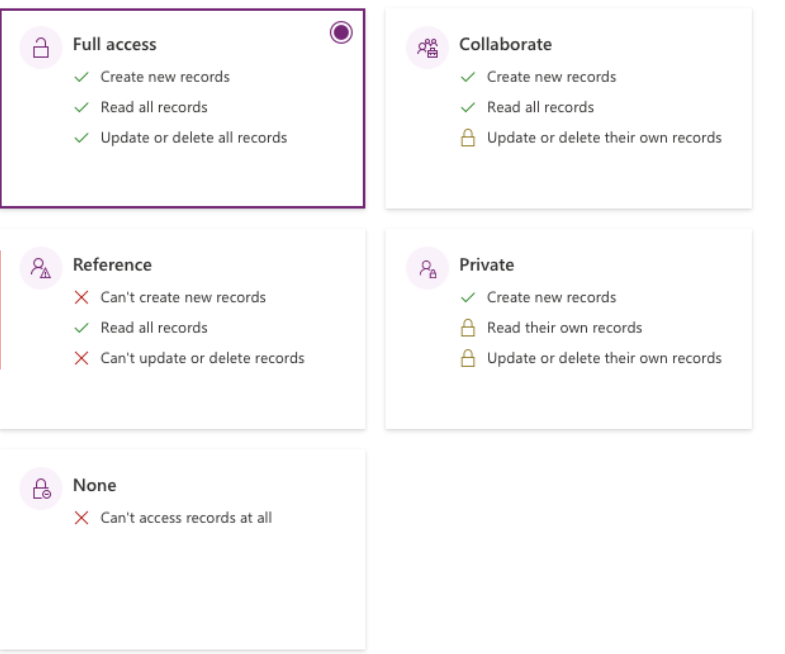

# Manage

In this section we explore how to manage your Dataverse for Teams usage.

## What admin roles are required?

The following admin roles are used to manage your Dataverse for Teams usage:

| Role | Common Tasks |
|-------------------------|-------------------------|
| Teams service admin | Used for general Teams admin tasks. This includes managing app setup and app permission policies for Dataverse for Teams. |
| Power Platform admin | Service admin for all Power Platform resources. Common tasks include: - Manage all admin features for Power Apps, Power Automate, and data loss prevention  - Create and manage service requests  - Monitor service health |
| Global admin | Assign the Global admin role to users who need global access to most management features and data across Microsoft online services. Users with this role can perform all the tasks the Teams service admin and Power Platform admin can. |

## Where do I perform admin tasks?

Ideally as an administrator, you would only visit a single portal to perform all your administrative tasks. But given the scope and breadth of the different products involved and their differing release cycles, there are multiple portals with which you will interact. The following outlines the different portals and the most common tasks you perform there.

| Portal | Common Tasks |
|-------------------------|-------------------------|
| Teams admin center  [https://admin.teams.microsoft.com](https://admin.teams.microsoft.com) | The administrative portal for Microsoft Teams admins. Some of the tasks you can perform here are: <ol type="1"> <li>Manage app setup policies</li> <li>Manage app permission policies</li> </ol> Most tasks require either Global admin or Teams admin role. |
| Power Platform admin center | The unified administrative portal for Power Platform admins. You can use the shortcut <u>[aka.ms/ppac](https://aka.ms/ppac).</u> Some of the tasks you can perform here are: <ol type="1"> <li>Environment management</li> <li>Manage support requests</li> <li>Monitor analytics</li> <li>Manage data gateways</li> <li>Manage data policies</li> </ol> Most tasks require either Global admin or Power Platform admin role. |
| Microsoft 365 admin center  [https://admin.microsoft.com](https://admin.microsoft.com) | Here you will manage users and their license assignment as well as you can launch into many of the individual admin centers from here. |
| Security &amp; Compliance Center [https://protection.office.com](https://protection.office.com/) | In addition to the general compliance tasks, administrators can come here to search the audit log to see Dataverse for Teams install audit events. |

## Learn environment and capacity limits

Now that you have tried sample apps and/or created custom apps, it's important to learn about the limits.

There are no limits to how many people can make apps in your organization. However, Dataverse for Teams availability is dependent on the number of Microsoft Teams users in your tenant.

More information on the limits can be found at [About the Microsoft Dataverse for Teams environment - Power Platform \| Microsoft Docs](https://docs.microsoft.com/en-us/power-platform/admin/about-teams-environment#capacity-limits)

## Publishing Apps

Once a user has built an app with Power Apps, they can easily publish it to one or more channels in that team.

### Step by step – Publish an app in Microsoft Teams

You can follow the step by step process in [Publish your app in Teams](https://docs.microsoft.com/en-us/powerapps/teams/publish-and-share-apps#publish-and-add-an-app-to-teams)

Power Apps can also be shared with other colleagues within your company that do not belong to your team. This is allowed without admin support if allowed by Team's permission policies. Once shared, they'll appear in the [Built for your colleagues](https://docs.microsoft.com/en-us/microsoftteams/manage-power-platform-apps) section within the Teams app store. Team's admins can also pin apps for users in the Teams app bar for even easier discovery.

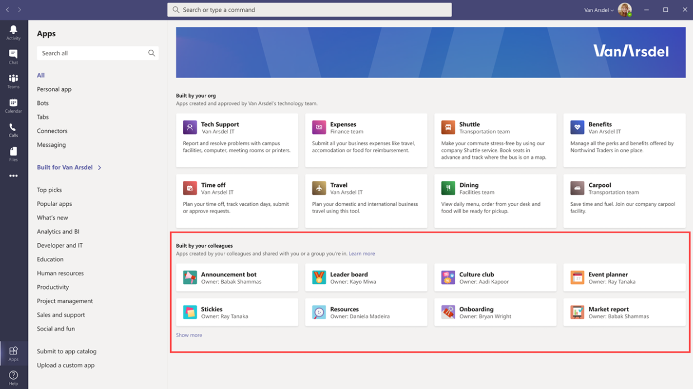

A common scenario broad distribution apps is for a centralized team (e.g. Central IT or Central HR) to create a Teams team where they can collaborate and build a solution together. Within the team, they can chat with each other, share design files, and create all of the resources (apps, flows, and tables) necessary to solve a particular business need.

Once they are done building a solution, they can then use broad distribution apps to push the app to everyone else in their organization. These other users will only have access to the data they need to complete their work. Meanwhile, administrators of the app who belong to the centralized team can leverage custom built admin tools to view all of the data.

### Step by step – Share a broad distribution app

You can follow the step by step process in [Set permission and share apps with colleagues](https://docs.microsoft.com/en-us/powerapps/teams/set-perms-and-share)

## Publishing Chatbots

Once a user has built a bot, they can publish it for others to chat with the bot. Follow step by step process in [Key concept – Publish your bot in Teams](https://docs.microsoft.com/power-virtual-agents/teams/publication-fundamentals-publish-channels-teams).

### Step by step – Share a bot with your teammates

Power Virtual Agents allows bot author to easily share the bot with their teammates directly in Microsoft Teams app store Built by your colleague section. A common scenario is a FAQ bot to answer common questions from teammates or a bot to automate business process for the team. You can follow the step by step process in [Share the bot with your team](https://docs.microsoft.com/power-virtual-agents/teams/publication-add-bot-to-microsoft-teams-teams#share-the-bot-with-your-team).

### Step by step – Share a bot with your organization

Users who build bots can partner with their Microsoft Teams admin to roll out the bot to broader audience. Once the bot is published, users can select the Share the bot and choose to Submit for admin approval. After the user has completed the submission, the user will now see the bot is pending approval from the admin. The bot is now available in Microsoft Teams admin center for admin's review. 

Once admin approves the submission, the bot will show up in Microsoft Teams app store built by your org section. Admins can also pin the bot on the left rail for ease of discovery.

Common scenarios for bots to be shared with organizations are HR, IT, Facility or other bots that are created by departments with intent to reach all members in the organization. Or a bot that targets a group of users that spans across multiple teams, such as a Front-line-worker Assistant bot.

You can follow the step by step process in the blog [Partner with admin to roll out bot in Microsoft Teams](https://powervirtualagents.microsoft.com/en-us/blog/partner-with-admin-to-roll-out-bot-in-microsoft-teams/) and [Share bot with your organization](https://docs.microsoft.com/power-virtual-agents/teams/publication-add-bot-to-microsoft-teams-teams#share-the-bot-with-your-organization).

## Use Teams setup policies to improve adoption.

Often users do not use apps and chatbots because they do not know they exist. Using app setup policies enables you to pin and install applications on behalf of your users and control these settings for your organization. [App setup policies](https://docs.microsoft.com/en-us/microsoftteams/teams-app-setup-policies) are managed in the Teams admin center.

As an admin, you can use app setup policies to do the following tasks:

-   Customize Teams to highlight the apps that are most important for your users. You choose the apps to pin and set the order that they appear. Pinning apps lets you showcase apps that users in your organization need, including apps built by third parties or by developers in your organization.

-   Control whether users can pin apps to Teams.

-   Install apps on behalf of users. You choose which apps are installed by default for users when they start Teams.

-   Pre-pin the bot with Setup policies under Teams apps section in Microsoft Teams admin center by selecting the bot in the pre-pinned list. It can be pre-pinned for everyone via the Global policy or for a group of users via custom policies.

### Step by Step - Using a Policy

The following steps guide you to install a sample app and pin it to the left rail for some/all Microsoft Teams users. This will ensure that the users have easy access to the app. You can skip the installation step if you are pinning the app your created/extended.

1.  Choose the sample app from the app store and install it to a team.

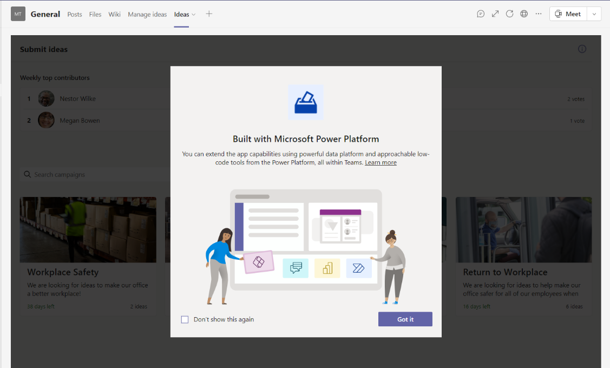

2.  Go to Power Apps personal app, select the team where the app was installed to, and share the app with a security group that has all the target users.

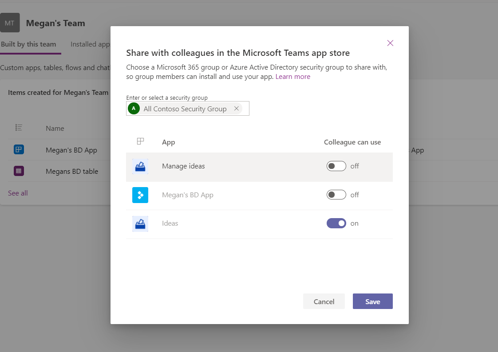

3.  Ensure that the Security Group has the appropriate table permissions for all tables used by the app. Table permissions can be managed by going to 'Installed App' section for the Teams team in Power Apps personal app, and selecting "See all."  
      
      
    Expand the list of tables:  
    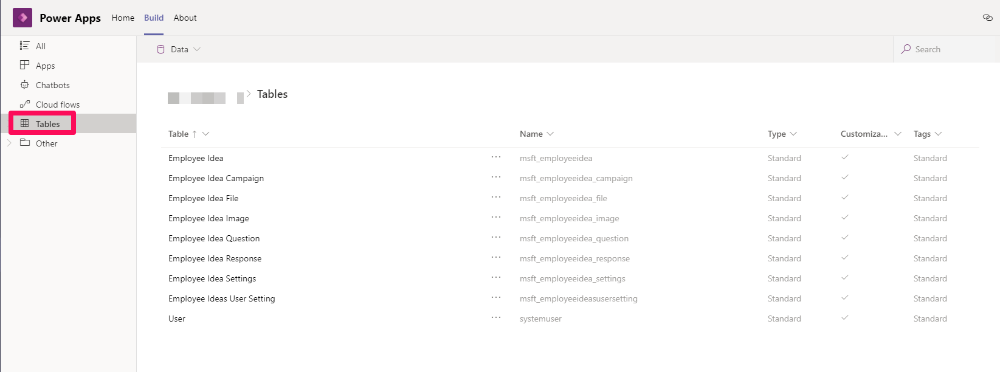  
      
    Selecting each table, and select the appropriate level of table permissions for the "Colleagues with Access" section. By default users with whom an app is shared will have "Full access" to the data tables for the apps. So, it's important to review and assign appropriate permissions.

4.  Click the installed apps in the build hub, select the app from the solution, and click the "Add to Teams" button to download the app manifest.

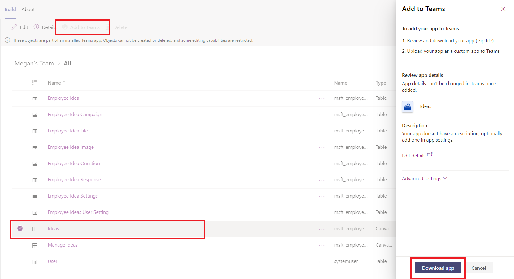

5.  Go to Manage Apps on Teams admin center \[https://admin.teams.microsoft.com/policies/manage-apps\]

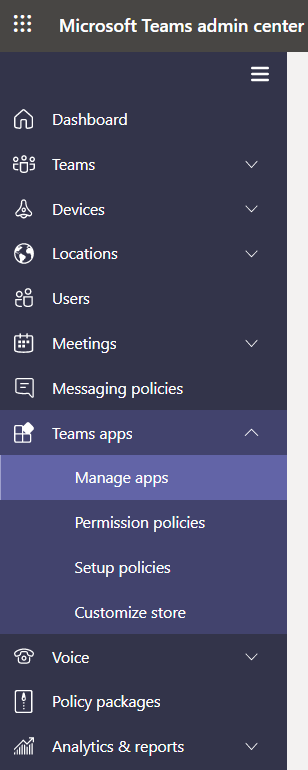

6.  Upload the app manifest from above.

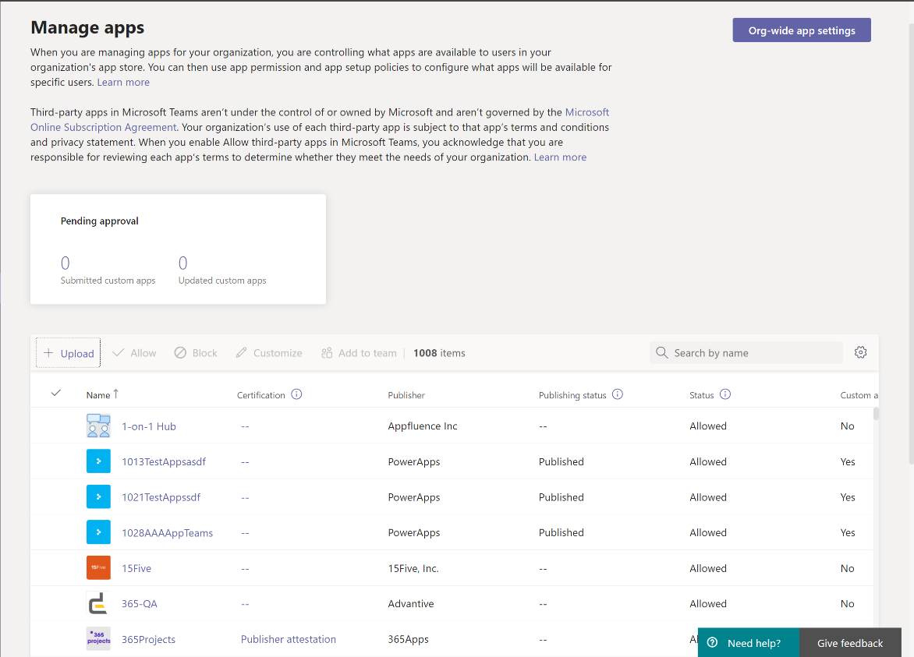

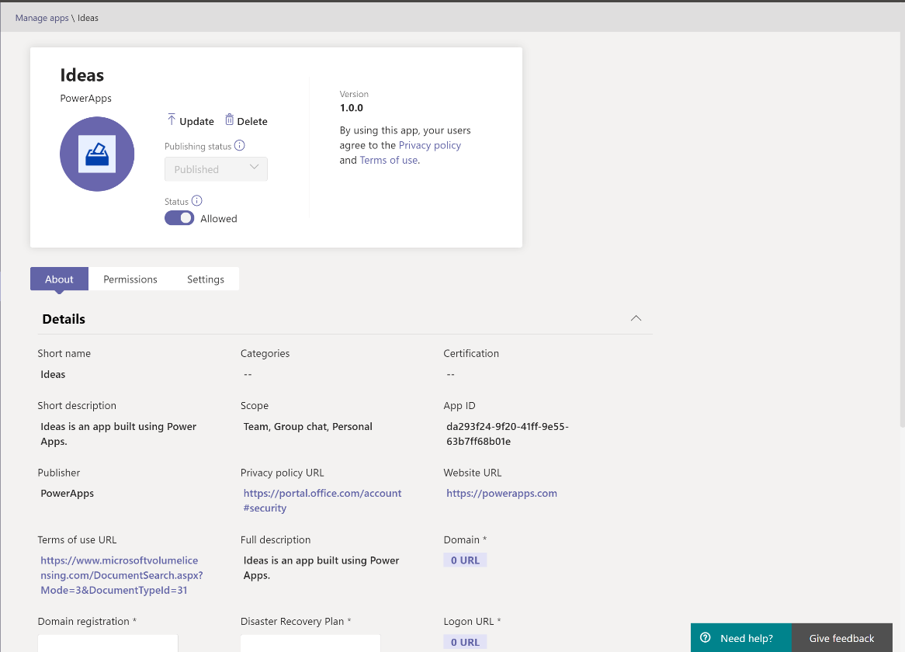

7.  Go to Setup policies in the Microsoft Teams admin center  
    \[https://admin.teams.microsoft.com/policies/app-setup\].

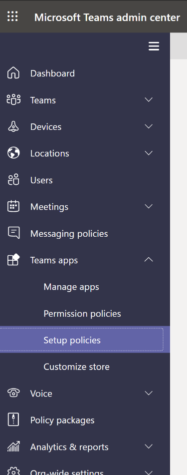

8.  Add a new setup policy.

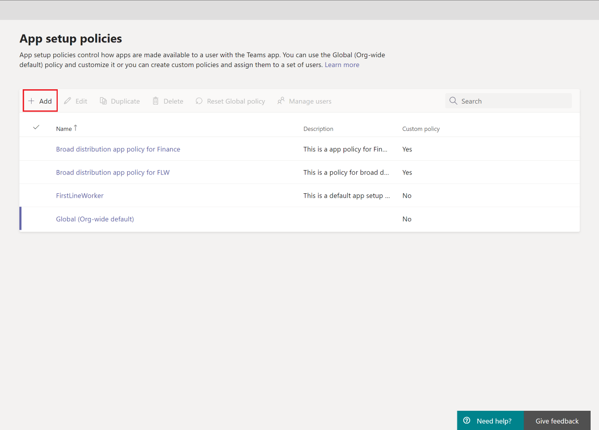

9.  Provide a meaningful name. Click "Add apps" under pinned apps section and select the app you want to pin.

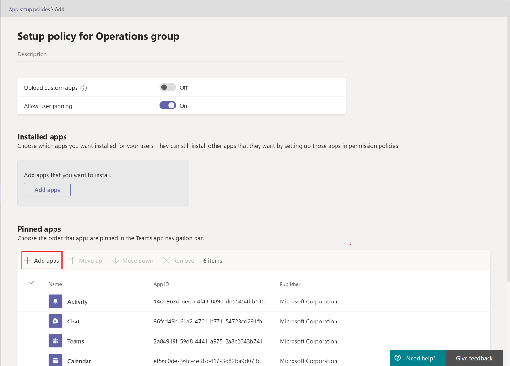

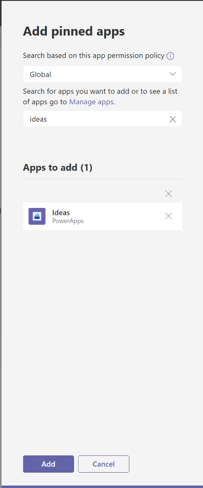

10. Move the app to the desired location on the left rail and save the setup policy.

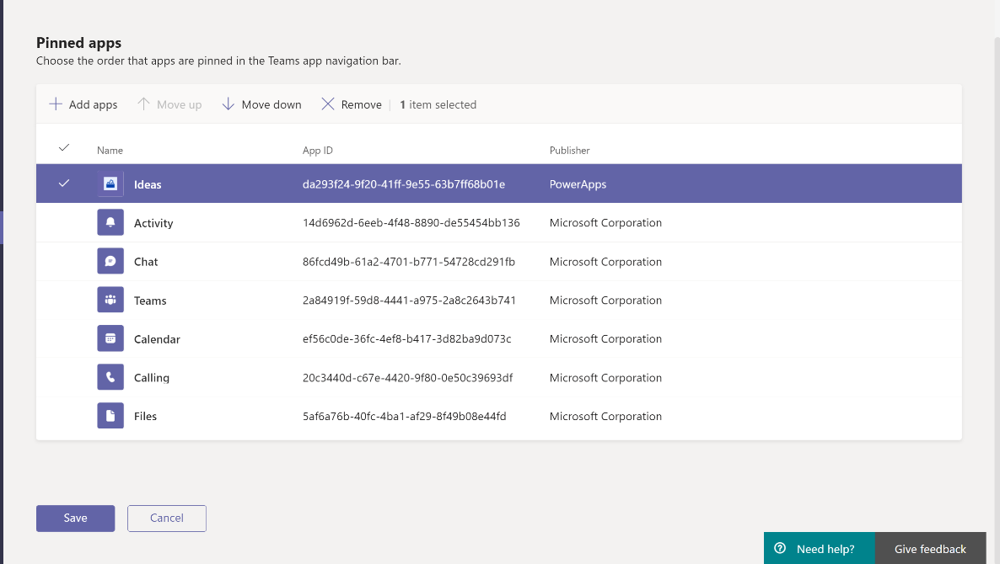

11. Select the policy created in previous step and click on "Manage Users".

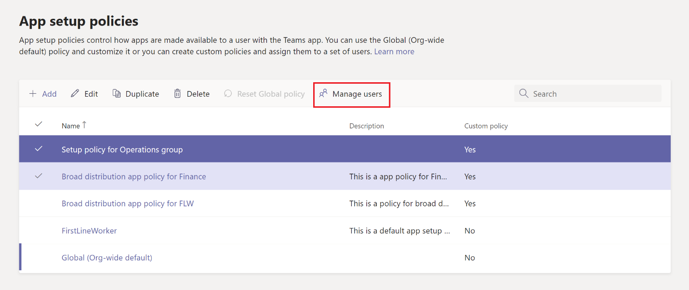

12. Add the list of users who you want to assign this policy.

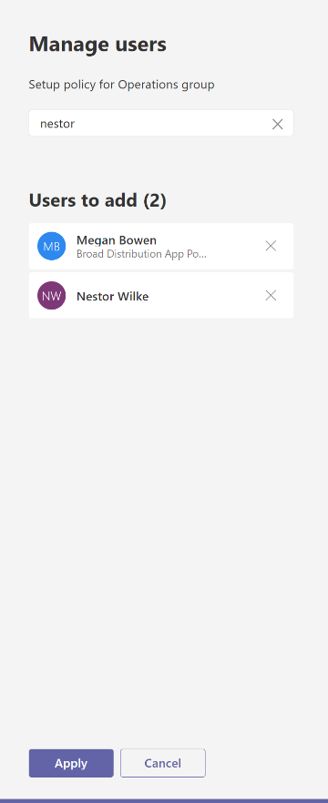

13. Users that were assigned to the setup policy will see the app in the left rail on their next login.

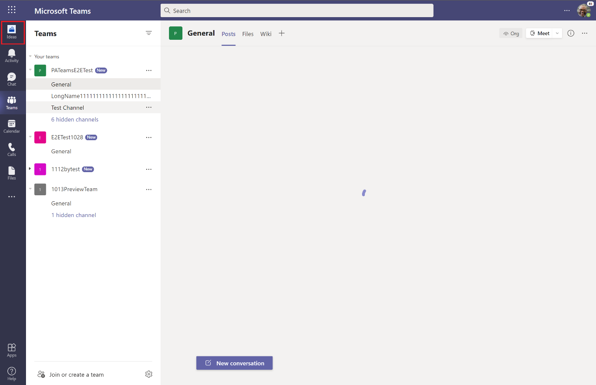

# Secure

In this section, we will focus on typical tasks as well as best practices for securing the platform. We will walk through:

-   Product discovery – understanding the origin of apps and flows

-   Knowing your environments

-   Layers of security

-   Setting up Data Loss Prevention policies

## Discovering your current state

The first action you should take as part of securing your tenant is a quick discovery process to understand if your organization already has started to use Dataverse for Teams in your tenant. As part of this you should review what environments already exist and how makers have been building apps and flows.

Apps, flows, chatbots, and environments could already exist because by default users can create them in your tenant. You want to know what exists so as you implement governance controls you do not want to break something your users depend on without knowing.

### What environments exist?

From the Power Apps Admin Center (<https://aka.ms/ppac>) you can see the environments that already exist. Key things to look for is how many, who created them, and what type of environments you have. Environments associated with a Team will have a type of Microsoft Teams.

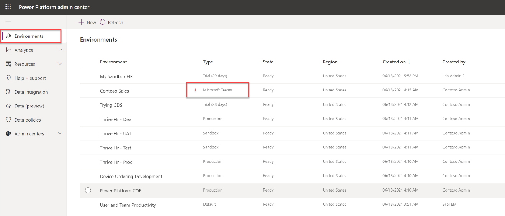

### What apps and flows already exist?

From the environment list if you have any Teams environments you can select them to see the several details.

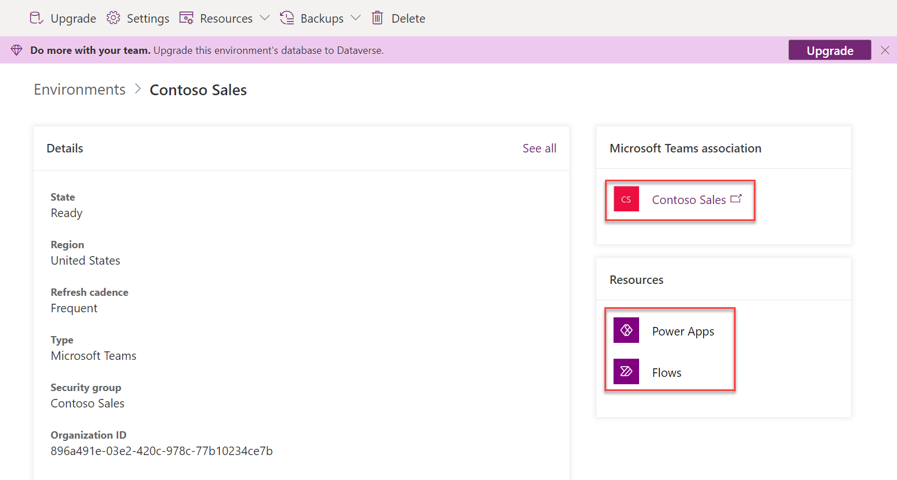

From this detail screen you can see what Team is associated with the environment and navigate to it. You can also select Power Apps or Flows in Resources to see what has been built in the environment.

## Layers of Security 

Microsoft Dataverse for Teams works with Microsoft Teams to secure access to apps and chatbots and the underlying Dataverse data. Members of teams is used to establish simplified access rules. For broad distribution apps support is provided to share with colleagues.

By default, all Teams users can create and share apps and chatbots. Administrators can leverage Teams' app permission policies to implement governance controlling who can create and who can share. For example, an organization could restrict app and chatbot creation to only those users who have attended training.

If not restricted by policy, owners of a team can install apps in their team and control access to the Dataverse data associated with the team.

Power Automate flows and canvas apps use connectors. The specific connections credentials and associated service entitlements determine permissions when apps use the connectors.

Connector use can be further restricted with Data Loss Prevention (DLP) policies. Cross-tenant inbound and outbound restrictions can also be applied to the connectors.

It's important to note, that when accessing data sources via connectors all the underlying security that the data source offers is in addition to the layers of security described above.

## Setup Team's app permission policies

App permission policies can be used to control what apps are available to Microsoft Teams users. Using permission policies, you can allow or block the following Dataverse for Teams actions:

-   Making or editing using the Power Platform embedded apps e.g., Power Apps and Power Virtual Agents

-   Sharing apps and chatbots broadly

By default, Power Apps and Power Virtual Agents are enabled for all users as part of the Global permission policy, unless the Global permission policy is already modified to block all apps. This automatically gives all Microsoft Teams users the ability to create new apps/bots on Dataverse for Teams.

Custom permission policies can be created to block or allow for specific users or groups of users. These policies would take precedence over the global default policy allowing you to handle exceptions from your defaults.

Global admins and Teams admins can review their tenants current policies here <https://admin.teams.microsoft.com/policies/app-permission>

### Controlling Power Platform Apps

The following end user embedded apps (Power Apps, Power Automate, Power Automate Actions, Power BI and Power Virtual Agents) can be allowed or blocked individually by policies.

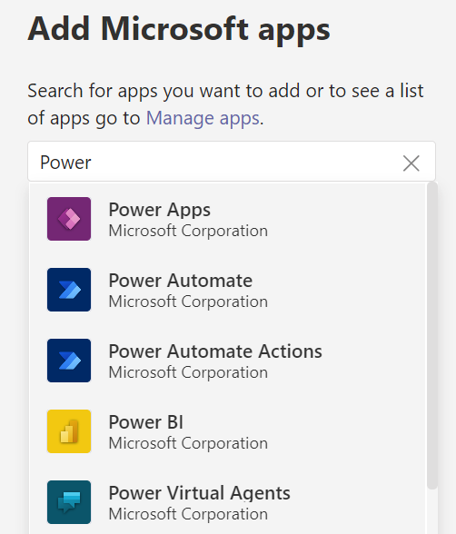

Shared Power Apps and Shared Power Virtual Agent Apps can be allowed or blocked by policy to control sharing of apps and chatbots:

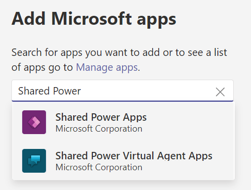

### Example Strategy - Encourage app and chatbot building

This works well for organizations who empower their users to build apps and chatbots to make them more productive but want some control over what is shared broadly in the organization.

The following would be implemented:

-   Default policy would block Shared Power Apps and Shared Power Virtual Agents Apps but would allow all other embedded apps.

-   A security group would be created to contain a list of who can share apps and chatbots.

-   A custom permission policy would be created to allow Shared Power Apps and Shared Power Virtual Agents Apps and assign that policy to the security group.

### Example Strategy - Control app and chatbot building

This works well for organizations who want more control over users allowed to build apps and chatbots. Users by default can't build or share unless added to the controlling security groups.

The following would be implemented:

-   Default policy would block all Power Platform embedded apps and block Shared Power Apps and Shared Power Virtual Agents Apps.

-   A security group would be created to contain a list of who can build apps and chatbots.

-   A custom permission policy would be created to allow the Power Platform embedded apps and assign that policy to the security group of users allowed to build apps and chatbots.

-   A security group would be created to contain a list of who can share apps and chatbots.

-   A custom permission policy would be created to allow Shared Power Apps and Shared Power Virtual Agents Apps and assign that policy to the security group of users who can share.

### Considerations when using permission policies

When implementing permission policies please consider the following:

-   Disabling Power Apps will only restrict users from making/editing apps using the embedded Power Apps maker experiences. Users will be able to use existing (or any future) apps that are pinned to channels, chats, or meetings. Apps rolled out by the admin using setup policies would also still be available for all end users.

-   Even when Power Apps app is blocked, apps that are rolled out by you using setup policies and apps that are allowed in the permissions policies are available for the users.

-   Users can add apps shared with them as personal apps (an app only installed for an individual user and not a team app) and pin them to the left rail or add them as tabs to a chat, channel, or meeting.

-   Users will not be able to use the Power Apps app from the app selection dialog. For example, users can not setup a Power App on a channel / tab.

-   Users can install the [sample apps](https://docs.microsoft.com/en-us/powerapps/teams/use-sample-apps-from-teams-store) to teams that they own or are member of. If the sample app is the first app being installed to a team, a new Dataverse for Teams environment is provisioned for that team.

-   Once Power Apps is disabled, users will not be able to edit or make any more changes to those apps. Only the approved makers will be able update apps using the Power Apps personal app.

-   After an admin creates or edits a policy it could take hours to take effect.

### Step by step – Disable for all users in global default policy

To disable Power Apps and Power Virtual Agents for all Microsoft Teams users, you need to update the Global permission policy using the below steps:

1.  Log in to the Teams admin center as Teams tenant administrator

2.  Go to Permission Policies on Teams admin center \[<https://admin.teams.microsoft.com/policies/app-permission>\]

3.  Open "Global (Org-wide default)" settings  
    

4.  Under "Microsoft apps", select the "Block specific apps and allow all others" option.  
    Add "Power Apps" and "Power Virtual Agents" app to list of blocked apps.  
    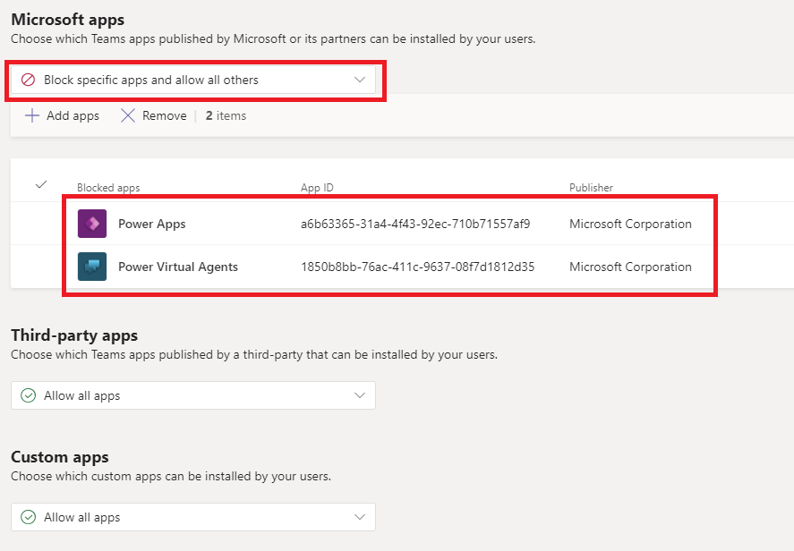

If you'd like to restrict/prevent users from broadly sharing apps, you should also add "Shared Power Apps" to the blocked apps list.

5.  Click 'Save' button to save the settings.

You have now removed access to create new apps and bots using Power Platform on Microsoft Teams for every user in the organization.

### Step by step – Allow specific Users/Groups to create

Now that you've restricted all users in your tenant from using Power Apps and Power Virtual Agents in Teams, follow the below steps to allow access to specific users.

You can create a custom permission policy and assign to specific users who can make/edit apps and bots. Follow the steps below to enable Power Apps and Power Virtual Agents to specific Microsoft Teams users.

1.  Go to Permission Policies on Teams admin center: [https://admin.teams.microsoft.com/policies/app-permission  
    ](https://admin.teams.microsoft.com/policies/app-permission)

2.  Add new policy  
    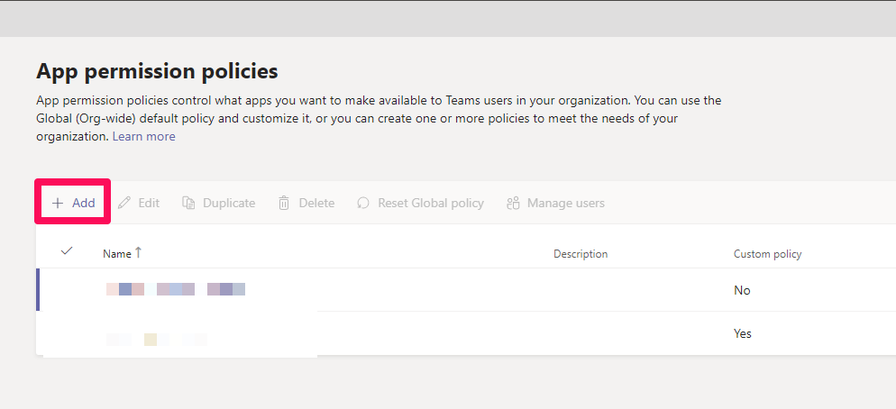

3.  Give the policy an appropriate name and description. Enable all "Microsoft apps" (or pick the appropriate settings that includes Power Apps and Power Virtual Agents app in allowed list of apps). Save the policy.  
    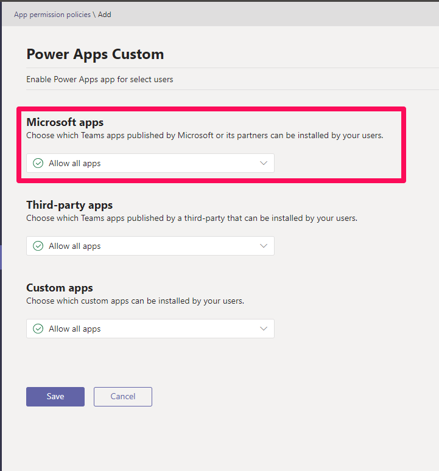

4.  Select the policy created in previous step, and click on "Manage Users"  
    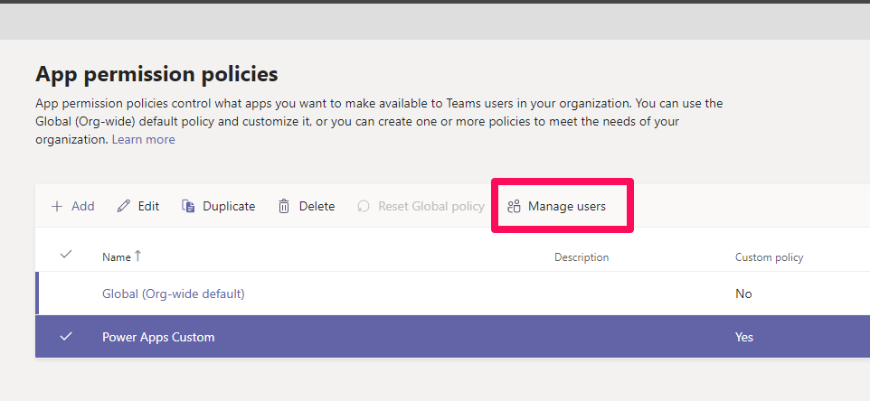

5.  Add the list of users who you want to grant ability to create Dataverse for Teams apps.  
    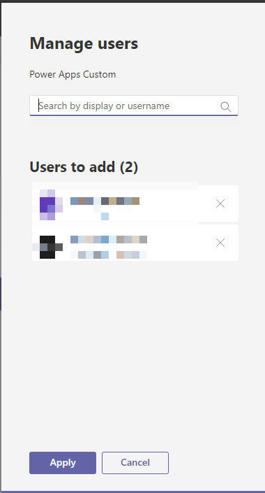

Note: You can use PowerShell to apply policy to users. See: [Grant-CsTeamsAppPermissionPolicy (SkypeForBusiness) \| Microsoft Docs](https://docs.microsoft.com/en-us/powershell/module/skype/grant-csteamsapppermissionpolicy?view=skype-ps)

## Enable users to install bots in Microsoft Teams

There are two ways for user to install bots built by their organization in Microsoft Teams:

1.  Install bots built by their teammates

2.  Install bots approved by admin for the whole organization or cross team sub-organizations

### Enable users to install bots built by their teammates

Users can share the bots they have built with their teammates to be used in Microsoft Teams. Their teammates can install and use the bot from Microsoft Teams app store built by your colleague section or via direct installation link. Learn more about how to [Share bots with teammates \| Microsoft Docs.](https://docs.microsoft.com/en-us/power-virtual-agents/teams/publication-add-bot-to-microsoft-teams-teams#share-the-bot-with-your-team)

Similar to how you can manage who can build bots in the previous section, you can manage who can find and install bots from their teammates via the app permission policy in Microsoft Teams admin center by controlling app permission policies for 'Shared Power Virtual Agents app'. Learn more in detail at [Manage Microsoft Power Platform apps in the Microsoft Teams admin center \| Microsoft Docs](https://docs.microsoft.com/microsoftteams/manage-power-platform-apps).

### Approve org-wide bots for users to install

Users who build bots for the whole organization need admin approval before they can be listed in Microsoft Teams app store for other users to install. Learn more on how to [Share bot with organization \| Microsoft Docs](https://docs.microsoft.com/power-virtual-agents/teams/publication-add-bot-to-microsoft-teams-teams#share-the-bot-with-your-organization).

Once the bot is submitted, it will show up in Microsoft Teams admin center. It follows the same approval experience as custom apps that are submitted via Visual Studio. Learn more about [Publish a custom app submitted through the Teams App Submission API \| Microsoft Docs.](https://docs.microsoft.com/microsoftteams/submit-approve-custom-apps#validate)

In addition to approving apps to show up in Microsoft Teams app store built by your org section, we recommend considering pre-pinning the bots in Microsoft Teams left rail for all employees or a subset of them for ease of discovery. This has been proven useful for org-wide HR, IT bots or front-line worker assistant bots that are needed by front line workers. Pre-pinning apps for users is controlled in Microsoft Teams admin center app setup policies. Learn more about pre-pinning at [Manage app setup policies in Microsoft Teams \| Microsoft Docs](https://docs.microsoft.com/microsoftteams/teams-app-setup-policies).

## Setup DLP policies for connector usage  

Data Loss Prevention policies enforce rules for which connectors can be used together and which are blocked and not usable at all. Connectors are classified as business data only, no business data allowed or blocked. A connector in the business data only group can only be used with other connectors form that group in the same app or flow. A connector that is blocked can't be used by any app or flow.

-   Data loss prevention (DLP) policies act as guardrails to help prevent users from unintentionally exposing data.

-   DLP policies can be scoped at the environment and tenant level offering flexibility to craft policies that are sensible and do not block high productivity.

-   Environment DLP policies cannot override tenant wide DLP policies.

-   If multiple policies are configured for one environment, the most restrictive policy applies to the combination of connectors.

-   By default, there are no DLP policies implemented in the tenant.

-   Policies can't be applied at the user level, only at the environment or tenant level.

-   DLP policies are connector aware, but do not control the connections that are made using the connector – in other words, DLP policies are not aware if you use the connector to connect to a development, test, or production environment.

-   PowerShell and admin connectors can manage policies.

-   Users of resources in environments can view policies that apply.

If your organization already has some other Power Platform resources created, it is likely you already have some DLP policies in place. Dataverse for Teams use of connectors share the same DLP policies. This might require coordination in your organization to ensure the policies implemented at a tenant level work for both Teams and non-Teams apps and flows.

DLP policies are managed from the Power Platform admin center at <https://admin.powerplatform.microsoft.com/dlp>

### Strategies for creating DLP policies

As an administrator taking over an environment or starting to support use of Power Apps and Power Automate DLP policies should be one of the first things you set up. This ensures a base set of policies is in place, and you can then focus on handling exceptions and creating targeted DLP policies that implement these exceptions once approved.

We recommend the following starting point for DLP policies:

1.  Create a policy spanning all environments that blocks all unsupported non-Microsoft connectors and classifies all Microsoft connectors as 'Business Data'[1].

2.  Create a policy for the default environment (and other training environments) that further restricts which Microsoft connectors are classified as 'Business Data'.

3.  Create additional policies or exclude those environments from policies \#1 and \#2 above that permit certain connectors or connector combinations to be used for specific environments .

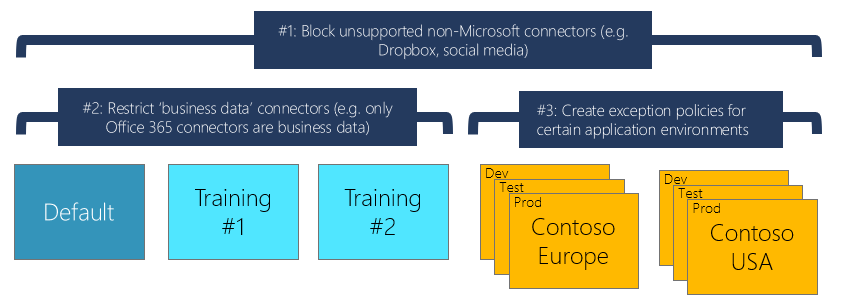

Best practice guidance for what DLP policies to set up can be found at [Manage Dataverse for Teams environments - Power Platform \| Microsoft Docs](https://docs.microsoft.com/en-us/power-platform/guidance/adoption/teams-environment-strategy) and [Establishing a DLP strategy - Microsoft Power Platform - Power Platform \| Microsoft Docs](https://docs.microsoft.com/en-us/power-platform/guidance/adoption/dlp-strategy).

More information on DLP can be found at [Data loss prevention policies - Power Platform \| Microsoft Docs](https://docs.microsoft.com/en-us/power-platform/admin/wp-data-loss-prevention)

You can also use PowerShell to apply DLP policies and you can find more details at [Applying a data loss prevention policy to all Dataverse for Teams environments - Power Platform \| Microsoft Docs](https://docs.microsoft.com/en-us/power-platform/admin/about-teams-environment#applying-a-data-loss-prevention-policy-to-all-dataverse-for-teams-environments)

## Share a pilot app with several users

If you made a custom app or extended one of the out of the box sample apps, you'd want to share it with relevant users. Depending on the nature of the app, your app may be relevant for a specific department or for several departments/users across your company.

In each case, Power Apps offer robust sharing options. Departmental apps can be published to channel(s) in a specific team. All users of the team will have access to the app. More information on sharing can be found at [Set permission and share your app using Power Apps in Teams - Power Apps \| Microsoft Docs](https://docs.microsoft.com/en-us/powerapps/teams/set-perms-and-share)

General purpose apps that are relevant to users across teams can be shared by broadly distributing it with a security group. More information on broad distribution of apps can be found at [Set permission and share your app using Power Apps in Teams - Power Apps \| Microsoft Docs](https://docs.microsoft.com/en-us/powerapps/teams/set-perms-and-share).

## Call to action

As an administrator you should

-   Establish an environment strategy, and a process for requesting access and limit who can create using Teams' policies

-   Set up data loss prevention policies early, and come up with a plan on how to manage exceptions

-   Regularly check for new connectors and move them into the appropriate (Business Data only or No Business Data Allowed) category of your DLP Policies

# Monitor and Alert

Monitoring your environments can help ensure your governance processes are being effective. You can use Power Automate to establish some automated alerts to keep you informed for things that might require more real time review.

## Install CoE starter kit in Dataverse for Teams

The Microsoft Power Platform CoE Starter Kit is a collection of components and tools that are designed to help you get started with developing a strategy for adopting and supporting Microsoft Power Platform.

Using the CoE Starter Kit in a Dataverse for Teams environment, a Power Automate per user license will be required for the admin running the sync flows. No additional licenses will be required for users interacting with any of the canvas apps.

You can follow the step-by-step guide to set up the CoE starter kit at <https://aka.ms/coestarterkit>

## Monitor capacity & adoption.

As you open Dataverse for Teams for all users, create processes around periodic monitoring of environment creation (approval process) and delete inactive environments.

Our philosophy is to enable you to use Microsoft Power Platform to manage Microsoft Power Platform—in keeping with that philosophy, you can use Power Automate to send welcome emails to owners of new Dataverse for Teams environments and request a business justification for their environments. Central IT can effectively engage with new makers and ensure that Dataverse for Teams capacity is used effectively in the tenant and distributed to the most important business use cases. Similar workflows can be used to apply specific DLP policies to Dataverse for Teams environments, as needed, and to invoke a cleanup of unused assets that can then be repurposed for more compelling scenarios in the tenant.

### Step by step – Govern environment creation

We recommend setting up reactive governance workflows and monitoring abilities. This gives team owners the ability to provide a business justification, and admins the ability to review the business justification. You can follow the [step by step example](https://docs.microsoft.com/en-us/power-platform/guidance/adoption/teams-environment-strategy#govern-environment-creation) and tailor it for your specific requirements.

You can monitor capacity usage for Microsoft Teams environments by using dedicated [capacity views in the Power Platform admin center](https://docs.microsoft.com/en-us/power-platform/admin/about-teams-environment#capacity-limits).

You can learn more about managing capacity at [Manage Dataverse for Teams environments - Power Platform \| Microsoft Docs](https://docs.microsoft.com/en-us/power-platform/guidance/adoption/teams-environment-strategy)

## Use audit logs to review installation activity

You can use audit logs for Teams to investigate events where users installed Microsoft Power Platform apps from the Built by your colleagues section of the Apps page in Teams.

To do this, search the audit log for the Installed app Teams event (under the AppInstalled operation) for a user or set of users. To find apps installed from Built by your colleagues, look for the TemplatedInstance value in the AppDistributionMode property in a given record's details.

# Upgrade

Upgrading a Dataverse for Teams environment allows access to the [full capabilities](https://docs.microsoft.com/en-us/powerapps/teams/data-platform-compare) of Dataverse and lifts the capacity limits of 2GB and 1,000,000 records.

### Benefits of upgrading

The following are some of the other key capabilities that are available after upgrade:

-   More types of data

-   More data integration options

-   More capabilities for developers

-   More security and compliance options

-   More places to create apps, flows and chatbots

### After upgrading

After upgrading, the following applies to the upgraded environment:

-   Users use apps, chatbots and flows will need licenses for Power Apps, Power Virtual Agents, or Power Automate to use their resources

-   The apps can run inside and outside of Microsoft Teams

-   Data for the environment will count against your org (tenant)'s available capacity

-   Chatbot sessions will count against your org (tenant)'s available capacity

-   The upgraded environment's lifecycle will no longer be tied to the lifecycle of that team. If the team is deleted, the upgraded environment remains

-   The Microsoft 365 Groups association will become editable

-   Team owners are assigned the System Admin roles on their environment and can access the environment by using the Power Platform admin center

The upgrade process is permanent and cannot be undone so it should be done intentionally with planning to accommodate licensing changes and downtime. During the upgrade apps, flows and chatbots along with the Dataverse data will be unavailable.

You can start the upgrade process from the Power Platform Admin Center environment detail page.

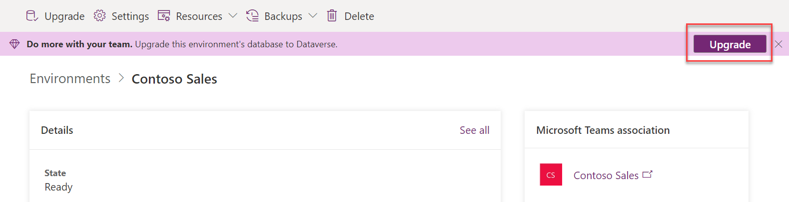

### Accessing upgraded environment in Power VIrtual Agents

After an environment has been upgraded, the users who owned bots in the environment can continue to manage their bot in Power Virtual Agents Teams app. In addition, those environments will also show up in Power Virtual Agents web portal too. Learn more about [Upgrade a Dataverse for Teams environment for Power Virtual Agents \| Microsoft Docs](https://docs.microsoft.com/power-virtual-agents/teams/admin-upgrade-dataverse-teams).

# Nuture and educate

Now that you have learned how to manage your environments and control various policies to provide adequate guardrails, it is time to optimize your investment and enable users to adopt the platform.

By establishing and proactively communicating your processes and procedures to makers building apps and chatbots using Dataverse for Teams you can help guide makers toward a successful publishing of their app or chatbot. In fact, a good practice is to have a team dedicated just to information on building apps and chatbots. You can use this team as a central place for publishing your processes and procedures as well as providing channels where makers can discuss amongst themselves how to build things. If you have a lot of users building things you might even consider building some of your own custom apps, automation and chatbot to help you manage the process. You can get ideas and expand on what the CoE Starter kit provides and tailor it for your needs.

Organizations that are successful using Dataverse for Teams establish a partnership between the makers and admins to work together to deploy apps and chatbots. They work together early in the building journey to review apps, bot content, and discuss strategies for how to get the best adoption in an organization.

Many of the Power Platform [adoption best practices](https://docs.microsoft.com/en-us/power-platform/guidance/adoption/methodology) also apply or can be adapted to work with Dataverse for Teams.

# Next Steps

Congratulations, you've made it to the end! We hope you found some helpful information and keep this playbook around for future reference. To remind you of where we started our journey at the beginning of the document, here are the actions you should consider taking in the first year to get started on the right track!

-   Identify the central team that will be implementing Dataverse for Teams governance and assign them the [Power Platform service admin role](https://docs.microsoft.com/en-us/power-platform/admin/use-service-admin-role-manage-tenant), which grants full access to PowerApps, Flow, & Power BI

-   Establish an environment strategy, review the creation of new environments using an automated process

-   Setup data loss prevention policies

-   Leverage out-of-box activity logs & analytics

-   Don't start from scratch, learn from the Center of Excellence starter kit

-   Establish and automate your audit processes

-   Welcome new makers and identify champions, create a team for them to communicate

-   Establish a Center of Excellence that will help accelerate your adoption of the platform by investing in and nurturing organic growth while maintaining governance and control. Your Center of Excellence will be aligned to and drive your company's digital transformation strategy and goals.

[1] 
