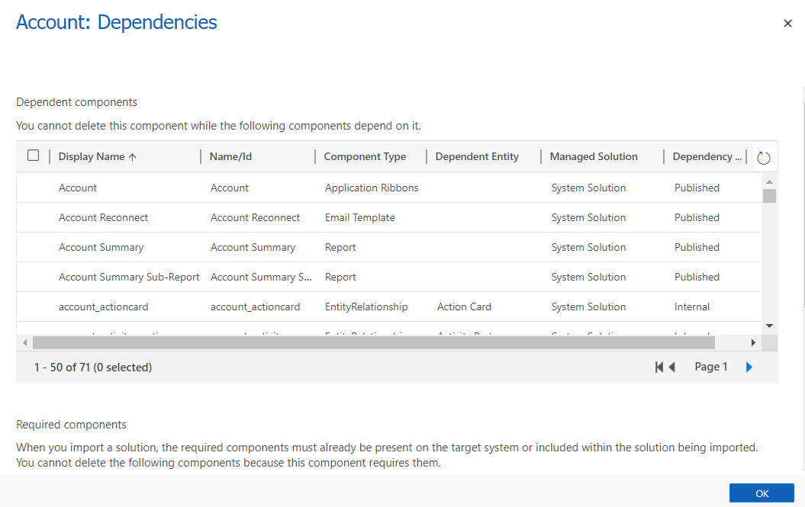
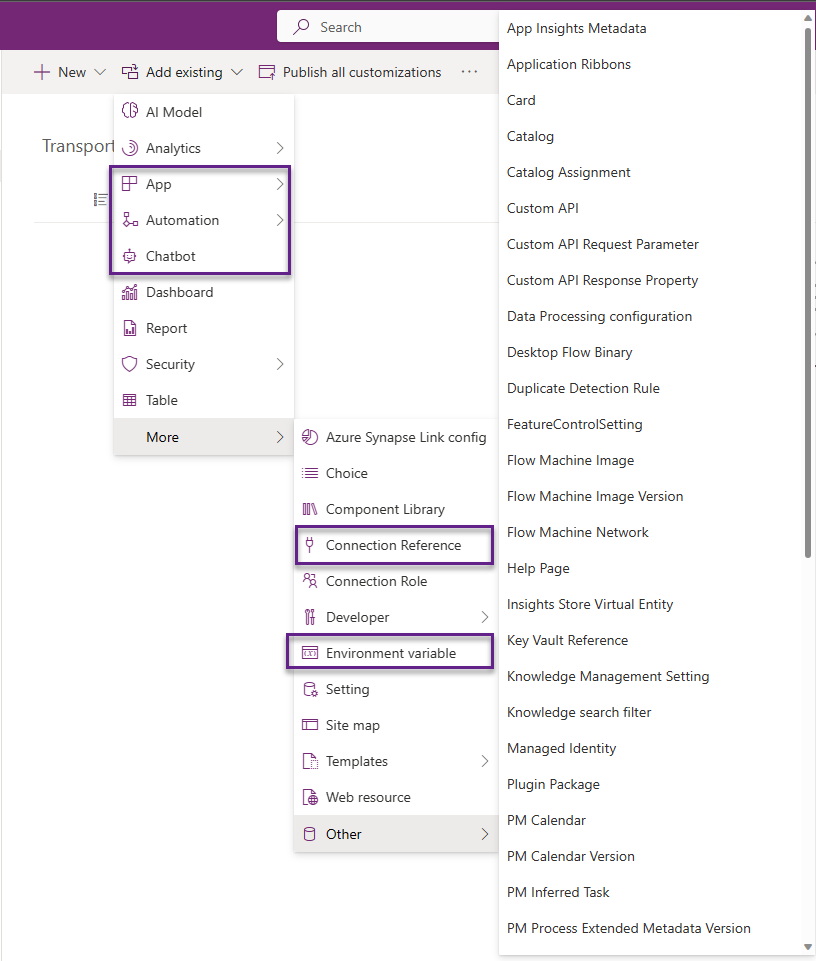
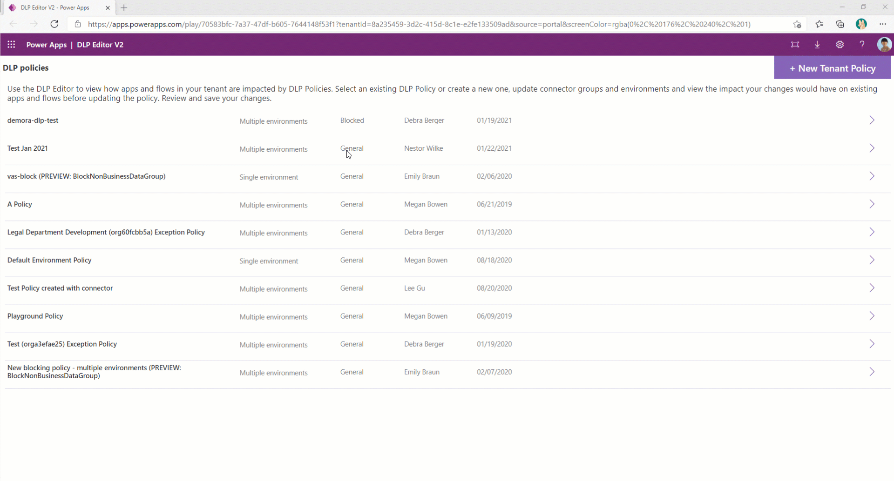
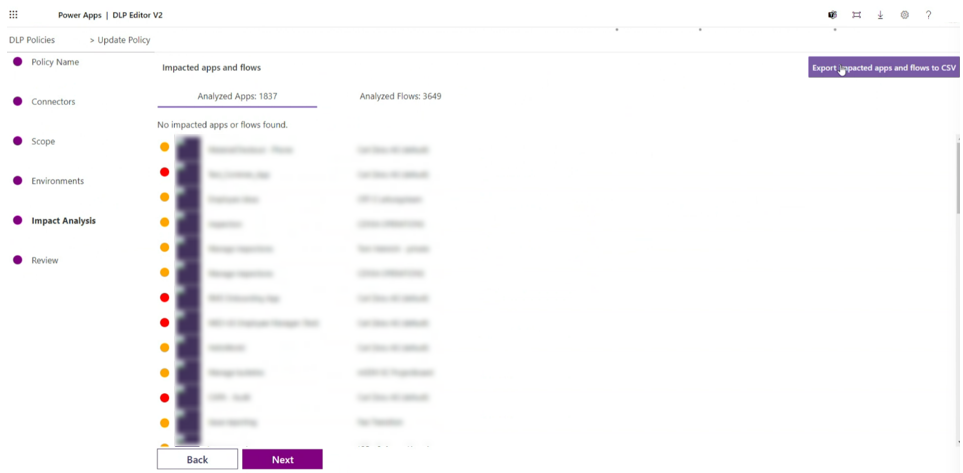

# Migrating apps and flows from the default environment

This document addresses a key need of how organizations and administrators can plan migration of their various assets from default environment.

## Default environment

Power Apps creates a single default environment for each tenant and shared by all users in that tenant. Whenever a new user signs up for Power Apps, they're automatically added to the Maker role of the default environment. No users are automatically added to the Environment Admin role of the default environment. The default environment is created in the region closest to the default region of the Azure AD tenant and is named as follows: "{Azure AD tenant name} (default)".

The default environment empowers every employee in an organization with a Microsoft 365 license to create apps and cloud flows. The default environment becomes the first playground studio for these employees to start building their apps and flows. Most organizations often rename the default environment to Personal Productivity.

Every employee in an organization using Power Platform has access to the default environment. Because it isn't possible to remove the environment maker role from the default environment, makers start to build personal productivity apps and flows and share them within their teams for others to benefit.

Administrators reactively discover that many apps and flows are created in the default environment. It may not be appropriate for the app or flow to be in the default environment in scenarios such as:

- An app is shared with many users – production like behavior.
- An app uses Excel workbooks with sensitive data.
- An app based on SharePoint lists is getting many data interactions – inserts, updates.
- An app or flow is using connectors that aren't allowed in new Data Loss Prevention (DLP) policies.

Custom Connector(s) are enabled and used in the default environment instead of being secured in a dedicated environment.

The above scenarios are worth consideration and provide an indication that you should start moving these apps and flows from the default environment into their own developer environment and/or another shared environment. Other factors that come into play are the limitations associated with the default environment.

Center of Excellence/enablement (CoE) teams that monitor Power Platform are forced to react once the limits are reached, which negatively affects the apps that are running in the default environment. This limitation may be something an administrator or the CoE team need to perform regularly as well. There are three broad stages:

### Identification of the Power Platform objects

The first step is to identify apps and flows and assets that need to be moved over (or) cleaned-up. The [CoE Starter Kit](/power-platform/guidance/coe/overview) provides an inventory of all the apps and flows, and the Power BI reports also help determine usage. This step helps you evaluate the app usage and should help to label them. As you go through the exercise, be sure to tag apps and flows that should be migrated to another environment. A tag could be based on the connectors used, user location, user department, and so on. This document also outlines a method for recognizing items that should be cleaned or relocated based on Data Loss Prevention (DLP).

### Move the Power Platform objects

If the component is intended for a move to a different environment, there are options available to move the app. A move is an interactive process and would need some level of Maker interaction. The level of complexity to move an app or flow increases with the mix of components used to build an app or flow.

For example, an App with six screens has 10 buttons through multiple screens. Let’s assume that these 10 buttons call an individual flow. There are also a couple of flows that get triggered daily to fix data or integrate data with another system. Let’s also assume that there's some AI Builder image processing model that is used as part of the automation. To move such an app, all components need to be added to a solution, connection references used across be adjusted correctly and tested out before confirming the completion.

In another case, assume a Canvas app that uses an Office 365 connection. In this case, the maker just needs to add the canvas app only to the solution.

### Clean up the Power Platform objects

If a component is tagged for cleanup, then there are two main options. The first option is to just delete it directly and the second option is to delete after taking a backup. In the latter case of backup, there may be some overlap of steps coinciding with moving objects.

As an example, CoE Team administrators find that most of the makers created test apps and flows to learn and abandoned them, which can be confirmed by looking at the usage metrics. Another way is to quarantine the app and if no one approaches then you can delete such apps as well.

Maintaining a communication strategy throughout this process plays a key role. Admins should plan to communicate:

- Establishing connections that makers need to permit as they launch the app in the new environment
- The new URL of the app from the target environment
- Navigating to the right environment.

Some of these solutions for relocating objects are ready-made and may require a standalone Power Apps and Power Automate license that provide users the ability to create and run apps across data sources that extend beyond Microsoft 365.

## Strategies

The entire process of identifying and moving apps and flows from the default environment is more likely to be successful when it's based on a strategy. There are multiple strategies that you can apply.

### DLP strategy

Data loss prevention (DLP) policies function as guardrails to help prevent users from unintentionally exposing organizational data and to protect information security in the tenant. DLP policies enforce rules for which connectors are enabled for each environment, and which connectors can be used together. Connectors are classified as either **business data only**, **no business data allowed**, or **blocked**. A connector in the business data only group can only be used with other connectors from that group in the same app or flow. It's recommended to have at least one policy.

Effectively, your environment strategy is defined through DLP and that provides a destination for the apps and flows in default environment.

### Environment strategy

When you develop an environment strategy, you configure environments and other layers of data security in a way that supports productive development in your organization, while securing and organizing resources. A strategy to manage environment provisioning and access, and controlling resources within them, is important to:

- Secure data and access.
- Govern the default environment in a compliant way.
- Manage the correct number of environments to avoid sprawl and conserve capacity.
- Facilitate and implement a healthy application lifecycle management (ALM).
- Organize resources in logical partitions.
- Support operations (and helpdesk) in identifying apps that are in production by having them in dedicated environments.
- Ensure data is being stored and transmitted in acceptable geographic regions (for performance and compliance reasons).
- Ensure isolation of applications being developed.
- Enablement of internal invoicing services to business end-users or business units consuming the services.

You should have well-established departments that can self-sustain and have existing ALM processes in place. In such cases, environments provide isolation and organize resources based on the department. A strategy based on that can be achieved by creating separate environments for each department. These environments then become the destination for the apps and flows in the default environment.

### Communication strategy

As part of the migration and/or clean-up effort, make sure the process is smooth to the makers, stakeholders, and leadership. Develop a strategy on how best to communicate and at what points you need to communicate that provides consistency in objective and helps with communication for all involved. Some options to consider include:

- Use the CoE Starter Kit as an asset tracker.
- Add custom cloud flows to send notifications at various stages.
- Create template emails that get sent out to communicate with the maker(s).

Things to keep in mind are.

- Change in URL of the app. Users of the app need to update any bookmarks to an app in the default environment.
- If there's a URL-based HTTP trigger flow, that must be updated in dependent flows to ensure it still acts as a webhook.
- Provide detailed steps to establish connections once the move is complete for both makers and app users. The user shouldn't be worried about creating a connection when they launch the app for the first time from the new environment.

A good start for setting up communications requires a self-serve model to scale and be more real time for users than just leaving it for a single user’s email or a distribution list. If you plan to establish a SharePoint site, there's a template available that you could use, create an internal Microsoft Power Platform hub. The hub becomes the common place to learn about strategy and guidance so makers get to make right decisions for what they intend to build and where they should go for it.

There are some existing solution components like [set up inactivity notifications components](/power-platform/guidance/coe/setup-archive-components) and [set up Developer Compliance components](/power-platform/guidance/coe/setup-governance-components) in the CoE Starter Kit that you could take advantage of. These components come with email templates, and they can be duplicated to fit your purpose and need for migrating them from default environment. A good addition is to capture some success stories as well on the communication site.

## Individual migration of objects

The distinction between app and solution is an important one. Exporting and importing an app only affects that object. A solution is a container that can have multiple apps, flows, and other objects.

### Export and import a canvas app (legacy way)

:::image type="content" source="media/image2.gif" alt-text="Export package GIF demo with example export walkthrough.":::

The detailed steps are documented at [Exporting a canvas app package](/power-apps/maker/canvas-apps/export-import-app) and [Importing a canvas app package](/power-apps/maker/canvas-apps/export-import-app).

This method of exporting apps is a legacy way. While it’s supported, we recommend that using [solutions](#solutions), which allows for migrating multiple components instead of just one resource.

### Export and import flow (legacy way)

The following steps describe how to export a flow.

1. To export a flow package, select "…" menu, select **Export** then select **Package (.zip).**.
1. On the next screen, supply a name and a description for your package first. You can then configure defaults and add comments that are accessible during the import phase.
1. Next, select the **Export** button in the bottom right corner and your package should start downloading shortly after. If your download doesn't start automatically, you can also select the **Download** button.

The following steps describe how to import a flow.

1. To import a flow, select the import button on the screen.
1. Next, upload the package file and wait for the screen to show the package details.
1. When configuring the flow settings, you can choose to either create a new flow or update an existing one with the flow definition from the package.
1. Select the connections that are required to set up the flow as part of the import process. You should see the ***Import*** button light up once you have successfully configured all the required settings.

Once you have imported the flow, it must be activated. Remember, if the flow has any connection references, the user activating it must have access to those connections. If not, the connection owner can grant access to the activation user.

This method of exporting cloud flows is a legacy way. While it’s supported, it's recommended to use solutions, which allows for migrating multiple components instead of just one resource.

### Export and import a model driven app

A model driven app is always part of a solution. The packaged app, included in the solution file (.zip), can be shared with users based on their security roles after it has been successfully exported from the source environment and imported into the target environment.

Detailed steps by step processes are covered in [export a solution](/power-apps/maker/model-driven-apps/distribute-model-driven-app) and [import a solution](/power-apps/maker/model-driven-apps/distribute-model-driven-app)

### Export and import a Power Virtual Agents bot

You can export and import bots using solutions. A detailed list of steps is covered in [export and import bots using solutions](/power-virtual-agents/authoring-export-import-bots).

### Export and import Power Pages site

Migration pages involve exporting the existing configuration from the source Microsoft Dataverse environment, and then importing it into the target Dataverse environment. There are some prerequisite steps that need to be [performed in the target environment](/power-apps/maker/portals/admin/migrate-portal-configuration). Once the preparation work is complete, the portal configuration data can be exported using the [configuration migration tool](/power-apps/maker/portals/admin/migrate-portal-configuration).

### SharePoint Form app – special case for default environment

[SharePoint form apps](/power-apps/maker/canvas-apps/sharepoint-form-integration) can be associated with only one environment, and if not configured otherwise, are in the default environment. A migration of all apps requires setting the destination to be a different environment instead of the default environment. Existing custom forms don't automatically migrate to the newly designated environment. Only production environments may be designated for SharePoint custom forms. The manual process follows like moving a canvas app.

## Backing up Microsoft Power Platform objects

Most Microsoft Power Platform objects are exported as zip files if not they have at least a file format. These files in their original format as a zip file or whatever extension they come with can be added to any file storage location or a repository of your choice. A few options to mention are Azure DevOps, GitHub, SharePoint, One Drive or any other solution that supports all file formats.

## Mass migration options

The migration of an app or flow is successful if it functions the same way as it did before. However, there are certain elements that can't be transferred:

- Flow Run data about the past runs of the flow. The data about flow runs is only stored for 28 days. If you need the data, then it can be exported and stored by either using the CoE Starter Kit or if you have [set up export to data lake](/power-platform/admin/self-service-analytics-schema-definition). The latest version of the CoE Starter Kit has the flow run data if used with Data Export.
- Versions of the Canvas app. As makers iterate through the development process, there may be multiple versions created. The prior versions can't migrate, only the latest version can be.
- Data accessed by the app or flow, using connectors, aren't included in the migration. Only app metadata is included as part of export.

Any collaboration comments made in the app or flow are also not included.

This document outlines some possibilities. It's important to carefully consider the implications and advantages of each possibility before deciding.

### Migrate all – DB backup and restore option

As with every other environment, the default environment is backed up as well. These system backups are performed automatically. There's no on-demand option for the default environment, so it will require a support request.

Once backed up, it can be restored into a new environment keeping all the data within Dataverse. This option is only to show the reader about its existence and educate the reader on when to consider. It shouldn't be pursued as the primary choice, as it would only yield partial migration.

| **Supported** | **Not fully supported** |
|---|---|
| **DataverseDynamics apps** | Canvas appComponent libraryCustom pagesPower AutomatePower Virtual Agents |

Not fully supported indicates that there may be potential data loss during migration and more steps required.

### Migrate metadata and then data

A recommended approach is to use Solutions to move the metadata and then either dataflows, Azure Data Factory, or another tool of preference could be employed to transfer data. Complete automation from start to finish may not be achievable in all cases, due to the diverse connectors, but close approximation is possible.

At a high level, the steps are:

1. Add App to a Solution
1. Add Flow to Solution
1. Add existing PVA.
1. Adjust connection references in Apps and Flows
1. Check for solution dependencies and add objects.
1. Export the Solution
1. Import the Solution

### Checking for solution dependencies

The success of a solution import in target environment can only be ensured when you have all related components added to solution or they're available in the target environment. If there are missing components, then the import of solution is likely to fail. To ensure that all required components are present, there are options best if used in combination:

Manually add selected components to the solution. In this case, it's assumed that you know that all dependent components are already available on the target environment.

Use the [show dependencies](/power-apps/maker/data-platform/view-component-dependencies) button from within the solution to let system identify dependencies for you. You have the option to add all or selectively add only those that don't exist in the target.



An image showing dependencies of account table.

### Adding a component to a Solution (manual)

Assuming that a Solution is created (check this [documentation](/power-apps/maker/data-platform/create-solution) to create a solution and add objects), a maker needs to use the Add existing component menu option to add an existing app, flow, or Power Virtual Agent.



### Adjust connection references

Canvas apps and flows handle connections differently. Flows use connection references for all connectors, while canvas apps only use them for implicitly shared (non-OAuth) connections, such as SQL Server Authentication.

#### Updating an app to use connection references instead of connections

Canvas apps that aren't solution aware when added to a solution won't automatically be upgraded to use connection references. Connection references get associated with canvas apps only at the time a data source is added to the app. To upgrade apps, you must

Add an app that is nonsolution aware to a solution.

Remove the connection from the app.

As best practice, create a new connection reference in the solution.

Add a connection containing an associated connection reference.

#### Updating a flow to use connection references instead of connections

When a flow isn't in a solution, it uses connections. If that flow is then added into solution, it continues to use connections initially. Flows can be updated to use connections references instead of connections in one of two ways:

If the flow is exported in an unmanaged solution and imported, the connections are removed with connection references.

When a solution flow is opened, the flow checker on the flow details page shows a warning to **Use connection references**. The warning message has an action to **Remove connections so connection references can be added**. Selecting that action removes connections from the trigger and actions in the flow and allow connection references to be selected and created.

### Adding an object to a Solution (automation)

You can use PowerShell commands to move apps in bulk to a solution. Adding pre-existing Canvas apps and cloud flows to solutions can also be done via the command line. Install the latest PowerShell modules to try this option. The two main commands are `Set-PowerAppAsSolutionAware` and `Set-FlowAsSolutionAware`.

Once the modules are installed, insert your own Environment ID, App ID, Flow ID, and Solution ID.

For a Canvas app:

```powershell
Set-PowerAppAsSolutionAware -EnvironmentName {Environment ID} -AppName {App ID} -SolutionId {Solution ID}
```

For a flow:

```powershell
Set-FlowAsSolutionAware -EnvironmentName {Environment ID} -FlowName {Flow ID} - SolutionId {Solution ID}
```

[Connection references](/power-platform/alm/conn-ref-env-variables-build-tools) are data entries into connection reference table. To use the connection reference as part of the App or Flow requires a modification of the core App or Flow definition. You need to replace the `connectionReferences` node with the connection reference.

### Solution export and import

Assuming the solutions are ready, the next stage of automation can be done in multiple ways.

- Manually [export](/power-apps/maker/data-platform/export-solutions) and [import](/power-apps/maker/data-platform/import-update-export-solutions) the solutions into the target environment.

- Use [packages](/power-platform/admin/deploy-packages-using-package-deployer-windows-powershell) to move multiple solutions in a single pass.

- Use Microsoft Power Platform [build tools tasks](/power-platform/alm/devops-build-tool-tasks) to perform multiple operations like pack solution, unpack solution, export solution and import solution. DevOps provides the ability to automate ALM and these tasks are all built to support ALM for Microsoft Power Platform.

The Power Platform Command Line Interface (PAC CLI) also provides options to export and import solutions. All solution-related [commands](/power-platform/developer/cli/reference/solution) can be used to build, export, and import solutions. You can also use PAC CLI to [transfer data in and out](/power-platform/developer/cli/reference/data).

A maker friendly option is to use Pipelines that are intended to democratize ALM for Microsoft Power Platform. Bringing ALM automation and CI/CD capabilities into a single feature service is more approachable for all makers, admins, and developers. This feature usage does require the default environment to be set as Managed environment.

### Creating connections (manual)

In the target environment before the import operation is set, create the missing connections that are required by the app or flow. This should help as a refresher to create connections - [Manage connections in Power Automate (contains video) - Power Automate | Microsoft Learn](/power-automate/add-manage-connections)

### Data Migration

There are multiple options available for data migration ranging from manual to full automation.

1. Manually export and import the data using Excel workbooks.
1. A Power Automate cloud flow can be developed to extract data from source tables and write directly to destination. However, this needs the maker to use the Dynamics 365 Connector or Dataverse (Legacy) connector. As of this document authoring, Dataverse connector doesn’t support connecting across environments, yet. This feature is on the roadmap and once released that may be used to move data from one to the other.
1. [Configuration Migration tool (CMT)](/power-platform/admin/manage-configuration-data) is a tool that is used for portal migration but can also be used for regular data migration. CMT can also be used with PowerShell. The [PAC CLI tool](/power-platform/developer/cli/reference/tool) gives the ability to call CMT.
1. Dataflows can be used to create mappings between the environments and used to move the data. HTTP Web connector may be used as an alternative to Dataverse.
1. Azure Data Factory can be used with Dataverse connector to pull data from source and inserted into the destination.

Given that Default environment is limited in size, one of the above options should suffice to move data out of the default environment.

#### Clean up considerations

A cleanup is a good idea for apps and flows that haven't been updated or used in a long time.  There are different paths for an administrator to consider as far as cleanup is concerned.

- Decide the order of importing the data. The least dependent tables go first and most dependent come at the last.
- Not all fields need be mapped. Fields like version, Modified date, Created date and some other system fields don't need to be mapped.
- If you would like to preserve the Original created on date, then use map the Source Created On date field to OverRiddenCreatedOn field on the destination table.
- Audit data can't be migrated.
- Don't enable any workflows, flows that get triggered based on data insertion unless intended. This increases the time for data migration.

In many cases, these are test flows, apps created by makers as part of their personal productivity learning and experimenting.

## Conclusion

Power Platform is a tool for citizen developers and pro developers alike. Default environment usage should primarily focus on personal productivity using Microsoft 365 products. All other apps and flow development should be happening in designated shared, individual or Developer environments. A strong recommendation is to develop an independent environment strategy based on DLP, which will help makers to develop their apps and flows in the right environment. There's also a great benefit to establishing a communication strategy and providing users with self-serve models of learning about the strategy, implementation of solutions and best practices to develop apps and flows. A good addition is to capture some success stories as well on the communication site. Success stories published internally help makers to connect with and open for possibilities that could be achieved using Power Platform.

A strong governance strategy is essential when migrating or moving specific objects. There are various strategies available for migrating objects, including individual and mass migration. The best fit option depends on our organization policies. Solutions are the most recommended way to organize the components of your application and make migrations more straightforward.

## Appendix

### Identification of Objects using DLP

DLP policy-based identification is helpful to define target environments for your apps and flows. There might be an App or Flows that are using a connector that is blocked by the DLP or a mix of Business and Non-Business connectors, which, upon DLP activation, will stop working. Noncompliant objects based on DLP.

To prevent downtime of potential critical objects, due DLPs, part of CoE Starter Kit, you can find **DLP editor (impact analysis) tool**. The goal of the DLP Editor is to allow admins to see the impact of existing policies or the potential impact of policy changes. It provides admins with a view of impacted apps and flows, and resources that would be disabled if new or updated policies were to be enforced. The app can be used to review existing policies, change existing policies, and mitigate risk by contacting makers and informing them about the best course of action for their app or flow.

Update existing DLP policies to review impact:



Follow this [link](/power-platform/guidance/coe/after-setup-tenant-hygiene) to find more information about the DLP Editor.

Before turning on the Data Loss Prevention (DLP) feature, you can identify which Apps/Flows will be affected and alert the makers. The DLP Editor can send a list of all the Apps/Flows that will be affected to an email address, which will generate a .csv file for each type of object.

Using The DLP Editor v2, in the "Impact Analysis” choose “Export impacted apps and flows to CSV.”



Each generated csv file (flow.csv and apps.csv) will have information regarding:

1. Name of App/Flow
1. Owner of App/Flow
1. OwnerEmail of App/Flow
1. Connections, all connections used by App/Flow
1. ID of App/flow to unique identify the object
1. EnvironmentID where the App/Flow is located

Notice the “Connections” will give you the list of all connections used by the App or Flow, if you need to identify exactly which connector is impacted by the DLP in question, an automation is needed at this time, we're evaluating changing this situation in the tool. <br><br>Example of implementation to identify the connection:

1. Create a Power Automate Flow.
1. Use the “Get Tenant DLP Policy” connector specifying the DLP in question.
1. The result is two arrays, Business Data and Non-Business Data, as an example the Twitter connector will show as below:

   | |
   |---|

   ```
   [
     {
       "id": "/providers/Microsoft.PowerApps/apis/shared_twitter",
       "name": "Twitter",
       "type": "Microsoft.PowerApps/apis"
     }
   ……
   ]
   ```

4. From this list you have access to the “name” of the connector that will match with the name list of the csv App/Flow Connection column.
1. By converting the csv to Excel format and placing it in your OneDrive, you can read all the impacted Apps/Flows from Power Automate and check which connection is the affected based on logic to compare connections with connector names.
1. After you have a match on which connection is causing the impact you can generate a new list with App/Flow ID and connector affected by the DLP.
1. Use the earlier information to notify the maker about the future impact, you can use Power Cards to collect the feedback from the maker if the App/Flow can be deleted or need to be migrated to another Environment.

Based on your analysis, if you determine that the affected Flows aren't being used (it hasn't been running for a while, isn't shared with anyone, hasn't been updated in a while), you can put it in quarantine and send an email to the make with instructions on how to move it to a different environment. This encourages a DIY (Do it Yourself) culture and removes the shadow IT. In some situations, you might want to exempt some objects from the DLP. For instance, you would like to apply a specific DLP only for new resources created and exempt the current resources. More information about DLP resource exemption can be found [here](/power-platform/admin/dlp-resource-exemption).

### Tagging options

CoE Starter Kit doesn’t have a tagging option today. However, it could be a customization that you could add to the Starter Kit.

Create a Table called Tags and set up an N-N relationship with App, Flows and other inventory tables. You can then Create a Tag and associate these records with the appropriate inventory items. For better user experience, you can embed a grid on the Main form of apps, flows, and other inventory tables. This option is recommended as it has referential consistency.

Create a Text field on each inventory table and use that to capture a Text(tag) that you can later use.

If you want a more fixed list Create a Global Option Set and add that to all the inventory tables and their forms as well.

### Quarantine option

If you're uncertain about the necessity of certain applications, you could try isolating them for a while and put them in quarantine, during this state, the app can only be used by the owner. After a suitable amount of time has elapsed and no response from the owner has been received, you can feel more secure in removing them from the environment.

Flows don’t support quarantine state, but a similar approach can be used by stopping the flow and check if it gets activated again by the owner.

In both cases having proper communication with the owner is important, for instance, using Email or messages in Microsoft Teams.

### Only Delete option

If there's really no loss of productivity and reuse of the objects as determined this option is the best. Most Test flow and apps fall into this category.

In this case, once the list of objects is identified, a PowerShell batch could be developed, and a csv list passed to it, which would then delete all those assets.

As you loop through the IDs of apps and flows the below command can be used to remove them from the default environment.

- Remove-AdminFlow -EnvironmentName Default-[Guid] -FlowName [Guid]
- Remove-AdminPowerApp -AppName [Guid] -EnvironmentName [Guid]

### Objects backup and Delete option

As an example, assume that Power Automate flow is created to address a specific seasonal need, but it hasn't been used for a long time. In this case, it’s good to take a backup of the component before deleting the component.

To make a backup of the component either options of [Individual Migration](#) or [Mass Migration](#) could be used to generate an exported solution. This can then be added to either a file repository of your choice or to OneDrive location.

Once the backup is secured then the options from Delete above can be applied to complete the cleanup process.

### Role based communication

Effective communication is crucial during a migration process. Communication happens over all phases of the migration process. Clear communication fosters understanding and collaboration among stakeholders. It enables the smooth flow of information, ensuring that everyone involved is well-informed about the migration plans, progress, and any potential challenges.

#### Audiences

In the migration process there are typically different audiences involved in communication. Here are the most typical key stakeholders and their roles:

1. **App owners** – app owners are individuals or teams responsible for the development, maintenance, and management of specific applications. They have in-depth knowledge of the functionality, workflow, and configuration of their applications. Communication with app owners is crucial to understanding their app-specific requirements, gathering feedback, addressing concerns, and ensuring a smooth migration of their apps to the new environment.
1. **App users** – app users are the individuals who utilize the applications regularly to perform their tasks or workflows. They may have varying levels of technical expertise and familiarity with the applications. Communication with app users is important to inform them about the migration, provide updates on any changes or disruptions that may occur and offer training or support to ensure a seamless transition and minimize any impact on their day-to-day operations.
1. **Department Heads/Managers**: Department heads or managers play a significant role in the migration process as they oversee the operations and strategic objectives of their respective departments. They need to be informed about the migration timeline, potential impacts, and benefits. Communication with department heads allows them to provide necessary guidance, align the migration with departmental goals, and ensure smooth coordination within their teams.
1. **IT/Technical Teams**: IT or technical teams are responsible for the infrastructure, systems, and overall technical aspects of the migration. They're involved in the planning, execution, and support of the migration process. Communication with IT teams is essential to discuss technical requirements, dependencies, security considerations, and any necessary infrastructure or configuration changes that need to be implemented for the successful migration.
1. **Security and Compliance Teams**: Security and compliance teams play a critical role in ensuring data security, privacy, and regulatory compliance during the migration. They provide guidance and ensure that appropriate measures are in place to protect sensitive information. Communication with security and compliance teams involves discussing security requirements, encryption protocols, access controls, and any compliance-related considerations throughout the migration process.
1. **Executive Management:** Executive management, including C-level executives or senior leadership, should be kept informed about the migration process. They may not require detailed technical information but should be aware of the project's objectives, progress, and potential impacts on the organization. Communication with executive management helps ensure their support, alignment with strategic goals, and resource allocation for the migration.

It's important to tailor communication strategies and messages for each audience, considering their specific needs, concerns and level of technical understanding. Clear and timely communication with all stakeholders fosters collaboration, ensures smooth coordination and mitigates any potential challenges during the migration process.

#### Cadence

The cadence or frequency of communications with stakeholders during a migration process will vary based on the specific needs and dynamics of the project. It's important to establish regular and consistent communication to keep stakeholders informed, address concerns and maintain alignment throughout the migration. Here are some considerations for determining the cadence of communication with different stakeholders:

1. **App owners:** maintaining frequent communication with app owners throughout the migration process. This includes regular updates on the progress of the migration, addressing any concerns and involving app owners in decision making when necessary. The frequency of communication can vary depending on the complexity and criticality of the app, but it's recommended to have regular check-ins, and timely responses to inquiries.
1. **App users:** Engage app users through regular communication channels to keep them informed about the migration. This should include announcements, emails, newsletters or even dedicated training sessions or workshops. The frequency of communication with app users may vary, but it's crucial to provide updates at key milestones, inform them about any changes or disruptions that may affect them and offer support and guidance throughout the process.
1. **Department heads and managers:** Communication with department heads and managers can occur at regular intervals or as needed based on the significance of the migration to their departments. Provide periodic updates on the overall progress, timelines, and impact on their teams.
1. **IT/ technical teams**: Engage in regular communication with IT and technical teams involved in the migration. This includes ongoing collaboration, sharing updates on technical, addressing technical questions or issues, and coordinating any necessary configurations or changes. Frequency will likely be higher in the planning and analysis phase and the implementation phase with regular touchpoints or meetings to ensure smooth coordination.

### Resourcing

Managing resources effectively is crucial for a successful migration. Here are some key aspects to consider when it comes to resourcing management during a migration:

1. **Resource identification:** Identify the resources required for the migration project, including individuals or teams responsible for tasks such as premigration preparations, data migration, testing, deployment, configuration, and post-migration support. Determine the specific skills, expertise, and availability needed for each role.
1. **Resources allocation:** Assign resources to their respective roles and tasks based on their skills, availability, and workload capacity. Ensure that resources are appropriately allocated to balance the workload and meet project deadlines. Consider any dependencies or constraints that may impact resource allocation, such as shared resources across multiple projects.
1. **Skills development and training:** Assess the skills and knowledge gaps within the team and provide necessary training or upskilling opportunities to ensure that resources are adequately equipped for their assigned tasks. This may involve providing training sessions, workshops, or access to relevant resources and documentation.
1. **Communication and collaboration:** Foster effective communication and collaboration among resources involved in the migration. Encourage regular status updates, coordination meetings, and knowledge sharing to ensure that all team members are aligned, informed, and working together towards common goals.
1. **Contingency planning:** Anticipate potential resource constraints or risks and develop contingency plans. Have backup resources identified or cross-trained in critical roles to mitigate any unforeseen challenges, such as unexpected absences or resource limitations.
1. **Stakeholder engagement:** Keep stakeholders, such as app owners, department heads, and management, informed about resource allocation and any potential impact on timelines or deliverables. Regularly communicate resource updates, progress reports, and any adjustments to resourcing plans to manage expectations and maintain transparency.

### Solution Aware (be part of a solution)

Microsoft Power Platform is a collection of low-code tools that have their own ALM processes. For example, a Canvas app can be exported as a zip file and imported into a new environment, while a Cloud flow can be exported and imported as zip files. Dataverse objects use Solutions as a packaging tool, which can also be exported as a zip file and imported into a new environment.

There are different ways of exporting your apps and flows to move them to a new environment. Solutions are a single file that can include nearly anything your makers build in Microsoft Power Platform and move them together.  Canvas apps and cloud flows can be exported directly.

Over time, Microsoft Power Platform objects have evolved to be solution aware. Now apps and flows can be solution aware by default, though this requires manual activation. Makers could still create apps and flows from make.powerapps.com and make.powerautomate.com, which can be classified as non-Solution aware, and these can be exported individually, or add them to a solution. By adding a Solution, the maker can take advantage of Environment variables and Connection references to configure and deploy endpoints across environments.

The goal is to have all Microsoft Power Platform components added to a single Solution, which allows multiple components to be easily moved as a single unit between environments.

#### Common questions about solutions

*Can I make existing objects solution aware?*

Yes, with the guidance provided in the sections following you'll understand the different options available.

*I'm building an app using non-Premium connectors. Can I still use Solutions?*

Yes, you can still use solutions in a Dataverse enabled environment. The app and connection references can all be part of a one solution package. This helps to move the app into a new environment. You can iterate the development of the app in a Developer environment and deploy it to the downstream environments by exporting the solution and importing it into the target environment. Also, the Solutions zip file can be stored in the file repository for future reference and works as a back-up and restore purposes.

### Definitions

#### Default Environment
You can't delete the default environment. You can't manually back up the default environment; system backups are done continuously.

The default environment is limited to 1 TB of storage capacity. To store more data, you can create a production environment. The default environment has the following:

- 3 GB Dataverse Database Capacity
- 3 GB Dataverse File Capacity
- 1 GB Dataverse Log Capacity

The capacity check conducted prior to creating new environments exclude the default environment's included storage capacity when calculating whether you have sufficient capacity to create a new environment.

#### Managed Environment

Managed Environments is a suite of capabilities that allows admins to manage Microsoft Power Platform at scale with more control, less effort, and more insights. Admins can use Managed Environments with any type of environment except the developer environments.

Managed Environments is included as an entitlement in standalone Power Apps, Power Automate, Power Virtual Agents, Power Pages, and Dynamics 365 licenses that give premium usage rights. When Managed Environments is activated in an environment, every app, Power Automate flow, Power Virtual Agents bot, and Power Pages website in that environment requires standalone licenses for accessing respective resources. For example:

Every user running an app in a managed environment must have a Power Apps per user or per app license or a Dynamics 365 license that gives premium Power Apps usage rights.

Every user running a Power Automate cloud flow in a managed environment must have a standalone Power Automate per user license, a Power Automate per flow license, or a Dynamics 365 license with premium Power Automate usage rights. Power Automate cloud flows that are triggered within apps or in context of apps or chatbots are covered by the respective Power Apps or Power Virtual Agents standalone licenses.

#### Solutions

Solutions are the mechanism for implementing ALM in Power Apps and other Microsoft Power Platform products, such as Power Automate. Solutions are used to transport apps and objects from one environment to another or to apply a set of customizations to existing apps. A solution can contain one or more apps and other objects such as site maps, tables, processes, web resources, choices, flows, and more.

#### Environment Variables in a solution

Environment variables enable the basic ALM scenario of moving an application between Microsoft Power Platform environments. Environment variables store the parameter keys and values, which then serve as input to various other application objects. Separating the parameters from the consuming objects allows you to change the values within the same environment or when you migrate solutions to other environments.

In this scenario, the applications stay the same except for some key external application references (such as tables, connections, and keys) that are different between the source environment and the destination environment. The applications require the structure of the tables or connections to be the same between the source and the destination environments, with some differences. Environment variables allow you to specify which of these different external references should be updated as the application is moved across environments.

Benefits of using environment variables include:

1. Provide new parameter values while **importing solutions** to other environments.
1. Store configuration for the **data sources** used in canvas apps and flows. For example, SharePoint Online site and list parameters can be stored as environment variables; therefore, allowing you to connect to different sites and lists in different environments without needing to modify the apps and flows.
1. Package and transport your customization and configuration together and manage them in a single location.
1. Package and transport secrets, such as credentials used by different objects, separately from the objects that use them.
1. One environment variable can be used across many different solution objects - whether they're the same type of component or different. For example, a canvas app and a flow can use the same environment variable. When the value of the environment variable needs to change, you only need to change one value.

Additionally, if you need to retire a data source in production environments, you can update the environment variable values with information for the new data source. The apps and flows don't require modification and will start using the new data source.

The environment variables can be unpacked and stored in source control. You may also store different environment variables values files for the separate configuration needed in different environments. Solution Packager can then accept the file corresponding to the environment the solution will be imported to.

#### Connection References in a solution

A connection is a proxy or a wrapper around an API that allows the underlying service to talk to Microsoft Power Automate, Microsoft Power Apps, and Azure Logic Apps. It provides a way for users to connect their accounts and use a set of prebuilt actions and triggers to build their apps and workflows.

A connection reference is a solution component that contains information about a connector. Both canvas app and operations within a Power Automate flow bind to a connection reference. You can import your connection reference into a target environment with no further configuration needed after the import is completed. To change a specific connection associated with a canvas app or flow, you edit the connection reference component within the solution.