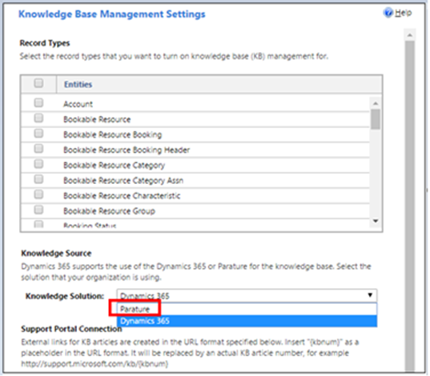

# Important changes (deprecations) coming in Power Apps, Power Automate, and customer engagement apps

The announcements and deprecations described in this article apply to Power Apps, Power Automate, and customer engagement apps. Engagement apps include Dynamics 365 Sales, Dynamics 365 Marketing, Dynamics 365 Field Service, and Dynamics 365 Project Service Automation.

Admins and IT professionals can use this information to prepare for future releases. This article was first published on June 27, 2017.

> [!IMPORTANT]
> "Deprecated" means we intend to remove the feature or capability from a future release. The feature or capability will continue to work and is fully supported until it is officially removed. This deprecation notification can span a few months or years. After removal, the feature or capability will no longer work. This notice is to allow you sufficient time to plan and update your code before the feature or capability is removed.

## Data Export Service deprecation

Effective November 2021, Data Export Service was deprecated. The Data Export Service will continue to work and will be fully supported until it reaches end-of-support and end-of-life in November 2022. This will impact Dynamics 365 and Power Platform customers who use Data Export Service add-on from Microsoft AppSource. We recommend that customers transition to [Azure Synapse Link for Dataverse](/powerapps/maker/data-platform/export-to-data-lake). For more information, see our [blog](https://powerapps.microsoft.com/blog/do-more-with-data-from-data-export-service-to-azure-synapse-link-for-dataverse/) or download [the deprecation playbook](https://aka.ms/DESDeprecationPlaybook).

## Dataverse OData v2.0 Service removal

We plan to remove the Dataverse OData v2.0 Organization Data Service on November 11, 2022.

> [!NOTE]
> This announcement does not involve the deprecated Organization Service SOAP endpoint. At this time, no date has been announced for the removal of the SOAP endpoint.

The Organization Data Service is an OData v2.0 endpoint introduced with Dynamics CRM 2011. The Organization Data Service was deprecated with Dynamics 365 Customer Engagement v8.0 in favor of the Web API, an OData v4.0 service. Today, less than .06% of requests to Dataverse use this endpoint. Removing this endpoint will enable Dataverse to improve overall performance.

Any code that uses the Organization Data Service should be migrated to use the Web API before that time. 
More information: [OData v2.0 Service removal date announcement](https://aka.ms/DataverseODataV2EndpointRemoval).

## Internet Explorer 11 support for Dynamics 365 and Microsoft Power Platform is deprecated

> [!IMPORTANT]
> With 2022 release wave 2, Internet Explorer 11 will be blocked. Please switch to a modern browser.

Effective December 2020, Microsoft Internet Explorer 11 support for Microsoft Dynamics 365 and Microsoft Power Platform is deprecated, and Internet Explorer 11 won’t be supported after August  2021. 

This will impact customers who use Dynamics 365 and Microsoft Power Platform products that are designed to be used through an Internet Explorer 11 interface. After August 2021, Internet Explorer 11 won't be supported for such Dynamics 365 and Microsoft Power Platform products. We recommend that customers transition to Microsoft Edge. 

More information: [Support end for Internet Explorer](admin/support-end-internet-explorer.md).

If you have more questions, contact your Microsoft Customer Service representative or Microsoft Partner.

## Support for Microsoft 365 Groups and Yammer in Dynamics 365 is deprecated

Effective February 2022, support for Microsoft 365 Groups (previously known as Office Groups) and Yammer in Dynamics 365 will be deprecated. This will impact customers who use Microsoft 365 Groups and/or Yammer for collaboration in Dynamics 365. We recommend that customers transition to Microsoft Teams for more advanced collaboration functionalities. For information about integrating Dynamics 365 with Teams, see [Integrate customer engagement apps in Dynamics 365 with Microsoft Teams](/dynamics365/teams-integration/teams-integration).

Existing customers can create teams from their existing Microsoft 365 Groups and map them to individual records as per the requirements. They can also continue to use Microsoft 365 Groups but have a custom experience to host it inside Dynamics 365.

If you've questions about the deprecation, contact your Microsoft Customer Service representative or Microsoft Partner.

## Support for viewing and managing application users in legacy web client is deprecated

Effective February 2022, the list of "Application Users" will not be available under **Advanced Settings** > **Security** > **Users**. You can use the Power Platform admin center to view and manage application users.

## The Analyze section, in mobile offline profiles is deprecated

Effective September 2021, the **Analyze** action and the **Offline profile** report that is used to configure mobile offline profiles is deprecated. 
The Analyze feature is being removed because of Cross-Site Scripts (XSS) vulnerabilities. The report is used to identify components that aren't available when you're working in offline mode. The capabilities will be reimagined as part of the ongoing enhancements of the mobile offline configuration experience. There's no action required by you.

## Dynamics 365 - Gamification is deprecated

Effective April 1, 2021, Dynamics 365 – Gamification is deprecated. Until September 30, 2021, Microsoft provided limited support for this solution. From October 1, 2021, the Dynamics 365 – Gamification solution won’t be functional. To uninstall Gamification, delete the **GamificationUpdater** and **Gamification** solutions from the Dynamics 365 organization. Note that you must first delete the **GamificationUpdater** solution followed by the **Gamification** solution. More information: [Delete a preferred solution](/previous-versions/dynamicscrm-2016/administering-dynamics-365/dn878909(v=crm.8)#Delete%20a%20preferred%20solution).

## Skype integration with customer engagement apps is deprecated

Effective July 2019, Skype integration feature with customer engagement apps has been deprecated and is no longer supported after July 31, 2021. Skype is retired on July 31, 2021; more information: [Skype for Business Online retirement - Microsoft Teams](/microsoftteams/skype-for-business-online-retirement)

The presence indication backed by Skype for Business will no longer function. This deprecation includes presence indication in hover cards, lookup fields, and lookup columns in grids. There are currently plans to support these locations via Teams. In the meantime, presence indication can be found in Live Person Cards.

Plan to transition to Microsoft Teams, because the Team’s capabilities go beyond those of Skype for Business Online. Teams is the next chapter in enterprise communication solution from Microsoft. For more information about Teams capabilities, see [The Total Economic Impact™ of Microsoft Teams](https://www.microsoft.com/microsoft-365/blog/wp-content/uploads/sites/2/2019/04/Total-Economic-Impact-Microsoft-Teams.pdf?rtc=1).

## Low-density headers in model-driven apps won't be supported with the 2021 release wave 2

With the upcoming 2021 release wave 2 (public preview in August 2021 and GA in October 2021), the low-density header option, and runtime experience won't be supported in model-driven app forms.

### Why is this needed?

- Makers have moved away from low-density headers and usage is low. 
- Low-density headers don't promote a highly dense experience and require users to always use the flyout for all controls across view-port sizes from small to very-wide.

### Impact
Any current form that is configured to be “low-density” is automatically updated to render in a [high density with flyout](/powerapps/maker/model-driven-apps/form-designer-header-properties#high-density-header-flyout) mode in a model driven app. Below is an example of high-density header with flyout:

> [!div class="mx-imgBorder"] 
> 

### Action required by you

To meet the October 2021 deadline, be sure you update any of your forms from a low-density format to a high density with flyout mode using the modern form designer. More information: [Configure header density](/powerapps/maker/model-driven-apps/form-designer-header-properties#configuring-header-density). 

If you don't make this change, the form no longer honors this setting at runtime. It also defaults to high density with flyout.

## Form footers in model-driven apps won't be supported with the 2021 release wave 2

With the upcoming 2021 release wave 2 (public preview in August 2021 and GA in October 2021), form footers won't be supported in a model-driven app form. 

#### Why is this needed? 

- The footer doesn't meet the Microsoft [Web Content Accessibility Guidelines (WCAG) 2.0](/compliance/regulatory/offering-WCAG-2-1) compliance for accessibility. 
- Data density is highly impacted by the form footer and doesn't support a good customer experience. Controls aren't discoverable and lead to many customer usability issues. 
- Makers have moved away from adding controls into the footer and there's low usage of other controls, out of box or custom, in the current form footer experiences. 
- Components created using Power Apps component framework aren't fully compatible with form footers, which cause usability issues when added to a form footer. 
- Form footers aren't included in the mobile experience or on the view and dashboard pages.  This change will align the form experience with other pages in a model-driven app. 

#### Impact

Main forms will no longer include the footer when a record is opened. Any out of box or custom controls that have been added to the form footer will no longer be available and you'll need to remove the fields if they're no longer necessary or move the fields to the header and use the [high-density header with flyout](/powerapps/maker/model-driven-apps/form-designer-header-properties#high-density-header-flyout) or add them onto the main form. The recommended approach is to move fields that users need to access regardless of the form tab a user is on to the header and set it to use the [high-density header with flyout](/powerapps/maker/model-driven-apps/form-designer-header-properties#high-density-header-flyout).  If there's only one tab, the recommendation is to move them into a new section on the form. 

#### Action required by you
- To meet the October 2021 deadline, be sure you move fields or controls added to a form footer to either the header or a section on the form.
- If you do nothing, the footer fields or controls that you've added no longer render on the form and aren't available to users. 

The out of box fields currently on the footer is removed and included on the form as part of the 2021 release wave 2 updates. So, you don't lose status, unsaved changes, or the option to open a form in a new window. The **Save** option is already available in the command bar and is always visible to the user. 

While we understand that these types of changes can be disruptive for makers that use the footer today, we always evaluate the experiences. We do this to ensure they provide a modern experience that improves usability, support accessibility requirements, and improves discoverability for highly used fields and controls on a page.

## Model-driven app controls deprecation

With the upcoming 2021 release wave 1 (public preview in February 2021 and GA in April 2021), some older controls for model-driven apps will be deprecated. These controls include Flip Switch, Calendar Control (V1), Linear Slider, Radial Knob, Arc Knob, Linear Gauge; along with the Website Preview control, MultiSelectPicklistControl (V1), and the Flip Label (two radio buttons format option).

#### Why is this needed? 

-	These controls are outdated and don’t conform to our current standards for useability and accessibility. 
-	For example, we’ve received feedback that the Flip Label control is difficult to determine its intended use and users commonly don’t see the options available to choose from, such as "yes / no" or "enable / disable."

#### Impact

- Starting April 2021, these controls can no longer be added to forms. 
- For instances of Flip Label control, the control will be transitioned to a drop-down.
- For all other controls, they'll continue to work within existing forms until April 2022.

#### Action required by you
We won't make other changes to forms or controls.  Makers are encouraged to make updates:

- Use the Toggle control as a replacement for Flip Label and Flip Switch.
- Use the Calendar Control (V2) as a replacement for Calendar Control (V1).
- Evaluate other deprecated controls to determine if they're still useful within existing forms.

## Microsoft Dynamics 365 Email Router is deprecated
The Microsoft Dynamics 365 Email Router will no longer function on April 21, 2021. For information on migrating email routing functionality to use the server-side synchronization feature, see: [Migrate settings from the Email Router to server-side synchronization](/previous-versions/dynamicscrm-2016/administering-dynamics-365/dn832114(v=crm.8)).

## The Microsoft Dynamics 365 application for Windows is deprecated

Effective April 2021, the [Microsoft Dynamics 365 app for Windows](https://go.microsoft.com/fwlink/?linkid=838618) that lets you run customer engagement apps (such as Dynamics 365 Sales, Dynamics 365 Customer Service, and Dynamics 365 Marketing) has been deprecated. 

Microsoft continues to provide security and other critical updates for the Microsoft Dynamics 365 app for Windows until January 29, 2021. We won't release any other features or functionalities for the app. After April 1, 2021, the app is removed from the Microsoft Store, and is no longer supported. 
 
We recommend that you start using your web browser as soon as possible to run your customer engagement apps, such as Dynamics 365 Sales, Dynamics 365 Customer Service, and Dynamics 365 Marketing. Run them on Windows to take advantage of the ongoing improvements for the web app.

## Organization data download filters for mobile offline are deprecated 

Effective February 2021, **Organization data download filter** option that filters the data when you set up mobile offline are deprecated. We recommend that you start preparing your organization and move relevant data filters from **Organization data download filter** to the offline profile option, which lets you determine what data is available when users work in offline mode. For more information, see [Create a mobile offline synchronization](/dynamics365/mobile-app/preview-setup-mobile-offline#step-2-create-a-mobile-offline-profile-to-determine-what-data-will-be-available-while-offline). Once the old filter criteria has been moved to offline profile, you can clear or delete the filters set in **Organization data download filter**. 

## TLS RSA cipher suites are deprecated

Effective October 30, 2020, the following cipher suites are being deprecated from our servers.
- "TLS_RSA_WITH_AES_256_GCM_SHA384”
- "TLS_RSA_WITH_AES_128_GCM_SHA256”
- "TLS_RSA_WITH_AES_256_CBC_SHA256”
- "TLS_RSA_WITH_AES_128_CBC_SHA256”

Cipher suites are used to encrypt messages to secure a network connection between clients/servers and other servers. We're removing the above list of cipher suites to comply with our current security protocols.

Beginning March 1, 2021, customers can only use our [standard cipher suites](/power-platform/admin/server-cipher-tls-requirements). This change impacts your clients and servers that communicate with our servers, for example, syncing emails from your Microsoft Exchange server, running outbound plug-ins, using native (local) clients to access our servers.

Customers must upgrade their servers before March 1, 2021.  For more information about configuring TLS Cipher Suite order, see [Manage Transport Layer Security (TLS)](/windows-server/security/tls/manage-tls).

## Document suggestions for all entities except case are deprecated

Effective October 20, 2020, the document suggestions feature has been deprecated for all entities, except the case entity. The case entity is available with Dynamics 365 Customer Service. More information: [Enable document suggestions to recommend related documents](admin/enable-document-suggestions.md) 

## Automatic record creation rules and SLA items in web client are deprecated

Effective October 01, 2020, the automatic record creation and update rules and service-level agreements (SLAs) have been deprecated in the web client. For more information, see [Deprecations in Customer Service](/dynamics365/customer-service/deprecations-customer-service).

## TimeZoneRule entity and some attributes of TimeZoneDefinition entity are deprecated

Effective September 24, 2020, the **TimeZoneRule** entity and the **Bias** and **RetiredOrder** attributes of the **TimeZoneDefinition** entity are deprecated and will be removed in a future release. For all client-side time zone calculations, use the [LocalTimeFromUtcTime](/dynamics365/customer-engagement/web-api/localtimefromutctime) and [UtcTimeFromLocalTime](/dynamics365/customer-engagement/web-api/utctimefromlocaltime) functions in Web API or the [TimeZoneInfo](/dotnet/api/system.timezoneinfo) class in the .NET framework. More information: [Blog: Deprecation of time zone entities in Microsoft Dataverse](https://powerapps.microsoft.com/blog/deprecation-of-time-zone-entities-in-common-data-service/) 

## Online management API PowerShell module and REST API are deprecated

Effective August 26, 2020, the online management API PowerShell module, and the underlying [Online Management REST API](/powerapps/developer/common-data-service/online-management-api/overview) are  deprecated. The [online management API PowerShell module](/powershell/powerapps/get-started-onlinemanagementapi) will be updated in October  2020 to point to newer underlying APIs and won’t receive further updates. We recommend that you use the Power Apps administration module. More information: [Get started using the Power Apps admin module](/powershell/powerapps/get-started-powerapps-admin)

## Company News Timeline solution is deprecated

Effective July 10, 2020, the [Company News Timeline](/dynamics365/company-news-timeline/get-company-news-timeline-dynamics-365-phones-tablets) solution, which delivers relevant news from Bing News about customers and categorizes it in inline when you're looking at customer accounts will be deprecated. Until September 10, 2020, Microsoft will continue to provide support for the feature, but won't release any other functionality beyond what is already present. Starting September 10, 2020, you'll need to uninstall the solution, which will remove the news widget from the Account record pages. 

1. To remove the solution, go to **Advanced settings** and select **Solutions**. 
2. Select **CompanyNewsTimeline** and then select **Delete**. 

As an alternative you can install news Power Apps component framework control. For more information, see [Set up and use the news control](/powerapps/maker/model-driven-apps/stay-current-with-news-control).

## Dynamic 365 Sales bot is deprecated

Effective June 2, 2020, the Dynamics 365 Sales bot, a feature that enables users to retrieve sales information through a bot within Dynamics 365 Sales app for Teams will be deprecated. Until July 31, 2020, Microsoft will continue to provide support for the feature, but won't release any more functionality beyond what is already present.  After July 31, 2020, you'll no longer be able to receive responses to conversations. The bot won’t be available for new customers; existing customers may still be able to access the bot from the Chat, however the bot won't respond to questions.

It is our goal to deliver a powerful bot experience that allows users to retrieve and manage information. Based on usage data and feedback from our customers, we'll be working on a powerful, extensible set of capabilities and features that will allow you to intuitively access and interact with sales information—among other entities—through a bot interface. we'll keep you updated on timing for when this will be available.

## Dynamics 365 Connector is deprecated

Effective May 5, 2020 the [Dynamics 365 connector](/connectors/dynamicscrmonline/) used for Flows, Logic Apps, and Canvas Apps is officially deprecated. We recommend that you don't create new connections using this connector.

Rather than use the Dynamics 365 connector, the [Microsoft Dataverse connector](/connectors/commondataserviceforapps/) should be your first choice *if you can use it*. You may not be able to use the Microsoft Dataverse connector in every situation today because of the following limitations:

- It isn't available in Logic Apps.
- It doesn't enable cross-tenant or cross environment connections. 
- It cannot be used for canvas apps that use the [Power Apps for Windows client](https://www.microsoft.com/p/power-apps/9nblggh5z8f3).

If you cannot use the Microsoft Dataverse connector, you should use the [Microsoft Dataverse (legacy)](/connectors/commondataservice/). This connector has all the capabilities of the Dynamics 365 connector, and includes several improvements that increase reliability.

The Microsoft Dataverse connector represents the future for connections using Dataverse. This includes Dynamics 365 apps using Dataverse. Work is underway to make this connector the only connector you will need. But at the current time, the previously mentioned limitations mean that you can't use it in all places where the Dynamics 365 connector or Microsoft Dataverse (legacy) connector can be used today.

At this time, there's no requirement to convert canvas apps, flows, or logic apps to stop using the Dynamics 365 connector because of the known blocking limitations. But you should stop creating new connections with the Dynamics 365 connector and convert them if you can.

|Type|Guidance|
|---------|---------|
|Flows|If you can convert existing flows to use the Microsoft Dataverse connector, we recommend you do so.|
|Logic Apps|We recommend you stop creating new connections using the Dynamics 365 connector and use the Microsoft Dataverse (legacy) instead.|
|Canvas Apps|Canvas apps created after November 2019 should not have used the connector infrastructure by default. These apps should automatically connect to the Dataverse instance within the same environment.   If you have a canvas app that used the  Dynamics 365 connector, find information about how to convert them here: [Converting canvas apps with the Dynamics 365 connector](/powerapps/maker/canvas-apps/use-native-cds-connector#converting-canvas-apps-with-the-dynamics-365-connector).|

### Forward looking guidance

When the Microsoft Dataverse connector represents a viable replacement for all situations where the Dynamics 365 and Microsoft Dataverse (legacy) connectors are used today, we intend to remove both the current Dynamics 365 and Microsoft Dataverse (legacy) connectors so that a single connector based on the Microsoft Dataverse connector will remain. At that time it will be required to convert any Flows, Logic Apps, and Canvas Apps still using the Dynamics 365 and Microsoft Dataverse (legacy) connectors.

We will announce timelines as they are determined.

## AI Builder text classification models are deprecated

Effective April 24, 2020, any text classification models created using AI Builder before this date will be deprecated. Until May 15, 2020, these models will continue to function, and Microsoft will continue to provide support, however some functionality may be disabled. After May 15, 2020, these models will no longer work.

Beginning April 24, 2020, customers will need to recreate their existing text classification models with the new model versions. Any models created after this date will automatically use the new model versions and require no further action.

After April 24, 2020, customers are encouraged to transition to the new model versions as soon as possible.

## Dynamic 365 for Outlook is deprecated

Effective March 2020, the legacy Dynamics 365 for Outlook (also referred to as Outlook COM add-in) was deprecated, and is no longer available for customer engagement apps (Dynamics 365 Sales, Customer Service, Marketing, and Field Service). Use the modern [Dynamics 365 App for Outlook](/dynamics365/outlook-app/overview) instead.

[Dynamics 365 Customer Engagement (on-premises)](/dynamics365/customerengagement/on-premises/overview) users can continue to use the legacy Dynamics 365 for Outlook. However, we recommend that you transition to the modern Dynamics 365 App for Outlook at the earliest. For information and steps to make a smooth transition, download [Dynamics 365 for Outlook (COM add-in) Playbook](https://aka.ms/OutlookCOMPlaybook).

## Dynamics 365 Home is deprecated 

Effective March 2020, the home page for Dynamics 365 applications (https://home.dynamics.com) is deprecated and won't be available on or after June 30, 2021. The Microsoft 365 apps page (https://www.office.com/apps) will replace it and provide users with a single page for productivity and business applications.  

Dynamics 365 Home users will see notification about the new location and recommendation to change browser bookmarks starting October 1, 2020. On or after June 30, 2021, users will no longer be able to navigate to <https://home.dynamics.com> from the Office 365 applications list or the Office 365 [application launcher](admin/quickly-navigate-office-365-app-launcher.md#quickly-move-between-apps-with-the-app-launcher). After June 2021, users who navigate to <https://home.dynamics.com> will see an error page.

More information: <https://aka.ms/business-apps-discovery-docs>  

## Form processing and object detection preview models in AI Builder are deprecated 

Effective March 5, 2020, any form processing and object detection models created using AI Builder before this date will be deprecated. Until June 8, 2020, these models will continue to function, and Microsoft will continue to provide support, however some functionality may be disabled. After June 8, 2020, these models will no longer work. 

Beginning March 5, 2020, customers will need to recreate their existing form processing and object detection models with the new model versions. Any models created after this date will automatically use the new model versions and require no further action.

After March 5, 2020, customers are encouraged to transition to the new model versions as soon as possible.

More information: 
- [Transition to use a new form processing model version](/ai-builder/form-processing-transition)
- [Transition to use a new object detection model version](/ai-builder/object-detection-transition)

## Old Dataverse environment URL redirector service is deprecated

When you access your Dataverse environment for the first time or every time after you have signed out from a prior session, you are directed to Azure AD for signing in. In the sign-in page URL, it contains a set of internal values/codes that include a link to the URL redirector service. Upon successful login, the URL redirector service directs you to your Dataverse environment.

The old URL redirector service, cloudredirector.crm.dynamics.com, was replaced in September 2019 with the new one, bn1--namcrlivesg614.crm.dynamics.com (just an example; the URL will differ based on your environment region). The old URL redirector service is deprecated, and will be removed on **March 31, 2020**. 

This change will impact you if you have created a bookmark of the sign-in page before September 2019 that contained the link to the old URL redirector service. The users impacted by this change will see a notification staring February 17, 2020 with instructions to resolve the issue. For detailed information about this issue and how to resolve it, see <https://support.microsoft.com/help/4541747>. 

## Deprecation of Office365 authentication type and OrganizationServiceProxy class for connecting to Dataverse

Effective February 4, 2020, the **WS-Trust** authentication type that is used by
custom clients to connect to Dataverse is deprecated. This change
affects applications that utilize
[Microsoft.Xrm.Sdk.Client.OrganizationServiceProxy](/dotnet/api/microsoft.xrm.sdk.client.organizationserviceproxy)
and
[Microsoft.Xrm.Tooling.Connector.CrmServiceClient](/dotnet/api/microsoft.xrm.tooling.connector.crmserviceclient)
classes for the authentication type of "Office365".

We are making this change to remove a security protocol (WS-Trust) that is
inherently insecure by current encryption standards. While Microsoft has worked
hard to protect users who choose to use this authentication type for
the convenience of login process, it has become an increasing source of concern
for Microsoft security and identity protection systems. The WS-Trust security
protocol, when used in conjunction with a user account and password, implements
an authentication flow that presents both the user ID and password to the
authenticating resource in 'clear text' form, relying solely on the transport
encryption to provide security for the initial leg of the authentication, until
such point as the token service returns an authentication token to use.
Additionally, the WS-Trust protocol does not support modern forms of
Multi-Factor Authentication and conditional access controls to customer data.

With this change, the intent is to guide developers away from this
authentication flow and help application developers to utilize the capabilities
of Azure Active Directory to secure and protect access to their applications and
customers in Dataverse.

To allow for transition of customers and partner applications: 

- Effective October 2020, the authentication protocol will be retired for all new tenants.
- Effective October 2020, the authentication protocol won't be available in all new [regions](admin/regions-overview.md#what-regions-are-available).
- Effective April 20211, the authentication protocol will be retired for all new environments within a tenant.
- Effective April 2022, the authentication protocol will be retired for all new and existing environments within a tenant.

1The retirement of new environments starts April 1, 2021 and rolls out gradually in all regions within a 6-week window.

More information: [Use of Office365 authentication with the WS-Trust security protocol](/powerapps/developer/common-data-service/authenticate-office365-deprecation)

## Regional Discovery Service is deprecated

Effective March 2, 2020, the *regional* [Discovery Service](/powerapps/developer/common-data-service/org-service/discovery-service) is deprecated. Microsoft will continue to provide support, security, and other critical updates for the *regional* Discovery Service, but won't release any more functionality beyond what has already been announced. After April 21, 2021, the *regional* Discovery Service will be shut down.

Customers must transition to using the [global OData V4 Discovery Service](/powerapps/developer/common-data-service/webapi/discover-url-organization-web-api#global-discovery-service) before April 21, 2021 so their applications aren't impacted. More information: [Modify your code to use global Discovery Service](/powerapps/developer/common-data-service/webapi/discovery-orgsdk-to-webapi).

## Rules feature in canvas apps is deprecated

Effective October 14, 2019, the [rules](/powerapps/maker/canvas-apps/working-with-rules) feature in canvas apps in Power Apps is deprecated. Few people have made use of rules in their canvas apps. From feedback collected through research and discussions with makers of Power Apps, the rules feature was confusing, and expressions were easier to learn, use, and debug. For more information about the rules feature deprecation, see [Blog: Canvas Rules feature deprecation](https://powerapps.microsoft.com/blog/canvas-rules-feature-deprecation/).

## Legacy web client is deprecated

As of September 2019, the legacy web client is deprecated. Customers must transition to Unified Interface before December 4, 2020. Microsoft will continue to provide support, security, and other critical updates to the legacy web client until December 4, 2020 but won't release any more functionality beyond what has already been announced.
  
On December 4, 2020, the legacy web client will no longer be available. Organizations should make the transition to Unified Interface as soon as possible to take advantage of Microsoft’s ongoing investments in reliability, performance, and functionality. 

 
In the coming months, for those that have not already made the transition, we will be sending reminders and scheduling updates to transition customers to Unified Interface prior to December 4, 2020. 
For more information and steps to make a smooth transition, see: 

-   [Unified Interface Community
    Group](https://community.dynamics.com/365/unified-interface/) including a
    Blog and Forum

-   [Getting Started Unified Interface
    Playbook](/powerapps/maker/model-driven-apps/unified-interface-playbook)

-   [User Experience and Unified Interface transition
    whitepaper](/powerapps/maker/model-driven-apps/approaching-unified-interface)

-   [Quick Start Guide – add Unified Interface App to existing
    environment](/powerapps/maker/model-driven-apps/transition-web-app-existing)

-   [Quick Start Guide – set an environment to Unified Interface as
    default](/powerapps/maker/model-driven-apps/transition-web-app)

## Task flows are deprecated

[Task flows](/power-automate/create-mobile-task-flow) are used to create a step-by-step data entry form for common tasks, such as after-meeting follow-ups. 

Task flows are deprecated and will be removed by October 1, 2021. They will be replaced by the immersive experience for business process flows that is planned for release. More information: [Business process flow immersive experiences](/power-platform-release-plan/2019wave2/microsoft-flow/business-process-immersive-experiences)

## Process Dialogs are deprecated

You can use a process dialog to create an interactive step-by-step data entry form that requires user input to start and run to completion. When you start the dialog process, a wizard-like interface is presented; users make selections or enter data as they progress through each page of the wizard.

Process dialogs are deprecated and will be removed by December 1, 2020. Suggested replacement options include Business Process Flows or Canvas Apps. More information: [Replace dialogs with business process flows or canvas apps](/power-automate/replace-dialogs)

## Legacy process-related attributes in entities are deprecated

The legacy process-related attributes (such as **StageId**, and **TraversedPath**) on entities enabled for business process flows are now deprecated. The **SetProcess** action for business process flows is also deprecated. Manipulating these legacy process-related attributes for target entity records does not guarantee consistency of the business process flow state, and isn't a supported scenario. The recommended way is to use the attributes of the business process flow entity. More information: [Create, retrieve, update, and delete business process flow entity records](/dynamics365/customer-engagement/developer/model-business-process-flows#create-retrieve-update-and-delete-business-process-flow-entity-records-process-instances)

## Some client APIs are deprecated

The following client APIs are deprecated to reorganize the Xrm client API object model to better align with the need of using the same
client scripts without having to change them based on the context or the client
(web client or the new Unified Interface) where they run. You should plan to use
the new client APIs mentioned in the **Replacement Client API** column instead
of the deprecated ones. The deprecated client APIs will continue to be available
and supported until they are officially removed from a future major release. *A public announcement here in the documentation, on the Dynamics 365 blog, and in many other places will be made at least six months before removal.*

|Deprecated Client API |Replacement Client API |Comments |
|-----|-----|-----|
|[Xrm.Page](/previous-versions/dynamicscrm-2015/developers-guide/gg328474(v%3dcrm.7))                                 | **Forms**: ExecutionContext.[getFormContext](/dynamics365/customer-engagement/developer/clientapi/reference/executioncontext/getformcontext)   **Commands**: Send it as the [PrimaryControl](/dynamics365/customer-engagement/developer/customize-dev/pass-dynamics-365-data-page-parameter-ribbon-actions#form-and-grid-context-in-ribbon-actions) parameter |                                               Use of the **Xrm.Page** object as a static access to the primary form context is still supported to maintain backward compatibility with the existing scripts. Based on the feedback, we understand that the usage of **Xrm.Page** is high, and it won't be removed as soon as some other client API methods listed in this section. We encourage you to use the new way of getting form content where possible. More information: [Client API form context](/dynamics365/customer-engagement/developer/clientapi/clientapi-form-context) Although **Xrm.Page** is deprecated, **parent.Xrm.Page** will continue to work in case of HTML web resources embedded in forms as this is the only way to access the form context from the HTML web resource.                                                |
|[Xrm.Page.context](/previous-versions/dynamicscrm-2015/developers-guide/gg334511(v%3dcrm.7))                             |                                                                                                                    Xrm.Utility.[getGlobalContext](/dynamics365/customer-engagement/developer/clientapi/reference/xrm-utility/getglobalcontext)                                                                                                                    |                                                                                                                                                              Allows access to the global context without going through the form context.                                                                                                                                                               |
| [Xrm.Page.context.getQueryStringParameters](/previous-versions/dynamicscrm-2015/developers-guide/gg334511(v%3dcrm.7)#getquerystringparameters) |                                                                                                                                                                    formContext.data.attributes                                                                                                                                                                    | The formContext.data.attributes API will make retrieval of non-entity bound data consistent across entity forms, metadata-driven dialogs, and task-based flows. The data will be a combination of custom values sent using the query string and what was specified in the parameters in the [openForm](/dynamics365/customer-engagement/developer/clientapi/reference/xrm-navigation/openform) method. |
| [Xrm.Page.context.getTimeZoneOffsetMinutes](/previous-versions/dynamicscrm-2015/developers-guide/gg334511(v=crm.7)#gettimezoneoffsetminutes) |                                                                                                                                                        globalContext.userSettings.getTimeZoneOffsetMinutes                                                                                                                                                        |                                                                                                                                                                                  Moved to globalContext.userSettings                                                                                                                                                                                   |
|                [Xrm.Page.context.getUserId](/previous-versions/dynamicscrm-2015/developers-guide/gg334511(v=crm.7)#getuserid)                |                                                                                                                                                                 globalContext.userSettings.userId                                                                                                                                                                 |                                                                                                                                                                                  Moved to globalContext.userSettings                                                                                                                                                                                   |
|              [Xrm.Page.context.getUserLcid](/previous-versions/dynamicscrm-2015/developers-guide/gg334511(v=crm.7)#getuserlcid)              |                                                                                                                                                               globalContext.userSettings.languageId                                                                                                                                                                |                                                                                                                                                                                  Moved to globalContext.userSettings                                                                                                                                                                                   |
|              [Xrm.Page.context.getUserName](/previous-versions/dynamicscrm-2015/developers-guide/gg334511(v=crm.7)#getusername)              |                                                                                                                                                                globalContext.userSettings.userName                                                                                                                                                                |                                                                                                                                                                                  Moved to globalContext.userSettings                                                                                                                                                                                   |
|             [Xrm.Page.context.getUserRoles](/previous-versions/dynamicscrm-2015/developers-guide/gg334511(v=crm.7)#getuserroles)             |                                                                                                                                                             globalContext.userSettings.securityRoles                                                                                                                                                              |                                                                                                                                                                                  Moved to globalContext.userSettings                                                                                                                                                                                   |
|     [Xrm.Page.context.getIsAutoSaveEnabled](/previous-versions/dynamicscrm-2015/developers-guide/gg334511(v=crm.7)#getisautosaveenabled)     |                                                                                                                                                       globalContext.organizationSettings.isAutoSaveEnabled                                                                                                                                                        |                                                                                                                                                                              Moved to globalContext.organizationSettings                                                                                                                                                                               |
|               [Xrm.Page.context.getOrgLcid](/previous-versions/dynamicscrm-2015/developers-guide/gg334511(v=crm.7)#getorglcid)               |                                                                                                                                                           globalContext.organizationSettings.languageId                                                                                                                                                           |                                                                                                                                                                              Moved to globalContext.organizationSettings                                                                                                                                                                               |
|         [Xrm.Page.context.getOrgUniqueName](/previous-versions/dynamicscrm-2015/developers-guide/gg334511(v=crm.7)#getorguniquename)         |                                                                                                                                                           globalContext.organizationSettings.uniqueName                                                                                                                                                           |                                                                                                                                                                              Moved to globalContext.organizationSettings                                                                                                                                                                               |
|             [Xrm.Page.data.entity.getDataXml](/previous-versions/dynamicscrm-2015/developers-guide/gg334720(v%3dcrm.7)#getdataxml)             |                                                                                                                                        No change in the method, but use "typename" instead of type for lookup attributes.                                                                                                                                         |                                                                                                                                                                                                                                                                                                                                                                                                        |
|                     [GridRow.getData](/previous-versions/dynamicscrm-2015/developers-guide/dn932126(v%3dcrm.7)#getdata)                      |                                                                                                                                                                           GridRow.data                                                                                                                                                                            |                                                                                                                                                 GridRow is essentially a form context. This change unifies the interface of GridRow with formContext.                                                                                                                                                  |
|            [GridRowData.getEntity ](/previous-versions/dynamicscrm-2015/developers-guide/dn932126(v=crm.7)#getentity)             |                                                                                                                                                                        GridRowData.entity                                                                                                                                                                         |                                                                                                                                                    GridRowData is form data. This change unifies the interface of GridRowData with formContextData.                                                                                                                                                    |
|                           [Xrm.Mobile.offline](/previous-versions/dynamicscrm-2016/developers-guide/mt787123(v=crm.8))                            |                                                                                                                              [Xrm.WebApi.offline](/dynamics365/customer-engagement/developer/clientapi/reference/xrm-webapi/offline)                                                                                                                              |                                                                                                                                                                     Moved the offline-related methods under **Xrm.WebApi.offline**                                                                                                                                                                     |
|              [parent.Xrm](/previous-versions/dynamicscrm-2015/developers-guide/gg309536(v%3dcrm.7)#reference-other-web-resources-from-an-html-web-resource)               | Use one of the following:   a) Use a custom control created using [Power Apps component framework](/powerapps/developer/component-framework/overview) instead of HTML web resources.  b) On forms, use the [getContentWindow](/powerapps/developer/model-driven-apps/clientapi/reference/controls/getcontentwindow) method of the web resource control.  c) If the [getContentWindow](/powerapps/developer/model-driven-apps/clientapi/reference/controls/getcontentwindow) method doesn't work, you can use `parent.Xrm` to get to the `Xrm` object inside an HTML web resource. If the HTML web resource is opened in a new window, then you should use `opener.Xrm` instead.                                                                                                                                                                                                                                                                                                                                                                  |                 **Earlier**: An HTML web resource may interact with the **Xrm.Page** or **Xrm.Utility** objects within the form by using **parent.Xrm.Page** or **parent.Xrm.Utility**.   **Now**: parent.Xrm.\* will work if the HTML web resource is loaded in a form container. It won't work for HTML web resources that are stand alone, or referenced from the site map or any other places.  **NOTE**: `parent.Xrm` will be removed after the removal of the `ClientGlobalContext.js.aspx` page; dates yet to be announced.                  |
|                              [addOnKeyPress](/previous-versions/dynamicscrm-2016/developers-guide/gg334266(v=crm.8)#addonkeypress)                              |                                                                                                                                                                       Use a custom control created using [Power Apps component framework](/powerapps/developer/component-framework/overview)                                                                                                                                                                        |                                                                                                                                                                                                                                                                                                                                                                                                        |
|                 [fireOnKeyPress](/previous-versions/dynamicscrm-2016/developers-guide/gg334266(v=crm.8)#fireonkeypress)                  |                                                                                                                                                                       Use a custom control created using [Power Apps component framework](/powerapps/developer/component-framework/overview)                                                                                                                                                                        |                                                                                                                                                                                                                                                                                                                                                                                                        |
|                 [removeOnKeyPress](/previous-versions/dynamicscrm-2016/developers-guide/gg334266(v=crm.8)#removeonkeypress)                  |                                                                                                                                                                       Use a custom control created using [Power Apps component framework](/powerapps/developer/component-framework/overview)                                                                                                                                                                       |                                                                                                                                                                                                                                                                                                                                                                                                        |
|                 [showAutoComplete](/previous-versions/dynamicscrm-2016/developers-guide/gg334266(v=crm.8)#showautocomplete)                  |                                                                                                                                                             Use a custom control created using [Power Apps component framework](/powerapps/developer/component-framework/overview)                                                                                                                                                             |                                                                                                                                                                                                                                                                                                                                                                                                        |
|                 [hideAutoComplete](/previous-versions/dynamicscrm-2016/developers-guide/gg334266(v=crm.8)#hideautocomplete)                  |                                                                                                                                                             Use a custom control created using [Power Apps component framework](/powerapps/developer/component-framework/overview)                                                                                                                                                             |                                                                                                                                                                                                                                                                                                                                                                                                        |
|                [Xrm.Utility.alertDialog ](/previous-versions/dynamicscrm-2015/developers-guide/jj602956(v%3dcrm.7)#alertdialog)                |                                                                                                                  Xrm.Navigation.[openAlertDialog](/dynamics365/customer-engagement/developer/clientapi/reference/xrm-navigation/openalertdialog)                                                                                                                  |                                                                                                                                             The new signature is consistent with other APIs (openForm) and takes a new set of parameters for flexibility.                                                                                                                                              |
|              [Xrm.Utility.confirmDialog](/previous-versions/dynamicscrm-2015/developers-guide/jj602956(v%3dcrm.7)#confirmdialog)               |                                                                                                                Xrm.Navigation.[openConfirmDialog](/dynamics365/customer-engagement/developer/clientapi/reference/xrm-navigation/openconfirmdialog)                                                                                                                |                                                                                                                                             The new signature is consistent with other APIs (openForm) and takes a new set of parameters for flexibility.                                                                                                                                              |
|                       [Xrm.Utility.getBarcodeValue](/previous-versions/dynamicscrm-2016/developers-guide/jj602956(v=crm.8)#getbarcodevalue)                        |                                                                                                                   Xrm.Device.[getBarcodeValue](/powerapps/developer/model-driven-apps/clientapi/reference/xrm-device/getbarcodevalue)                                                                                                                   |  Moving device-related actions to Xrm.Device                                                       |
|                       [Xrm.Utility.getCurrentPosition](/previous-versions/dynamicscrm-2016/developers-guide/jj602956(v=crm.8)#getcurrentposition)                        |                                                                                                                   Xrm.Device.[getCurrentPosition](/powerapps/developer/model-driven-apps/clientapi/reference/xrm-device/getcurrentposition)                                                                                                                   | Moving device-related actions to Xrm.Device                                                        |
|                       [Xrm.Utility.isActivityType](/previous-versions/dynamicscrm-2015/developers-guide/jj602956(v%3dcrm.7)#isactivitytype)                        |                                                                                                                   Xrm.Utility.[getEntityMetadata](/dynamics365/customer-engagement/developer/clientapi/reference/xrm-utility/getentitymetadata)                                                                                                                   |                                                        The isActivityType method is synchronous so it was suitable for ribbon rules. However, the replacement method, [getEntityMetadata](/dynamics365/customer-engagement/developer/clientapi/reference/xrm-utility/getentitymetadata), is asynchronous, and isn't suitable for ribbon rules.                                                        |
|             [Xrm.Utility.openEntityForm ](/previous-versions/dynamicscrm-2015/developers-guide/jj602956(v%3dcrm.7)#openentityform)             |                                                                                                                         Xrm.Navigation.[openForm](/dynamics365/customer-engagement/developer/clientapi/reference/xrm-navigation/openform)                                                                                                                         |                                                                                                                                                                              Moving navigation actions to Xrm.Navigation                                                                                                                                                                               |
|                       [Xrm.Utility.openQuickCreate](/previous-versions/dynamicscrm-2015/developers-guide/jj602956(v%3dcrm.7)#openquickcreate)                       |                                                                                                                         Xrm.Navigation.[openForm](/dynamics365/customer-engagement/developer/clientapi/reference/xrm-navigation/openform)                                                                                                                         |                                                                                                                                                                              Moving navigation actions to Xrm.Navigation                                                                                                                                                                               |
|                       [Xrm.Utility.openWebResource](/previous-versions/dynamicscrm-2015/developers-guide/jj602956(v%3dcrm.7)#openwebresource)                       |                                                                                                                  Xrm.Navigation.[openWebResource](/dynamics365/customer-engagement/developer/clientapi/reference/xrm-navigation/openwebresource)                                                                                                                  |                                                                                                                                                Moving navigation actions to Xrm.Navigation   **Note**: This API returns VOID in Unified Interface.                                                                                                                                                 |
|                       [globalContext.organizationSettings.baseCurrencyId](/powerapps/developer/model-driven-apps/clientapi/reference/xrm-utility/getglobalcontext/organizationsettings#basecurrencyid)                       |                                                                                                                  [globalContext.organizationSettings.baseCurrency](/powerapps/developer/model-driven-apps/clientapi/reference/xrm-utility/getglobalcontext/organizationsettings#basecurrency)                                                                                                                  |                                                                                                                                                The replacement method lets you access the display name along with the ID of transaction currency.                                                                                                                                                 |
|                       [globalContext.userSettings.securityRoles](/powerapps/developer/model-driven-apps/clientapi/reference/xrm-utility/getglobalcontext/usersettings#securityroles)                       |                                                                                                                  [globalContext.userSettings.roles](/powerapps/developer/model-driven-apps/clientapi/reference/xrm-utility/getglobalcontext/usersettings#roles)                                                                                                                  |                                                                                                                                                The replacement method lets you access the display name along with the ID of the security roles.                                                                                                                                                 |
|                       [globalContext.userSettings.transactionCurrencyId](/powerapps/developer/model-driven-apps/clientapi/reference/xrm-utility/getglobalcontext/usersettings#transactioncurrencyid)                       |                                                                                                                  [globalContext.userSettings.transactionCurrency](/powerapps/developer/model-driven-apps/clientapi/reference/xrm-utility/getglobalcontext/usersettings#transactioncurrency)                                                                                                                   |                                                                                                                                                The replacement method lets you access the display name along with the ID of transaction currency.                                                                                                                                                 |
|                       [getData](/powerapps/developer/model-driven-apps/clientapi/reference/controls/getdata) and [setData](/powerapps/developer/model-driven-apps/clientapi/reference/controls/setdata) for Silverlight web resources                       |                                                                                                                  None                                                                                                                  |                                                                                                                                                Silverlight is no longer supported. These methods won't be available after October 2020.                                                                                                                                                  |
|                       [formContext.data.entity.save](/powerapps/developer/model-driven-apps/clientapi/reference/formcontext-data-entity/save)                       |                                                                                                                  [formContext.data.save](/powerapps/developer/model-driven-apps/clientapi/reference/formcontext-data/save)                                                                                                                  |                                                                                                                   |
|                       [ClientGlobalContext.js.aspx](/powerapps/developer/model-driven-apps/clientapi/reference/getglobalcontext-clientglobalcontext.js.aspx#clientglobalcontextjsaspx)                       |                                                                                                                  None                                                                                                                  |  The ClientGlobalContext.js.aspx page is deprecated and scheduled to be unavailable after October 1, 2022. Use  [Power Apps component framework overview](/powerapps/developer/component-framework/overview) to build configurable and reusable components that enable external integrations in a supported way or use [custom pages](/powerapps/maker/model-driven-apps/model-app-page-overview) to add custom full page or dialog or pane experiences into model-driven apps, with the flexibility of the canvas designer.                                                                                                                 |
|                       [getObject](/powerapps/developer/model-driven-apps/clientapi/reference/getglobalcontext-clientglobalcontext.js.aspx#clientglobalcontextjsaspx)                       |                                                                                                                  [getContentWindow](/powerapps/developer/model-driven-apps/clientapi/reference/controls/getcontentwindow)                                                                                                                  |                       |

For information about the new client APIs, see [Apply business logic using client scripting in model-driven apps using JavaScript](/powerapps/developer/model-driven-apps/client-scripting)

## EntityMetadata.IsInteractionCentricEnabled property is deprecated

All entities supported in Unified Interface are now enabled for the interactive experience in the new Customer Service Hub app. This implies that
the **EntityMetadata**.[IsInteractionCentricEnabled](/dotnet/api/microsoft.xrm.sdk.metadata.entitymetadata.isinteractioncentricenabled)
property, which indicates whether an entity can be enabled for interactive experience, is no longer relevant. The corresponding setting for this property
in the Customization tool, **Enable for interactive experience**, is removed, and the 
**EntityMetadata**.[IsInteractionCentricEnabled](/dotnet/api/microsoft.xrm.sdk.metadata.entitymetadata.isinteractioncentricenabled) property will be removed from the future version.

## Voice of the Customer is deprecated 

The Voice of the Customer solution is used to create and send surveys for collecting feedback.  

As of July 1, 2019, the Voice of the Customer solution is deprecated. Users can create and distribute new surveys and collect responses from live surveys until July 1, 2020.  

A new solution, Dynamics 365 Customer Voice, is generally available to capture customer feedback using surveys. Customers can learn more about Customer Voice [here](/dynamics365/customer-voice/help-hub).

## Dynamics 365 for Blackberry is deprecated

As of December 3, 2018, Microsoft Dynamics 365 for Blackberry App is deprecated and will be removed from the iOS App Store on October 31, 2019. The mobile app is currently available on the iOS App Store and is designed for Dynamics 365 customers that utilize Blackberry Mobile Application Management. See more details about the Dynamics 365 for Blackberry app here: [Secure your mobile data with Microsoft Dynamics 365 for Good](/dynamics365/customer-engagement/mobile-app/v8/go-mobile/admin-troubleshoot/secure-mobile-data-dynamics-365-good). After October 31, 2019, Microsoft Intune will be the only supported mobile application management solution for the [Dynamics 365 for phones application](/dynamics365/customer-engagement/mobile-app/install-dynamics-365-for-phones-and-tablets). 

Microsoft will continue to provide security and other critical updates to the Dynamics 365 for Blackberry App until October 31, 2019, but won't release any more features or functionalities within the app. After October 31, 2019, the Dynamics 365 for Blackberry App will be removed from the App Store, and support will end.

**What should you do?**

If you are currently using the Dynamics 365 for Blackberry App together with Mobile Application Management for Blackberry, plan to migrate to Dynamics 365 for phones by October 31, 2019. We encourage you to migrate as soon as possible to take advantage of Microsoft's ongoing investments in the reliability, performance, and functionality of the Dynamics 365 mobile app.

## Usage of Parature knowledgebase as the knowledge management solution is deprecated

Usage of Parature knowledgebase as the knowledge
management solution is deprecated. This feature is replaced by Knowledge
Management features in Dynamics 365 Customer Service.

The **Knowledge Solution** setting in the **Knowledge Base Management Settings**
dialog box, which provides a connection to Pasture will be removed in a future major release.

## Project Service Finder app is deprecated

The Project Service Finder App, available for use with Dynamics 365 Project Service Automation, is deprecated. The legacy application will be supported for
associated legacy Project Service Automation releases in accordance with
Microsoft's [Modern Lifecycle
Policy](https://support.microsoft.com/help/30881). The functionality
available through this app will be available in a future release of Dynamics 365 Project Service Automation application.

## Relationship Roles are deprecated

Relationship Roles (**Settings \> Business Management \> Relationship Roles**) are
being deprecated along with their user interface components. These will be removed in a future major release. 
This feature is replaced by **Connection Roles**. More information: [Create connections to view relationships between
records](/previous-versions/dynamicscrm-2016/admins-customizers-dynamics-365/mt826690(v=crm.8)).

## Mail Merge is deprecated

In Dynamics CRM 2016 (version 8.0), we introduced server-side document
generation using Word and Excel templates. You can use these templates to
provide standardized documents or customized data analysis for your
organization.

Mail merge from previous versions is deprecated. This includes the mail-merge
Word add-in and mail-merge templates (**Settings \> Templates \> Mail Merge
Templates**).

More information: [Create Word and Excel templates](/previous-versions/dynamicscrm-2016/admins-customizers-dynamics-365/mt826692(v=crm.8))

## Announcements are deprecated

Announcements (**Settings \> Administration \> Announcements**) are deprecated and
will be removed in a future major release.

## Ready-to-use business processes available through Add Ready to Use Business Processes setting are deprecated

Ready-to-use business processes available through the Add Ready-to-Use Business
Processes setting (<strong>Settings \> Data Management \> Add Ready-to-Use Business
Processes</strong>) are deprecated and will be removed in a future major release. You can find ready-to-use business processes on Microsoft AppSource.

## Silverlight (XAP) web resource is deprecated 

The Silverlight (XAP) web resource is deprecated on the web client, and isn't
supported on Unified Interface. Instead of Silverlight web resources, you must use custom
controls created using the HTML web resources
with HTML5 to create UI components to visualize and interact with data.

## Power Apps portals

See [Important changes coming in Power Apps portals](/powerapps/maker/portals/important-changes-deprecations).

## Release plans

[Removed or deprecated features in Finance and Operations apps](/dynamics365/fin-ops-core/fin-ops/get-started/removed-deprecated-features-home-page)

[!INCLUDE[footer-include](includes/footer-banner.md)]
