# Error handling

> [!NOTE]
> The behavior that this article describes is available only when the **Formula-level error management** preview feature through **Settings** > **Upcoming features** > **Preview** is turned on. More information: [Controlling which features are enabled](/power-apps/maker/canvas-apps/working-with-experimental-preview#controlling-which-features-are-enabled)

Errors happen. Networks go down, storage fills up, unexpected values flow in.  It's important that your logic continues to work properly in the face of potential issues.

By default, errors flow through the formulas of an app and are reported to the end user of the app.  In this way, the end user knows something unexpected happened, they can potentially fix the problem themselves with a different input, or they can report the problem to the owner of the app.  

As an app maker, you can take control of errors in your app:
- **Detecting and handling an error.**  If there's a chance an error may occur, the app's formulas can be written to detect the error condition and retry the operation.  The end user doesn't need to be concerned that an error occurred because the maker took the possibility into account.  This is done with the [**IfError**, **IsError**, and **IsErrorOrBlank**](reference/function-iferror.md) functions within a formula.
- **Reporting an error.**  If an error isn't handled in the formula where it was encountered, the error is then bubbled up to the **App.OnError** handler.  Here, the error can no longer be replaced as it has already occurred and is a part of formula calculations.  But you can use **App.OnError** to control how the error is reported to the end user, including suppressing the error reporting all together.  **App.OnError** also provides a common choke point for error reporting across the entire app.
- **Creating and rethrowing an error.**  Finally, you may detect an error condition with your own logic, a condition that is specific to your app.  Use the [**Error**](reference/function-iferror.md) function to create custom errors.  The **Error** function is also used to rethrow an error after being interrogated in **IfError** or **App.OnError**.

## Getting started

Let's start with a simple example.

1. Create a new screen in a Power Apps Canvas app.
1. Insert a **TextInput** control.  It will default to the name **TextInput1**.
1. Insert a **Label** control.
1. Set the **Text** property of the **Label** control to the formula

```power-fx
1/Value( TextInput1.Text )
```
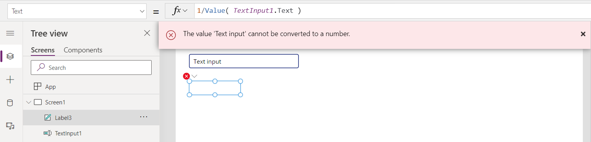

We have an error because the default text of a **TextInput** control is `"Text input"`, which can't be converted to a number.   By default this is a good thing: the end user will get a notification that something isn't working as expected in the app.

Obviously, we don't want an error to greet the user each time they start this app.  Likely `"Text input"` isn't the right default for the text input box anyway.  To remedy this, let's change the **Default** property of the **TextInput** control to:

```power-fx
Blank()
```
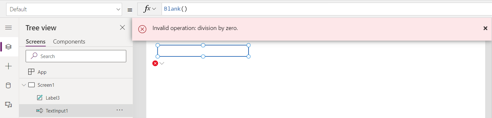

Hmm, now we have a different error.  Mathematical operations with *blank*, such as division, will coerce the blank value to a zero.  And that is now causing a division by zero error.  To remedy this, we need to decide what the appropriate behavior is for this situation in this app.  The answer may be to show *blank* when the text input is *blank*.  We can accomplish this by wrapping our formula with the **IfError** function:

```power-fx
IfError( 1/Value( TextInput1.Text ), Blank() )
```
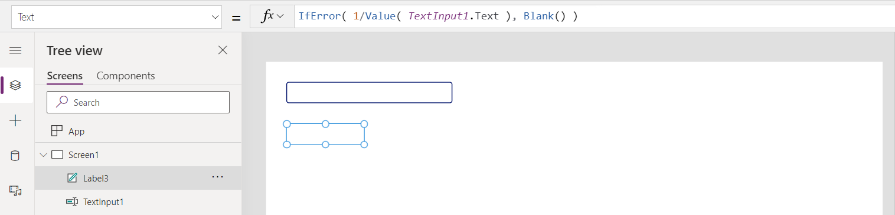

Now the error is replaced with a valid value and the error banner has gone away.  But, we may have overshot, the **IfError** we used covers *all* errors, including typing in a bad value such as `"hello"`.  We can address this by tuning our **IfError** to handle the division by zero case only with and rethrowing all other errors:

```power-fx
IfError( 1/Value( TextInput1.Text ), 
         If( FirstError.Kind = ErrorKind.Div0, Blank(), Error( FirstError ) ) )
```
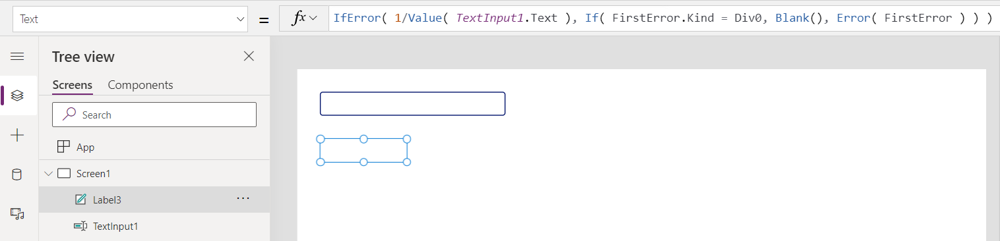

So, let's run our app and try some different values.  

Without any value, as when the app starts, there's no answer displayed as the default value is *blank*, but there also no error shown as the **IfError** replaces the division by zero error.  

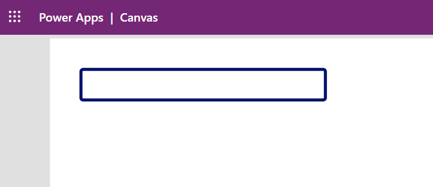

If we type in a 4, we get the expected result of 0.25:

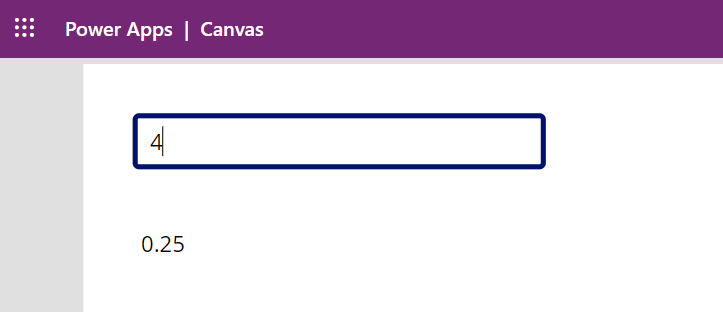

And if we type in something illegal, like `hello`, then we'll receive an error banner:

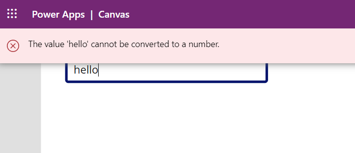

This is a simple introductory example.  Error handling can be done many different ways, depending on the needs of the app:

1. Instead of an error banner, we could have shown **"#Error"** in the label control with the formula.  To keep the types of the replacements compatible with the first argument to **IfError** we need to explicitly convert the numerical result to a text string with the **Text** function.
    ```power-fx
    IfError( Text( 1/Value( TextInput1.Text ) ), 
             If( FirstError.Kind = ErrorKind.Div0, Blank(), "#Error" )
    ```
    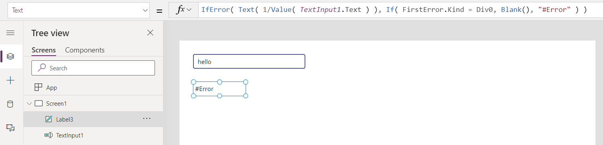
2. Instead of wrapping this specific instance with **IfError** we could have written a centralized **App.OnError** handler. We can't replace the string shown with "#Error" as the error has already happened and **App.OnError** is only provided to control reporting.
    ```power-fx
    If( FirstError.Kind <> ErrorKind.Div0, Error( FirstError ) )
    ```

## Error propagation

Errors flow through formulas much as they do in Excel.  For example in Excel, if cell `A1` has the formula `=1/0`, then A1 will display the error value `#DIV0!`:

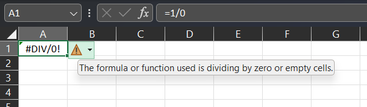

If cell `A2` refers to `A1` with a formula such as `=A1*2`, then the error propagates through that formula too:

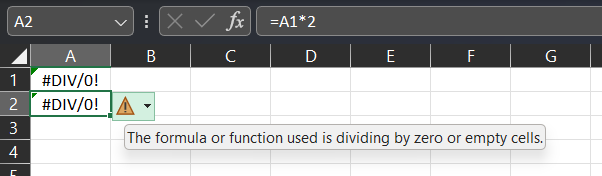

The error replaces the value that would have otherwise been calculated.  There's no result for the multiplication in cell `A2`, only the error from the division in `A1`.  

Power Fx works the same way.  In general, if an error is provided as an argument to a function or operator, the operation won't take place and the input error will flow through as the result of the operation.  For example, `Mid( Text( 1/0 ), 1, 1 )` will return a Division by Zero error, as the inner most error passes through the [**Text**](reference/function-text.md) function and [**Mid**](reference/function-left-mid-right.md) function:

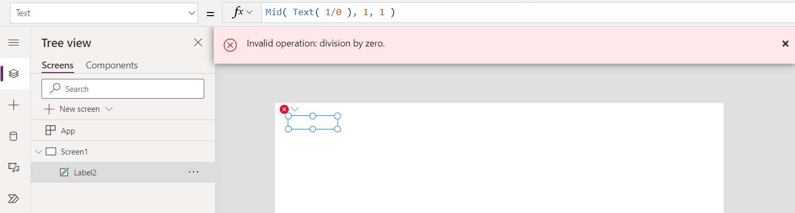

In general, errors don't flow through Power Apps control properties. Let's extend the previous example with an additional control that displays if the first label's `Text` property is an error state:

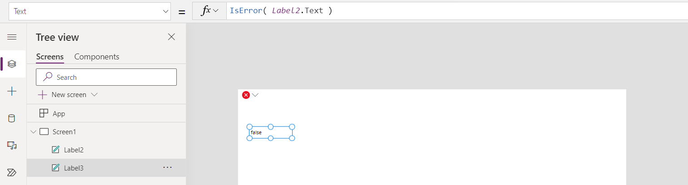

It's fine that errors don't propagate through a control because the system will observe errors on the input to all control properties.  The error won't be lost.

Most functions and operators follow the "error in, error out" rule, but there are some exceptions.  The functions **IsError**, **IsErrorOrBlank**, and **IfError** are designed for working with errors so they may not return an error even if one is passed into them.

## Observing errors

Errors aren't observed until their value is used.

As a result, the **If** and **Select** functions may also not return an error if one is passed in.  Consider the formula `If( false, 1/0, 3 )`.  There's a division by zero error present in this formula, but since the `If` isn't taking that branch because of the `false`, Power Fx and Power Apps won't report an error:

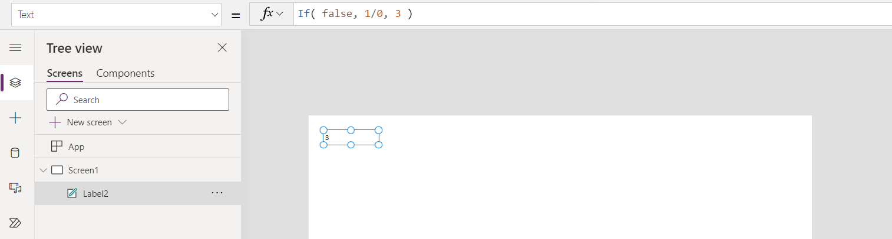

Using the **Set** function with an error won't report an error at the point the error is placed into the variable.  For example in Power Apps, here's a formula in **App.OnStart** that places a division by zero error into the variable `x`:

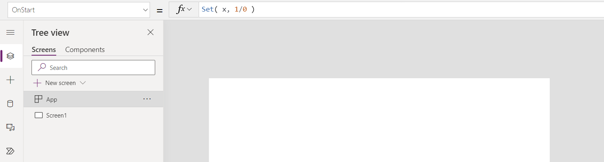

No error is reported, because `x` isn't being referenced.  However, the moment we add a label control and set its **Text** property to `x`, the error is displayed:

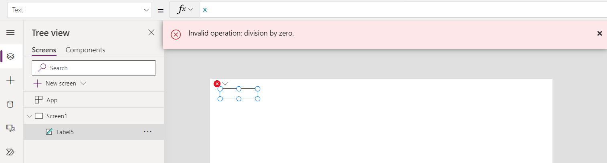

You can observe errors within a formula with the **IfError**, **IsError**, and **IsErrorOrBlank** functions.  With these functions, you can return an alternate value, take alternate action, or modify the error before it's observed and reported.

## Reporting errors

After an error is observed, the next step is to report the error to the end user.  

Unlike Excel, there isn't always a convenient place to show an error result, as the result of a formula may drive a property such as X and Y coordinates of a control for which there's no convenient place to show some text.  Each Power Fx host controls how errors are ultimately displayed to the end user and how much control the maker has over this process.  In Power Apps, an error banner is shown and **App.OnError** is used to control how the error is reported.

It's important to note that **App.OnError** can't replace the error in the same way that **IfError** can.  At the point that **App.OnError** is executed, the error has already happened, and the result has propagated through other formulas.  **App.OnError** only controls how the error is reported to the end user and provides a hook for the maker to log the error if desired.

The scope variables **FirstError** and **AllErrors** provide context information about the error or errors.  This provides information on the kind of error and where the error originated and where it was observed.

## Stopping after an error

Behavior formulas support taking action, modifying databases, and changing state.  These formulas allow more than one action to be done in a sequence using the `;` chaining operator (or `;;` depending on the locale).

In this case, for example, the grid control is showing what is in the `T` table.  Each button select changes the state in this table with two **Patch** calls:

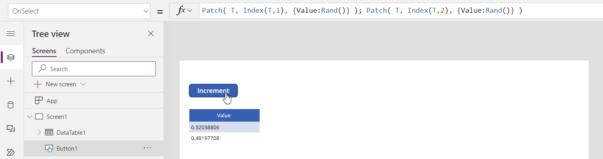

In a chained behavior formula, actions don't stop after the first error.  Let's modify our example to pass an invalid index number in the first **Patch** call.  The second **Patch** continues on despite this earlier error.  The first error is reported to the end user, and shown as an error in Studio on the control:

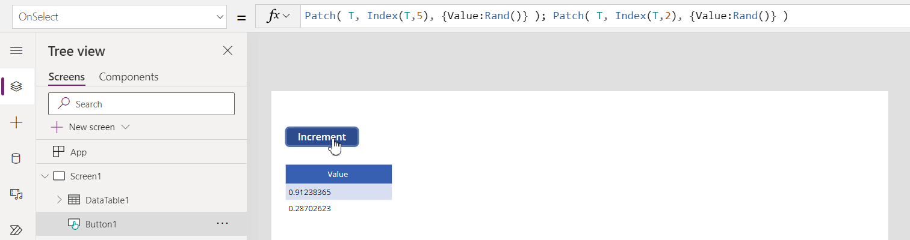

**IfError** can be used to stop execution after an error.  Similar to the **If** function, the third argument to this function provides a place to put actions that should be executed only if there's no error:

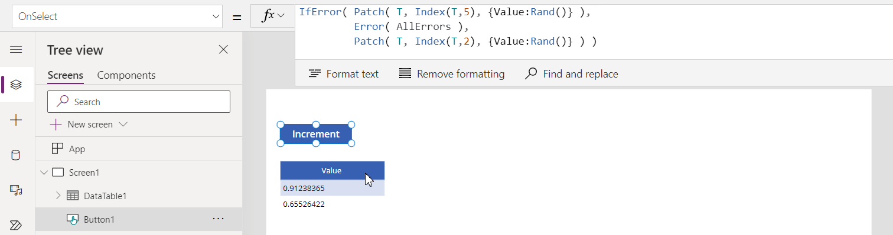

If an error is encountered during one of the iterations of **ForAll**, the rest of the iterations won't stop.  **ForAll** is designed to execute each iteration independently, allowing for parallel execution.  When the **ForAll** is complete, an error will be returned, which contains all the errors encountered (by examining **AllErrors** in **IfError** or **App.OnError**).

For example, the following formula will result in **ForAll** returning two errors (for the division by zero for `Value` of 0, twice) and `Collection` will have three records (for when `Value` isn't 0): `[1, 2, 3]`.

```power-fx
Clear( Collection ); 
ForAll( [1,0,2,0,3], If( 1/Value > 0, Collect( Collection, Value ) ) );
```

## Working with multiple errors

Since a behavior formula can execute more than one action, it can also encounter more than one error.  

By default, the first error is reported to the end user.  In this example, both **Patch** calls will fail, the second with a division by zero error.  Only the first error (about index) is shown to the user:

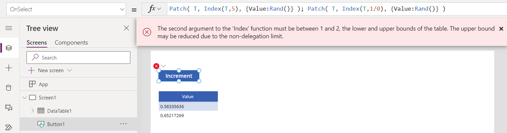

The **IfError** function and **App.OnError** can access all the errors encountered with the **AllErrors** scope variable.  In this case, we can set this to a global variable and look at both errors encountered.  They appear in the table in the same order in which they were encountered:

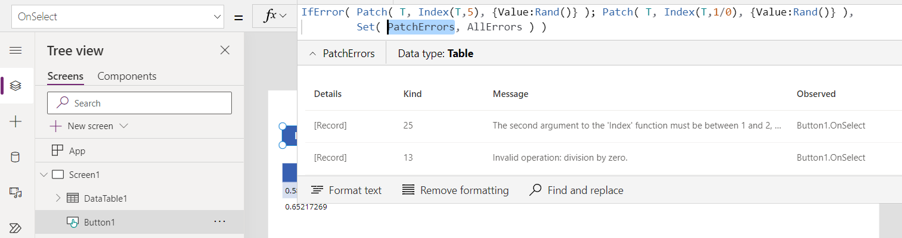

Multiple errors can be returned in non-behavior formulas too.  For example, using the **Patch** function with a batch of records to update can return multiple errors, one for each record that fails.

## Errors in tables

As we saw earlier, errors can be stored in variables.  Errors can also be included in data structures, such as tables.  This is an important so that an error on any one record can't invalidate the entire table.

For example, consider this data table control in Power Apps:

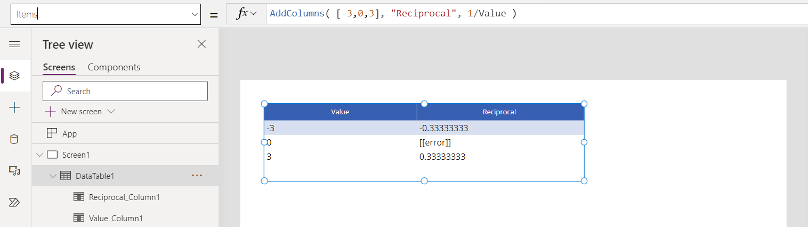

The calculation in **AddColumns** has encountered a division by zero error for one of the values. For that one record, the **Reciprocal** column has an error value (division by zero) but the other records don't and are fine.  `IsError( Index( output, 2 ) )` returns false and `IsError( Index( output, 2 ).Value )` returns true.

If an error occurs when filtering a table, the entire record is an error  but still returned in the result so that the end user knows something was there and there's a problem.

Take this example.  Here, the original table has no errors, but the act of filtering creates an error whenever **Value** is equal to 0:

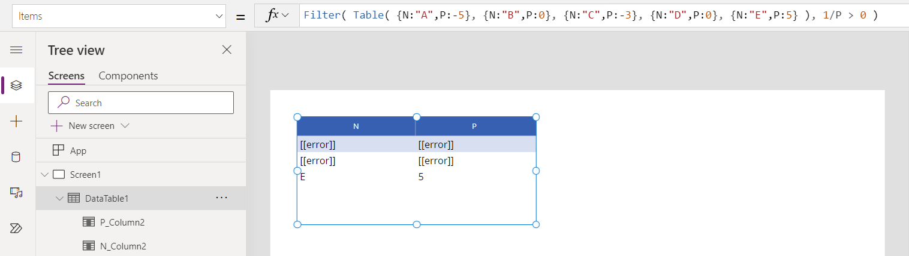

The values -5 and -3 are properly filtered out.  The values 0 result in an error in processing the filter, and so it's unclear if the record should be included or not in the result.  To maximize transparency for end users and help makers debug, we include an error record in place of the original.  In this case, `IsError( Index( output, 2 ) )` returns true.

## Data source errors

The functions that modify data in data sources, such as **[Patch](reference/function-patch.md)**, **[Collect](reference/function-clear-collect-clearcollect.md)**, **[Remove](reference/function-remove-removeif.md)**, **[RemoveIf](reference/function-remove-removeif.md)**, **[Update](reference/function-update-updateif.md)**, **[UpdateIf](reference/function-update-updateif.md)**, and **[SubmitForm](reference/function-form.md)** report errors in two ways:
- Each of these functions will return an error value as the result of the operation.  Errors can be detected with **IsError** and replaced or suppressed with **IfError** and **App.OnError** as usual.  
- After the operation, the **Errors** function will also return the errors for previous operations.  This can be useful for displaying the error message on a form screen without needing to capture the error in a state variable.

For example, this formula will check for an error from **Collect** and display a custom error message:
```power-fx
IfError( Collect( Names, { Name: "duplicate" } ),
         Notify( $"OOPS: { FirstError.Message }", NotificationType.Warning ) )
```

The **Errors** function also returns information about past errors during runtime operations.  It can be useful for displaying an error on a form screen without needing to capture the error in a state variable.   

## Rethrowing errors

Sometimes some potential errors are expected and can be safely ignored.  Inside **IfError** and **App.OnError**, if an error is detected that should be passed on to the next higher handler, it can be rethrown with `Error( AllErrors )`.

## Creating your own errors

You can also create your own errors with the **Error** function.  

If you're creating your own errors, it's recommended that you use values above 1000 to avoid potential conflicts with future system error values.

## ErrorKind enum values

| ErrorKind enum | Value | Description |
|----------------|-------|-------------|
| AnalysisError | 18 | System error.  There was a problem with compiler analysis. |
| BadLanguageCode | 14 | An invalid or unrecognized language code was used.  |
| BadRegex | 15 | Invalid regular expression.  Check the syntax used with the **IsMatch**, **Match**, or **MatchAll** functions. |
| Conflict | 6 | The record being updated has already been changed at the source and the conflict needs to be resolved.  A common solution is to save any local changes, refresh the record, and reapply the changes. |
| ConstraintViolated | 8  | The record didn't pass a constraint check on the server. | 
| CreatePermission | 3 | The user doesn't have create record permission for the data source.  For example, the **Collect** function was called. |
| DeletePermissions | 5 | The user doesn't have delete record permission for the data source.  For example, the **Remove** function was called. |
| Div0 | 13 | Division by zero. |
| EditPermissions | 4 | The user doesn't have create record permission for the data source.  For example, the **Patch** function was called. |
| GeneratedValue | 9 | A value was erroneously passed to the server for a field that is automatically calculated by the server. |
| InvalidFunctionUsage | 16 | Invalid usage of a function. Often one or more of the arguments to the function is incorrect or used in an invalid way. |
| FileNotFound | 17 | The **SaveData** storage couldn't be found. |
| InsufficientMemory | 21 | There isn't enough memory or storage on the device for the operation. |
| InvalidArgument | 25 | An invalid argument was passed to a function. | 
| Internal | 26 | System error.  There was an internal problem with one of the functions. |
| MissingRequired | 2 | A required field of a record was missing. |
| Network | 23 | There was a problem with network communications. |
| None | 0 | System error.  There's no error. |
| NotApplicable | 27 | No value is available.  Useful to differentiate a *blank* value that can be treated as a zero in numerical calculations from blank values that should be flagged as a potential problem if the value is used.  |
| NotFound | 7 | Record couldn't be found.  For example, the record to be modified in the **Patch** function. |
| NotSupported | 20 | Operation not supported by this player or device. |
| Numeric | 24  | A numeric function was used in an improper way.  For example, **Sqrt** with -1. |
| QuoteExceeded | 22 | Storage quota exceeded. |
| ReadOnlyValue | 10 | Column is read only and can't be modified. | 
| ReadPermission | 19 | The user doesn't have read record permission for the data source. | 
| Sync | 1 | An error was reported by the data source. Check the Message column for more information. | 
| Unknown | 12 | There was an error, but of an unknown kind. |
| Validation | 11 | The record didn't pass a validation check.  |
