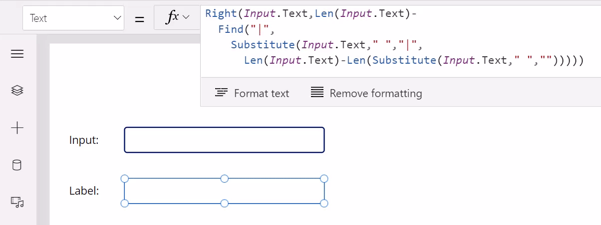
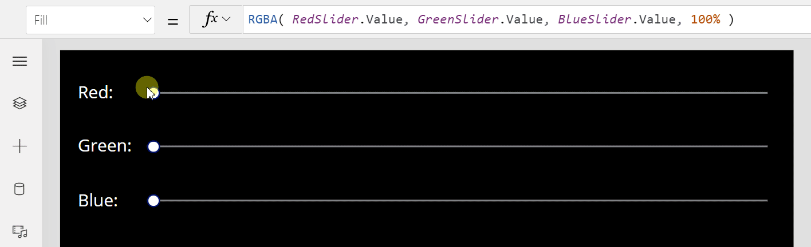
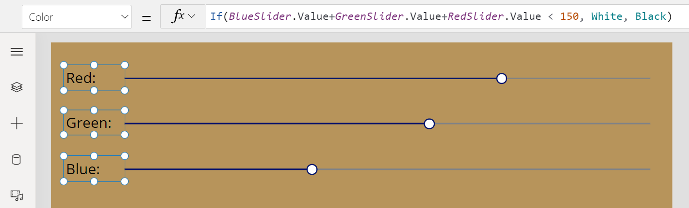
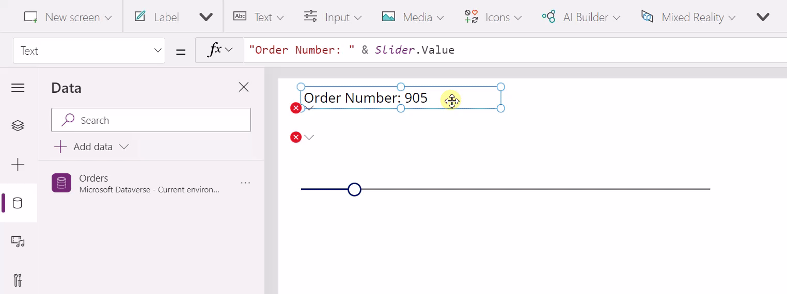
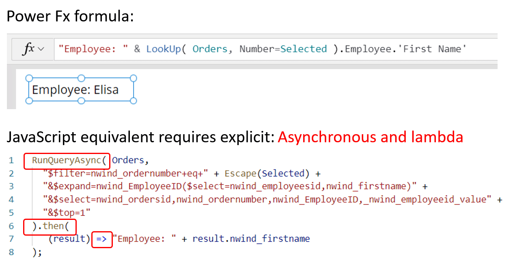
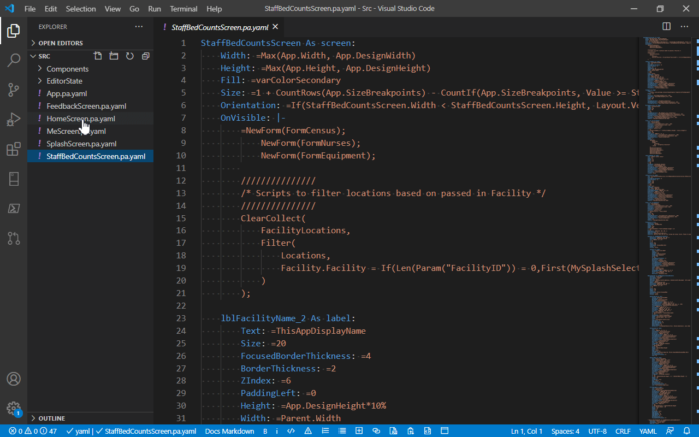
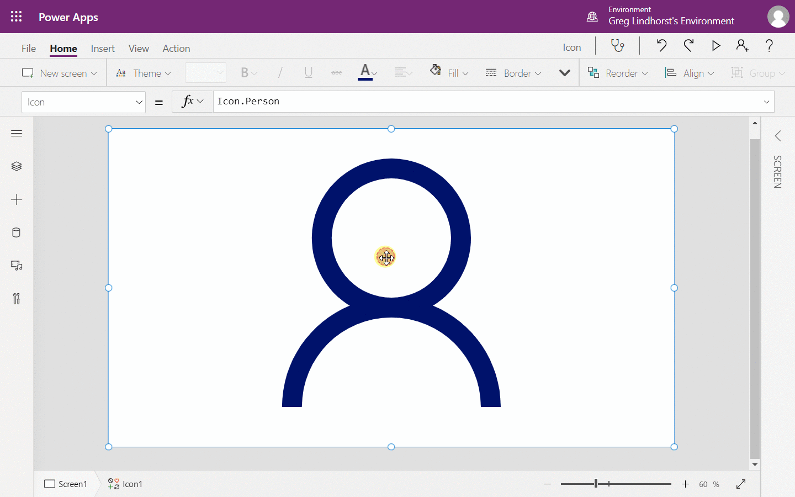
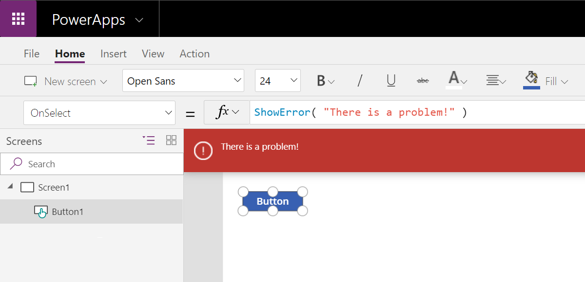
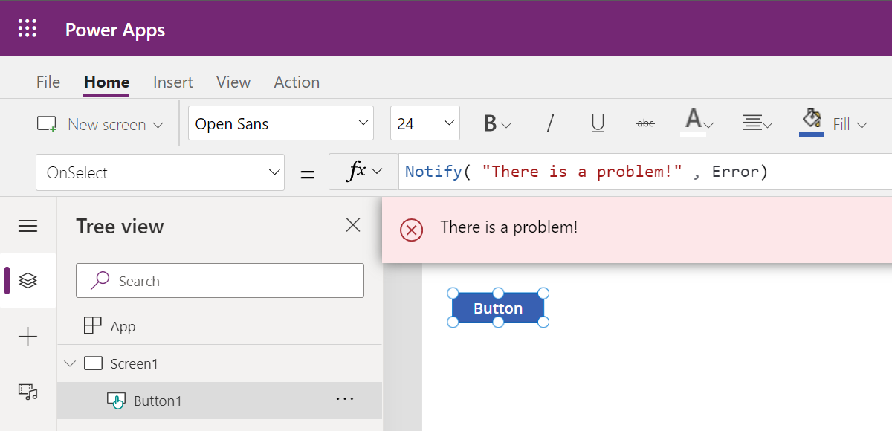

# Microsoft Power Fx overview

Power Fx is the low-code language that Microsoft Power Platform uses. It's a general-purpose, strongly typed, declarative, and functional programming language.

Power Fx is expressed in human-friendly text. It's a low-code language that makers can work with directly in an Excel-like formula bar or Visual Studio Code text window. The "low" in low-code comes from the concise and simple nature of the language, which makes common programming tasks easy for both makers and developers. It enables the full spectrum of development from no-code for those who never programmed before to "pro-code" for the seasoned professional, with no learning or rewriting cliffs in between. Diverse teams can collaborate and save time and expense.

> [!NOTE]
> - Microsoft Power Fx is the new name for the formula language for canvas apps in Power Apps. This overview and associated articles are a work in progress as Microsoft extracts the language from canvas apps, integrates it with other Microsoft Power Platform products, and makes it available as open source. To learn more about and experience the language today, start with [Get started with formulas in canvas apps](/powerapps/maker/canvas-apps/working-with-formulas) in the Power Apps documentation and sign up for a free [Power Apps trial](https://powerapps.microsoft.com).
> - In this article, *makers* refers to users who might use a feature at either end of the programming skill spectrum. *Developers* refers to users when the feature is more advanced and is likely beyond the scope of a typical Excel user.

Power Fx binds objects together with declarative spreadsheet-like formulas. For example, think of the **Visible** property of a UI control as a cell in an Excel worksheet, with an associated formula that calculates its value based on the properties of other controls. The formula logic recalculates the value automatically, similar to how a spreadsheet does, which affects the visibility of the control.

Also, Power Fx offers imperative logic when needed. Worksheets don't typically have buttons that can submit changes to a database, but apps often do. The same expression language is used for both declarative and imperative logic.

Microsoft will make Power Fx available as open-source software. It's currently integrated into canvas apps, and Microsoft is in the process of extracting it from Power Apps for use in other Microsoft Power Platform products and as open source. More information: [Microsoft Power Fx on GitHub](https://github.com/microsoft/power-fx)

This article is an overview of the language and its design principles. To learn more about Power Fx, see the following articles:

- [Data types](data-types.md)
- [Operators and identifiers](operators.md)
- [Tables](tables.md)
- [Variables](variables.md)
- [Imperative logic](imperative.md)
- [Global support](global.md)
- [Expression grammar](expression-grammar.md)
- [YAML formula grammar](yaml-formula-grammar.md)

## Think spreadsheet

What if you could build an app as easily as you build a worksheet in Excel?

What if you could take advantage of your existing spreadsheet knowledge?

These questions inspired the creation of Power Apps and Power Fx. Hundreds of millions of people create worksheets with Excel every day. Let's bring them app creation that's easy and uses Excel concepts that they already know. By breaking Power Fx out of Power Apps, we're going to answer these questions for building automation, or a virtual agent, or other domains.

All programming languages, including Power Fx, have *expressions*: a way to represent a calculation over numbers, strings, or other data types. For example, `mass * acceleration` in most languages expresses multiplication of `mass` and `acceleration`. You can put the result of an expression in a variable, use it as an argument to a procedure, or nest it in a bigger expression.

Power Fx takes this a step further. An expression by itself says nothing about what it's calculating. It's up to the maker to place it in a variable or pass it to a function. In Power Fx, instead of only writing an expression that has no specific meaning, you write a *formula* that binds the expression to an identifier. You write `force = mass * acceleration` as a formula for calculating `force`. As `mass` or `acceleration` changes, `force` automatically updates to a new value. The expression described a calculation, a formula gave that calculation a name and used it as a recipe. This is why we refer to Power Fx as a *formula language*.

For example, this [formula from Stack Overflow](https://stackoverflow.com/questions/350264/how-can-i-perform-a-reverse-string-search-in-excel-without-using-vba) searches a string in reverse order. In Excel, it looks like the following image.

:::image type="content" source="media/overview/reverse-search-excel.png" alt-text="Reverse search":::

Screenshot of a formula bar in Excel with the formula:
=RIGHT(A1,LEN(A1)-
FIND("|",
SUBSTITUTE(A1," ","|",
LEN(A1)-LEN(SUBSTITUTE(A1," ",""))))
Cell A1 contains the text "Hello, World! It is great to meet you!" Cell A2 contains the text "you!"

Power Fx works with this same formula, with the cell references replaced with control property references:

> [!div class="mx-imgBorder"]
> 

Screenshot of a Power Fx formula bar in Power Apps. The formula is
=RIGHT(Input.Text,Len(Input.Text)-
FIND("|",
SUBSTITUTE(Input.Text," ","|",
Len(Input.Text)-Len(Substitute(Input.Text," ",""))))
In the Input box below the formula, the text "Hello, World! It is great to meet you!" appears, letter by letter. At the same time in the Label box, the letters of the last word appear. When the full text appears in the Input box, the word "you!" appears in the Label box.

As the `Input` control value changes, the `Label` control automatically recalculates the formula and shows the new value. There are no `OnChange` event handlers here, as would be common in other languages.

Another example uses a formula for the `Fill` color of the screen. As the sliders that control Red, Green, and Blue change, the background color automatically changes as it's being recalculated.

> [!div class="mx-imgBorder"]
> 

There are no `OnChange` events for the slider controls, as would be common in other languages. There's no way to explicitly set the `Fill` property value at all. If the color isn't working as expected, you need to look at this one formula to understand why it isn't working. You don't need to search through the app to find a piece of code that sets the property at an unexpected time; there is no time element. The correct formula values are always maintained.

As the sliders are set to a dark color, the labels for Red, Green, and Blue change to white to compensate. This change happens through a simple formula on the `Color` property for each label control.

> [!div class="mx-imgBorder"]
> 

What's great about this formula is that it's isolated from what's happening for the `Fill` color: these are two entirely different calculations. Instead of large monolithic procedures, Power Fx logic is typically made up of lots of smaller formulas that are independent. This structure makes them easier to understand and enables enhancements without disturbing existing logic.

Power Fx is a declarative language, just as Excel is. The maker defines what behavior they want, but it's up to the system to determine and optimize how and when to accomplish it. To make that practical, most work is done through pure functions without side effects, making Power Fx also a functional language (again, just as Excel is).

## Always live

A defining aspect of worksheets is that they're always live, and changes are reflected instantaneously. There's no compile or run mode in a worksheet. When you modify a formula or enter a value, the worksheet immediately recalculates to reflect the changes. Any detected errors surface immediately and don't interfere with the rest of the worksheet.

Power Fx implements the same thing. It uses an incremental compiler to continuously keep the program in sync with the data it's operating on. Changes automatically propagate through the program's graph, affecting the results of dependent calculations. These calculations might drive properties on controls such as color or position. The incremental compiler also provides a rich formula editing experience with IntelliSense, suggestions, autocomplete, and type checking.

In the following animation, the order number is displayed in a label control dependent on the slider control, even though there are two errors on the labels below it. The app is very much alive and interactive. The first attempt at fixing the formula by entering `.InvalidName` results in an immediate red line and error displayed, as it should, but the app keeps running.

> [!div class="mx-imgBorder"]
> 

When you enter `.Employee`, the `Data` pane adds the Employees table, retrieves metadata for this table, and immediately offers suggestions for columns. You just walked across a relationship from one table to another, and the system made the needed adjustments to the app's references. The same thing happens when adding a `.Customer`.

After each change, the slider continues with its last value and any variables retain their value. Throughout, the order number continues to be displayed in the top label as it should. The app is live, processing real data, the entire time. You can save it, walk away, and others can open and use it just like Excel. There's no build step, no compile, there's only a publish step to determine which version of the app is ready for users.

## Low code

Power Fx describes business logic in concise, yet powerful, formulas. Most logic reduces to a single line, with plenty of expressiveness and control for more complex needs. The goal is to keep to a minimum the number of concepts a maker needs to understand&mdash;ideally, no more than an Excel user would already know.

For example, to look up the first name of an employee for an order, you write the Power Fx as shown in the following animation. Beyond Excel concepts, the only added concept used here is the dot **"."** notation for drilling into a data structure, in this case `.Employee.'First Name'`. The animation shows the mapping between the parts of the Power Fx formula and the concepts that need to be explicitly coded in the equivalent JavaScript.

> [!div class="mx-imgBorder"]
> 

Let's look more in-depth at all the things that Power Fx does for us and the freedom it has to optimize because the formula is declarative:

- **Asynchronous**: All data operations in Power Fx are asynchronous. The maker doesn't need to specify this, nor does the maker need to synchronize operations after the call is over. The maker doesn't need to be aware of this concept at all, they don't need to know what a promise or lambda function is.

- **Local and remote**: Power Fx uses the same syntax and functions for data that's local in-memory and remote in a database or service. The user need not think about this distinction. Power Fx automatically delegates what it can to the server, to process filters and sorts there more efficiently.

- **Relational data**: Orders and Customers are two different tables, with a many-to-one relationship. The OData query requires an "$expand" with knowledge of the foreign key, similar to a Join in SQL. The formula has none of this; in fact, database keys are another concept the maker doesn't need to know about. The maker can use simple dot notation to access the entire graph of relationships from a record.

- **Projection**: When writing a query, many developers write `select * from table`, which brings back all the columns of data. Power Fx analyzes all the columns that are used through the entire app, even across formula dependencies. Projection is automatically optimized and, again, a maker doesn't need to know what "projection" means.

- **Retrieve only what is needed**: In this example, the `LookUp` function implies that only one record should be retrieved and that's all that's returned. If more records are requested by using the `Filter` function&mdash;for which thousands of records might qualify&mdash;only a single page of data is returned at a time, on the order of 100 records per page. The user must gesture through a gallery or data table to see more data, and it automatically brings in more data for them. The maker can reason about large sets of data without needing to think about limiting data requests to manageable chunks.

- **Runs only when needed**: You define a formula for the `Text` property of the label control. As the variable selected changes, the `LookUp` is automatically recalculated and the label is updated. The maker didn't need to write an OnChange handler for Selection, and didn't need to remember that this label is dependent upon it. This is declarative programming, as discussed earlier: the maker specified what they wanted to have in the label, not how or when it should be fetched. If this label isn't visible because it's on a screen that isn't visible, or its `Visible` property is false, you can defer this calculation until the label is visible and effectively eliminate it if that rarely happens.

- **Excel syntax translation**: Many users know that the ampersand (**&**) is used for string concatenation in Excel. JavaScript uses a plus sign (**+**), and other languages use a dot (**.**).

- **Display names and localization**:  `First Name` is used in the Power Fx formula while `nwind_firstname` is used in the JavaScript equivalent. In Microsoft Dataverse and SharePoint, there's a display name for columns and tables in addition to a unique logical name. The display names are often much more user-friendly, as in this case, but they have another important quality in that they can be localized. If you have a multilingual team, each team member can see table and field names in their own language. In all use cases, Power Fx makes sure that the correct logical name is sent to the database automatically.

## No code

You don't need to read or write Power Fx to start expressing logic. You can express many customizations and logic through simple switches and UI builders. These no-code tools are built to read and write Power Fx, so there's plenty of headroom for someone to take it further. However, no-code tools never offer all the expressiveness of the full language. Even when you use no-code builders, the formula bar is front and center in Power Apps to educate the maker about what's being done on their behalf so they can begin to learn Power Fx.

Let's look at some examples. In Power Apps, the property panel provides no-code switches and knobs for the properties of the controls. In practice, most property values are static. You can use the color builder to change the background color of the `Gallery`. Notice that the formula bar reflects this change, updating the formula to a different `RGBA` call. At any time, you can go to the formula bar and take this change a step further - in this example, by using `ColorFade` to adjust the color. The color property still appears in the properties panel, but an **fx** icon appears on hover and you're directed to the formula bar. This fully works in two ways: removing the `ColorFade` call returns the color to something the property panel can understand, and you can use it again to set a color.

> [!div class="mx-imgBorder"]
> 

Here's a more complicated example. The gallery shows a list of employees from Dataverse. Dataverse provides views over table data. You can select one of these views and the formula changes to use the `Filter` function with this view name. You can use the two drop-down menus to dial in the correct table and view without touching the formula bar. But let's say you want to go further and add a sort. You can add that function in the formula bar, and the property panel again shows an fx icon and directs modifications to the formula bar. And again, if you simplify the formula to something the property panel can read and write, it can be used.

> [!div class="mx-imgBorder"]
> 

These examples are simple. Power Fx makes a great language for describing no-code interactions. It's concise, powerful, and easy to parse. It provides the headroom that is so often needed with "no cliffs" up to low-code.

## Pro code

Low-code makers sometimes build solutions that require the help of an expert or are taken over by a professional developer to maintain and enhance. Professionals also appreciate that low-code development can be easier, faster, and less costly than building a professional tool. Not every situation requires the full power of Visual Studio.

Professionals want to use professional tools to be most productive. You can store Power Fx formulas in [YAML source files](yaml-formula-grammar.md), which are easy to edit by using Visual Studio Code, Visual Studio, or any other text editor. Storing formulas in YAML files enables you to put Power Fx under source control by using GitHub, Azure DevOps, or any other source code control system.

> [!div class="mx-imgBorder"]
> 

> [!div class="mx-imgBorder"]
> 

Power Fx supports formula-based components for sharing and reuse. It supports parameters to component properties, enabling the creation of pure user-defined functions with more enhancements on the way.

Also, Power Fx is great at stitching together components and services built by professionals. Out-of-the-box connectors provide access to hundreds of data sources and web services. Custom connectors enable Power Fx to talk to any REST web service. Code components enable Power Fx to interact with fully custom JavaScript on the screen and page.

## Design principles

### Simple

Power Fx is designed to target the maker audience, whose members aren't trained as developers. Wherever possible, the language uses knowledge that this audience already knows or can pick up quickly. The number of concepts required to be successful is kept to a minimum.

Being simple is also good for developers. For the developer audience, Power Fx aims to be a low-code language that cuts down the time required to build a solution.

### Excel consistency

Microsoft Power Fx language borrows heavily from the Excel formula language. It takes advantage of Excel knowledge and experience from the many makers who also use Excel. Types, operators, and function semantics are as close to Excel as possible.

If Excel doesn't have an answer, Power Fx next looks to SQL. After Excel, SQL is the next most commonly used declarative language and can provide guidance on data operations and strong typing that Excel doesn't.

### Declarative

The maker describes *what* they want their logic to do, not exactly *how* or *when* to do it. This approach allows the compiler to optimize by performing operations in parallel, deferring work until needed, and prefetching and reusing cached data.

For example, in an Excel worksheet, the author defines the relationships among cells but Excel decides when and in what order to evaluate formulas. Similarly, you can think of formulas in an app as "recalc-ing" as needed based on user actions, database changes, or timer events.

### Functional

Use pure functions that don't have side effects. This approach results in logic that's easier to understand and gives the compiler the most freedom to optimize.

Unlike Excel, apps by their nature do mutate state. For example, apps have buttons that save changes to the record in a database. Some functions, therefore, do have side effects, although limit these side effects as much as is practical.

### Composition

Where possible, add functionality that composes well with existing functionality. You can decompose powerful functions into smaller parts that you can more easily use independently.

For example, a **Gallery** control doesn't have separate `Sort` and `Filter` properties. Instead, you compose the `Sort` and `Filter` functions together into a single `Items` property. You layer the UI for expressing `Sort` and `Filter` behavior on top of the `Items` property by using a two-way editor for this property.

### Strongly typed

The types of all values are known at compile time. This approach allows for the early detection of errors and rich suggestions while authoring. 

Polymorphic types are supported, but before you can use them, you must pin their type to a static type and that type must be known at compile time. The **IsType** and **AsType** functions are provided for testing and casting types.

### Type inference

Types are derived from their use without being declared. For example, setting a variable to a number results in the variable's type being established as a number.

Conflicting type usage results in a compile-time error.

### Locale-sensitive decimal separators

Some regions of the world use a dot (**.**) as the decimal separator, while others use a comma (**,**). Excel follows this regional convention. Other programming languages generally use a canonical dot (**.**) as the decimal separator for all users worldwide. To be as approachable as possible for makers at all levels, it's important that `3,14` is a decimal number for a person in France who has used that syntax all their lives.

The choice of decimal separator has a cascading impact on the list separator, used for function call arguments, and the chaining operator.

| Author's language decimal separator | Power Fx decimal separator | Power Fx list separator | Power Fx chaining operator |
| --- | --- | --- | --- |
| **.** (dot) |**.** (dot) |**,** (comma) |**;** (semicolon) |
| **,** (comma) |**,** (comma) |**;** (semicolon) |**;;** (double semicolon) |

More information: [Global support](global.md)

### Not object-oriented 

Excel isn't object-oriented, and neither is Power Fx. For example, in some languages, the length of a string is expressed as a property of the string, such as `"Hello World".length` in JavaScript. Excel and Power Fx instead express this in terms of a function, as `Len( "Hello World" )`.

Components with properties and methods are object-oriented and Power Fx easily works with them. But where possible, prefer a functional approach.

### Extensible 

Makers can create their components and functions by using Power Fx itself. Developers can create their components and functions by writing JavaScript.

### Developer friendly 

Although makers are the primary target, try to be developer-friendly wherever possible. If it doesn't conflict with the design principles described previously, do things in a way that a developer appreciates. For example, Excel has no capability for adding comments, so use C-like line and inline comments.

### Language evolution 

Evolving programming languages is both necessary and tricky. Everyone&mdash;rightfully&mdash;is concerned that a change, no matter how well-intentioned, might break existing code and require users to learn a new pattern. Power Fx takes backward compatibility seriously, but the Power Fx team also strongly believes that they won't always get it right the first time and that the community can collectively learn what's best. A programming language must evolve, and Power Fx was designed to support language evolution from the very beginning.

Every saved Power Fx document includes a language version stamp. If the Power Fx team wants to make an incompatible change, they write what they call a "back compat converter" that automatically rewrites the formula the next time it's edited. If the change is something major that the team needs to educate the user about, the app displays a message with a link to the docs. By using this facility, Power Fx can still load apps that were built with the preview versions of Power Apps from many years ago, despite all the changes that have occurred since then.

For example, the Power Fx team introduced the `ShowError` function to display an error banner with a red background. 

Users loved it, but they also asked for a way to show a success banner (green background) or an informational banner (blue background). So, the team came up with a more generic `Notify` function that takes a second argument for the kind of notification. The team could have just added `Notify` and kept `ShowError` the way it was, but instead they replaced `ShowError` with `Notify`. They removed a function that was previously in production and replaced it with something else. Because there would have been two ways to do the same thing, this change would have caused confusion&mdash;especially for new users&mdash;and, most importantly it would have added complexity. Nobody complained, everybody appreciated the change and then moved on to their next Notify feature.

This is how the same app looks when loaded into the latest version of Power Apps. No action was required by the user to make this transformation happen, it occurred automatically when the app was opened.

By using this facility, Power Fx can evolve faster and more aggressively than most programming languages.

### No undefined value

Some languages, such as JavaScript, use the concept of an *undefined* value for uninitialized variables or missing properties. For simplicity's sake, Power Fx avoids this concept. Instances that would be undefined in other languages are treated as either an error or a blank value. For example, all uninitialized variables start with a blank value. All data types can take on the value of blank.

## Related articles

[Data types](data-types.md) 
[Operators and identifiers](operators.md) 
[Tables](tables.md) 
[Variables](variables.md) 
[Imperative logic](imperative.md) 
[Global support](global.md) 
[Expression grammar](expression-grammar.md) 
[YAML formula grammar](yaml-formula-grammar.md) 
[Formulas in canvas apps](/powerapps/maker/canvas-apps/working-with-formulas)
