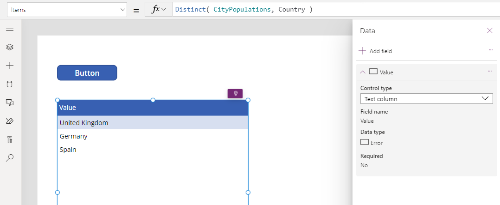

---
title: Distinct function
description: Reference information including syntax and examples for the Distinct function.
author: gregli-msft

ms.topic: reference
ms.custom: canvas
ms.reviewer: mkaur
ms.date: 6/10/2024
ms.subservice: power-fx
ms.author: gregli
search.audienceType:
  - maker
contributors:
  - gregli-msft
  - mduelae
  - gregli
no-loc: ["Distinct"]
---

# Distinct function
[!INCLUDE[function-distinct-applies-to](includes/function-distinct-applies-to.md)]


Summarizes [records](/power-apps/maker/canvas-apps/working-with-tables#records) of a [table](/power-apps/maker/canvas-apps/working-with-tables), removing duplicates.

## Description

The **Distinct** function evaluates a formula across each record of a table and returns a one-column table of the results with duplicate values removed. The name of the column is **Value**.

[!INCLUDE [record-scope](../../includes/record-scope.md)]

[!INCLUDE [delegation-no-one](../../includes/delegation-no-one.md)]

## Syntax

**Distinct**( _Table_, _Formula_ )

- _Table_ - Required. Table to evaluate across.
- _Formula_ - Required. Formula to evaluate for each record.

## Example

1. Insert a [**Button**](/power-apps/maker/canvas-apps/controls/control-button) control, and set its **OnSelect** property to this formula.

   ```power-fx
   ClearCollect( CityPopulations,
       { City: "London",    Country: "United Kingdom", Population: 8615000 },
       { City: "Berlin",    Country: "Germany",        Population: 3562000 },
       { City: "Madrid",    Country: "Spain",          Population: 3165000 },
       { City: "Hamburg",   Country: "Germany",        Population: 1760000 },
       { City: "Barcelona", Country: "Spain",          Population: 1602000 },
       { City: "Munich",    Country: "Germany",        Population: 1494000 }
   );
   ```

1. Select the button while holding down the Alt key.

   The formula is evaluated and the **CityPopulations** collection is created which you can show by selecting **CityPopulations** in the formula bar:

    > [!div class="mx-imgBorder"] 
    > 

1. Insert a [**Data table**](/power-apps/maker/canvas-apps/controls/control-data-table) control, and set its **Items** property to this formula:

   ```power-fx
   Distinct( CityPopulations, Country )
   ```

   You can view the result of this formula in the formula bar by selecting the entire formula:

    > [!div class="mx-imgBorder"] 
    > 

1. Use the **Edit fields** link in the data table's properties pane to add the **Value** column:

    > [!div class="mx-imgBorder"] 
    > 

1. Insert a [**Label**](/power-apps/maker/canvas-apps/controls/control-text-box) control, and set its **Text** property to the formula:

   ```power-fx
   First( Sort( Distinct( CityPopulations, Country ), Value ) ).Value
   ```

   This formula sorts the results from **Distinct** with the [**Sort**](function-sort.md) function, takes the first record from the resulting table with the [**First**](function-first-last.md) function, and extracts the **Result** field to obtain just the country/region name.

    > [!div class="mx-imgBorder"] 
    > 

[!INCLUDE[footer-include](../../includes/footer-banner.md)]


