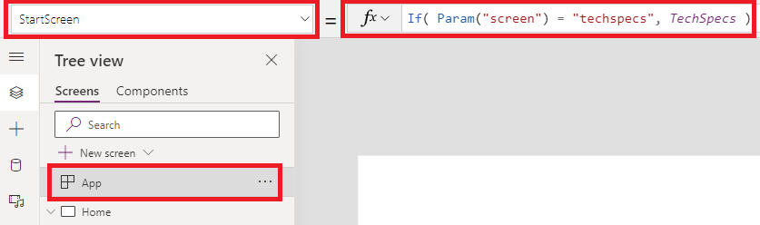

---
title: Launch and Param functions
description: Reference information including syntax and examples for the Launch and Param functions.
author: gregli-msft
ms.topic: reference
ms.custom: canvas
ms.reviewer: mkaur
ms.date: 3/4/2025
ms.subservice: power-fx
ms.author: gregli
search.audienceType:
  - maker
contributors:
  - gregli-msft
  - mduelae
  - gregli
---

# Launch and Param functions
[!INCLUDE[function-param-applies-to](includes/function-param-applies-to.md)]


Launches a webpage or a canvas app and provides access to launch parameters.

## Launch

Launches a webpage or a canvas app. The function supports:

- **Address** (required), the URL of the webpage of the canvas app.
- **Parameters** (optional), named values to pass to the webpage or canvas app. In a canvas app, parameters can be read with the [**Param**](#param) function.
- **Target** (optional), the browser tab in which to launch the webpage or canvas app.

**Launch** can only be used in [behavior formulas](/power-apps/maker/canvas-apps/working-with-formulas-in-depth).

>[!NOTE]
> - If the Launch formula is used to open Power Apps and the app isn't visible to the end user, it's recommended to check if the app is blocked by a browser pop-up blocker or if the browser is wait for the user's response to a dialog box that asks whether they want to navigate to a new screen.
> - Only **https**: URIs are supported when using Launch in the Power Apps Visual in PowerBI.


### Address

Webpages are launched via a URL address. For example:

```power-fx
Launch( "https://bing.com" )
```

You can launch canvas apps with **Web link** or **App URI** (app id prefixed with `/providers/Microsoft.PowerApps/apps/`). To find these values for an app:

1. Go to [Power Apps](https://make.powerapps.com).
1. Select **Apps** from left navigation pane.
1. Select your app.
1. Select **Details** from top menu. <br> You can also select **...** (**More Commands**) and then select **Details** from the drop-down menu.

   

1. Copy **Web link**.

   

The **Web link** can be used in any web page and will launch the canvas app. It can also be used with the **Launch** function. For example:


```power-fx
Launch( "https://apps.powerapps.com/e/{environment id}/a/{app id}?tenantId={tenantId}" )

```

Native apps on a device can't be launched directly. There may be indirect options available on some platforms, such as a native app installing a custom URL scheme or registering with the web browser to offer an option for specific web sites.

### Parameters

**Launch** can pass parameters to the webpage or canvas app. Parameters can be provided in two ways:

- An argument list of name value pairs. For example:

  ```power-fx
  Launch( "https://bing.com/search", "q", "Power Apps", "count", 1 )
  ```

- A record of field values. For example:

  ```power-fx
  Launch( "https://bing.com/search", { q: "Power Apps", count: 1 } )
  ```

  This form can be easier to work with as it makes the association between name and value clearer. It's the only form that supports the optional _LaunchTarget_ argument.

The address and parameters are URL encoded before being passed to replace certain non-alphanumeric characters with `%` and a hexadecimal number as if the [**EncodeUrl**](function-encode-decode.md) function has been used on each.

When launching a webpage, a [query string](https://en.wikipedia.org/wiki/Query_string) of parameters can be included at the end of the URL address. Any additional parameters provided to **Launch** will be added to the end of the query string. Query strings don't work when launching a canvas app.

When launching an app on a mobile device where that app is already running, parameters will not be refreshed in the running app. An app reload is required for parameters to be refreshed.

### Target

Use the _LaunchTarget_ argument to specify the target browser window in which to open the webpage or app. Use one of the following **LaunchTarget** enum values or provide a custom window _name_.

| LaunchTarget&nbsp;enum | Description                                                                                                                                                                                                                                                                                                                                                                                                                                     |
| ---------------------- | ----------------------------------------------------------------------------------------------------------------------------------------------------------------------------------------------------------------------------------------------------------------------------------------------------------------------------------------------------------------------------------------------------------------------------------------------- |
| **New**                | The webpage or app is opened in a new window or tab.                                                                                                                                                                                                                                                                                                                                                                                            |
| **Replace**            | The webpage or app replaces the current window or tab.                                                                                                                                                                                                                                                                                                                                                                                          |
| _name_                 | Instead of an enum value, use your own text string to _name_ the window or tab. _Self_ is an internal only name that is only used by the **Launch** function. It has no impact on nor will it match the title of the window that your users see. If a window or tab with the given _name_ already exists, its contents will be replaced. Otherwise, a new window or tab will be created. _name_ can't begin with the underscore character "\_". |

**New** is the default enum when running in a web browser with **Replace** and _name_ as available options. In a mobile player, **New** is the default for webpages with _name_ as an available option; while the current canvas app will always be replaced by another canvas app.

> [!NOTE]
>
> - Using a _LaunchTarget_ with any value other than **New** in embedded scenarios (for example, Power BI or SharePoint) is not supported and may result in unexpected behavior. In the future, this behavior may change, or may cause an error.

## Param

The **Param** function retrieves a parameter passed to the app when it was launched. If the named parameter wasn't passed, **Param** returns _blank_.

- When launching a canvas app from another canvas app, use the _Parameter_ arguments to the **Launch** function. Parameter names and values will be automatically URL encoded.
- When launching a canvas app from a web page, add parameters to the [query string](https://en.wikipedia.org/wiki/Query_string) of the [canvas app web link](#address). This involves adding `&parametername=parametervalue` assuming the query string has already been started for the `tenantId`. For example, adding `&First%20Name=Vicki&category=3` would pass two parameters: `First Name` with a value of `"Vicki"` and `category` with a value of `"3"` (value type is _text_). The parameter name and value must be URL encoded if they contain spaces or special characters, similar to using the [**EncodeURL**](function-encode-decode.md) function.
- Param names are case-sensitive.
- Param names and values will be automatically URL decoded for use in your app.
- Parameter values do not change unless the app is reloaded. Using **Launch** on a mobile device where the app is already running does not refresh the parameters.
- Even if the parameter contains a number, the type returned by **Param** will always be a text string. Conversion to other types will automatically occur or use explicit conversions such as the [**Value**](function-value.md) function to convert explicitly to a number.

>[!NOTE]
> For [custom pages](/power-apps/maker/model-driven-apps/add-page-to-model-app), the only parameters accepted by the page are: recordId and entityName.

## Syntax

**Launch**( _Address_ [, *ParameterName1*, *ParameterValue1*, ... ] )

- _Address_ – Required. The address of a webpage or the ID of an app to launch.
- _ParameterName(s)_ – Optional. Parameter name.
- _ParameterValue(s)_ – Optional. Corresponding parameter values to pass to the app or the webpage.

**Launch**( _Address_, { [ *ParameterName1*: *ParameterValue1*, ... ] } [, *LaunchTarget* ] )

- _Address_ – Required. The address of a webpage or the ID of an app to launch.
- _ParameterName(s)_ – Optional. Parameter name.
- _ParameterValue(s)_ – Optional. Corresponding parameter values to pass to the app or the webpage.
- _LaunchTarget_ – Optional. A **LaunchTarget** enum value or a custom _name_.

**Param**( _ParameterName_ )

- _ParameterName_ - Required. The name of the parameter passed to the app.

### Reserved parameters

The following keywords are reserved (regardless of case) for internal use, and shouldn't be used as a custom parameter in the **Param()** function:

- amp%3Bauthmode
- amp%3Benableonbehalfof
- amp%3Bhidenavbar
- amp%3Blocale
- appmetadataversion
- authmode
- channeltype
- cordovapath
- correlationid
- debug
- delegatelaunchurl
- disablepreviewredirect
- embedderorigin
- enableonbehalfof
- groupid
- hideappsplash
- hidenavbar
- hint
- hostclienttype
- hostmode
- iframecontainerid
- isfullscreen
- ispreviewmode
- loader
- loaderType
- locale
- location
- packagekind
- packageproperties
- playerresourcespath
- playersessionid
- powerappslanguage
- screencolor
- sdkversion
- site
- skipappmetadata
- skipiframecreation
- skiplaunchappcache
- source
- sourcetime
- standaloneconsent
- teamid
- teamtype
- tenantId
- theme
- uselocalpackagehostresources
- userteamrole

## Examples

### Simple Launch

#### From a canvas app to a web page:

| Formula                                                                                                                                                | Description                                                                                                         |
| ------------------------------------------------------------------------------------------------------------------------------------------------------ | ------------------------------------------------------------------------------------------------------------------- |
| **Launch(&nbsp;"http://bing.com/search",&nbsp;<br>"q",&nbsp;"Power&nbsp;Apps",&nbsp;"count",&nbsp;1&nbsp;)**                                           | Opens the webpage **https://bing.com/search?q=Power%20Apps&count=1**. A new window or tab is opened.                 |
| **Launch(&nbsp;"http://bing.com/search",&nbsp;<br>{&nbsp;q:&nbsp;"Power&nbsp;Apps",&nbsp;count:&nbsp;1&nbsp;}&nbsp;)**                                 | The same as the previous examples using the equivalent record notation. A new window or tab is opened.              |
| **Launch(&nbsp;"http://bing.com/search",&nbsp;<br>{&nbsp;q:&nbsp;"Power&nbsp;Apps",&nbsp;count:&nbsp;1&nbsp;},&nbsp;<br>LaunchTarget.Replace&nbsp;)**  | The same as the previous examples, replacing the current window or tab with the result if running in a web browser. |
| **Launch(&nbsp;"http://bing.com/search",&nbsp;<br>{&nbsp;q:&nbsp;"Power&nbsp;Apps",&nbsp;count:&nbsp;1&nbsp;},&nbsp;<br>"Search&nbsp;Results"&nbsp;)** | The same as the previous example, creating or replacing the contents of the window or tab named **Search Results**. |

#### From a canvas app to a canvas app

Update the app ID, screen name, and record number as appropriate.

```power-fx
Launch( "/providers/Microsoft.PowerApps/apps/YOUR-APP-ID",
        { Navigate: "Second Screen", Record: 34 }
)
```

#### From a web page to a canvas app

Update the app ID, tenant ID, screen name, and record number as appropriate.

```html
<html>
  <body>
    <a
      href="https://apps.powerapps.com/play/e/YOUR-APP-ENVIRONMENT-ID/a/YOUR-APP-ID?tenantId=YOUR-TENANT-ID&Navigate=Second%20Screen&Record=34"
    >
      Launch canvas app
    </a>
  </body>
</html>
```

### Simple Param

Simple launch examples above to launch canvas app [from web page](#from-a-web-page-to-a-canvas-app) or [from another canvas app](#from-a-canvas-app-to-a-canvas-app) show simple examples for Param function:

| Formula                           | Description                                                                                                                                                                                                                                          | Result          |
| --------------------------------- | ---------------------------------------------------------------------------------------------------------------------------------------------------------------------------------------------------------------------------------------------------- | --------------- |
| **Param(&nbsp;"Navigate"&nbsp;)** | The **Navigate** parameter was provided when the app was launched and is returned.                                                                                                                                                                   | "Second Screen" |
| **Param(&nbsp;"Record"&nbsp;)**   | The **Record** parameter was provided when the app was launched. Even though it was passed in as a number to the **Launch** function, the result from **Param** will be a text string that can be implicitly or explicitly converted to other types. | "34"            |
| **Param(&nbsp;"User"&nbsp;)**     | The **User** parameter wasn't provided. A _blank_ value is returned that can be tested with the [**IsBlank**](function-isblank-isempty.md) function.                                                                                                 | _blank_         |

### Step by Step examples for Launch and Param

The **Product Showcase** tablet layout template was used for the following examples. To create an app with this template, follow the steps from [create an app](/power-apps/maker/canvas-apps/get-started-test-drive) article and select the **Product Showcase** template. You can also use your own app.

#### Example - Launch

1. Go to [Power Apps](https://make.powerapps.com).
1. Select **Apps** from left navigation pane.
1. Select your app and then select **Edit**.
1. Select **Insert** from the menu and then select **Label**.
1. Move the label to the bottom right of the screen.
1. From the properties pane on the right-side, select **Color** as _white_ and set **Border thickness** at _1_.
1. Select the **Text** property from right-side and enter text as _Surface tablets in news_.
1. From property list on top left, select **OnSelect**.
1. Enter formula as `Launch("https://www.bing.com/news/search","q","Microsoft Surface tablets")`. You can also use any other URL, parameter, and keywords of your choice.

   

1. Save and publish the app.
1. Play the app.
1. Select label **Surface tablets in news** to launch news search with keywords _Microsoft Surface tablets_.

> [!TIP]
> For scalability, you can replace the manually entered keywords in Launch function with [variables](/power-apps/maker/canvas-apps/working-with-variables).

#### Example - Param

1. Go to [Power Apps](https://make.powerapps.com).
1. Select **Apps** from left navigation pane.
1. Select your app and then select **Edit**.
1. Select **Insert** from the menu and then select **Label**.
1. Move the label to the bottom right of the screen.
1. Select **Text** property for the label from top left.
1. Enter formula as `Param("browser")`. You can also use a different parameter of your choice.

   

1. Save and publish the app.
1. Copy [web link](#address) for your app from [Power Apps](https://make.powerapps.com).
1. Open a new browser.
1. Paste the app web link in the browser and append `&browser=Microsoft%20Edge` at the end.

   

1. When your app launches, the label shows the parameter value passed.

   

1. Close the app player and edit the app.
1. Select **App** from the Tree view on left navigation.
1. Select **StartScreen** property on top left.
1. Enter the formula as `If( Param("screen") = "techspecs", TechSpecs )`.

   

   [If function](function-if.md) in [StartScreen](object-app.md#startscreen-property) property checks if parameter equals a certain value, in this case the value _techspecs_. And if it matches, returns the _TechSpecs_ screen control to the **StartScreen** property.

   > [!NOTE]
   > Replace the **TechSpecs** control name in the **If** function with the name of a screen control in your own app if you're not using the **Product Showcase** app template.

1. Save and publish the app.
1. Open a new browser.
1. Paste the app web link in the browser and append `&screen=techspecs` at the end.

   

1. The app directly launches with **TechSpecs** as the startscreen.

### See also

[Canvas app formula reference](/power-apps/maker/canvas-apps/formula-reference)

[!INCLUDE[footer-include](../../includes/footer-banner.md)]


