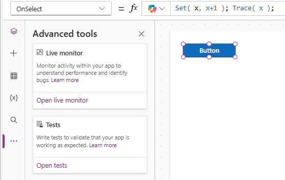
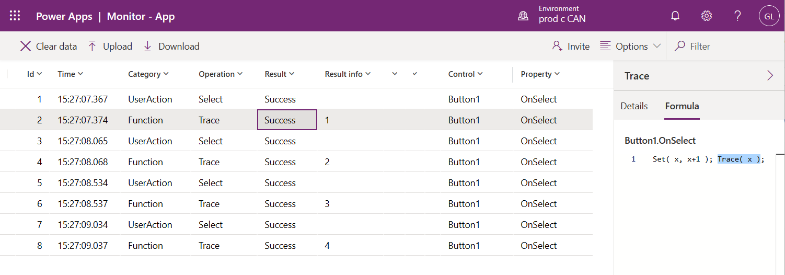

---
title: Trace function
description: Reference information including syntax and examples for the Trace function.
author: mduelae

ms.topic: reference
ms.custom: canvas
ms.reviewer: mkaur
ms.date: 3/22/2024
ms.subservice: power-fx
ms.author: gregli
search.audienceType:
  - maker
contributors:
  - gregli-msft
  - mduelae
  - gregli
---

# Trace function
[!INCLUDE[function-trace-applies-to](includes/function-trace-applies-to.md)]


Often there is a lot of logic working behind the scenes in an app. Sometimes the impact is obvious, for example a control's value or color changes, confirming the logic operated correctly. However, sometimes it isn't obvious and it can be difficult to visualize and understand what is happening inside the app. Use the **Trace** function to record diagnostic information from behind the scenes, creating a timeline of what actually happened, to better understand how your app is operating and to help debug issues.

When used in Power Apps, the output from **Trace** appears in the [Power Apps Monitor](/power-apps/maker/monitor-overview) tool along with other app activities. If you've allowed your app to send telemetry data to [Azure Application Insights](/power-apps/maker/canvas-apps/application-insights), the **Trace** function can also be used to send information to your Application Insights resource. **Trace** can only be used in [behavior formulas](../imperative.md). 

When used with [Test Studio](/power-apps/maker/canvas-apps/test-studio), **Trace** is an optional expression that can be used to provide additional information in your test results from the **OnTestCaseComplete** event. **Trace** event messages are combined with passed and failed assertion messages in the **Traces** table of the **TestCaseResult** record. The **Traces** table has two properties, **Message** and **Timestamp**. Trace information used in tests will also be recorded in Application Insights. Test trace information won't be available in the Monitor tool as the Monitor is connected to the app when it's played from the Power Apps Studio.

## Syntax

**Trace**( _Message_ [, _TraceSeverity_ [, _CustomRecord_ [, _TraceOptions_ ] ] ] )

- _Message_ – Required. The information to be traced. Numbers, Dates, Booleans and any other data type that can be coerced to Text.
- _TraceSeverity_ – Optional. The severity level of the Trace recorded in Monitor and Application Insights. Options are **TraceSeverity.Information** (default), **TraceSeverity.Warning**, **TraceSeverity.Error**, or **TraceSeverity.Critical**.
- _CustomRecord_ – Optional. A record containing custom data that will be recorded in Monitor or Application Insights.
- _TraceOptions_ – Optional. Options are **TraceOptions.None** (default) and **TraceOptions.IgnoreUnsupportedTypes** which will ignore data types in _CustomRecord_ that can't be serialized.  

## Example

1. Create a button control in Power Apps Studio.
2. Set the **OnSelect** formula to the formula:
  ```power-fx
  Set( x, x+1 );
  Trace( x );
  ```
3. Open the Power Apps Monitor in another browser window by selecting the "Advanced tools" icon in the left hand pane and select "Open monitor":
  
4. Return to the original Studio browser window and select your button four times.  Use **Alt-click** on your mouse if in design mode.
5. View the Power Apps Monitor.  
6. The Monitor's grid will contain an event for each button click and for each **Trace** call, which will show the value of the variable after each increment. Drill into a Trace event to see where the **Trace** was initiated, and the expression used for the message, in the right hand panel:
  

## See Also

[Power Apps Monitor Overview](/power-apps/maker/monitor-overview) <br>
[Test Studio Overview](/power-apps/maker/canvas-apps/test-studio) <br>
[Working with Test Studio](/power-apps/maker/canvas-apps/working-with-test-studio)

[!INCLUDE[footer-include](../../includes/footer-banner.md)]


