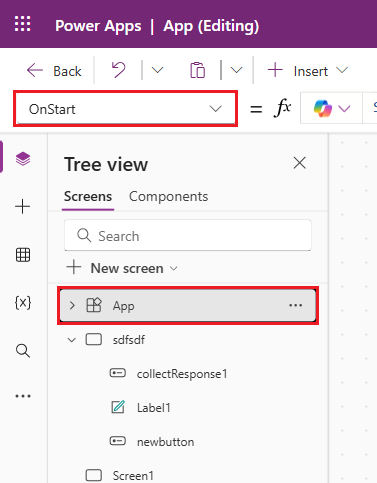
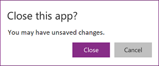
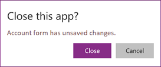
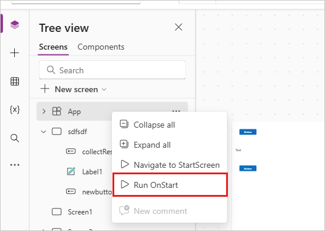
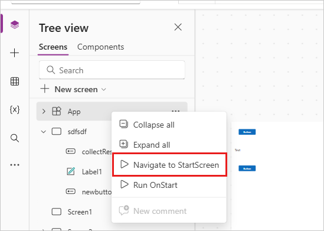

---
title: App object in Power Apps
description: Reference information including syntax and examples for the App object in Power Apps.
author: gregli-msft
ms.topic: reference
ms.custom: canvas
ms.reviewer: mkaur
ms.date: 06/11/2026
ms.author: gregli
search.audienceType: 
  - maker
contributors:
  - gregli-msft
  - mduelae
  - gregli
ms.contributors:
- anuitz
---
# App object in Power Apps
[!INCLUDE[object-app-applies-to](includes/object-app-applies-to.md)]

Get information about the currently running app and control the app's behavior.

## Description

Like a control, the **App** object has properties that identify which screen is showing and prompt you to save changes so you don't lose them. Every app has an **App** object.

Write formulas for some properties of the **App** object. At the top of the **Tree view** pane, select the **App** object as you would any other control or screen. To view or edit one of the object's properties, select it in the drop-down list to the left of the formula bar.

> [!div class="mx-imgBorder"]
> 

This article covers the following **App** object properties:

- [ActiveScreen](#activescreen-property) – the screen that's currently displayed.
- [BackEnabled](#backenabled-property) – how the app responds to the device back gesture.
- [ConfirmExit and ConfirmExitMessage](#confirmexit-properties) – warn the user before closing the app.
- [Connection string](#connection-string-property) – set up Application Insights logging.
- [Formulas](#formulas-property) – define named formulas, user defined functions, and user defined types.
- [OnError](#onerror-property) – handle errors globally.
- [OnStart](#onstart-property) – run logic when the app starts.
- [StartScreen](#startscreen-property) – set the screen shown first when the app loads.
- [StudioVersion](#studioversion-property) – return the Power Apps Studio version that published the app.

## ActiveScreen property

The **ActiveScreen** property identifies the screen that's currently displayed.

This property returns a screen object. Use it to reference properties of the current screen, such as the name with the formula **App.ActiveScreen.Name**. You can also compare this property to another screen object, like with the comparison formula **App.ActiveScreen = Screen2** to check if **Screen2** is the current screen.

Use the **[Back](function-navigate.md)** or **[Navigate](function-navigate.md)** function to switch the screen that's displayed.

## BackEnabled property

The **BackEnabled** property changes how the app responds to the device back gesture (swipe or use the hardware back button on Android devices, or swipe from the left on iOS devices) when running in [Power Apps mobile](/power-apps/mobile/run-powerapps-on-mobile). When enabled, the device back gesture goes back to the screen that was most recently shown, which is similar to the [**Back**](function-navigate.md#back) formula. When disabled, the device back gesture takes the user to the app list. 

## ConfirmExit properties

Nobody wants to lose unsaved changes. Use the **ConfirmExit** and **ConfirmExitMessage** properties to warn the user before closing your app.

> [!NOTE]
> - **ConfirmExit** doesn't work in apps embedded in, for example, Power BI and SharePoint.
> - **ConfirmExit** isn't supported in custom pages. 
> - Now, these properties can reference controls only on the first screen if the **Delayed load** preview feature is enabled (which it is by default for new apps). If you reference other screens, Power Apps Studio doesn't show an error, but the published app doesn't open in Power Apps Mobile or a browser. Microsoft is working to lift this limitation. In the meantime, turn off **Delayed load** in **Settings** > **Upcoming features** (under **Preview**).

### ConfirmExit

**ConfirmExit** is a Boolean property that, when *true*, opens a confirmation dialog box before the app closes. By default, this property is *false*, and no dialog box appears.

When the user might have unsaved changes in the app, use this property to show a confirmation dialog box before exiting the app. Use a formula that checks variables and control properties (for example, the **Unsaved** property of the [**Edit form**](/power-apps/maker/canvas-apps/controls/control-form-detail) control).

The confirmation dialog box appears in any situation where data can be lost, such as:

- Run the [**Exit**](function-exit.md) function.
- If the app runs in a browser:
  - Close the browser or the browser tab where the app runs.
  - Select the browser's back button.
  - Run the [**Launch**](function-param.md#launch) function with a *LaunchTarget* of **Self**.
- If the app runs in Power Apps Mobile (iOS or Android):
  - Swipe to switch to a different app in Power Apps Mobile.
  - Select the back button on an Android device.
  - Run the [**Launch**](function-param.md#launch) function to launch another canvas app.

The exact look of the confirmation dialog box can vary across devices and versions of Power Apps.

The confirmation dialog box doesn't show in Power Apps Studio.

### ConfirmExitMessage

By default, the confirmation dialog box shows a generic message, such as **"You may have unsaved changes."** in the user's language.

Use **ConfirmExitMessage** to provide a custom message in the confirmation dialog box. If this property is *blank*, the default value is used. Custom messages are truncated as needed to fit within the confirmation dialog box, so keep the message to a few lines at most.

In a browser, the confirmation dialog box can show a generic message from the browser.

### Example

1. Set the **App** object's **ConfirmExit** property to this expression:

    ```power-fx
    AccountForm.Unsaved Or ContactForm.Unsaved
    ```

    The dialog box appears if the user changes data in either form and then tries to close the app without saving those changes.

    > [!div class="mx-imgBorder"]
    > 

1. Set the **App** object's **ConfirmExitMessage** property to this formula:

    ```power-fx
    If( AccountForm.Unsaved,
        "Accounts form has unsaved changes.",
        "Contacts form has unsaved changes."
    )
    ```

    The dialog box shows a form-specific message when the user changes data in either form and then tries to close the app without saving those changes.

    > [!div class="mx-imgBorder"]
    > 

## Connection string property

Use the **Connection string** property to export system-generated application logs to [Application Insights](/power-apps/maker/canvas-apps/application-insights).

To set the connection string:

1. Open your app for [editing](/power-apps/maker/canvas-apps/edit-app) in Power Apps Studio.
1. Select the **App** object in the left navigation tree view.
1. Enter the **Connection string** in the properties pane.

If data isn't sent to Application Insights, contact your Power Platform admin and check whether Application Insights is disabled at the tenant level.

## Formulas property

Use the **Formulas** property to define reusable logic across your app. The **Formulas** property supports three constructs:

- [Named formulas](#formulas-property) – assign a name to a formula and reuse the value throughout the app.
- [User defined functions](#user-defined-functions) – named formulas that take parameters and return a value.
- [User defined types](#user-defined-types) – named types you can reuse in formulas and function signatures.

### Named formulas

Use named formulas in the **Formulas** property to define a formula that you can reuse throughout your app.

In Power Apps, formulas determine the value of control properties. For example, to set the background color consistently across an app, set the **Fill** property for each control to a common formula:

```power-fx
Label1.Fill: ColorValue( Param( "BackgroundColor" ) )
Label2.Fill: ColorValue( Param( "BackgroundColor" ) )
Label3.Fill: ColorValue( Param( "BackgroundColor" ) )
```

With so many places where this formula appears, it becomes tedious and error prone to update them all if a change is needed. Instead, create a global variable in **OnStart** to set the color once, and then reuse the value throughout the app:

```power-fx
App.OnStart: Set( BGColor, ColorValue( Param( "BackgroundColor" ) ) )
Label1.Fill: BGColor
Label2.Fill: BGColor
Label3.Fill: BGColor
```

While this method is better, it also depends on **OnStart** running before the value for **BGColor** is established. **BGColor** might also be manipulated in some corner of the app that the maker is unaware of, a change made by someone else, and that can be hard to track down.

Named formulas provide an alternative. Just as you commonly write *control-property = expression*, you can instead write *name = expression* and then reuse *name* throughout your app to replace *expression*. Define these formulas in the **Formulas** property:

```power-fx
App.Formulas: BGColor = ColorValue( Param( "BackgroundColor" ) );
Label1.Fill: BGColor
Label2.Fill: BGColor
Label3.Fill: BGColor
```

The advantages of using named formulas include:

- **The formula's value is always available.** There's no timing dependency, no **OnStart** that must run first before the value is set, no time in which the formula's value is incorrect. Named formulas can refer to each other in any order, so long as they don't create a circular reference. They can be calculated in parallel. 
- **The formula's value is always up to date.** The formula can perform a calculation that is dependent on control properties or database records, and as they change, the formula's value automatically updates. You don't need to manually update the value as you do with a variable. And formulas only recalculate when needed.
- **The formula's definition is immutable.** The definition in **Formulas** is the single source of truth and the value can't be changed somewhere else in the app. With variables, some code might unexpectedly change a value, but this hard-to-debug situation isn't possible with named formulas.
- **The formula's calculation can be deferred.** Because its value is immutable, it can always be calculated when needed, which means it need not be calculated until it's needed. Formula values that aren't used until **screen2** of an app is displayed need not be calculated until **screen2** is visible. Deferring this work can improve app load time. Named formulas are declarative and provide opportunities for the system to optimize how and when they're computed.
- **Named formulas is an Excel concept.** Power Fx uses Excel concepts where possible since so many people know Excel well. Named formulas are the equivalent of named cells and named formulas in Excel, managed with the Name Manager. They recalculate automatically like cells of a spreadsheet and control properties do.

Define named formulas one after another in the **Formulas** property, each ending with a semicolon. The type of the formula is inferred from the types of the elements within the formula and how they're used together. For example, these named formulas retrieve useful information about the current user from Dataverse:

```power-fx
UserEmail = User().Email;
UserInfo = LookUp( Users, 'Primary Email' = User().Email );
UserTitle = UserInfo.Title;
UserPhone = Switch( UserInfo.'Preferred Phone', 
                    'Preferred Phone (Users)'.'Mobile Phone', UserInfo.'Mobile Phone',
                    UserInfo.'Main Phone' );
```

If the formula for **UserTitle** needs to be updated, you can easily update it in this one location. If **UserPhone** isn't needed in the app, then these calls to the **Users** table in Dataverse aren't made. There's no penalty for including a formula definition that isn't used.

Some limitations of named formulas:
- They can't use behavior functions or otherwise cause side effects within the app. 
- They can't create a circular reference. Having **a = b;** and **b = a;** in the same app isn't allowed.

## User-defined functions

Power Fx includes a long list of built-in functions, such as **If**, **Text**, and **Set**. By using user-defined functions, you can write your own functions that take parameters and return a value, just like the built-in functions. Think of user-defined functions as an extension to named formulas that adds parameters and supports behavior formulas.

For example, you might define a named formula that returns fiction books from a library:

```powerapps-dot
Library = [ { Title: "The Hobbit", Author: "J. R. R. Tolkien", Genre: "Fiction" },
            { Title: "Oxford English Dictionary", Author: "Oxford University", Genre: "Reference" } ];

LibraryFiction = Filter( Library, Genre = "Fiction" );
```

Without parameters, you need to define separate named formulas for each genre. But instead, parameterize your named formula:

```powerapps-dot
LibraryType := Type( [ { Title: Text, Author: Text, Genre: Text } ] );

LibraryGenre( SelectedGenre: Text ): LibraryType = Filter( Library, Genre = SelectedGenre );
```

Now you can call `LibraryGenre( "Fiction" )`, `LibraryGenre( "Reference" )`, or filter on other genres by using a single user-defined function.

The syntax is:

**FunctionName**( [ *ParameterName1*: *ParameterType1* [ , *ParameterName2*: *ParameterType2* ... ] ] ) : *ReturnType* = *Formula*;

- *FunctionName* – Required. The name of the user-defined function.
- *ParameterName(s)* – Optional. The name of a function parameter.
- *ParameterType(s)* – Optional. The name of a type, either a built-in [data type name](../data-types.md), a data source name, or a type defined by using the **Type** function.
- *ReturnType* – Required. The type of the return value from the function.
- *Formula* – Required. The formula that calculates the value of the function based on the parameters.

You must type each parameter and the output from the user-defined function. In this example, `SelectedGenre: Text` defines the first parameter to the function to be of type **Text** and `SelectedGenre` is the name of the parameter that is used in the body for the [**Filter** operation](function-filter-lookup.md). See [**Data types**](../data-types.md) for the supported type names. The [**Type** function](function-type.md) is used to create an aggregate type for the library, so that you can return a table of books from the function.

You define `LibraryType` as a plural table of records type. If you want to pass a single book to a function, you can extract the type of the record for this table by using the [**RecordOf** function](function-type.md):

```powerapps-dot
BookType := Type( RecordOf( LibraryType ) );

IsGenre( Book: BookType, SelectedGenre: Text ): Boolean = (Book.Genre = SelectedGenre);
```

Record matching for function parameters is tighter than it is in other parts of Power Fx. The fields of a record value must be a proper subset of the type definition and can't include extra fields. For example, `IsGenre( { Title: "My Book", Published: 2001 }, "Fiction" )` results in an error.

Recursion isn't yet supported by user-defined functions.

### Behavior user defined functions


Named formulas and most user defined functions don't support behavior functions with side effects, such as [**Set**](function-set.md) or [**Notify**](function-showerror.md). In general, avoid updating state if you can. Instead, rely on functional programming patterns and allow Power Fx to recalculate formulas as needed automatically. But, there are cases where it's unavoidable. To include behavior logic in a user defined function, wrap the body in curly braces:

```powerapps-dot
Spend( Amount: Number ) : Void = {
    If( Amount > Savings, 
        Error( $"{Amount} is more than available savings" ),
        Set( Savings, Savings - Amount );
        Set( Spent, Spent + Amount) 
    );
}
```

Now you can call `Spend( 12 )` to check if you have 12 in your Savings, and if so, debit it by 12 and add 12 to the Spent variable. The return type of this function is **Void** as it doesn't return a value.

The syntax of a behavior user defined function is:

**FunctionName**( [ *ParameterName1*: *ParameterType1* [ , *ParameterName2*: *ParameterType2* ... ] ] ) : *ReturnType* = { *Formula1* [ ; *Formula2* ... ] };

- *FunctionName* – Required. The name of the user-defined function.
- *ParameterName(s)* – Optional. The name of a function parameter.
- *ParameterType(s)* – Optional. The name of a type, either a built-in [data type name](../data-types.md), a data source name, or a type defined with the [**Type** function](function-type.md).
- *ReturnType* – Required. The type of the return value from the function. Use **Void** if the function doesn't return a value.
- *Formula(s)* – Required. The formula that calculates the value of the function based on the parameters.

As with all Power Fx formulas, execution doesn't end when an error is encountered. After the [**Error** function](function-iferror.md) is called, the [**If** function](function-if.md) prevents the changes to **Savings** and **Spent** from happening. The [**IfError** function](function-iferror.md) can also be used to prevent further execution after an error. Even though it returns **Void**, the formula can still return an error if there's a problem. 

## User defined types

Use named formulas with the [**Type**](function-type.md) function to create user defined types. Use `:=` instead of `=` to define a user defined type, for example `Book := Type( { Title: Text, Author: Text } )`. See the [**Type** function](function-type.md) for more information and examples.

## OnError property

Use **OnError** to take action when an error happens anywhere in the app. It provides a global opportunity to intercept an error banner before it's displayed to the end user. You can also use it to log an error by using the [**Trace** function](function-trace.md) or write to a database or web service.

In Canvas apps, the result of every formula evaluation is checked for an error. If an error is encountered, **OnError** is evaluated with the same **FirstError** and **AllErrors** scope variables that the app uses if the entire formula is wrapped in an [**IfError** function](function-iferror.md).

If **OnError** is empty, a default error banner shows the **FirstError.Message** of the error. Defining an **OnError** formula overrides this behavior, so the maker can handle error reporting as needed. You can request the default behavior in **OnError** by rethrowing the error by using the [**Error** function](function-iferror.md). Use the rethrowing approach if you want to filter out or handle some errors differently, but let others pass through.

**OnError** can't replace an error in calculations the way that **IfError** can. If **OnError** is invoked, the error already happened and is already processed through formula calculations like **IfError**; **OnError** controls error reporting only.

**OnError** formulas are evaluated concurrently and it's possible that their evaluation might overlap with the processing of other errors. For example, if you set a global variable at the top of an **OnError** and read it later on in the same formula, the value might have changed. Use the [**With** function](function-with.md) to create a named value that is local to the formula.

Although **OnError** processes each error individually, the default error banner might not appear for each error individually. To avoid having too many error banners displayed at the same time, the same error banner isn't displayed again if it was recently shown.

### Example

Consider a **Label** control and **Slider** control that are bound together through the formula:

```power-fx
Label1.Text = 1/Slider1.Value
```

:::image type="content" source="media/object-app/onerror-noerror.png" alt-text="Label and slider control bound through the formula Label1.Text = 1/Slider1.Value.":::

The slider defaults to 50. If you move the slider to 0, **Label1** shows no value, and an error banner appears:

:::image type="content" source="media/object-app/onerror-div0.png" alt-text="Slider control moved to 0, resulting in a division by zero error, and an error banner.":::

Let's look at what happens in detail:

1. You move the slider to the left and the **Slider1.Value** property changes to 0.
1. **Label1.Text** automatically reevaluates. Division by zero occurs, generating an error.
1. There's no **IfError** in this formula. The division by zero error is returned by the formula evaluation.
1. **Label1.Text** can't show anything for this error, so it shows a *blank* state.
1. **OnError** is invoked. Since there's no handler, the standard error banner is displayed with error information.

If needed, you can also change the formula to `Label1.Text = IfError( 1/Slider1.Value, 0 )`. Using **IfError** means there's no error or error banner. You can't change the value of an error from **OnError** because the error already happened - **OnError** only controls how it's reported.

If you add an **OnError** handler, it doesn't affect steps before step 5, but it does change how the error is reported:

```power-fx
Trace( $"Error {FirstError.Message} in {FirstError.Source}" )
```

:::image type="content" source="media/object-app/onerror-trace-formula.png" alt-text="App.OnError formula set to generate a Trace.":::

With this **OnError** handler, the app user doesn't see any error. But the error is added to the Monitor's trace, including the source of the error information from **FirstError**:

:::image type="content" source="media/object-app/onerror-trace.png" alt-text="Slider control moved to 0, resulting in a division by zero error, but no error banner.":::

If you also want to show the default error banner along with the trace, rethrow the error by using the **Error** function after the **Trace** call, as if the **Trace** wasn't there:

```power-fx
Trace( $"Error {FirstError.Message} in {FirstError.Source}" );
Error( FirstError )
```

## OnStart property

> [!NOTE]
> Using the **OnStart** property can cause performance problems when loading an app. Consider these alternatives before adding logic to **OnStart**:
>
> - To cache data or set up global variables, use a [named formula](#formulas-property) in the **Formulas** property where possible.
> - To set the first screen to show, use the [**StartScreen**](#startscreen-property) property instead of [**Navigate**](function-navigate.md).
> - To run logic when a specific screen is shown, use the screen's **OnVisible** property.
>
> Depending on your context, the **OnStart** property might be disabled by default. If you don't see it and need to use it, check the app's Advanced settings for a switch to enable it.
>
> When the nonblocking **OnStart** rule is enabled (the default), **OnStart** runs at the same time as other app rules. As a result:
>
> - Variables initialized in **OnStart** might not be fully initialized when other app rules read them.
> - A screen can render and become interactive before **App.OnStart** or **Screen.OnVisible** finishes running, especially if those functions take a long time.

The **OnStart** property runs when the user starts the app. Use this property to:

- Retrieve and cache data in collections by using the **[Collect](function-clear-collect-clearcollect.md)** function.
- Set up global variables by using the **[Set](function-set.md)** function.

This formula runs before the first screen appears. No screen is loaded, so you can't set context variables with the **[UpdateContext](function-updatecontext.md)** function. But you can pass context variables with the **Navigate** function.

After you change the **OnStart** property, test it by hovering over the **App** object in the **Tree view** pane, selecting the ellipsis (...), and then selecting **Run OnStart**. Unlike when the app loads for the first time, existing collections and variables are already set. To start with empty collections, use the **[ClearCollect](function-clear-collect-clearcollect.md)** function instead of the **Collect** function.

> [!div class="mx-imgBorder"]
> 

> [!NOTE]
> - Using the [**Navigate**](function-navigate.md) function in the **OnStart** property is retired. Existing apps still work. For a limited time, you can enable it in the app settings (under **Retired**). But using **Navigate** this way can cause app load delays because it forces the system to finish running **OnStart** before showing the first screen. Use the **StartScreen** property instead to set the first screen displayed.
> - The retired switch is off for apps created before March 2021 where you added **Navigate** to **OnStart** between March 2021 and now. When you edit these apps in Power Apps Studio, you see an error. Turn the retired switch on to clear this error.

## StartScreen property

The **StartScreen** property sets which screen shows first. Power Apps evaluates this property once when the app loads and returns the screen object to show. By default, this property is empty, and the first screen in the Studio Tree view shows first.

**StartScreen** is a data flow property that can't contain behavior functions. All data flow functions are available. Use these functions and signals to decide which screen to show first:

- [**Param**](function-param.md) function to read parameters used to start the app.
- [**User**](function-user.md) function to read information about the current user.
- [**LookUp**](function-filter-lookup.md), [**Filter**](function-filter-lookup.md), [**CountRows**](function-table-counts.md), [**Max**](function-aggregates.md), and other functions that read from a data source.
- API calls through a connector. Make sure the call returns quickly.
- Signals such as [**Connection**](signals.md#connection), [**Compass**](signals.md#compass), and **App**.

> [!NOTE]
> Global variables and collections, including those created in **OnStart**, aren't available in **StartScreen**. Named formulas are available and are often a better alternative for formula reuse across the app.

If **StartScreen** returns an error, the first screen in the Studio Tree view shows as if **StartScreen** isn't set. Use the **IfError** function to catch any errors and redirect to an error screen.

After you change **StartScreen** in Studio, test it by hovering over the **App** object in the **Tree view** pane, selecting the ellipsis (...), and then selecting **Navigate to StartScreen**. The screen changes as if the app just loaded.

> [!div class="mx-imgBorder"]
> 

### Examples

```power-fx
Screen9
```
`Screen9` shows first whenever the app starts.

```power-fx
If( Param( "admin-mode" ) = 1, HomeScreen, AdminScreen )
```
Checks if the Param "admin-mode" is set and uses it to decide if HomeScreen or AdminScreen shows first.

```power-fx
If( LookUp( Attendees, User = User().Email ).Staff, StaffPortal, HomeScreen )
```
Checks if an attendee is a staff member and directs them to the correct screen on startup.

```power-fx
IfError( If( CustomConnector.APICall() = "Forest", 
             ForestScreen, 
             OceanScreen 
         ), 
         ErrorScreen 
)
```
Directs the app based on an API call to either `ForestScreen` or `OceanScreen`. If the API fails, the app uses `ErrorScreen` instead.

## StudioVersion property

Use the **StudioVersion** property to show or log the version of Power Apps Studio used to publish an app. This property helps when you're debugging and checking that your app is republished with a recent version of Power Apps Studio.

**StudioVersion** returns text. The format of this text can change over time, so treat it as a whole and don't extract individual parts.

[!INCLUDE[footer-include](../../includes/footer-banner.md)]


