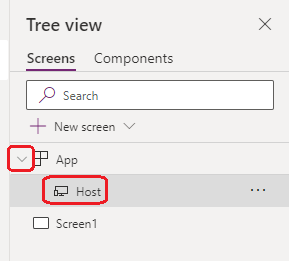

---
title: Host object in Power Apps
description: Reference information including syntax and examples for the Host object in Power Apps.
author: gregli
ms.topic: reference
ms.custom: canvas
ms.reviewer: 
ms.date: 3/22/2024
ms.author: jorisde
search.audienceType: 
  - maker
contributors:
  - gregli
---
# Host object in Power Apps
[!INCLUDE[object-host-applies-to](includes/object-host-applies-to.md)]


The **Host** object in Power Apps provides information about the current host running the app.

## Description

The **Host** object provides information about the host device, operating system, and player that is running an app.  **Host** is similar to [the **App** object](object-app.md) and every app has access to this information.

One of the best uses of **Host** is to debug an app that isn't working properly on a specific device or with a specific browser.  Use the text properties of this object to display information in the app's UI with a [**Text label**](/power-apps/maker/canvas-apps/controls/control-text-box) control or log the information to a database table or to [Application Insights](/power-platform/admin/overview-integration-application-insights).

It's tempting to use **Host** to tailor an app to a specific device or browser.  This is dangerous as Power Apps is designed to be run on a wide spectrum of hardware and software platforms and your **Host** based logic may not account for them all and they will change over time.  The better approach is to use information that is more abstracted and not tied to specific hardware and software. For example, use the [**Size**](/power-apps/maker/canvas-apps/controls/control-screen#additional-properties) property of the **Screen** control to tailor a screen to show less or reorganize information when running on a smaller device such as a phone.

To access the **Host** object in Power Apps Studio, expand the [**App**](object-app.md) object at the top of the **Tree view** pane and then select **Host**. In this example, the **Host** object doesn't have any properties that accept formulas.

> [!div class="mx-imgBorder"]
> 

> [!NOTE]
> The host object is currently only available in custom pages and canvas apps.

## BrowserUserAgent property

The text property **BrowserUserAgent** contains the complete user agent string that the browser uses to identify itself when running the app.

For example, a browser user agent string might be:

- Mozilla/5.0 (Windows NT 10.0; Win64; x64) 
- AppleWebKit/537.36 (KHTML, like Gecko) 
- Chrome/109.0.0.0 Safari/537.36 Edg/109.0.1518.78

> [!NOTE]
> If you're running Power Apps in a native app or using the [wrap](/power-apps/maker/common/wrap/wrap-how-to) feature in Power Apps, the app is presented via a browser control, which supplies a user agent string.

## OSType property

The **OSType** property provides the name of the operating system where the app is running. The **OSType** is determined from the user agent string sent by the browser to Power Apps. The following are examples of common values for **OSType**:

| Value |
| --- |
| Windows |
| Mac OS |
| iOS |
| Android |
| Linux |
| ... |

> [!NOTE]
> Don't use the **OSType** to change experience or functionality of your app based on the reported operating system.

The **OSType** text can be used in any formula, such as showing it in a label's text property:

```power-fx
Label1.Text: "You're running " & Host.OSType
```

## SessionID property
The **SessionID** property returns the GUID that identifies the current session. Include this information when reporting problems to your administrator.

> [!NOTE]
> In embedded scenarios such as Power Apps in Power BI, the SessionID property returns the underlying Power Apps session ID, not the Power BI session ID.

```power-fx
Label1.Text: $"Provide session ID { Host.SessionID } to your administrator."
```

## TenantID property

The **TenantID** property provides the Globally Unique Identifier (GUID) that specifies the Microsoft Entra tenant associated with the presently authenticated user.

> [!NOTE]
> Similar to **SessionID**, in embedded scenarios such as Power Apps in Power BI, the tenant ID is the tenant used for the Power Apps session authentication.

```power-fx
Label1.Text: Host.TenantID
```

## Version property

The **Version** property provides the identification and version number of the Power Apps player.  Similar to **BrowserUserAgent**, more than one version number may be returned, separated by spaces.

> [!NOTE]
> The **Version** property is always an empty string when working in Power Apps Studio.

```power-fx
Label1.Text: Host.Version
```
## OfflineEnabled property

The **OfflineEnabled** property provides the runtime mode of the app in the Power Apps player. For apps that are not enabled for offline, the property is always false. For apps that are [enabled for offline](/power-apps/mobile/canvas-mobile-offline-overview) the property is false on the web, but true on iOS, Android, and Windows.  

> [!NOTE]
> Even if a canvas app doesn't function without network connectivity, the **OfflineEnabled** property remains true in Power Apps Studio for canvas apps that have been enabled for offline use.

```power-fx
Label1.Text: Host.OfflineEnabled
```
## Examples

1. Create a new Canvas app.
1. Add a **Text label** control and set the `Text` property to `"Host.BrowserUserAgent: " & Host.BrowserUserAgent`.
1. Add a **Text label** control and set the `Text` property to `"Host.OSType: " & Host.OSType`.
1. Add a **Text label** control and set the `Text` property to `"Host.SessionID: " & Host.SessionID`.
1. Add a **Text label** control and set the `Text` property to `"Host.TenantID: " & Host.TenantID`.
1. Add a **Text label** control and set the `Text` property to `"Host.Version: " & Host.Version`.
1. Add a **Text label** control and set the `Text` property to `"Host.OfflineEnabled: " & Host.OfflineEnabled`.

Run your app on different devices and with different browsers and you will see results similar to the below.

### Power Apps Studio on Windows with Edge browser

**Host.Version** is always blank when working in Power Apps Studio.

```
Host.BrowserUserAgent: Mozilla/5.0 (Windows NT 10.0; Win64; x64) AppleWebKit/537.36 (KHTML, like Gecko) Chrome/116.0.0.0 Safari/537.36 Edg/116.0.1938.76
Host.OSType: Windows
Host.SessionID: ee2eed1a-8455-4e68-a433-a709302d0c71
Host.TenantID: aaaabbbb-0000-cccc-1111-dddd2222eeee
Host.Version: 
```

### Power Apps native mobile player on iOS

```
Host.BrowserUserAgent: Mozilla/5.0 (iPhone; CPU iPhone OS 16_6_1 like Mac OS X) AppleWebKit/605.1.15 (KHTML, like Gecko) Mobile/15E148 PowerApps/e1c23ff9-4822-4e75-a003-01c91407a4d2
Host.OSType: Windows
Host.SessionID: 3ebec22f-ee2e-412a-b3eb-45d97db34863
Host.TenantID: aaaabbbb-0000-cccc-1111-dddd2222eeee
Host.Version: PowerApps-Native/3.23084.8(iOS)
```

### Power Apps web player on Windows with Firefox browser

```
Host.BrowserUserAgent: Mozilla/5.0 (Windows NT 10.0; Win64; x64; rv:109.0) Gecko/20100101 Firefox/117.0
Host.OSType: Windows
Host.SessionID: 283309a4-d88b-4b2a-88de-73b47d1b62d0
Host.TenantID: aaaabbbb-0000-cccc-1111-dddd2222eeee
Host.Version: PowerApps-Web/3.23084.6(Windows)
```

### Power Apps web player on iOS with Safari browser

```
Host.BrowserUserAgent: Mozilla/5.0 (iPhone; CPU iPhone OS 16_6_1 like Mac OS X) AppleWebKit/605.1.15 (KHTML, like Gecko) Version/16.6 Mobile/15E148 Safari/604.1
Host.OSType: iOS
Host.SessionID: a09a946d-ce71-4c1f-bd35-519c79849c8d
Host.TenantID: aaaabbbb-0000-cccc-1111-dddd2222eeee
Host.Version: PowerApps-Web/3.23084.6(iOS)
```


