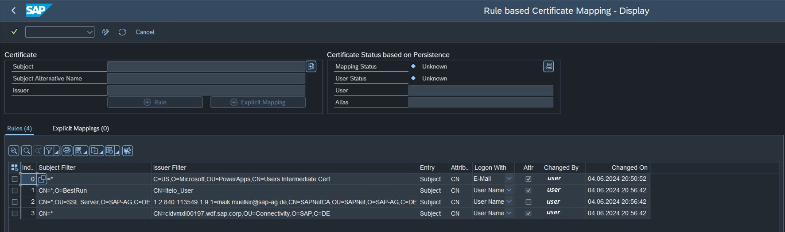

# Set up Microsoft Entra ID with certificates for SSO

This guide walks you through setting up the SAP ERP connector so your users can access SAP data and run Remote Function Calls (RFCs) in Microsoft Power Platform by using their Microsoft Entra ID for authentication. T​he process involves configuring both public and private certificates for secure communication.

> [!NOTE]
> While the example in this article uses self-generated public key infrastructure that isn't recommended, ensure settings and certificates align with your business requirements and your [Microsoft partner](https://partner.microsoft.com/partnership/find-a-partner).

## Prerequisites

Be sure you already:

- [Set up SAP Connection](sap-erp-connector.md). Be sure to use version July 2024 - 3000.230 or later of the [On-premise data gateway](https://powerapps.microsoft.com/downloads/).
- [Set up Secure Network Communications](secure-network-communications.md).

You also need to be familiar with public and private key technologies.

## Certificate

Generate a self-signed root certificate similar to those certificates provided by a Certificate Authority. You can use it to issue tokens for your users.

### Create a demo public key infrastructure

Extend the [Set up Secure Network Communication](secure-network-communications.md) documentation by implementing the other half of the demo PKI (public key infrastructure).


Create the folder structure.

```powershell
cd C:\
mkdir pki-certs
cd C:\pki-certs\
mkdir signingUsersCert
mkdir userCerts
```

Create extension files to ensure you create certificates with the correct metadata and restrictions.

`signingUsersCert/extensions.cnf`

``` [ v3_ca ]
subjectKeyIdentifier=hash
authorityKeyIdentifier=keyid:always,issuer
basicConstraints = critical,CA:true,pathlen:0
keyUsage = cRLSign, keyCertSign
```

`userCerts/extensions.cnf`

``` basicConstraints=CA:FALSE
subjectKeyIdentifier=hash
authorityKeyIdentifier=keyid,issuer
keyUsage = digitalSignature, keyEncipherment
extendedKeyUsage = clientAuth
```

Create the necessary `index.txt` and `serial` files to keep track of signed certificates.

```powershell
# Create the necessary serial and index files if they don't exist
if (-Not (Test-Path "signingUsersCert\index.txt")) { New-Item -Path "signingUsersCert\index.txt" -ItemType File }
if (-Not (Test-Path "signingUsersCert\serial")) { Set-Content -Path "signingUsersCert\serial" -Value "0001" }
```

Generate the intermediate Users cert.

```powershell
openssl genrsa -out signingUsersCert/users.key.pem 2048

# Create Certificate Signing Request
openssl req -new -key signingUsersCert/users.key.pem -sha256 -out signingUsersCert/users.csr.pem -subj "/O=Contoso/CN=Users Intermediate Cert"

# Sign the certificate with the rootCA cert.
openssl x509 -req -in signingUsersCert/users.csr.pem -days 3650 `
  -CA rootCA/ca.cert.pem -CAkey rootCA/ca.key.pem `
  -out signingUsersCert/users.cert.pem `
  -extfile signingUsersCert/extensions.cnf -extensions v3_ca `
  -CAserial rootCA/serial
```

### Generate user certs

Run the following command to generate and sign a certificate for a user with the SAP username `TESTUSER01`:

```powershell
# Create the private key.
openssl genrsa -out userCerts/TESTUSER01.key.pem 2048

# Generate the certificate signing request
openssl req -key userCerts/TESTUSER01.key.pem -new -sha256 -out userCerts/TESTUSER01.csr.pem -subj "/CN=TESTUSER01"

# Sign the certificate + add extensions with the intermediate cert.
openssl x509 -req -days 365 -in userCerts/TESTUSER01.csr.pem -sha256 `
  -CA signingUsersCert/users.cert.pem -CAkey signingUsersCert/users.key.pem `
  -out userCerts/TESTUSER01.cert.pem -extfile userCerts/extensions.cnf `
  -CAserial signingUsersCert/serial
```

> [!NOTE]
> Use `CN=TESTUSER01` as the first parameter.

You now have a root cert, an intermediate SNC (short for Secure Network Communications) cert, an intermediate users cert, and a certificate to identify the user cert.

Verify the chain with the following command:

```powershell
$ openssl verify -CAfile rootCA/ca.cert.pem -untrusted signingUsersCert/users.cert.pem userCerts/TESTUSER01.cert.pem

userCerts/TESTUSER01.cert.pem: OK
```

## Windows Store

Follow these steps to add users signing certificates and certificate chains to the Windows Store.

1. Generate a `.p12` file from the user's signing certificate and private key.

```powershell
openssl pkcs12 -export -out user_signing_cert.p12 -inkey .\signingUsersCert\users.key.pem -in .\signingUsersCert\users.cert.pem
```

1. Open the Windows Certificate Manager:
    1. Press `Win + R`, type `certlm.msc`, and press Enter.
1. Import the public Root CA certificate:
    1. Import it into `Trusted Root Certification Authorities`.
1. Import the user certificate and key:
    1. In the Certificate Manager, go to the appropriate certificate store, such as `Personal`.
    1. Right-click and select `All Tasks > Import`.
    1. Follow the wizard to import the `.p12` file. Make sure to **mark the key as exportable** so the on-premises data gateway (OPDG) can use it to encrypt data.
    1. Right-click on `Users Intermediate Cert` and select `All Tasks > Manage Private Keys`.
1. Add the `NT SERVICE\PBIEgwService` user to the list of users with permissions.
1. Check the subject name of the certificate in the Windows Certificate Store:

```powershell
Get-ChildItem -Path Cert:\LocalMachine\My | Where-Object { $_.Subject -like "*Users Intermediate Cert*" } | Format-List -Property Subject
```

## Entra ID to SAP user mapping

You can map X.509 certificates to users explicitly, by using rules, or by adding a user intermediate certificate to SAP.

### Map X.509 certificates to users explicitly

Explicitly map a small number of Microsoft Entra ID users to SAP users.

In the SAP GUI, go to T-Code `SM30`.

Enter table `VUSREXTID` and select the maintain button.

Select option `DN` when prompted for *:::no-loc text="Type of ACL":::*.

Choose **New Entry** and enter `CN=TESTUSER01@CONTOSO.COM` (replacing the content for your own UPN) for the external ID. Make sure CN comes first. Select your UPN for the username field, check the **Activated** option, and save the results.

> [!NOTE]
> DO NOT INCLUDE `p:` prefix.

### Map X.509 certificates to users using rules

Use *Certificate Rules* to easy bulk-map Entra ID users to SAP users.

Ensure the `login/certificate_mapping_rulebased` profile parameter is set to a current value of `1`.

> [!NOTE]
> This mapping method does not persist between restarts.

Then create the following rule in t-code `CERTRULE`



> [!NOTE]
> Wait two minutes to ensure cached connections to SAP have expired and then retest the connection. If not, you may run into the *No suitable SAP user found for X.509-client certificate* error.

### User intermediate certificate

Take these steps to add a user intermediate certificate to SAP:

1. Open t-code `STRUST` and double-click
on `STRUST` to add the public certificate *users.cert.pem* file to the box.
1. In SAP GUI, go to transaction code STRUST.
1. If *SNC SAPCryptolib* has a red X, right-click and select **Create**.
1. Select **SNC SAPCryptolib** and then double-click your *Own Certificate*.
1. Select **Import Certificate** and choose your `signingUsersCert\users.cert.pem` public certificate.
1. Select **Add to Certificate List**.

## SAP system update

Add the `SsoCertificateSubject` parameter to your SAP system parameters.

``` "SsoCertificateSubject": "CN=Users Intermediate Cert, O=Contoso", ```

Also enable

``` "SncSso": "On" ```

Replace the connection with a new one that uses `Microsoft Entra ID (using certificates)` to sign in to SAP by using your Microsoft Entra ID account.

> [!IMPORTANT]
> Delete the temporary TESTUSER01 public and private keys when you finish this tutorial.

> [!IMPORTANT]
> Ensure you handle private keys securely and delete them when you finish this setup to maintain security.

Learn more:
[On-premises data gateway FAQ](/data-integration/gateway/service-gateway-onprem-faq)
[Configure certificate-based authentication](/power-automate/desktop-flows/configure-certificate-based-auth)
