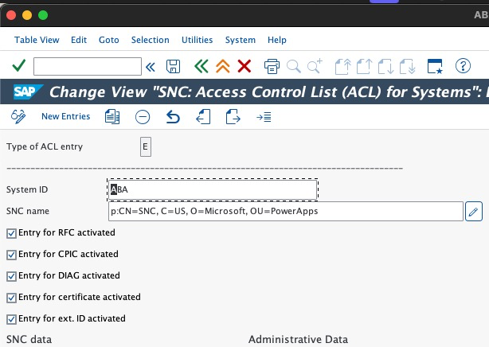
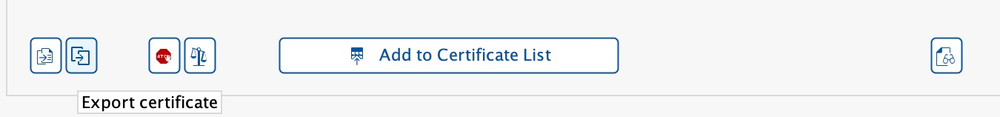
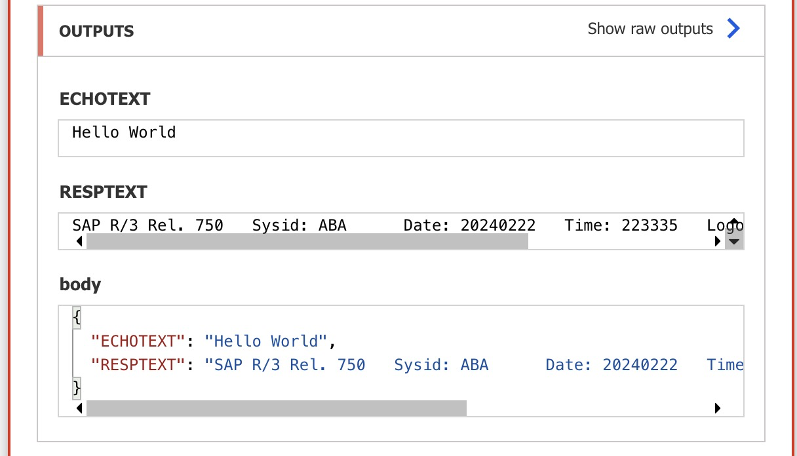

# Set up Secure Network Communications (SNC) for SAP and Microsoft Power Platform

This guide walks you through setting up a secure encrypted connection between the on-premises data gateway (OPDG) and SAP using Secure Network Communications (SNC).

> [!IMPORTANT]
> This article is for setting up a proof of concept only. The settings and recommendations are not intended for production use. For more information about this topic,  consult your security team, internal policies, and Microsoft Partner for further guidance.

## Prerequisites

 1. [Set up SAP connection via Getting started guide](/connect/sap-erp-connector.md)
 1. Access to an SAP instance that you can restart and administer
 1. SAP GUI installed and set up
 1. Familiarity with public and private key technologies.
 1. OpenSSL
    - If you have Git for Windows, you can use the `openssl` command by adding `C:\Program Files\Git\usr\bin\` to your system PATH

## Install SAP Common Crypto Library

SAP Common Crypto Library enables NCo to encrypt encrypted communication between the on-premises data gateway and SAP. To extract the library, we need a proprietary decompression utility called `SAPCAR`.

### Get SAPCAR

1. Go to the [SAP Software Center](https://me.sap.com/softwarecenter).
2. Search for "SAPCAR" and select the latest non-archived version.
3. Choose your operating system.
4. Download the .EXE file to `C:\sap\SAR`.

### Get SAP Common Crypto Library

1. In the SAP Software Center, search for "COMMONCRYPTOLIB".
2. Select the latest version.
3. Choose your operating system.
4. Download the .SAR file with the most recent release date to `C:\sap\SAR`.

### Extract SAP Common Crypto

1. Open PowerShell and go to `C:\sap\SAR`.
1. Run the following command, replacing parts of it with your own values:

   ```powershell
   .\SAPCAR_xxxx.EXE -xvf .\SAPCRYPTOLIBP_xxxx.SAR -R .\..\libs\sapcryptolib
   ```

1. Check that `sapgenpse.exe` is in `C:\sap\libs\sapcryptolib` folder.

## Generate certificates

Certificate establish trust and encryption between your on-premises data gateway and the SAP box.

> [!WARNING]
> This method is for demo purposes and not recommended for production systems.
> For production systems please refer to your internal PKI or Security Team for certificate guidance.

### Certificate structure

In this example, our certificates are structured as follows. This article specifically focuses on setting up the blue boxes.


### Create certificates

1. Set up the folder structure:

   ```powershell
   mkdir rootCA
   mkdir sncCert
   
   # Create the necessary serial and index files if they don't exist
   if (-Not (Test-Path "rootCA\index.txt")) { New-Item -Path "rootCA\index.txt" -ItemType File }
   if (-Not (Test-Path "rootCA\serial")) { Set-Content -Path "rootCA\serial" -Value "01" }
   ```

1. Generate a Root CA:

   ```powershell
   openssl genpkey -algorithm RSA -out rootCA/ca.key.pem -pkeyopt rsa_keygen_bits:2048
   openssl req -x509 -new -key rootCA/ca.key.pem -days 7305 -sha256 -extensions v3_ca -out rootCA/ca.cert.pem -subj "/O=Contoso/CN=Root CA"
   ```

1. Generate the SNC certificate:

   ```powershell
   openssl genrsa -out sncCert/snc.key.pem 2048
   openssl req -key sncCert/snc.key.pem -new -sha256 -out sncCert/snc.csr.pem -subj "/O=Contoso/CN=SNC"
   ```

1. Create an OpenSSL configuration file for signing:
   `sncCert/extensions.cnf`

   ```[ v3_leaf ]
   subjectKeyIdentifier = hash
   authorityKeyIdentifier = keyid,issuer
   basicConstraints = critical,CA:false
   keyUsage = critical,digitalSignature,keyEncipherment,dataEncipherment
   extendedKeyUsage = clientAuth,emailProtection
   ```

1. Sign the SNC certificate with the Root CA:

   ```powershell
   openssl x509 -req `
      -in sncCert/snc.csr.pem `
      -CA rootCA/ca.cert.pem `
      -CAkey rootCA/ca.key.pem `
      -CAcreateserial `
      -out sncCert/snc.cert.pem `
      -days 3650 `
      -sha256 `
      -extfile sncCert\extensions.cnf `
      -extensions v3_leaf
   ```

## Create a Personal Secure Environment

Create a Personal Secure Environment (PSE) for the on-premises data gateway. The NCo library will look for the SNC certificate inside of the PSE.

1. Create a PKCS#12 container:

   ```powershell
   openssl pkcs12 -export -out snc.p12 -inkey sncCert\snc.key.pem -in sncCert\snc.cert.pem -certfile rootCA\ca.cert.pem
   ```

1. Set up the SECUDIR environment variable:
   - Open System Properties (Right-click "This PC" > Properties > Advanced system settings)
   - Select "Environment Variables"
   - Under "System variables", select "New"
   - Set Variable name to "SECUDIR"
   - Set Variable value to "C:\sapsecudir"
   - Select "OK" to save

1. Import the PKCS#12 container into a PSE:

   ```powershell
   C:\sap\libs\sapcryptolib\sapgenpse.exe import_p12 -p SAPSNCSKERB.pse C:\pki-certs\snc.p12
   ```

## Set up SAP for SNC

1. Sign in to SAP GUI.
1. Go to transaction code `SNC0`.
1. Enter `E` as the work area.
1. Select `New Entry` from the top bar and fill in the required information.
   
1. Select the "Save" icon.
1. Return to the SAP GUI home screen.
1. Go to transaction code RZ10.
1. Set these profile parameters:

   ```snc/accept_insecure_cpic: 1
   snc/accept_insecure_gui: 1
   snc/accept_insecure_rfc: 1
   snc/enable: 1
   snc/extid_login_diag: 1
   snc/extid_login_rfc: 1
   snc/gssapi_lib: $(SAPCRYPTOLIB)
   snc/identity/as: p:CN=ID3, O=Contoso
   snc/permit_insecure_start: 1
   snc/data_protection/max: 3```

1. Save the profile parameters and restart your SAP system.

## Exchange certificates between SAP and OPDG

### Add OPDG's SNC certificate to SAP

1. In SAP GUI, go to transaction code STRUST.
1. If "SNC SAPCryptolib" has a red X, right-click and select "Create".
1. Double-click "SNC SAPCryptolib" and then double-click your Own Certificate.
1. Select "Import Certificate" and choose your `sncCert\snc.cert.pem` public certificate.
1. Select "Add to Certificate List".

   

### Add SAP's SNC certificate to OPDG

1. In SAP GUI, go to transaction code STRUST.
1. Double-click "SNC SAPCryptolib" and then double-click your Own Certificate.
1. Export the public certificate.

   

1. Move the public certificate to your OPDG machine (for example, `C:\sap\contoso-public-key.crt`).
1. Import the certificate into your OPDG's PSE:

   ```powershell
   C:\sap\libs\sapcryptolib\sapgenpse.exe maintain_pk -p SAPSNCSKERB.pse -v -a C:\pki-certs\sncCert\sapkerb.public.cert
   ```

## Test the secure connection

1. Create a new instant flow in Power Automate.
1. Add an SAP ERP Call Function action.
1. Update the SAP Connection string to include SNC parameters:

   ```json
   {
   "AppServerHost": "xxx",
   "Client": "xx",
   "SystemNumber": "xx",
   "LogonType": "ApplicationServer",
   "SncLibraryPath": "C:\\sap\\libs\\sapcryptolib\\sapcrypto.dll",
   "SncMyName": "p:CN=SNC, O=Contoso",
   "SncPartnerName": "p:CN=ID3, O=Contoso",
   "SncQop": "Default",
   "UseSnc": "true",
   "SncSso": "Off"
   }```

1. Test the connection using the `STFC_CONNECTION` RFC function.

   

> [!IMPORTANT]
> Ensure the secure handling and eventual deletion of private keys upon completion of this setup to maintain security integrity.

## Next steps

Now, SNC is established between your On-premises Data Gateway and SAP system, you can:

- Implement SNC in your production environment
- [Learn about Microsoft Entra ID using certificates(X.509 user authentication) for SAP](/connect/entra-id-with-certs.md)

By following this guide, you establish a fully encrypted connection between your On-premises Data Gateway and SAP system, enhancing the security of your SAP integration with Microsoft Power Platform.
