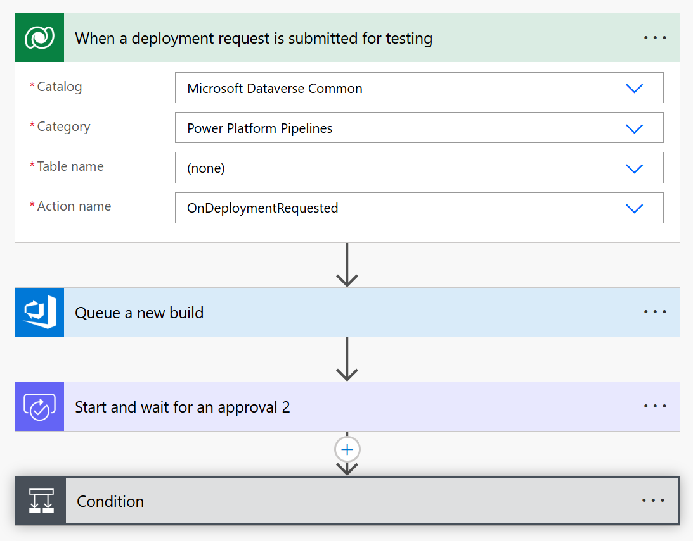

## Introduction to ALM in Power Platform with Test Engine

Application Lifecycle Management (ALM) is a comprehensive approach to managing the lifecycle of applications, encompassing governance, development, testing, maintenance, and deployment. In the context of Power Platform, ALM ensures that applications are developed, tested, and deployed efficiently and consistently. This article introduces the logical ALM lifecycle of automated testing, from local machine execution to pipeline ALM execution.

## Local Machine Execution

You can use a local editor like [Visual Studio Code](https://code.visualstudio.com/) to edit the [yaml](./yaml.md) files to author the Test Engine tests. To run the tests you will need the following command line tools installed. 

### Command Line Tools

To execute automated tests locally, several command line tools need to be installed on the development machine.

#### Azure CLI

The **[Azure CLI](/cli/azure/install-azure-cli)** is essential for obtaining access tokens to connect to Dataverse. Locally, you can use `az login --allow-no-subscriptions`.

#### Power Platform Command Line

The **/power-platform/developer/cli/introduction** is required to execute test suite files using the [pac test run](../developer/cli/reference/test) command. You can use **[Power Platform CLI Install Instructions](../developer/cli/introduction)** so that you can use [pac test run](../developer/cli/reference/test) to execute test suite files.

#### Source Code

If you as using the source code version of Test Engine the following will be required

- **[.Net 8.0 SDK](/dotnet/core/install/)**: If you plan to build Test Engine from source, and not use `pac test run` action.
- **[Install and set up Git](/devops/develop/git/install-and-set-up-git)**: If you need to pull changes from [Power Apps Test Engine](https://github.com/microsoft/PowerApps-TestEngine).

## Power Platform Pipelines 

You can trigger execution of automation tests when using a [Custom pipelines host](/power-platform/alm/custom-host-pipelines).

- This flow makes use of [Dataverse Triggers](../alm/extend-pipelines#triggers) to start a pipeline. You can optionally set [Trigger conditions](../alm/extend-pipelines#trigger-conditions) to determine which deployment name or stage that the cloud flow applies to.
- Use the [Azure DevOps Connector](/connectors/visualstudioteamservices/) to start a new build. You can the [optional field parameters](/connectors/visualstudioteamservices/#other-fields-parameter) to pass parameters to the pipeline.
- Start an [Approval](/connectors/approvals/) with a list of changes and a summary of the test results of the pipeline.
- Based on the `Approve` or `Deny` update the pipeline using [Dataverse Actions](/power-platform/alm/extend-pipelines#actions)

### Azure DevOps

Using your Azure DevOps pipeline you could look to combine the following links and tasks to build a pipeline to execute and upload the test results:

- **[Create Azure DevOps pipeline](/azure/devops/pipelines/create-first-pipeline)**: If using Azure DevOps pipeline to execute automated tests
- **[Dataverse Git integration setup (preview)](/power-platform/alm/git-integration/connecting-to-git)**: If using Azure DevOps Git integration to include the resources of the solution being tested
- **[Use service principals & managed identities in Azure DevOps](/azure/devops/integrate/get-started/authentication/service-principal-managed-identity)**: For Azure Pipelines to connect to dataverse.
- **[Use dotnet v2 task](/azure/devops/pipelines/tasks/reference/use-dotnet-v2)**: To install 8.0 SDK if building Test Engine from source from **https://microsoft.github.io/PowerApps-TestEngine/**
- **[PowerShell v2 task](/azure/devops/pipelines/tasks/reference/powershell-v2?view=azure-pipelines) or [Bash v3 task](/azure/devops/pipelines/tasks/reference/bash-v3)**: To execute `pac test run` to execute tests via the Power Platform CLI
- **[Variable groups](/azure/devops/pipelines/library/variable-groups)**: To store values required for test automation
- **[Secure files](/azure/devops/pipelines/library/secure-files)**: To host configuration files required for test run execution if using Azure Devops
- **[Download secure file v1 task](/azure/devops/pipelines/tasks/reference/download-secure-file-v1)**: To download and secure files doe use in the Azure DevOps pipeline
- **[Publish test results v2 task](/devops/pipelines/tasks/reference/publish-test-results-v2)**: To publish test results (*.trx) to Azure Pipelines.
