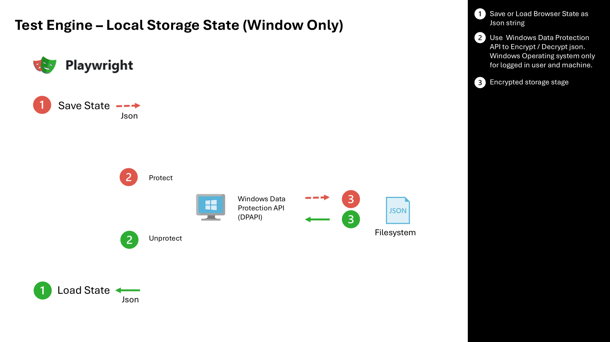
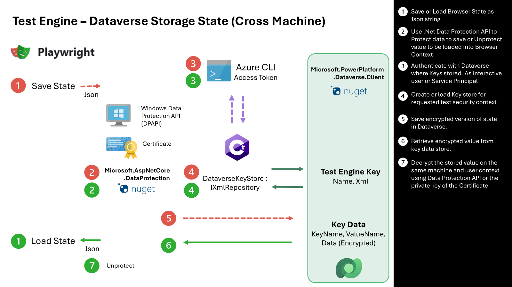

# Test Engine Authentication implementation

> [!NOTE]
> [!INCLUDE [cc-preview-features-definition](../includes/cc-preview-features-definition.md)]

One of the key elements of automated testing discussion for browser based tests using the multiple profiles of automated testing of Power Apps is the security model to allow sign-in and the security around these credentials.

Understanding process is critical to comprehend how the interactive web sign-in credential process works, how sign-in tokens are encrypted, and how this relates to the multifactor authentication (MFA) process. 

Additionally, we'll explore the controls that the Microsoft Entra security team can put in place and the security model across Test Engine, Playwright, Data Protection API, OAuth sign-in to Dataverse, Dataverse, and Key Value Store.

## Local Windows

The first and simplest option to secure storage state is using Windows Data Protection API. While this option has less components, it does have limitations as it requires Microsoft Windows together the user account and machine to secure the files locally. When you're looking to execute tests on a different operating system or execute your tests in the context of pipelines the [Dataverse Data Protection](#data-protection-dataverse) approach will be a better approach.



1. The current storage state user authentication provider is extended to Save and load the Playwright browser context as Encrypted values
1. Make use of the [Windows Data Projection API](/dotnet/standard/security/how-to-use-data-protection) to protect and unprotect the saved state at rest.
1. Save encrypted json file or retrieve unprotected JSON to the file system for use in other test sessions

## Data Protection Dataverse

The next approach makes use of a more comprehensive data protection approach that allows saved user persona state to be shared across multiple machines. This approach adopts a multi level approach to allow for a wider set of operating systems and execution environments.



1. The current storage state user authentication provider is extended to Save and load the Playwright browser context as Encrypted values
1. Make use of the Microsoft.AspNetCore.DataProtection package to offer Windows Data Protection (DAPI) or Certificate public / private encryption
1. Use the current logged in Azure CLI session to obtain an access token to the Dataverse instance where Test Engine Key values and encrypted key data are stored
1. Use a custom xml repository that provides the ability query and create Data Protection state by implementing IXmlRepository
1. Store XML state of data protection in Dataverse Table. Encryption of XML State managed by Data Protection API and selected protection providers
1. Make use of Dataverse Security model, sharing and auditing features are enabled to control access and record access to key and key data. Data Protection API is used to decrypt values and apply the state json to other test sessions.
1. Use the Data Protection API to decrypt the encrypted value using Windows Data Protection API (DAPI) or X.509 certificate private key.

A future option could also consider adding integration with [Azure Key Vault](/aspnet/core/security/key-vault-configuration)

## Playwright

Test Engine web based tests encapsulate browser automation using [Playwright](https://playwright.dev/dotnet/). The key class in this process is [BrowserContext](https://playwright.dev/dotnet/docs/api/class-browsercontext#browser-context-storage-state) that allows provide a way to operate multiple independent browser sessions. Specifically the key element is the use of storage state for this browser context, contains current cookies and local storage snapshot to allow interactive and headless sign-in.

### Initial sign-in

Using the storage state provider of Test Engine the initial sign-in must be part of an interactive sign-in process. This process attempts to start a test session. When no previous storage state is available or valid the interactive user will be prompted to be logged in via Microsoft Entra before allowing access to the requested page. This sign-in process uses what ever Multi Factor and Conditional Access policies that have been applied to validate the user sign-in.

Including some further on possible settings for background reading:

- Configured [Authentication Methods](/entra/identity/authentication/concept-authentication-methods)
- [How it works: Microsoft Entra multifactor authentication](/entra/identity/authentication/concept-mfa-howitworks)
- [Reauthentication prompts and session lifetime for Microsoft Entra multifactor authentication](/entra/identity/authentication/concepts-azure-multi-factor-authentication-prompts-session-lifetime)
- [Web browser cookies used in Microsoft Entra authentication](/entra/identity/authentication/concept-authentication-web-browser-cookies)
- [What is Conditional Access?](/entra/identity/conditional-access/overview)
- [Configure adaptive session lifetime policies](/entra/identity/conditional-access/howto-conditional-access-session-lifetime)
- [Require a compliant device, Microsoft Entra hybrid joined device, or multifactor authentication for all users](/entra/identity/conditional-access/policy-alt-all-users-compliant-hybrid-or-mfa)
- [Microsoft Defender for Cloud Apps overview](/defender-cloud-apps/what-is-defender-for-cloud-apps)

The goal of the sign-in process it works with organization defined sign-in process so that defined authentication methods are validated.

### Storage State

After a successful sign-in process The storage state of the browser context can contain [cookies](/entra/identity/authentication/concept-authentication-web-browser-cookies) that are used to authenticate later sessions. [Learn more about how to use data protection](/dotnet/standard/security/how-to-use-data-protection)

### Windows Data Protection API

.NET provides access to the data protection API (DPAPI), which allows you to encrypt data using information from the current user account or computer. When you use the DPAPI, you alleviate the difficult problem of explicitly generating and storing a cryptographic key.

### Data Protection API

The [Microsoft.AspNetCore.DataProtection](/aspnet/core/security/data-protection/introduction) package offers Windows Data Protection (DAPI) or Certificate public/private encryption. This ensures that sensitive data, such as sign-in tokens, is securely encrypted and stored.

Key information to review for readers that are unfamiliar with Data Protection API:

- [Authenticated encryption details in ASP.NET Core](/aspnet/core/security/data-protection/implementation/authenticated-encryption-details) with `ES-256-CBC` + `HMACSHA256`
- [Key management in ASP.NET Core](/aspnet/core/security/data-protection/implementation/key-management)
- [Custom key repository](/aspnet/core/security/data-protection/implementation/key-storage-providers#custom-key-repository)
- [Windows DPAPI key encryption at rest](/aspnet/core/security/data-protection/implementation/key-encryption-at-rest#windows-dpapi) encryption mechanism for data that's never read outside of the current machine. Only applies to Windows deployments.
- [X.509 certificate key encryption at rest](/aspnet/core/security/data-protection/implementation/key-encryption-at-rest#x509-certificate)

#### DPAPI Encryption

By default data values are encrypted with `ES-256-CBC` and `HMACSHA256`. 

`ES-256-CBC` stands for 'AES-256 in Cipher Block Chaining (CBC) mode'. AES (Advanced Encryption Standard) is a widely used encryption algorithm that ensures data confidentiality. `256` refers to the key size, which is 256 bits. CBC mode is a method of encrypting data in blocks, where each block of plaintext is XORed with the previous ciphertext block before being encrypted. This ensures that identical plaintext blocks produce different ciphertext blocks, enhancing security.

`HMACSHA256` stands for "Hash-based Message Authentication Code using SHA-256." Hash-Based Message Authentication Code (HMAC) is a mechanism that provides data integrity and authenticity by combining a cryptographic hash function (in this case, SHA-256) with a secret key. SHA-256 is a member of the SHA-2 family of cryptographic hash functions, producing a 256-bit hash value.

When combined, `ES-256-CBC` + `HMACSHA256` provides both encryption and authentication:

- Encryption with `AES-256-CBC`: The data is encrypted using AES-256 in CBC mode, ensuring that the data is confidential and can't be read by unauthorized parties.
- Authentication with `HMACSHA256`: An HMAC is generated using SHA-256 and a secret key. This HMAC is appended to the encrypted data. When the data is received, the HMAC can be recalculated and compared to the appended HMAC to verify that the data hasn't been tampered with.

This combination ensures that the data is both encrypted (confidential) and authenticated (integrity and authenticity), providing a robust security mechanism.

### Dataverse Integration

The current logged-in Azure CLI session is used to obtain an access token to the Dataverse instance where Test Engine key values and encrypted key data are stored. The Dataverse security model, sharing, and auditing features are enabled to control access and record access to key and key data.

Further reading for readers unfamiliar with Azure CLI sign-in, Access Token, and Dataverse security model:
- [az sign-in](/cli/azure/reference-index#az-login)
- [az account get-access-token](/cli/azure/account#az-account-get-access-token) using Azure CLI to obtain access token. In this case it's used to obtain access token to integrate with Dataverse custom XML repository
- [Microsoft.PowerPlatform.Dataverse.Client](https://www.nuget.org/packages/Microsoft.PowerPlatform.Dataverse.Client/) used to access Custom XML Repository using the obtained access token
- [Security concepts in Microsoft Dataverse](../admin/wp-security-cds.md) where using User or Team owned records.
- [Granting permission to tables in Dataverse for Microsoft Teams](/power-apps/teams/dataverse-for-teams-table-permissions)
- [Record sharing](../admin/wp-security-cds.md#record-sharing) Individual records can be shared on a one-by-one basis with another user (interactive or application user).
- [Column-level security in Dataverse](../admin/wp-security-cds.md#column-level-security-in-dataverse)
- [System and application users](../admin/system-application-users.md). Specifically [application users](../admin/create-users.md#create-an-application-user) that could be used from the context of a CI/CD process.

### Custom XML Repository

A custom XML repository provides the ability to query and create Data Protection state by implementing [IXmlRepository](/aspnet/core/security/data-protection/extensibility/key-management#ixmlrepository). The XML state of data protection is stored in a Dataverse table, with encryption managed by the Data Protection API and selected protection providers.

Note the `IXmlRepository` doesn't need to parse the XML passing through them. They treat the XML documents as opaque and let higher layers of the Data Protection API worry about generating and parsing the documents.

### Decryption Process

The Data Protection API is used to decrypt the encrypted value using Windows Data Protection API (DAPI) or X509 certificate private key. This decrypted value is then applied to other test sessions.

## Sample

The following sample is a conceptual overview of how values are *Protected* and *Unprotected* using Dataverse as the `IXmlRepository`

<!-- 
TODO: Can this be refactored to provide a static method with identifiable inputs and outputs?
Perhaps more generic so it might be re-usable?
And with /// comments
 -->

```csharp
using Microsoft.AspNetCore.DataProtection;
using Microsoft.AspNetCore.DataProtection.Repositories;
using Microsoft.Extensions.DependencyInjection;
using Microsoft.Extensions.Logging;
using Microsoft.PowerPlatform.Dataverse.Client;
using Microsoft.Xrm.Sdk;
using Microsoft.Xrm.Sdk.Query;
using System.Security.Cryptography.X509Certificates;
using System.Xml.Linq;

public class Program { 
    public static void Main(string[] args)
    {
        ServiceProvider services = null;

        var serviceCollection = new ServiceCollection();
        serviceCollection.AddLogging(configure => configure.AddConsole());

        var api = new Uri("https://contoso.crm.dynamics.com/");

        string keyName = "Sample";

        // Configure Dataverse connection
        var serviceClient = new ServiceClient(api, (url) => Task.FromResult(AzureCliHelper.GetAccessToken(api)));

        serviceCollection.AddSingleton<IOrganizationService>(serviceClient);

        serviceCollection.AddDataProtection()
            .ProtectKeysWithCertificate(GetCertificateFromStore("localhost"))
            //.ProtectKeysWithDpapi()
            .AddKeyManagementOptions(options =>
            {
                options.XmlRepository = new DataverseKeyStore(services?.GetRequiredService<ILogger<Program>>(), serviceClient, keyName);
            });
        services = serviceCollection.BuildServiceProvider();
        var protector = services.GetDataProtector("ASP Data Protection");


        string valueName = string.Empty;
        while ( string.IsNullOrEmpty(valueName))
        {
            Console.WriteLine("Variable Name");
            valueName = Console.ReadLine();
        }
        
        var matches = FindMatch(serviceClient, keyName, valueName);

        if (matches.Count() == 0)
        {
            string newValue = string.Empty;
            while ( string.IsNullOrEmpty(newValue))
            {
                Console.WriteLine("Value does not exist. What would you like the value to be?");
                newValue = Console.ReadLine();
            }
            
            StoreValue(serviceClient, keyName, valueName, protector.Protect(newValue));

            Console.WriteLine($"Saved value for {valueName}");
        } 
        else
        {
            string data = protector.Unprotect(matches.First().Data);
            Console.WriteLine($"Value {valueName}: {data}");
        }

        Console.ReadLine();
    }
}
```

### DataverseKeyStore

Possible code to query and store encryption key values encrypted via DAPI or public key of certificate. This layer just passes the opaque xml to other components interact with.

```csharp
/// <summary>
/// Represents a key store for Dataverse, implementing the IXmlRepository interface.
/// </summary>
public class DataverseKeyStore : IXmlRepository
{
    /// <summary>
    /// Logger instance for logging information.
    /// </summary>
    private readonly ILogger<Program>? _logger;

    /// <summary>
    /// Service instance for interacting with Dataverse.
    /// </summary>
    private readonly IOrganizationService _service;

    /// <summary>
    /// Friendly name used for querying and storing keys.
    /// </summary>
    private string _friendlyName;

    /// <summary>
    /// Initializes a new instance of the DataverseKeyStore class.
    /// </summary>
    /// <param name="logger">Logger instance for logging information.</param>
    /// <param name="organizationService">Service instance for interacting with Dataverse.</param>
    /// <param name="friendlyName">Friendly name used for querying and storing keys.</param>
    public DataverseKeyStore(
      ILogger<Program>? logger, 
      IOrganizationService organizationService, 
      string friendlyName)
    {
        _logger = logger;
        _service = organizationService;
        _friendlyName = friendlyName;
    }

    /// <summary>
    /// Retrieves all XML elements stored in Dataverse.
    /// </summary>
    /// <returns>A read-only collection of XML elements.</returns>
    public IReadOnlyCollection<XElement> GetAllElements()
    {
        // Retrieve keys from Dataverse
        var query = new QueryExpression("te_key")
        {
            ColumnSet = new ColumnSet("te_xml"),
            Criteria = new FilterExpression
            {
                Conditions =
                {
                    new ConditionExpression(
                     attributeName: "te_name", 
                     conditionOperator: ConditionOperator.Equal, 
                     value: _friendlyName)
                }
            }
        };

        var keys = _service.RetrieveMultiple(query)
        .Entities
        .Select(e => XElement.Parse(e.GetAttributeValue<string>("te_xml")))
        .ToList();

        return keys.AsReadOnly();
    }

    /// <summary>
    /// Stores an XML element in Dataverse.
    /// </summary>
    /// <param name="element">The XML element to store.</param>
    /// <param name="friendlyName">The friendly name associated with the XML element.</param>
    public void StoreElement(XElement element, string friendlyName)
    {
        var keyEntity = new Entity("te_key")
        {
            ["te_name"] = _friendlyName,
            ["te_xml"] = element.ToString(SaveOptions.DisableFormatting)
        };

        _service.Create(keyEntity);
    }
}
```

### Saving and Locating Encrypted Data

The following static `FindMatch` and `StoreValue` methods demonstrates a simple view of possible code to store and retrieve encrypted values from Dataverse

```csharp
/// <summary>
/// Finds and retrieves a collection of protected key-value pairs from Dataverse based on the specified key name and value name.
/// </summary>
/// <param name="service">The IOrganizationService instance used to interact with Dataverse.</param>
/// <param name="keyName">The name of the key to search for.</param>
/// <param name="valueName">The name of the value to search for. This parameter is optional.</param>
/// <returns>A read-only collection of ProtectedKeyValue objects that match the specified key name and value name.</returns>
public static IReadOnlyCollection<ProtectedKeyValue> FindMatch(
   IOrganizationService service, 
   string keyName, 
   string? valueName)
{
    // Retrieve keys from Dataverse
    FilterExpression filter = new FilterExpression(LogicalOperator.And);
    filter.Conditions.Add(new ConditionExpression("te_keyname", ConditionOperator.Equal, keyName));
    filter.Conditions.Add(new ConditionExpression("te_valuename", ConditionOperator.Equal, valueName));

    var query = new QueryExpression("te_keydata")
    {
        ColumnSet = new ColumnSet("te_keyname", "te_valuename", "te_data"),
        Criteria = filter
    };

    var keys = service.RetrieveMultiple(query)
    .Entities
    .Select(e => new ProtectedKeyValue {
        KeyId = e.Id.ToString(),
        KeyName = e["te_keyname"]?.ToString(),
        ValueName = e["te_valuename"]?.ToString(),
        Data = e["te_data"]?.ToString(),
    })
    .ToList();

    return keys.AsReadOnly();
}

/// <summary>
/// Stores a new key-value pair in Dataverse.
/// </summary>
/// <param name="service">The IOrganizationService instance used to interact with Dataverse.</param>
/// <param name="keyName">The name of the key to store.</param>
/// <param name="valueName">The name of the value to store.</param>
/// <param name="data">The data associated with the key-value pair.</param>
public static void StoreValue(
   IOrganizationService service, 
   string keyName, 
   string valueName, 
   string data)
{
    var keyEntity = new Entity("te_keydata")
    {
        ["te_keyname"] = keyName,
        ["te_valuename"] =  valueName,
        ["te_data"] = data,
    };

    service.Create(keyEntity);
}

```

[!INCLUDE [footer-banner](../includes/footer-banner.md)]
