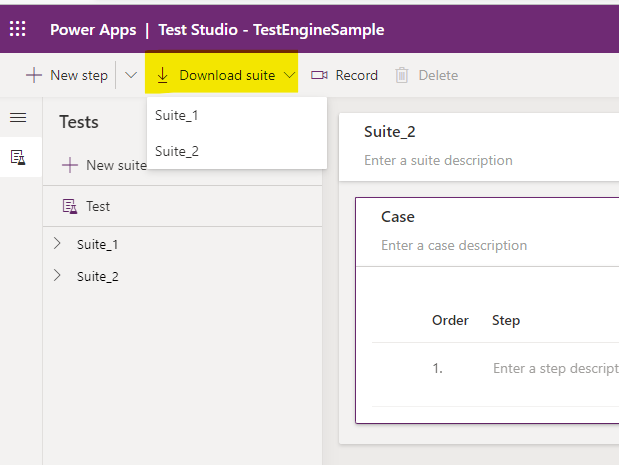
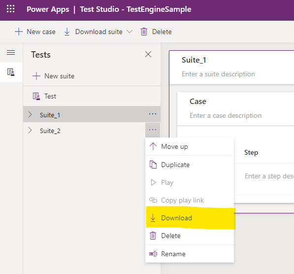

# Testing your canvas app

> [!NOTE]
> [!INCLUDE [cc-preview-features-definition](../includes/cc-preview-features-definition.md)]

Testing your canvas app with [Test Engine](./overview.md) requires the following steps:

1. [Create a Test Plan](#create-a-test-plan)
1. [Set up your user](#set-up-your-user)
1. [Run the test](#run-the-test)
1. [View the results](#view-the-results)

### Create a Test Plan

Test plans are defined using [YAML](https://yaml.org/spec/1.2.2/) format. You can [author your own test plan](#author-your-own-test-plan) or [download recorded tests from Test Studio](#download-recorded-tests-from-test-studio).

Downloading recorded tests from Test Studio allows quick capture and replay of user interactions with your application. This method is useful for creating basic test cases without writing any code. However, it has limitations in terms of flexibility and the ability to handle complex scenarios.

When choosing authoring your own test plan, you can take advantage of the following features:
- **Additional Power Fx Functions**: Use the extra registered Power Fx actions to interact with Power Apps component framework (PCF) Controls and Galleries, enhancing the capabilities of your test plans.
- **Define Custom Data Structures and Functions**: Make use of User Defined Types (UDTs) and User Defined Functions (UDFs) to create reusable and maintainable test steps. 

#### Author your own test plan

Create a yaml file using the test plan schema explained in [Power Apps Test Engine YAML format (preview)](yaml.md).

#### Download recorded tests from Test Studio

If you have tests that you recorded in [Test Studio](/power-apps/maker/canvas-apps/test-studio), you can download them from Test Studio to reuse in Test Engine.

- Use the **Download suite** button in Test Studio to download the test plan. Choose the test suite to download if you have multiple test suites.

    

- Alternatively, use the **Download** button available under each test suite.

    

- Make sure you update the config file and user configurations if you're using a different tenant or environment for this app.

### Set up your user

Test Engine currently has these authentication methods:

| Method | Description |
|--------|-------------|
| Storage State | Store authenticated user state locally in the user profile using Microsoft Windows [Data Protection API](/dotnet/standard/security/how-to-use-data-protection)
| Dataverse | Store authenticated user state inside dataverse using your own customer managed key encrypted with an X.509 certificate using [ASP.NET Core Data Protection](/aspnet/core/security/data-protection/introduction)

You can't store test credentials in test plan files you must select `storagestate` or `dataverse` as the secure location to store credentials. The test plan file contains references to which environment variables are used for user persona. For example, the following YAML snippet indicates that the `user1Email` environment variables are used:

```yaml
environmentVariables:
  users:
    - personaName: User1
      emailKey: user1Email
```

View [Users](yaml.md#users) for more information.

Use the following PowerShell script to store the username and password in your environment variables.

```powershell
$env:user1Email = "someone@example.com"
```

### Run the test

Use the PAC CLI [pac test run](../developer/cli/reference/tests.md#pac-test-run) command to run your test plan.

- Path to your test plan file
- EnvironmentId (For example 00aa00aa-bb11-cc22-dd33-44ee44ee44ee)
- TenantId (For example aaaabbbb-0000-cccc-1111-dddd2222eeee)

For example this could be

```pwsh
pac test run -p "canvas" -i "testplan.te.yaml" -t aaaabbbb-0000-cccc-1111-dddd2222eeee -e 00aa00aa-bb11-cc22-dd33-44ee44ee44ee
```

### View the results

When the tests complete, you can view the results of your test in the `.trx` file located in the output directory. This folder contains any screenshots or videos captured by your tests when `recordVideo` is set to `true` in the test plan yaml.

## Test Engine Canvas Changes

The first preview version of the Test Engine was focused on testing canvas applications only. The updated preview version of Test Engine provides new features to allow for more diverse test types.

### Summary of New Features

#### Model Driven Application Support

The latest version of the Test Engine now expands Power Apps testing to include support for [Model Driven Applications](model-driven-application.md) (MDA). This enhancement allows testers to create more comprehensive test plans that cover both canvas and MDA.

#### Dataverse Integration

The ability to optionally include Dataverse in your test plans enables the creation of integration tests. This feature allows testers to validate interactions between applications and Dataverse, ensuring data integrity and consistency across the platform.

#### Managed Extensibility Framework

The new Managed Extensibility Framework model allows extra Power Fx actions to be registered. This framework provides a flexible way to extend the capabilities of the Test Engine by adding custom actions that can be used within test plans.

#### User Defined Types and User Defined Functions

The introduction of User Defined Types (UDTs) and User Defined Functions (UDFs) makes test steps more reusable and maintainable. UDTs allow you to define custom data structures, while UDFs enable the creation of custom functions. These features enhance the flexibility and readability of your test plans.

For more information on UDTs and UDFs, review the [PowerFx](./powerfx.md) documentation.

#### New Authentication Model

The new authentication model removes the need for environment user name and password security, replacing it with a new authentication provider model. This model supports scenarios including multifactor authentication, enhancing the security and reliability of the Test Engine.

[!INCLUDE [footer-banner](../includes/footer-banner.md)]

