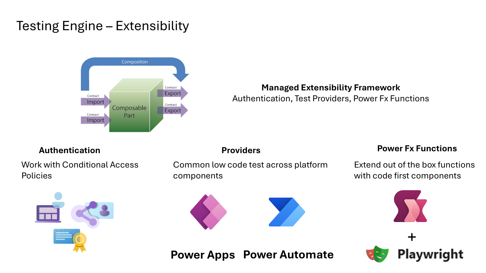

# Test Engine Extensibility

[!INCLUDE [cc-preview-features-definition](../includes/cc-preview-features-definition.md)]

This document provides a detailed explanation of the core elements of the Test Engine, including context on [provider model](./providers.md) and the Power Fx extension model. It also highlights how Power Fx test steps can be extended as low-code user-defined functions or as C# modules.

## Common Features of the Test Engine

The Test Engine offers several key features:

- **Test Suite and Test Case Execution**: At its core, the test engine allows you to define and execute test suites and test cases. This means you can organize your tests into logical groups and run them systematically to ensure your application behaves as expected.

- **Saving Test Results and Log Files**: After Test Engine completes executing your tests, it will save the results in various formats, including the popular `.trx` files. These files store detailed information about each test run, making it easier to review outcomes and diagnose issues. Additionally, log files and video recordings capture the execution details, providing a comprehensive audit trail.

## Managed Extensibility Framework (MEF)

The **[Managed Extensibility Framework (MEF)](/dotnet/framework/mef/)** provides modular extension pattern for applications. MEF is used in Test Engine to enable three main classes of extensibility:

1. **Authentication**: Integrate various authentication mechanisms into the testing framework, including support patterns that need to account for sign in with multifactor authentication or OAuth based authentication.

2. **Providers**: Modules that support specific platforms or technologies, such as [Power Apps Canvas apps](./canvas-application.md) and [Model Driven apps](./model-driven-application.md). These providers enable seamless interaction and testing of applications built on these platforms.

3. **Power Fx Functions**: Allow test steps to be extended support custom Power Fx functions, allowing the creation of sophisticated and tailored test scenarios. These Power Fx function can be defined as [user defined functions](./powerfx.md#user-defined-functions) or extended as custom code using C#.

 > NOTES:
 > 1. During public preview only MEF [providers](./providers.md) and C# Power Fx module function compiled and signed by Microsoft will be loaded by [pac test run](../developer/cli/reference/tests#pac-test-run) command.
 > 2. Create or build new extensions cab be done using the open source MIT licensed [Power Apps Test Engine](https://github.com/microsoft/PowerApps-TestEngine)

## Playwright Integration

C# extension models can have the ability to interact with Playwright [IBrowserContext](https://playwright.dev/dotnet/docs/api/class-browsercontext) to provide Power Fx based extensions for browser based test providers.

## Ring Deployment Model for Extensibility

The Test Engine follows a [Ring Deployment Model](./ring-deployment-model.md):

- **Preview Namespace**: New features and extensions are first introduced in the Preview namespace. Using the Preview namespace allows early adopters to test and provide feedback on these new capabilities before they're widely released.

- **TestEngine Namespace**: After initial testing and refinement, features are promoted to the TestEngine namespace. This stage is designed for wider usage, ensuring that the extensions are robust and ready for broader deployment.

## Conclusion

The Test Engine Extensibility framework empowers users to enhance their testing capabilities through modular extensions. Whether integrating new authentication methods, adding support for different application types, or extending the testing language with custom functions, MEF provides a flexible and powerful way to do so. The Ring Deployment Model ensures that these extensions are thoroughly vetted and ready for prime time.

[!INCLUDE [footer-banner](../includes/footer-banner.md)]
