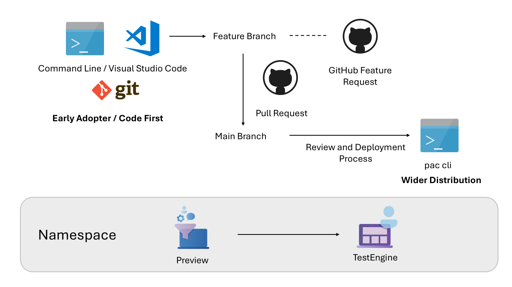

# Test Engine Ring Deployment Mode (preview)

> [!NOTE]
> [!INCLUDE [cc-preview-features-definition](../includes/cc-preview-features-definition.md)]

In the ever-evolving landscape of software development, the Ring Deployment Model stands out as a strategic approach to rolling out new features and updates. The ring deployment model, inspired by the concentric rings of a tree allows us to validate that changes are introduced in a controlled, phased manner, minimizing risks and maximizing feedback.

Imagine a bustling city where a new public transportation system is about to be launched. Instead of opening all routes simultaneously, the city planners decide to test the system in a small neighborhood first. This pilot phase allows them to gather feedback, identify issues, and make necessary adjustments before expanding to larger areas.

Lets have a look at what that looks like for the target release process for Test Engine Features

## The Core Rings

1. **Inner Ring (Canary Users)**: The heart of the deployment model lies the Inner Ring, often referred to as the Canary Users. Generally these users are early adopters who are willing to test new features first. These features are linked to feature request in GitHub open source project. The feedback of early adopters feedback is crucial as it helps identify critical bugs and usability issues during development. The inner ring is typically small, consisting of internal teams or a select group of trusted users. New features in this ring are marked as Preview.

2. **Second Ring (Beta Testers)**: Once the initial feedback is incorporated, the deployment expands to the Second Ring. This group is larger and includes beta testers who represent the general user base. The goal here's to validate the changes in a more diverse environment, ensuring that the updates work seamlessly across different configurations and use cases. Preview features at this stage could be available in the `pac cli` using opt-in configuration

3. **Outer Ring (General Availability)**: Finally, after thorough testing and refinement, the deployment reaches the Outer Ring. At this stage features, reach general availability where the new features are available to all users. By this stage, the updates are expected to be stable and reliable through the previous rings now progress to a wider audience. Features that reach this level move to TestEngine namespace for wider usage.

## Development Branches and Integration

The Ring Deployment Model is closely tied to the development workflow, particularly the use of branches in version control systems. Here's how it integrates:

- **Development Branches**: New features and updates are initially developed in separate branches. These branches allow developers to work on new functionalities without affecting the main codebase.
- **Merge to Main Branch**: After successful testing, the changes are tagged in the main branch for a release. A Git tag represents the stable version of the software that is ready for deployment.

## Namespaces for Feature Testing

Within each release, features are introduced in different namespaces to facilitate testing and feedback:

- **Preview Namespace**: New features are first included in the Preview namespace. This allows early adopters to test and provide feedback on these features before they're widely released.
- **TestEngine Namespace**: After initial testing and refinement, features are promoted to the TestEngine namespace. The Test Engine namespace is designed for wider usage, ensuring that the features are robust and ready for broader deployment.

## Integration into Power Platform Command Line

The final step involves integrating the tested and refined features into the Power Platform Command Line. This approach ensures that the new functionalities are accessible to all users, enhancing their development experience.

## Benefits of the Ring Deployment Model

- **Risk Mitigation**: Risk mitigation is addresses gradually expanding the user base. This model reduces the risk of widespread issues. Problems can be identified and resolved early, preventing major disruptions.
- **User Feedback**: Continuous feedback from different user groups ensures that the final product meets the needs and expectations of the entire user base.
- **Scalability**: The model is highly scalable, allowing organizations to adjust the size of each ring based on the complexity of the update and the risk tolerance.

[!INCLUDE [footer-banner](../includes/footer-banner.md)]
