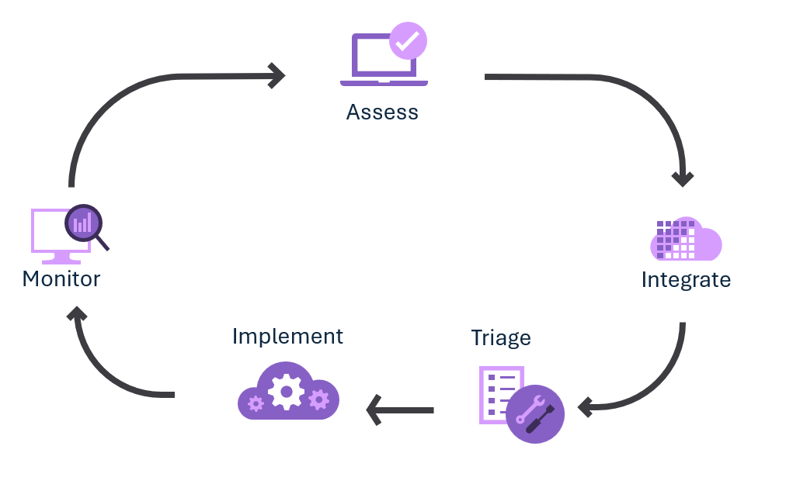

# Complete a Power Platform Well-Architected assessment

[Power Platform Well-Architected assessment](https://aka.ms/powa/assessment) is a tool comprising a series of questions based on the key recommendations outlined in the pillars of Power Platform Well-Architected.

At the end of the assessment, you'll receive recommendations and corresponding links to supporting material to help you improve your workload's design. You can export these recommendations to a file to begin incorporating the recommendations into operational processes for continuous improvement of your workload.

## When to take the assessment

For new workloads, we recommend that you perform the assessment during the initial design process, recording the proposed decisions. The guidance then acts as a baseline and starts a feedback loop that you can use to refine the workload design. As you make more design decisions, periodically capture them in subsequent assessment milestones.

Existing workloads should be examined as well, as part of the continuous improvement cycle of the workload. Set a cadence, such as every 90 days, and use milestones to track how the workload design continues to improve.

## Receive and integrate recommendations

After you complete an assessment, the recommendations for your current milestone are available on the assessment's guidance page. Export these recommendations by selecting the **Export to CSV** button. You can use the offline copy to share the recommendations and start to prioritize them. Although some teams might consider the CSV file sufficient, we recommend that you add the recommendations to the workload's backlog so they can be integrated into the workload's software development lifecycle (SDLC).

## Prioritize and implement recommendations

Workload owners and key stakeholders should rank the recommendations in alignment with the team's standard processes for work prioritization. Consider how relevant each recommendation is and any potential tradeoffs associated with specific design choices. Certain recommendations could be allocated to designated owners, while others may be delayed or rejected. Consider adding the recommendations to the workload's backlog and integrating them into your SDLC.

## Monitor improvements

Over time, the workload will evolve due to changes in functionality, reduction or accumulation of technical debt, and any required tradeoffs. Use the milestone feature of the assessment to track these changes, using the prior milestone as a baseline. You'll be able see the change over time in the [Power Platform Well-Architected Review](https://aka.ms/powa/assessment).

## Tips

- Be sure to sign in when you take assessments so that the tool can generate milestones.

  > [!WARNING]
  > Assessments are tied to a Microsoft Learn profile. They can't be transferred to or accessed by other profiles.

- Choose a meaningful name for the assessment, and be sure to include the name of the pillar in the assessment's name.
- Use meaningful milestone names to indicate when you're evaluating the workload.
  Capture any specifics that you want to discuss with the workload team in the notes feature on questions and on recommendations.
- Consider taking the assessment one pillar at a time, staggered by month, rather than answering all the questions across all five pillars in one assessment. 

## Next step

> [!div class="nextstepaction"]
> [Complete a Power Platform Well-Architected assessment](https://aka.ms/powa/assessment)
