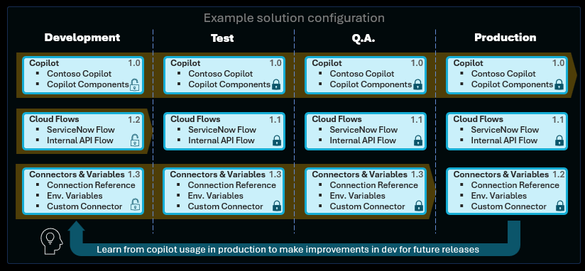

# Deployment and test considerations for intelligent application workloads

Maintain a healthy application lifecycle management (ALM) process to avoid production issues and to swiftly address any regressions.

## Determine your ALM strategy

Ensure that your development process is efficient and scalable by developing a comprehensive ALM strategy that includes version control, continuous integration/continuous deployment (CI/CD), and automated testing.

Evaluate options from simple to advanced CI/CD:

- Manual deployment of solutions.
- Automated deployment with user-friendly [pipelines in Power Platform](/power-platform/alm/pipelines) (no source control).
- Automated deployment + source control with [Azure DevOps](/power-platform/alm/devops-build-tools) or [GitHub Power Platform](/power-platform/alm/devops-github-actions) tools.
- Automated testing of the intelligent application workload as part of the deployment process.

## Use solutions for environment management

Maintain separate environments for development, testing, and production. This practice helps to isolate issues and ensures that changes are thoroughly tested before reaching users.

Use [solutions](../../alm/solution-concepts-alm.md) to move plugins created in Microsoft Copilot Studio across different environments.

Key recommendations and considerations:

- **Work within the context of solutions**: Ensure all development is conducted within the framework of solutions.
- **Separate solutions for independent deployment**: Create distinct solutions only when there's a need to deploy components independently.
- **Understand limitations**: Understand limitations of automated deployment, and evaluate which settings have to be set or updated manually after deployment, such as Application Insights integration, deployed channels, and security settings.
- **Use a custom publisher and prefix**: Implement a custom publisher and prefix for better organization and management.
- **Use environment variables**: Use [environment variables](/power-apps/maker/data-platform/environmentvariables) for settings and secrets that vary across environments.
- **Export and deploy as managed solutions**: Export and deploy solutions as managed, except when setting up a development environment.
- **Restrict customizations to development**: Avoid making customizations outside of the development environment.
- **Automate ALM processes**: Consider automating ALM for source control and automated deployments.

### Example

This example provides an overview of the deployment strategy for an intelligent application workload and describes the roles and processes associated with each environment: Development (Dev), Testing (Test), Quality Assurance (QA), and Production (Prod).

<!-- Modify above image's terminology -->

1. **Development environment (Dev)**:
   - **Purpose**: For the initial creation and customization of the solution.
   - **Activities**: Developers build and modify components such as apps, flows, and agents. All customizations and configurations are performed here.
   - **Key practices**:
     - Use a custom publisher and prefix for all components.
     - Implement environment variables for settings and secrets.
     - Ensure all changes are version-controlled and documented.

2. **Testing environment (Test)**:
   - **Purpose**: For preliminary validation and testing of the developed solution.
   - **Activities**: Solutions are exported from the Dev environment as managed solutions and imported into the Test environment. Functional and integration testing is conducted to identify and resolve issues early.
   - **Key practices**:
     - Maintain a separate Test environment to simulate real-world scenarios.
     - Use environment variables to manage settings and secrets specific to the Test environment.
     - Automate deployment processes to ensure consistency and repeatability.

3. **Quality Assurance environment (Q.A. or QA)**:
   - **Purpose**: Dedicated to thorough quality assurance and user acceptance testing (UAT).
   - **Activities**: Managed solutions are imported from the Test environment into the QA environment. Extensive testing, including performance, security, and UAT, is conducted to ensure the solution meets all requirements and standards.
   - **Key practices**:
     - Use environment variables to manage QA-specific settings and secrets.
     - Involve users in UAT to gather feedback and ensure the solution meets their needs.
     - Automate testing processes where possible to enhance efficiency and accuracy.

4. **Production environment (Prod)**:
   - **Purpose**: Hosts the live, user-facing version of the solution.
   - **Activities**: After successful QA testing, the managed solution is exported from the QA environment and imported into the Production environment. This environment is strictly controlled to ensure stability and reliability.
   - **Key practices**:
     - Deploy solutions as managed to prevent unauthorized changes.
     - Use environment variables to manage production-specific settings and secrets.
     - Monitor and maintain the solution to ensure optimal performance and address any issues promptly.

**Overall strategy**:

- **Separation of concerns**: Each environment serves a distinct purpose, ensuring that development, testing, QA, and production activities don't interfere with one another.
- **Automation**: Automate ALM processes, including source control, testing, and deployments, to enhance efficiency and reduce the risk of errors.
- **Consistency**: Maintain consistency across environments by using environment variables and automated deployment scripts.

## Establish a test strategy

Ensure you have a clear plan to validate that your intelligent application workloads and integrations function as expected.

- Define your test strategy for intelligent application workloads. Use the [Test Framework](https://aka.ms/PVASamples/PVATestFramework) to bulk test user utterances and validate that the appropriate topic triggers or that the first "did you mean" option is the correct one in 90% of the cases.

- Test integrations as part of the full end-to-end conversation testing with the Test Framework scale test capability.

- Use the [Power CAT Copilot Studio Kit](https://github.com/microsoft/Power-CAT-Copilot-Studio-Kit) to configure agents and tests. Run individual tests against the Copilot Studio APIs (Direct Line), and evaluate the agent responses against expected results.

- Ensure that you understand nonfunctional requirements like availability, compliance, data retention/residency, performance, privacy, recovery time, security, and scalability. For example, a chat widget on the website should load and start a conversation within 5 seconds of being clicked. Similarly, a cloud flow triggered to return information to the user should provide the desired data within 10 seconds.

## Related information

- [Power Platform ALM](/power-platform/alm/)
- [Recommendations for safe deployment practices](../operational-excellence/safe-deployments.md)
