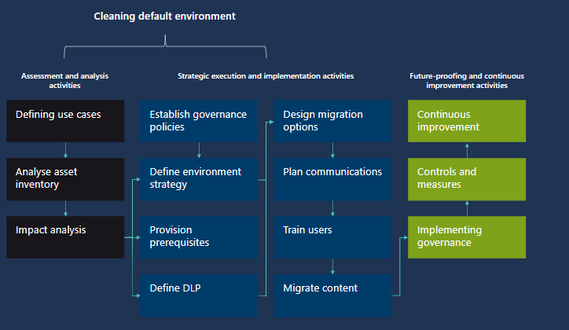
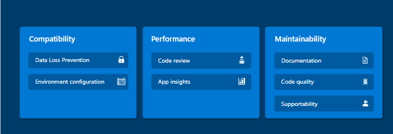
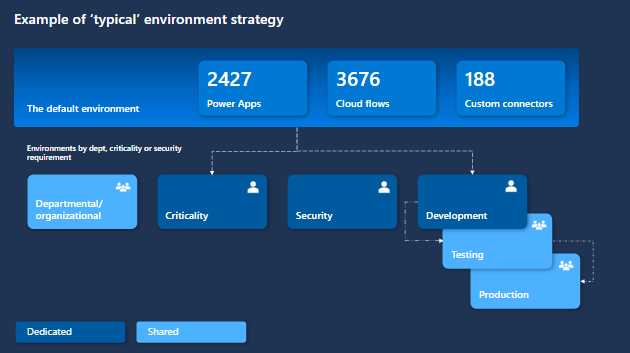

# Recommendations for default environment hygiene

**Applies to this Power Platform Well-Architected Reliability checklist recommendation:**

|[RE:11](checklist.md)| Default environment hygiene recommendation.   |
|---|---|

This guide describes the best practices for developing a strategy for Default Environment hygiene. As you continue to use Microsoft Power Platform to create impactful applications, it is important to ensure that environments remain organized, efficient, and aligned with your evolving business needs. This guide will provide you with a strategy of why, what, and how to declutter the default environment, offering practical insights and strategies to enhance your Power Platform governance.

The purpose of the default environment is primarily to facilitate rapid application development and enable users to familiarize themselves with Power Platform’s building blocks, such as Power Apps and Power Automate.  The default environment offers a low barrier to entry, making it accessible to individuals and teams who are new to the Power Platform, or in the early stages of their app development journey.  

While the default environment offers a convenient starting point, it is important to note that it is not intended for long-term production use. Its default settings and configurations might not align with the security, compliance, and scalability requirements of a production environment. Therefore, when organizations are ready to deploy their apps and solutions for broader usage, it becomes necessary to migrate the content to a dedicated environment that is properly configured and optimized.

This recommendation will address

- App and flow landscape: Moving from numerous undocumented apps and flows to a comprehensive understanding of your inventory and documentation for all apps and flows.
- Redundancy and risk: Moving from unknown redundancy and potential risks in existing solution to identifying and retiring redundant solutions and mitigating risks.
-  Migration effort: Moving from uncertainty in the effort required for migrating apps and flows to a streamlined migration plan with clear effort estimates. 
- Value identification: Moving from limited understanding of the value and impact of solutions to identifying solutions based on their value and business impact.
- Governance: Moving from lack of governance over app and flow creation and management to implementation of governance policies for better control. 

**Definitions**

| **Default environment** | [**Environments overview - Power Platform &#124; Microsoft Learn**](/power-platform/admin/environments-overview) |
|---|---|
| | |
| | |

## Key design strategies

Cleaning up the default environment happens over several phases. 

Once we understand more about how the platform is being used, we then start to analyze the impact that moving solutions will have on them.  

We then move into planning, where we define crucial elements such as the migration options, the environment strategy, how we train and communicate with app owners, and app users, we make decisions about governance policies, and how we want users of the platform to behave, and then we look at moving forwards, after the migration work has been completed.  

We do not want to have a build-up of resources in the default environment, so we need to put measures in place to help guarantee that we do not need to repeat this work.

### Use case analysis

First, define use cases of the types of solutions that have been built. This will help you categorize solutions and define an action plan per type, rather than looking at the individual solutions. As part of your use case definition consider important information such as the data classification, audience, and business impact of the solution. 

Example use case analysis:

| **Use case** | **Definition** |
|---|---|
| **Everybody** | Large number of users |
| **Broad use, critical** | Used by departments, business units or project teams. Critical or important to the business operation. |
| **Broad use, non-critical** | Used by departments, business units or project teams. Not critical or important to the business operation, typically addresses productivity scenarios where a manual work around exists. |
| **Personal use** | Small number of users, either just one person or some peers. Typically help save time and are for productivity scenarios, but a manual workaround exist or downtime would not cause a business impact. |
| **Deletion** | Redundant, orphaned, no longer required, inactive. |
| **SharePoint** | Custom forms and flows over SharePoint, the use case is decided and driven by the SharePoint site owner. |

### Asset inventory

It is crucial to have a full inventory of assets in the Default environment, before you can proceed to the next steps. Only once you fully understand the apps and flows in the Default environment, can you start categorizing them and come up with an action plan. 

There are multiple ways to get an asset inventory, either by using the out of the box Power Platform Admin Center, open-source solutions like the CoE Starter Kit or building a custom solution with PowerShell or Power Platform admin connectors.

As part of your inventory gathering, you can typically find out some characteristics of the apps and flows by the meta-data available for them – such as the number of users the resource is shared with, when it was last modified, when it was last launched, if the resource is suspended or orphaned already etc. 

However, the criticality of a workload can typically not be established through meta-data or usage alone – a workload for budget planning might only be used once a quarter by a small number of users, on the other hand a workload to record your daily steps as part of a wellness competition could be used daily by the entire organization. Looking at the meta-data and usage alone is not enough to establish the impact and criticality of the workload on the organization. You will have to communicate with the workload owner to establish the criticality of their solutions. 

We recommend conducting a survey that owners must respond to establish the criticality. Ask simple questions such as “If this app ceased to function, would this impact yourself / your team / the entire org / customers” and “What type of impact would it be: productivity impact / revenue impact / regulatory impact”. Based on the answers, determine criticality.  

### Migration options

Once you have done your use case analysis and asset inventory, decide what migration options will be available for workloads. These depend on the use case and criticality, as well as your existing environment strategy. 

Here are some options:

- Self-migrated: Workload owner is responsible for end to end migration
- Assisted migration: Workload owner will work together with the Platform team to migrate 
- Platform team migrated: Workload owner collaborates with the migration team. Migration team undertakes the entire migration process. The Migration team is typically part of your Power Platform admin or Center of Excellence/Enablement team. 
- Not migrated: No migration required. Workload either remains in the Default environment or gets deleted. 

Based on your use cases, we recommend the following approach for migration options:

| **Use case analysis** | **Migration option** |
|---|---|
| **Everybody** | Platform team migrated |
| **Broad use case, critical** | Assisted migration |
| **Broad use case, non-critical** | Self-migration |
| **Personal use** | No action |
| **SharePoint** | No Action |

### Impact analysis

Before you migrate workloads to new environments, you need to perform a technical impact analysis. This will ensure workloads end up in environments that meet the workload requirements and where they can be well supported. 

Here are some recommendations. These recommendations could be considered for self-service (for self-migration), or as migration as a service (assisted migration):

- Compatibility: if the app or flow is moving to a new environment, it needs to be compatible. This could encompass checking for environment configuration, connector availability, etc. 
- Performance: consider the performance and scalability of apps by use case definition. For broad usage, critical and non-critical apps, they should consider a code review to ensure that any anti-patterns are addressed before they are migrated.
- Maintainability: Evaluating the maintainability aspects of the app – consider factors such as documentation, code quality, and supportability. This should be a requirement for broad usage, critical apps.

We recommend the following level of technical impact analysis, based on the use case analysis and migration option:

:::row:::
    :::column:::
    ****
    :::column-end:::
    :::column:::
    **Self-migrated**
    :::column-end:::
    :::column:::
    **Assisted migration**
    :::column-end:::
    :::column:::
    **Platform team migrated**
    :::column-end:::
:::row-end:::
:::row:::
    :::column:::
    **Target environment review (DLP, configuration)**
    :::column-end:::
    :::column:::
    :white_check_mark:
    :::column-end:::
    :::column:::
    :white_check_mark:
    :::column-end:::
    :::column:::
    :white_check_mark:
    :::column-end:::
:::row-end:::
:::row:::
    :::column:::
    **Code review** **tool**
    :::column-end:::
    :::column:::
    :white_check_mark:
    :::column-end:::
    :::column:::
    :white_check_mark:
    :::column-end:::
    :::column:::
    :white_check_mark:
    :::column-end:::
:::row-end:::
:::row:::
    :::column:::
    **App insights**
    :::column-end:::
    :::column:::
    
    :::column-end:::
    :::column:::
    
    :::column-end:::
    :::column:::
    :white_check_mark:
    :::column-end:::
:::row-end:::
:::row:::
    :::column:::
    **Documentation**
    :::column-end:::
    :::column:::
    
    :::column-end:::
    :::column:::
    :white_check_mark:
    :::column-end:::
    :::column:::
    :white_check_mark:
    :::column-end:::
:::row-end:::
:::row:::
    :::column:::
    **Code** **quality**
    :::column-end:::
    :::column:::
    
    :::column-end:::
    :::column:::
    
    :::column-end:::
    :::column:::
    :white_check_mark:
    :::column-end:::
:::row-end:::
:::row:::
    :::column:::
    **Supportability**
    :::column-end:::
    :::column:::
    
    :::column-end:::
    :::column:::
    :white_check_mark:
    :::column-end:::
    :::column:::
    :white_check_mark:
    :::column-end:::
:::row-end:::

### Environment strategy

Before you start the decluttering process, you need to understand where your workloads need to be moved to. It’s important to have a strategy for managing environments, and that types of workloads that will reside in them. 

Typically they are considered either dedicated, or shared.

Reasons for dedicated environments:

- Criticality – there may be business critical apps that should not have any other Power Platform asset reside in the same environment to mitigate the risk of an update or deployment outside the business critical app impacting performance or availability.
- Security – access to data, or the app itself may have certain levels of sensitivity, meaning that to mitigate the risk of unauthorised access or data breach, it requires a dedicated environment. It could also require a combination of connectors that you would not want used outside the specific use case and requirements fo the solution.
- Development – developer environments may be dedicated to a particular project

Considerations for shared environments:

Departmental – keeping all Power Platform resources required by a specific team or department can simplify user access, licensing and chargeback models.

Testing – commonly test environments are shared.

Production – sharing broad usage applications in a share production environment can simplify deployments.

### Provisioning prerequisites

To ensure that migration goes smoothly, it’s important to ensure that any prerequisite is completed prior to starting migration activities.  This includes:

- ensuring target environments are provisioned and configured correctly
- creating and applying DLP policies to the environment
- Entra ID groups are created, access packages available, and users are mapped/ added to these groups
- Where appropriate, Azure App Insights is configured for apps of high-value for additional telemetry data

Also consider handling your migration in batches, which can be useful when you have hundreds of workloads to migrate. For example, you can migrate in batches by department, by use case, or by target environment. 

Think about how you would manage migration batches. What would be a manageable approach to migrating apps in batches? What would you change about your migration strategy?

### Plan communications

Plan your communication strategy to ensure stakeholders are aware of the impact, to raise awareness, to encourage collaboration and to collect feedback. 

**Awareness and Engagement**

A communications plan ensures that all stakeholders are aware of the goals, timelines, and expected outcomes. It's important to engage everyone who will be affected by changes in the default environment, including IT professionals, end-users, and management.

**Educating Stakeholders**

Microsoft Power Platform, being a suite of business application tools, often involves a diverse range of users with varying levels of expertise. A communications plan can help in educating these users about the importance of maintaining a clean and efficient default environment. This includes explaining the benefits of proper management, such as improved performance, easier navigation, and enhanced security.

**Managing Expectations**

Through effective communication, you can manage stakeholders' expectations regarding the outcomes of the migration. This includes setting clear objectives, explaining the scope of what will be covered, and what will be required from participants.

**Encouraging Collaboration**

A communications plan can foster a collaborative environment. Cleaning up the default environment may require input and cooperation from different departments or teams. Effective communication ensures that everyone is on the same page and working towards a common goal.

**Feedback Mechanism**

An essential part of any migration is feedback. A communications plan should outline how feedback will be collected and addressed. This feedback is crucial for continuous improvement of the default environment and the project itself.

#### Audience Analysis

Understanding your audience is the foundation of effective communication. In the context of migrating, this means knowing who the participants are, their roles, their level of expertise with the Power Platform, and their specific needs or challenges.

The choice of communication channels can greatly impact the effectiveness of your message. Different channels (emails, webinars, in-person meetings, collaborative platforms, etc.) have different strengths and are suitable for different types of messages and audiences.

Tailoring messages is about ensuring that your communication is relevant, engaging, and clear to your specific audience. This involves not only the content but also the tone, language, and complexity of the message.

**Roles and Responsibilities**

Highlight the importance of knowing the roles and responsibilities of different stakeholders.

Explain that tailoring messages based on roles ensures that the information is relevant and meaningful to each group.

**Communication Preferences**

Discuss different communication preferences within the audience (e.g., some may prefer emails, while others prefer in-person meetings).

Emphasize the need to adapt communication channels to suit the preferences of diverse stakeholders.

**Knowledge Level:**

Address varying levels of knowledge about the Power Platform. Some may be technical experts, while others may have a more general understanding.

Show how adjusting the depth of technical detail in your communication can enhance understanding.

**Interests and Concerns:**

Stress the importance of identifying the interests and concerns of different groups.

Explain that aligning your message with their interests ensures engagement and buy-in.

### Continuous improvement

Governance is dynamic by nature. In a constantly evolving business and technological landscape, governance cannot be static.

It needs to adapt and evolve continuously to remain effective.

Establish a continuous governance cycle:

- Establish and review key policies: Periodically establish, review and update governance policies in areas like resource requests, user access, compliance
- Proactive governance measures: Implement and regularly update proactive measures, including audits, risk assessments and training programs
- Setting, monitoring, adjusting OKRs: Define and periodically reassess OKRs to ensure alignment with evolving organizational goals and governance standards
- Leveraging technology for enhanced governance: Continuously integrate and update technology tools to support and streamline governance processes
- Feedback and continuous improvementEstablish a regular feedback mechanism from all stakeholders and use insights for ongoing governance enhancement

Track the effectiveness of your governance with OKRs:

| **Objective** | **Key result** | **Anticipated effect** |
|---|---|---|
| **Optimised resource and** **environment management** | Develop a process for requesting and approving new environments | Streamlines the creation and management of environments, improving efficiency |
| **** | Reduce unused or underutilized resources by 25% by end of Q3 | Enhances resource efficiency and cost-effectiveness |
| **** | Implement an environment cleanup strategy by Q4 | Optimizes environment usage and maintains organizational order |
| **Improve user engagement and** **training** | Increase training completion rates for developers and users to 80% by Q3 | Elevates platform proficiency, leading to better and more secure usage |
| **Streamline application development and** **deployment** | Create a template and component library by Q3 | Accelerates development and ensures consistency across applications |

### Implement governance

Integrate governance principles into your organizational cultures. Policies need to be ingrained in organizational culture. Training programs and regular policy reviews ensure that principles are deeply embedded. Include these principles in maker/ user onboarding. Positive outcomes of effective governance include enhanced stakeholder trust, better risk management and platform sustainability. Focus on continuous governance cycle.

## Power Platform facilitation

- **Default Environment Routing** moves makers away from building in the default environment. By having a dedicated developer environment that they are routed to when launching make.powerapps.com they have the benefit of building in a safe space, rich with all of the premium features they need to develop great applications.   When they are ready, they benefit from the in-built ALM capabilities that pipelines delivers to them.  This means their ideas, when ready can be deployed to the correct downstream environments. This is great for makers, but also great for admins, who have now a far more mature ALM process that everyone is following, whether they know it or not. Learn More [Default environment routing (preview) - Power Platform | Microsoft Learn](/power-platform/admin/default-environment-routing?tabs=ppac)
- **Pipelines in Power Platform** aim to democratize application lifecycle management (ALM) for Power Platform and Dynamics 365 customers by bringing ALM automation and continuous integration and continuous delivery (CI/CD) capabilities into the service in a manner that's more approachable for all makers, admins, and developers.  [Set up pipelines in Power Platform - Power Platform | Microsoft Learn](/power-platform/alm/set-up-pipelines)
- **Sharing Limits** limit how broadly makers can share canvas apps. Applying this to the default environment can ensure proactive governance and avoid oversharing of workloads. [Limit sharing - Power Platform | Microsoft Learn](/power-platform/admin/managed-environment-sharing-limits)
- **Maker Welcome Content** allows you to configure na customized welcome content that helps makers get started with Power Apps. When the welcome content is enabled, upon signing in to Power Apps, makers will be greeted with customized getting started information. You can use this feature to educate makers about the purpose of the Default environment, and your environment strategy: [Enable maker welcome content (preview) - Power Platform | Microsoft Learn](/power-platform/admin/welcome-content)
- Developer environments: [About the Power Apps Developer Plan - Power Platform | Microsoft Learn](/power-platform/developer/plan)
- CoE Starter Kit 

## Related links

[Default environment routing (preview) - Power Platform | Microsoft Learn](/power-platform/admin/default-environment-routing?tabs=ppac)

[Microsoft Power Platform Center of Excellence Kit - Power Platform | Microsoft Learn](/power-platform/guidance/coe/starter-kit)

[Managed Environments overview - Power Platform | Microsoft Learn](/power-platform/admin/managed-environment-overview)

[Establishing an environment strategy - Microsoft Power Platform - Power Platform | Microsoft Learn](/power-platform/guidance/adoption/environment-strategy)
