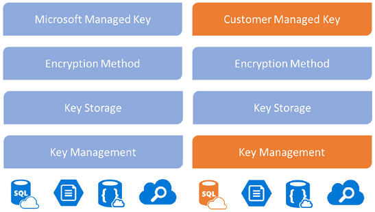
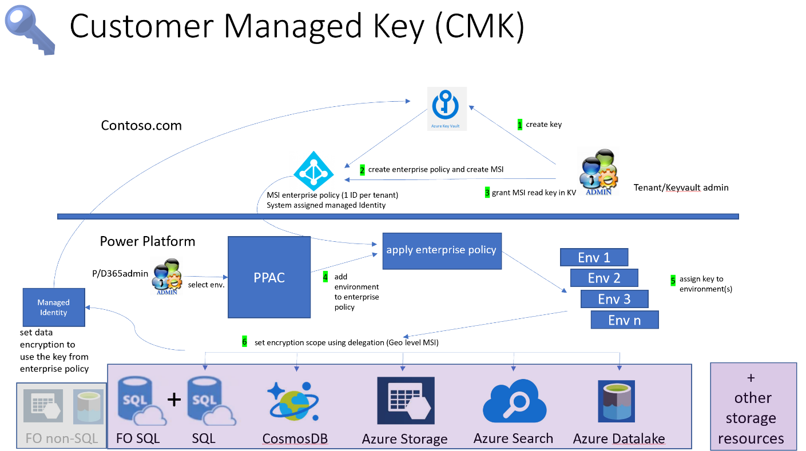

# Recommendations for data encryption

**Applies to Power Well-Architected Security checklist recommendation:**

|[SE:07](checklist.md)|Encrypt data by using modern industry-standard methods to guard confidentiality and integrity. Align encryption scope with data classifications; prioritize native platform encryption methods.|
|---|---|

If your data isn't protected, it can be maliciously modified, which leads to loss of integrity and confidentiality.

This guide describes the recommendations for encrypting and protecting your data. Encryption is the process of using cryptography algorithms to **make the data unreadable and lock the data with a key**. In the encrypted state, data can't be deciphered. It can only be decrypted by using a key that's paired with the encryption key.

**Definitions** 

| Terms | Definition |
|---|---|
| Certificates | Digital files that hold the public keys for encryption or decryption. |
| Cipher suite | A set of algorithms that are used to encrypt and decrypt information to secure a network connection over Transport Layer Security (TLS). |
| Decryption | The process in which encrypted data is unlocked with a secret code. |
| Double encryption | The process of encrypting data by using two or more independent layers of encryption. |
| Encryption | The process by which data is made unreadable and locked with a secret code. |
| Hashing | The process of transforming data to text or numbers with the intent of hiding information. |
| Keys | A secret code that's used to lock or unlock encrypted data. |
| Signature | An encrypted stamp of authentication on data. |
| Signing | The process of verifying data's authenticity by using a signature. |
| X.509 | A standard that defines the format of public key certificates. |

## Key design strategies

Organizational mandates or regulatory requirements might enforce encryption mechanisms. For example, there might be a requirement that data must remain only in the selected region, and copies of the data are maintained in that region.

These requirements are often the base minimum. Strive for a higher level of protection. You're responsible for **preventing confidentiality leaks and tampering of sensitive data**, whether it's external user data or employee data.

Data is an organization’s most valuable and irreplaceable asset, and encryption serves as the last and strongest line of defence in a multi-layered data security strategy. Microsoft business cloud services and products use encryption to safeguard customer data and help you maintain control over it.

### Encryption scenarios

Encryption mechanisms likely need to secure the data in three stages:

**Data at rest** is all information that's kept in storage objects. By default, Microsoft stores and manages the database encryption key for your environments using a Microsoft-managed key. However, Power Platform provides a customer-managed encryption key (CMK) for added data protection control, where you can self-manage the database encryption key. [add link to Power platform facilitation section where CMK is explained]  

**Data in transit** is information that's transferred between components, locations, or programs. Azure uses industry standard transport protocols such as TLS between user devices and Microsoft data centers, and within data centers themselves.  

### Native encryption mechanisms

By default, Microsoft stores and manages the database encryption key for your environments using a Microsoft-managed key. However, Power Platform provides a customer-managed encryption key (CMK) for added data protection control, where you can self-manage the database encryption key. The encryption key resides in your own Azure key vault, which allows you to rotate or swap the encryption key on demand. It also allows you to prevent Microsoft's access to your customer data when you revoke the key access to our services at any time.

### Encryption keys

By default, Power Platform services use Microsoft-managed encryption keys to encrypt and decrypt data. Azure is responsible for key management.

You can opt for **customer-managed keys**. Power Platform still uses your keys, but you're accountable for key operations. **You have the flexibility to change keys** when you want. Decryption is a compelling reason to use customer-managed keys.

You should **pair strong encryption with strong decryption**. From a security perspective, protecting a decryption key is important because rotation is a common way to control the blast radius if a key is compromised. Monitor access to detect anomalous access and activities.

**Store keys separate from encrypted data**. This decoupling helps ensure that the compromise of one entity doesn't affect the other. If you use customer-managed keys, store them in a key store. Store highly sensitive data in a managed hardware security module (HSM).

Both stores are protected with identity-based access. This feature enables you to deny access, even to the platform.

Administrators can provide their own encryption key using their own key generator hardware (HSM) or use Azure Key Vault to generate an encryption key. The key management feature takes the complexity out of encryption key management by using Azure Key Vault to securely store encryption keys. Azure Key Vault helps safeguard cryptographic keys and secrets used by cloud applications and services. Encryption keys must meet the following Azure Key Vault requirements:

2048-bit RSA

[HSM BYOK](/azure/key-vault/keys/hsm-protected-keys)

Administrators also can revert the encryption key back to a Microsoft managed key at any time.

## Power Platform facilitation

The following sections describe Power Platform services and features that you can use to encrypt your data.

**Customer Managed Key**  

All customer data stored in Power Platform is encrypted using a strong Microsoft-managed encryption key by default. Organizations with data privacy and compliance requirements to secure their data and manage their own keys can use the customer managed key capability. The customer managed key provides added data protection where you self-manage the data encryption key associated with your Dataverse environment. Using this capability enables you to rotate or swap encryption keys on demand. Also, it prevents Microsoft from being able to access your data when you revoke the key from the service at any time. 

Power Apps store their data in their own storage and in Microsoft Dataverse. When you apply the customer managed key to environments, only the data stored in Microsoft Dataverse are encrypted with your key. The non-Microsoft Dataverse data, including Power Apps source code and canvas apps icons, continue to be encrypted with the Microsoft-managed key. 

When using a customer managed key with Power Automate, your workflows, and all associated at-rest data will be stored and executed on a dedicated infrastructure, partitioned by the environment. This encryption includes your workflow definitions for cloud and desktop flows and workflow execution history with detailed inputs and outputs. The connection settings for connectors will continue to be encrypted with a Microsoft-managed key. 

**Enabling** **CMK in a tenant** 

To use customer managed keys, administrators can provide their own encryption key from their own Azure Key Vault to the Power Platform storage services to encrypt their customer data. Microsoft doesn't have direct access to your Azure Key Vault. For Power Platform services to access the encryption key from your Azure Key Vault, the administrator creates a Power Platform enterprise policy, which references the encryption key and grants this enterprise policy access to read the key from your Azure Key Vault. 

**Using** **CMK in an environment** 

Organizations can choose which Power Platform environments that have Dataverse they want to encrypt using their own key. The customer-managed key is a feature of Managed Environments, so any environment in which you plan to use your own keys must be enabled as a Managed Environment. To configure CMK for an environment, the administrator would add the environment to the enterprise policy. Changing the key can be accomplished by creating another enterprise policy, removing the environment from the old policy, and adding it to the new policy. Removing an environment from all enterprise policies reverts the data encryption for the environment to Microsoft-managed keys. 

You can use separate encryption keys to encrypt different Dataverse environments to further isolate data. 

**Locking environments** 

Your organization can revoke the encryption key access to Power Platform services anytime. Microsoft’s service access to your customer data ends immediately when this occurs. Since you can use separate encryption keys to encrypt different Microsoft Dataverse environments, you can separately lock these environments by revoking key vault access to the respective enterprise policy. Locking key vault or key access can only be done by the Azure Key Vault admin. 

You can trigger key access revocation by completing a few different tasks, including deleting the encryption or key vault. The [complete list of tasks](/power-platform/admin/cmk-lock-unlock) should be reviewed and should only occur with the intent to lock the environment.  

You should never revoke key access as part of your normal business process. When you revoke key access, all environments associated with the enterprise policy will be taken completely offline immediately, and your users who were active in the environment will experience unplanned downtime, including data loss. If you decide to leave the service, locking the environment can ensure that your customer data can never be accessed again by anyone, including Microsoft. 

To unlock the environments, you must restore all key access permissions for the original encryption key. You can then submit a Microsoft Support request to unlock and enable the environments. The environments can only be enabled when the original encryption key used to encrypt the customer data is restored. 

**Risk when you manage your** **key** 

Customer-managed key is a powerful tool to put you in control of protecting your data. Before you use the key management feature, you should understand the risk when you manage your database encryption keys. It's conceivable that a malicious administrator (a person who is granted or has gained administrator-level access with intent to harm an organization's security or business processes) working within your organization might use the manage keys feature to create a key and use it to lock your environments in the tenant. Azure Key Vault has built-in safeguards that assist in restoring the key, which require the soft delete and purge protection key vault settings enabled. Another safeguard you can implement is to make sure that there is [separation of tasks](/power-platform/admin/customer-managed-key) where the Azure Key Vault administrator isn't granted access to the Power Platform admin center. 

## Data residency

An Azure Active Directory (Azure AD) tenant houses information that's relevant to an organization and its security. When an Azure AD tenant signs up for Power Platform services, the tenant's selected country or region is mapped to the most suitable Azure geography where a Power Platform deployment exists. Power Platform stores customer data in the tenant's assigned Azure geography, or _home geo_, except where organizations deploy services in multiple regions.

Some organizations have a global presence. For example, a business may be headquartered in the United States but do business in Australia. It may need certain Power Platform data to be stored in Australia to comply with local regulations. When Power Platform services are deployed in more than one Azure geography, it's referred to as a _multi-geo_ deployment. In this case, only metadata related to the environment is stored in the home geo. All metadata and product data in that environment is stored in the remote geo.

Microsoft may replicate data to other regions for data resiliency. We don't replicate or move personal data outside the geo, however. Data replicated to other regions may include non-personal data such as employee authentication information.

Power Platform services are available in specific Azure geographies. For more information about where Power Platform services are available, where your data is stored, and how it's used, go to [Microsoft Trust Center](https://www.microsoft.com/trustcenter). Commitments concerning the location of customer data at rest are specified in the Data Processing Terms of the [Microsoft Online Services Terms](https://www.microsoftvolumelicensing.com/DocumentSearch.aspx?Mode=3&DocumentTypeId=31). Microsoft also provides data centers for [sovereign entities](/power-platform/admin/regions-overview).

### Data at rest

Unless otherwise stated in documentation, customer data remains in its original source (for example, Dataverse or SharePoint). A Power Platform app is stored in Azure Storage as part of an environment. Data used in mobile apps is encrypted and stored in SQL Express. In most cases, apps use Azure Storage to persist Power Platform service data and Azure SQL Database to persist service metadata. Data that's entered by app users is stored in the respective data source for the service, such as Dataverse.

All data persisted by Power Platform is encrypted by default using Microsoft-managed keys. Customer data stored in Azure SQL Database is fully encrypted using Azure SQL's Transparent Data Encryption (TDE) technology. Customer data stored in Azure Blob storage is encrypted using Azure Storage Encryption.

### Data in processing

Data is in processing when it's being used as part of an interactive scenario, or when a background process, such as a refresh, touches it. Power Platform loads data in processing into the memory space of one or more service workloads. To facilitate the workload's functionality, data that's stored in memory isn't encrypted.

### Data in transit

Power Platform requires all incoming HTTP traffic to be encrypted using TLS 1.2 or higher. Requests that try to use TLS 1.1 or lower are rejected.

Learn more [About data encryption - Power Platform | Microsoft Learn](/power-platform/admin/about-encryption)

##### Secret management

You can use [Key Vault](https://azure.microsoft.com/services/key-vault/) to securely store and control access to tokens, passwords, certificates, API keys, and other secrets. Use Key Vault as a key and certificate management solution. Use environment variables to access secrets from Key Vault [Use environment variables in solutions - Power Apps | Microsoft Learn](/power-apps/maker/data-platform/environmentvariables)

## Example

The following example shows encryption solutions that you can use to manage keys, certificates, and secrets.

## Related links

[Use environment variables in solutions - Power Apps | Microsoft Learn](/power-apps/maker/data-platform/environmentvariables)

[Power Platform security FAQs - Power Platform | Microsoft Learn](/power-platform/admin/security/faqs)

[Manage your customer-managed encryption key in Power Platform - Power Platform | Microsoft Learn](/power-platform/admin/customer-managed-key)

