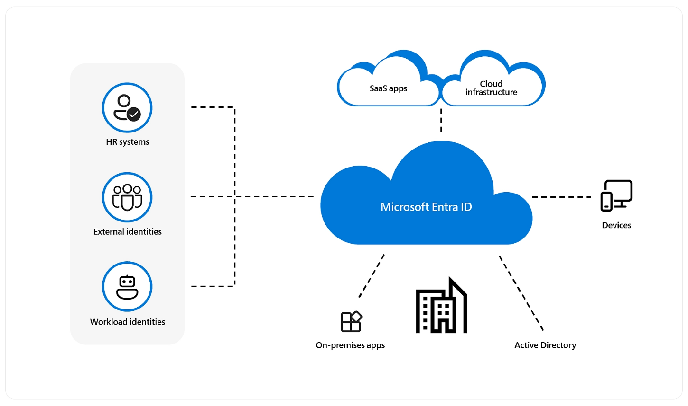

# Recommendations for identity and access management

**Applies to this Power Platform Well-Architected Security checklist recommendation:**

|[SE:05](checklist.md)|Implement strict, conditional, and auditable identity and access management (IAM) across all workload users, team members, and system components. Limit access exclusively to *as necessary*. Use modern industry standards for all authentication and authorization implementations. Restrict and rigorously audit access that's not based on identity.|
|---|---|

This guide describes the recommendations for authenticating and authorizing identities that are attempting to access your workload resources.

From a technical control perspective, **identity is always the primary perimeter**. This scope doesn't just include the edges of your workload. It also includes individual components that are inside your workload. Typical identities include:

- **Humans**. Application users, admins, operators, auditors, and bad actors.
- **Systems**. Workload identities, managed identities, API keys, service principals, and Azure resources.
- **Anonymous**. Entities who haven't provided any evidence about who they are.

**Definitions** 

| Terms | Definition |
|---|---|
| Authentication (AuthN) | A process that verifies that an identity is who or what it says it is. |
| Authorization (AuthZ) | A process that verifies whether an identity has permission to perform a requested action. |
| Conditional access | A set of rules that allows actions based on specified criteria. |
| IdP | An identity provider, like Microsoft Entra ID. |
| Persona | A job function or a title that has a set of responsibilities and actions. |
| Preshared keys | A type of secret that's shared between a provider and consumer and used through a secure and agreed upon mechanism. |
| Resource identity | An identity defined for cloud resources that's managed by the platform. |
| Role | A set of permissions that define what a user or group can do. |
| Scope | Different levels of organizational hierarchy where a role is permitted to operate. Also a group of features in a system. |
| Security principal | An identity that provides permissions. It can be a user, a group, or a service principal. Any group members get the same level of access. |
| User identity | An identity for a person, like an employee or an external user. |
| Workload identity | A system identity for an application, service, script, container, or other component of a workload that's used to authenticate itself to other services and resources. |

> [!Note]
> An identity can be grouped with other, similar identities under a parent called a _security principal_. A security group is an example of a security principal. This hierarchical relationship simplifies maintenance and improves consistency. Because identity attributes aren't handled at the individual level, chances of errors are also reduced. In this article, the term _identity_ is inclusive of security principals.

## Microsoft Entra ID is the identity provider for Power Platform

All Power Platform products use Microsoft Entra ID (formerly Azure Active Directory or Azure AD) for identity and access management. Entra ID enables organizations to secure and manage identity for their hybrid and multi-cloud environments. Entra ID is also essential for managing business guests needing access to Power Platform resources. Power Platform also uses Entra ID to manage other applications that need to integrate with Power Platform APIs using the service principal capabilities. By using Entra ID, the Power Platform can leverage Entra ID more advanced security features like Conditional Access and continuous access evaluation.

### Authentication

Authentication is a process that verifies identities. The requesting identity is required to provide some form of verifiable identification. For example:

- A user name and password.
- A preshared secret, like an API key that grants access.
- A shared access signature (SAS) token.
- A certificate that's used in TLS mutual authentication.

Power Platform authentication involves a sequence of requests, responses, and redirects between the user's browser and Power Platform or Azure services. The sequence follows the [Microsoft Entra ID auth code grant flow](/azure/active-directory/develop/v2-oauth2-auth-code-flow).

Connecting and authenticating to a data source is done separately from authenticating to a Power Platform service. Learn more: [Connecting and authenticating to data sources](/power-platform/admin/security/connect-data-sources)

### Authorization

Power Platform uses Microsoft Entra ID [Microsoft Identity Platform](/azure/active-directory/develop/v2-overview) for authorization of all API calls with the industry-standard OAuth 2.0 protocol.

## Key design strategies

To understand the identity needs for a workload, you need to list the user and system flows, workload assets, and personas, and the actions they will do.

Each use case will probably have its own set of controls that you need to design with an assume-breach mindset. Based on the identity requirements of the use case or the personas, identify the conditional choices. Avoid using one solution for all use cases. Conversely, the controls shouldn't be so granular that you introduce unnecessary management overhead.

You need to log the identity access trail. Doing so helps validate the controls, and you can use the logs for compliance audits.

### Determine all identities for authentication

**Outside-in access**. Power Platform authentication involves a sequence of requests, responses, and redirects between the user's browser and Power Platform or Azure services. The sequence follows the [Microsoft Entra ID auth code grant flow](/azure/active-directory/develop/v2-oauth2-auth-code-flow). Power Platform automatically authenticates all users that access the workload for various purposes.

**Inside-out access**. Your workload will need to access other resources. For example, reading from or writing to the data platform, retrieving secrets from the secret store, and logging telemetry to monitoring services. It might even need to access third-party services. These are all workload identity requirements, however you also need to consider resource identity requirements – for example, how will deployment pipelines run and get authenticated. 

### Determine actions for authorization

Next, you need to know what each authenticated identity is trying to do so that those actions can be authorized. The actions can be divided by the type of access that they require:

**Data plane access**. Actions that take place in the data plane cause data transfer – for example, an application reading or writing data from Microsoft Dataverse, or writing logs to Application Insights.

**Control plane access**. Actions that take place in the control plane cause a Power Platform resource to be created, modified, or deleted. For example, modifying environment properties, or creating a Data policy.

Applications typically target data plane operations, while operations often access both control and data planes.

### Provide role-based authorization

Based on the responsibility of each identity, authorize actions that should be permitted. **An identity must not be allowed to do more than it needs to do**. Before you set authorization rules, you need to have a clear understanding of who or what is making requests, what that role is allowed to do, and to what extent it can do it. Those factors lead to choices that combine identity, role, and scope.

Consider the following:

- Does the workload need to have data plane access to Dataverse for both read and write access?
- Does the workload need access to environment properties as well? 
- If the identity is compromised by a bad actor, what would the impact to the system be in terms of confidentiality, integrity, and availability?
- Does the workload need permanent access or can conditional access be considered?
- Does the workload perform actions that require administrative / elevated permissions? 
- How will the workload interact with third-party services?

#### Role assignment

A role is a _set of permissions_ that's assigned to an identity. Assign roles that only allow the identity to complete the task, and no more. When user's permissions are restricted to their job requirements, it's easier to identify suspicious or unauthorized behavior in the system.

Ask questions like these:

- Is read-only access enough?
- Does the identity need permissions to delete resources?
- Does the role only need access to the records they created?
- Is hierarchical access based on the business unit the user is in required?
- Does the role need administrative or elevated permissions?
- Does the role need permanent access to these permissions?
- What happens if the user changes jobs?

**Limiting the level of access that users, applications, or services have reduces the potential attack surface.** If you grant only the minimum permissions that are required to perform specific tasks, the risk of a successful attack or unauthorized access is significantly reduced. For example, a developer only needs maker access to the Development environment but not the Production environment, they only need access to create resources but not change environment properties, and they may only need access to read/write data from Dataverse but not change the data model or attributes of the Dataverse table. 

**Avoid permissions that** **target individual** **users.** Granular and custom permissions create complexity and confusion and can become difficult to maintain as users change roles and move across the business, or as new users with similar authentication requirements join the team. This can create a complex legacy configuration that's difficult to maintain and negatively impact both security and reliability.

 > :::image type="icon" source="../_images/trade-off.svg"::: **Tradeoff**: A granular access control approach enables better auditing and monitoring of user activities.

**Grant roles that start with least privilege and add more based your operational or data access needs**. Your technical teams must have clear guidance to implement permissions.

### Make conditional access choices

Don't give all identities the same level of access. Base your decisions on two main factors:

**Time**. How long the identity can access your environment.

**Privilege**. The level of permissions.

Those factors aren't mutually exclusive. A compromised identity that has more privileges and unlimited duration of access can gain more control over the system and data or use that access to continue to change the environment. Constrain those access factors both as a preventive measure and to control the blast radius.

*Just in Time (JIT)* approaches provide the required privileges only when they're needed.

*Just Enough Access (JEA)* provides only the required privileges.

Although time and privilege are the primary factors, there are other conditions that apply. For example, you can also use the device, network, and location from which the access originated to set policies.

**Use strong controls that filter, detect, and block unauthorized access**, including parameters like user identity and location, device health, workload context, data classification, and anomalies.

For example, your workload might need to be accessed by third-party identities like vendors, partners, and customers. They need the appropriate level of access rather than the default permissions that you provide to full-time employees. Clear differentiation of external accounts makes it easier to prevent and detect attacks that come from these vectors.

### Critical impact accounts

Administrative identities introduce some of the highest impact security risks because the tasks they perform require privileged access to a broad set of these systems and applications. Compromise or misuse can have a detrimental effect on your business and its information systems. Security of administration is one of the most critical security areas.

Protecting privileged access against determined adversaries requires you to take a complete and thoughtful approach to isolate these systems from risks. Here are some strategies:

**Minimize the number of critical impact accounts.**

**Use separate roles** instead of elevating privileges for existing identities.

**Avoid permanent or standing access** by using the JIT features of your IdP. For break glass situations, follow an emergency access process.

**Use modern access protocols** like passwordless authentication or multifactor authentication. Externalize those mechanisms to your IdP.

Enforce key security attributes by using **conditional access policies**.

**Decommission administrative accounts** that aren't being used.

### Establish processes to manage the identity lifecycle

**Access to identities must not last longer than the resources that the identities access.** Ensure that you have a process for disabling or deleting identities when there are changes in team structure or software components.

This guidance applies to source control, data, control planes, workload users, infrastructure, tooling, the monitoring of data, logs, metrics, and other entities.

**Establish an identity governance process** to manage the lifecycle of digital identities, high-privileged users, external/guest users, and workload users. Implement access reviews to ensure that when identities leave the organization or the team, their workload permissions are removed.

### Protect nonidentity based secrets

Application secrets like preshared keys should be considered vulnerable points in the system. In the two-way communication, if the provider or consumer is compromised, significant security risks can be introduced. Those keys can also be burdensome because they introduce operational processes.

Treat these secrets as entities that can be dynamically pulled from a secret store. They shouldn't be hard coded in your apps, flows, deployment pipelines, or in any other artifact.

Be sure that you have the **ability to revoke secrets**.

Apply operational practices that handle tasks like **key rotation and expiration**.

For information about rotation policies, see [Automate the rotation of a secret for resources that have two sets of authentication credentials](/azure/key-vault/secrets/tutorial-rotation-dual) and [Tutorial: Updating certificate auto-rotation frequency in Key Vault](/azure/key-vault/certificates/tutorial-rotate-certificates).

### Keep development environments safe

Write access to Developer environments should be gated, read access to source code should be limited to roles on a need-to-know basis. You should have a process in place that scans resources regularly and identifies the latest vulnerabilities.

### Maintain an audit trail

One aspect of identity management is ensuring that the system is auditable. Audits validate whether assume-breach strategies are effective. Maintaining an audit trail helps you:

Verify that identity is authenticated with strong authentication. **Any action must be traceable** to prevent repudiation attacks.

**Detect weak or missing authentication protocols** and get visibility into and insights about user and application sign-ins.

Evaluate access from identities to the workload based on security and **compliance requirements** and consider user account risk, device status, and other criteria and policies that you set.

**Track progress or deviation** from compliance requirements.

Most resources have data plane access. You need to know the identities that access resources and the actions that they perform. You can use that information for security diagnostics.

## Power Platform facilitation

Power Platform access control is a vital part of its overall security architecture. Access control points can ensure that the right users are gaining access to the Power Platform resources. In this section of the paper, we will explore the different access points you can configure and their role in your overall security strategy.

### Microsoft Entra ID

All Power Platform products use Microsoft Entra ID (formerly Azure Active Directory or Azure AD) for identity and access management. Entra ID enables organizations to secure and manage identity for their hybrid and multi-cloud environments. Entra ID is also essential for managing business guests needing access to Power Platform resources. Power Platform also uses Entra ID to manage other applications that need to integrate with Power Platform APIs using the service principal capabilities. By using Entra ID, the Power Platform can leverage Entra ID more advanced security features like Conditional Access and continuous access evaluation.

### License assignment

Access to Power Apps and Power Automate starts with having a license. The type of license a user has determines the assets and data a user can access. The following table outlines differences in resources available to a user based on their plan type, from a high level. Granular licensing details can be found in the [Licensing overview](/power-platform/admin/pricing-billing-skus).

### Conditional access policies

**Conditional access describes your policy** for an access decision. To use conditional access, you need to understand the restrictions that are required for the use case. Configure Microsoft Entra Conditional Access by setting up an access policy for that's based on your operational needs.

Learn more:

- [Set up Microsoft Entra Conditional Access](/power-platform/guidance/adoption/conditional-access)
- [Conditional access and multi-factor authentication in Power Automate](/troubleshoot/power-platform/power-automate/conditional-access-and-multi-factor-authentication-in-flow)

### Continuous access

Continuous access accelerates when certain events are evaluated to determine if access should be revoked. Traditionally, with OAuth 2.0 authentication access token expiration is when a check is done during token renewal. With continuous access, a user’s critical events and network location changes are continuously evaluated to determine if the user should still maintain access. These evaluations can result in early termination of active sessions or require reauthentication. For example, if a user account is disabled, they should lose access to the app. Location is also important; for example, the token was authorized from a trusted location, but the user changed their connection to an untrusted network. Continuous access would cause the conditional access policy evaluation, and the user would lose access because they are no longer connecting from an approved location.

Currently, with Power Platform, only Dataverse supports continuous access evaluation. Microsoft is working to add support to other Power Platform services and clients. Learn more: [Continuous access evaluation](/power-platform/admin/continuous-access-evaluation)

As organizations continue to embrace hybrid work locations and deploy cloud applications, Entra ID is an essential primary security perimeter protecting users and resources. Conditional access extends that perimeter beyond a network perimeter to include user and device identity. Continuous access ensures that as events or user locations change, access is re-evaluated. Power Platform products' use of Entra ID allows you to implement organization-level security governance that applies consistently across your application portfolio. Review [these](/azure/security/fundamentals/identity-management-best-practices) identity management best practices for more guidance you can include in building your own plan for using Entra ID with the Power Platform.

### Group access management

Instead of granting permissions to specific users, assign access to groups in Microsoft Entra ID. If a group doesn't exist, work with your identity team to create one. You can then add and remove group members outside of Azure and make sure that permissions are current. You can also use the group for other purposes, like mailing lists.

For more information, see [Secure access control using groups in Microsoft Entra ID](/azure/active-directory/develop/secure-group-access-control).

### Threat detection

Microsoft Entra ID Protection can help you detect, investigate, and remediate identity-based risks. For more information, see [What is Identity Protection?](/azure/active-directory/identity-protection/overview-identity-protection).

Threat detection can take the form of reacting to an alert of suspicious activity or proactively searching for anomalous events in activity logs. User and Entity Behavior Analytics (UEBA) in Microsoft Sentinel makes it easy to detect suspicious activities. For more information, see [Identify advanced threats with UEBA](/azure/sentinel/identify-threats-with-entity-behavior-analytics).

### Identity logging

- **Activity Logging**. Power Apps, Power Automate, Connectors and Data Loss Prevention activity logging are tracked and viewed from the Microsoft Purview compliance portal. [Learn about Microsoft Purview](/purview/purview)

- **Dataverse Auditing**. Logs changes that are made to customer records in an environment with a Dataverse database. Dataverse auditing also logs user access through an app or through the SDK in an environment. This auditing is enabled at the environment level, and additional configuration is required for individual tables and columns.

### Service admin roles

Entra ID contains a set of pre-established admin roles that can be assigned to administrators to allow them to have permission to perform administrative tasks. You can review the [permission matrix](/power-platform/admin/use-service-admin-role-manage-tenant#service-administrator-permission-matrix) for a granular breakdown of each role’s privileges.

Use [Microsoft Entra Privileged Identity Management (PIM)](/power-platform/admin/manage-high-privileged-admin-roles) to manage high-privileged admin roles in the Power Platform admin center.

### Securing Dataverse data

One of the key features of Dataverse is its rich security model that can adapt to many business usage scenarios. This security model is only available when a Dataverse database is in the environment. As a security professional, you likely will not be building the entire security model yourself but can often be involved in making sure the use of the security features is consistent with the data security requirements of the organization. Dataverse uses role-based security to group together a collection of privileges. These security roles can be associated directly to users, or they can be associated with Dataverse teams and business units.
For more information, see [Security concepts in Microsoft Dataverse](/power-platform/admin/wp-security-cds)

### Securely access data using Customer Lockbox

Most operations, support, and troubleshooting performed by Microsoft personnel (including subprocessors) don't require access to customer data. With Power Platform Customer Lockbox, we provide an interface for the customers to review and approve (or reject) data access requests in the rare occasion when data access to customer data is needed. It's used in cases where a Microsoft engineer needs to access customer data, whether in response to a customer-initiated support ticket or a problem identified by Microsoft. For more information, see [Securely access customer data using Customer Lockbox in Power Platform and Dynamics 365](/power-platform/admin/about-lockbox)

## Related links

[Connecting and authenticating to data sources](/power-platform/admin/security/connect-data-sources)
[Authenticating to Power Platform services](/power-platform/admin/security/authenticate-services)
[Security concepts in Microsoft Dataverse](/power-platform/admin/wp-security-cds)
[Power Platform security FAQs](/power-platform/admin/security/faqs)
[Use service admin roles to manage your tenant](/power-platform/admin/use-service-admin-role-manage-tenant#service-administrator-permission-matrix)
[Continuous access evaluation](/power-platform/admin/continuous-access-evaluation)
[Set up Microsoft Entra Conditional Access](/power-platform/guidance/adoption/conditional-access)
[Conditional access and multi-factor authentication in Power Automate](/troubleshoot/power-platform/power-automate/conditional-access-and-multi-factor-authentication-in-flow)
[Microsoft identity platform and OAuth 2.0 authorization code flow](/entra/identity-platform/v2-oauth2-auth-code-flow)
[What's new in Microsoft Entra ID?](/azure/active-directory/fundamentals/whats-new)
[Microsoft Entra built-in roles](/azure/active-directory/roles/permissions-reference)
[Overview of role-based access control in Microsoft Entra ID](/azure/active-directory/roles/custom-overview)
