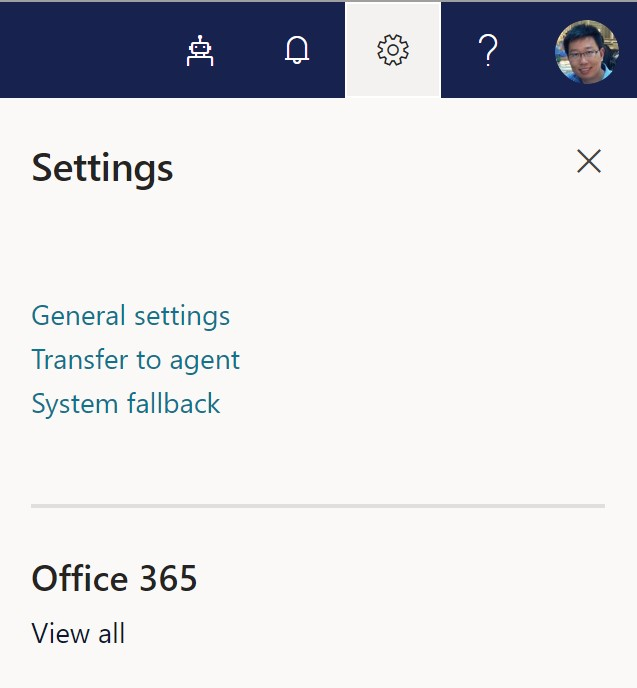
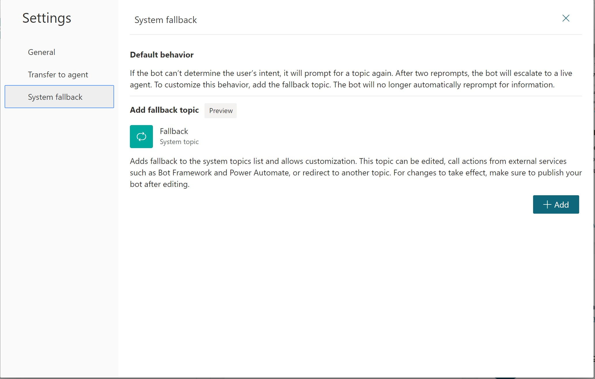
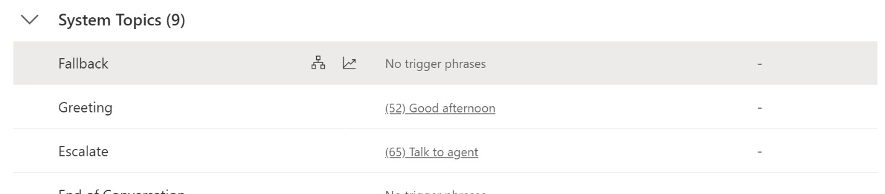
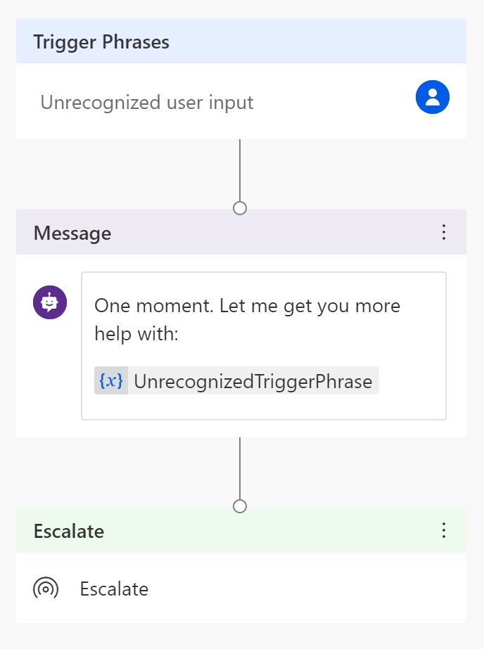
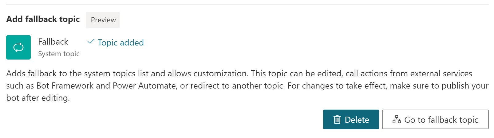

# System Fallback Topic

The bot triggers corresponding topics based on user’s input. If the bot can’t determine the user’s intent, it will prompt for a topic again. After two prompts, the bot will escalate to a live agent.

In some occasions, you may want to customize the bot behavior when no intent is triggered, like building a catch-all topic to capture the unrecognized user intents, using it to call backend systems or route to existing services. In Power Virtual Agents, this can be achieved by adding the System Fallback Topic. 

## Adding System Fallback Topic
1.	Go to **Settings**, open **System fallback**

2.	In the Settings pane, using the **“+Add”** button to Add fallback topic. 

 
After these two simple steps, a system fallback topic is added. The bot will start to route to the system fallback topic when no intent is triggered. You can use the Go to fallback topic button to open and customize the fallback topic. 
 
## Customize fallback topic
After you add the system fallback topic, you can open it using Go to fallback topic button on the settings pane. You’ll also see this Fallback topic listed alongside with other System Topics in the topic list. 

Open this topic in the editing canvas, you’ll see the default fallback topic contains two nodes, a Message node that rephrases the user input and an Escalate node that redirects to a live agent. 

 
You can customize this topic like any other system topic, with one extra information you can leverage - **{x}UnrecognizedTriggerPhrase** variable. The message node in the topic uses it to rephrase user’s input. You can use it as input and pass it to a Power Automate Flow or Bot Framework Skill.

Note - the system fallback topic doesn’t have a trigger phrase. Like other system topics, its trigger phrases are not customizable.  

## Reset system fallback behavior by deleting the fallback topic
To reset system fallback behavior and let it return to its default behavior, go to Settings, open System Fallback. On the system fallback pane, use the Delete button to remove it. 

 
Note - This will remove the Fallback topic and any changes you made to it. 

