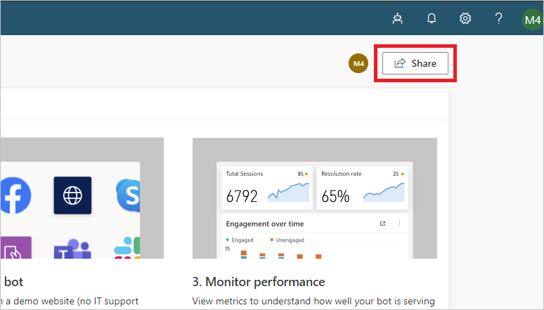
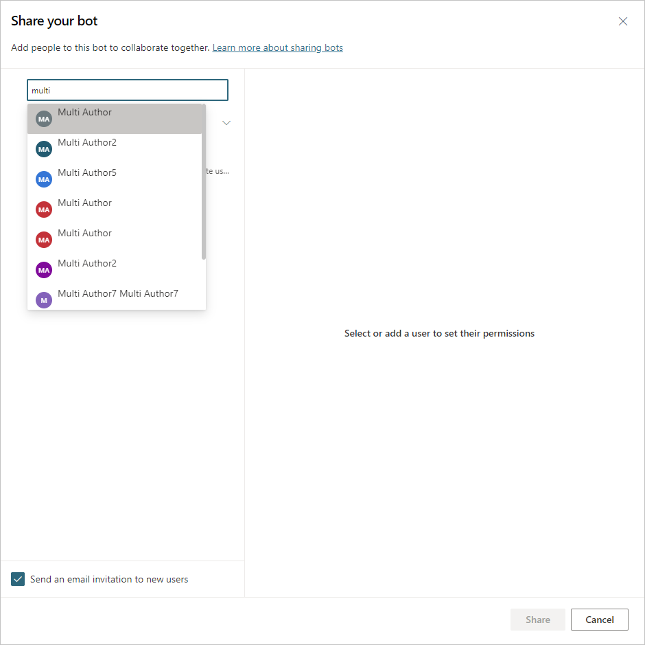
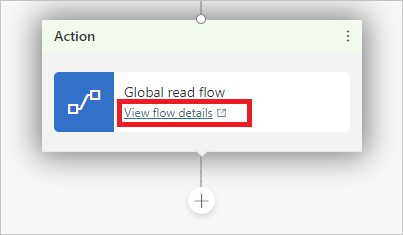
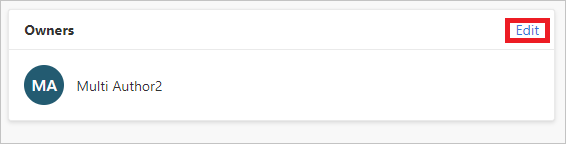
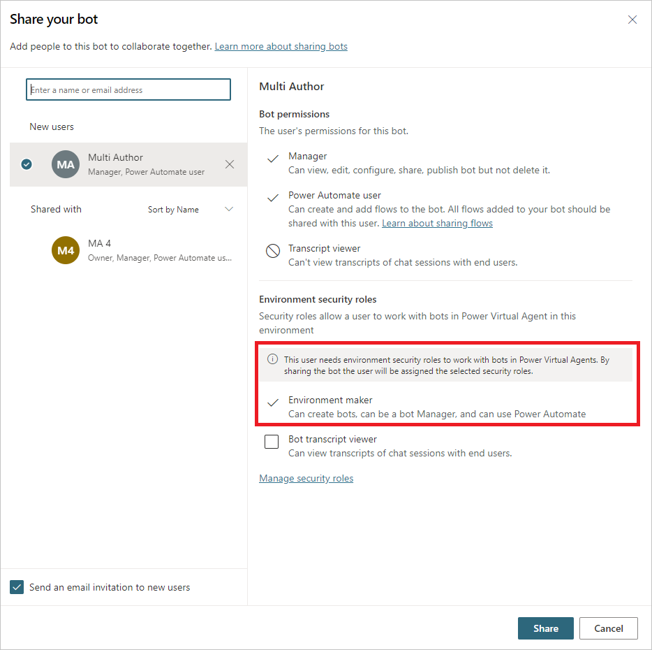
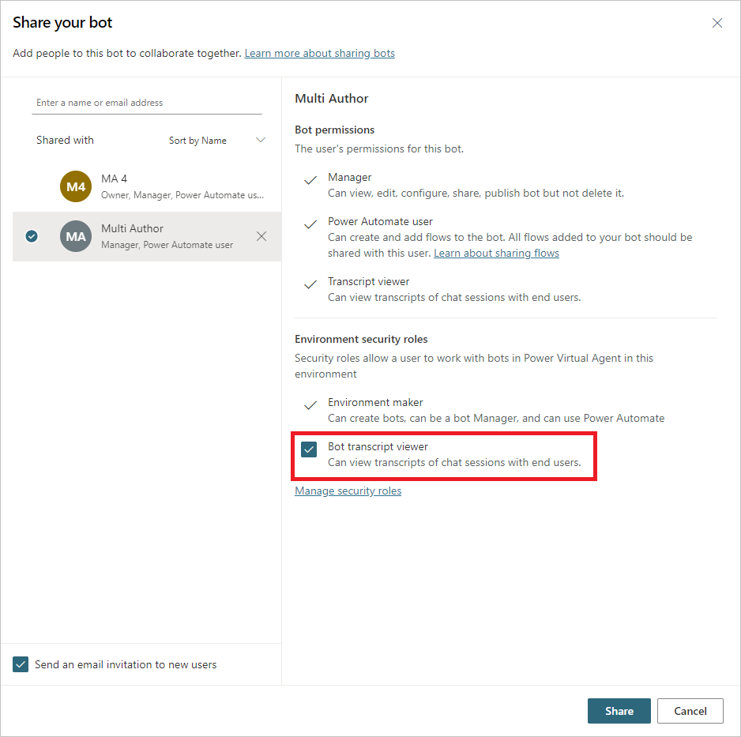

# Share your bot with other users

Share your bot with other users so multiple users can edit, manage, and work together on a bot. 

You can stop sharing a bot with individual users at any time. If you're a **System administrator**, you can also assign additional security roles when sharing a bot.

>[!NOTE]
>You don't need to share a bot with another user for them to chat with the bot.  
>See how to make your bot available for users in the [Key concepts - Publish your bot](publication-fundamentals-publish-channels.md) topic.

## Share a bot

Everyone you share the bot with can view, edit, configure, share, and publish the bot. They can't delete the bot.

>[!NOTE]
>You can only share the bot with users who have Power Platform licenses. Users who don't have a license can [sign up for a free trial](sign-up-individual.md) so they can edit the bot.

1. To share a bot, sign in to Power Virtual Agents and select **Share** at the top of the bot's home page.

    

2. Specify the name or email address of the users that you would like to share the bot with.  

    >[!NOTE]
    >You can only share a bot with individual users, which means you can't share it with a security group or distribution group in your organization.  
    >You also can't share with users or groups outside of your organization.  

    

3. Review the user's permissions.
 

    

4. If you want to let users know you've shared the bot with them, select the **Send an email invitation to new users** check box.

5. Select **Share** to share the bot with the new users.

>[!IMPORTANT]
>It can take up to 10 minutes for the bot to show up in the shared user's bot list if the user [was not previously part of the environment](#assign-additional-environment-security-roles) of the shared bot.

### Insufficient environment permissions

Users in the environment must have the **Environment maker** security role before a bot can be shared with them. 

**System administrators** of the environment will need to assign the **Environment maker** security role to the user before you share the bot. If you're a **System administrator**, you can [assign the **Environment maker** role when you share the bot](#assign-additional-environment-security-roles).

Learn more about [security roles](/power-platform/admin/security-roles-privileges) and [predefined security roles](/power-platform/admin/database-security#predefined-security-roles).
 

### Share Power Automate flows used in bot
You can [add actions to a bot using flows in Power Automate](advanced-flow.md), however flows in a bot aren't automatically shared with other users when sharing a bot. 

Users who don't have access to the flow shared can still run it by using the test bot canvas.

To let other users edit or add flows you'll need to share them in Power Automate. You can open flows directly from the topic where the flow is used.

1. Select **View flow details** to go to the flow's details page in Power Automate.
 
    

2. Select **Edit** in the **Owners** section
 
    

3. Enter the name or email address of the user you want to give editing permissions to.

## Stop sharing a bot

You can stop sharing a bot with a user, and any shared user can stop the bot from being shared with other users, except for the owner. The owner will always have access to the bot.

1. Sign in to Power Virtual Agents and select **Share** at the top of the bot's home page.

2. Select **X** next to the users that you want to stop sharing the bot with.
 
     

3. Select **Share** to stop sharing the bot with the user.

## Assign additional environment security roles

If you're a **System administrator**, you can assign and manage additional security roles when sharing a bot.

The **Environment security roles** section shows when you share a bot and only if  you're a **System administrator**. It lets you share bots with users who don't have sufficient environment permissions to use Power Virtual Agents. 

You must be a **System administrator** of the environment where the bot is located to view and add security roles.

>[!NOTE]
>For full security role management, [use the Power Platform Admin Center](/power-platform/admin/create-users-assign-online-security-roles#assign-a-security-role-to-a-user).  
> Learn more about [security roles](/power-platform/admin/security-roles-privileges) and [predefined security roles](/power-platform/admin/database-security#predefined-security-roles).

### Assign Environment maker security role during bot sharing

You can assign the **Environment maker** security role when sharing a bot with a user who does not have sufficient environment permissions to run Power Virtual Agents.

When [sharing the bot](#share-a-bot), if the specified user does not have sufficient permissions to use Power Virtual Agents in the environment, you'll be notified that **Environment maker** security role will be assigned to the user so they can use the bot.
 

### Assign Bot transcript viewer security role during bot sharing

You can assign the **Bot transcript viewer** security role to users who don't have conversation transcript access when sharing a bot. 

Based on the content and target audience of the bot, you may want to give transcript access only to users who have appropriate privacy training.

>[!IMPORTANT]
>Conversation transcript access is managed by environment security roles. After assigning the **Bot transcript viewer** security role to a user, that user can access conversation transcripts for all bots that they create or are shared with in the environment.  
>In the default environment, every user has the **Bot transcript viewer** role assigned by default. We recommend you create an environment for bots that controls which user can view conversation transcripts.

When [sharing the bot](#share-a-bot), you can assign the **Bot transcript viewer** role by selecting the check box.
 

 
### Manage security roles
You can [manage environment security roles at the Power Platform admin center](/power-platform/admin/database-security#assign-security-roles-to-users-in-an-environment-that-has-a-common-data-service-database). 

