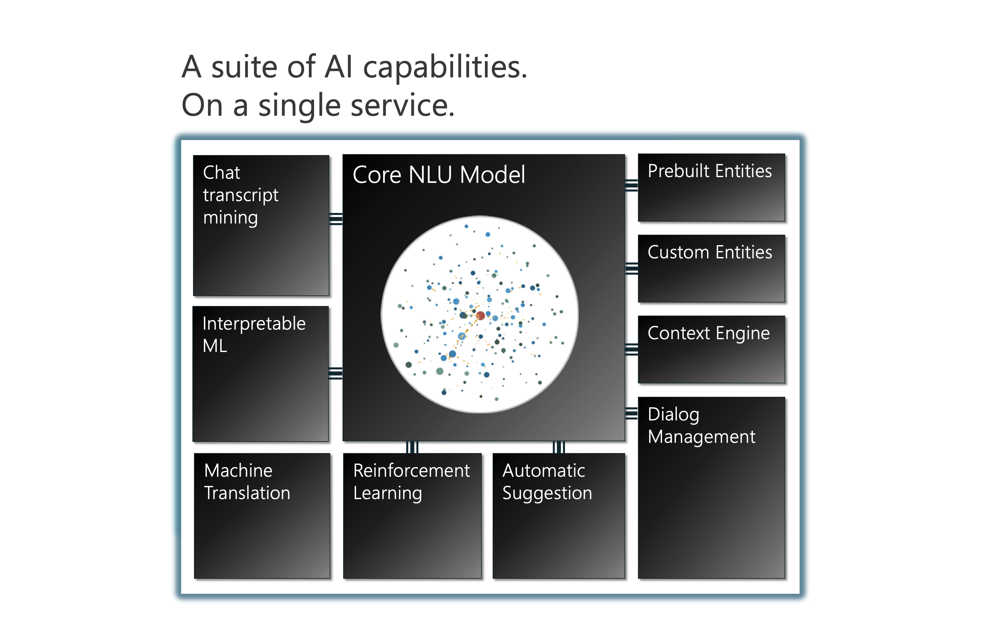
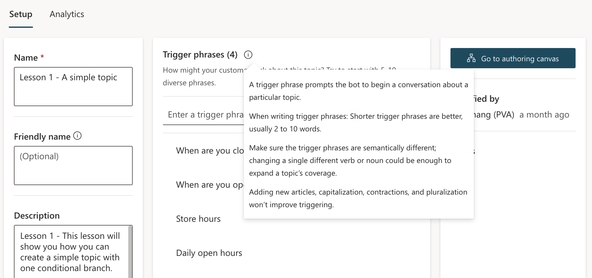
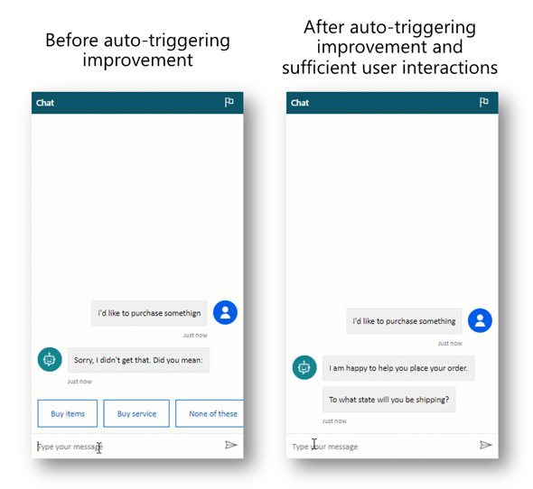
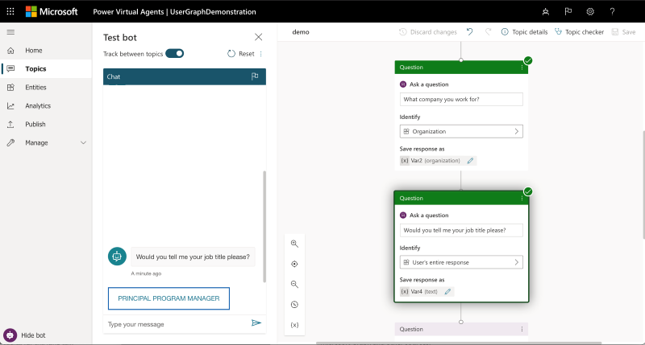

# AI capabilities in Power Virtual Agents

## AI models in Power Virtual Agents - background

Power Virtual Agents hosts multiple AI models and AI capabilities on a single service, the core of which is a transformer-based natural language understanding (NLU) model.

Traditionally, intent triggering (how an AI model determines the intent of a question posed to it, by using NLU to understand what a user is asking) is formalized as a multi-class classification problem, in which the model is highly associated with known categories; any change to these categories will result in the need to build a new AI model. 

Power Virtual Agents, however, employs a language understanding model that uses an example-based approach, powered by a deep neural model. This type of large-scale model only needs to be trained once with large amounts of data using AI supercomputing, and can then be used for specific tasks with few examples without further training. The use of this model is part of the [AI at Scale](https://innovation.microsoft.com/en-us/ai-at-scale) initiative by Microsoft, and means the way AI is developed and used is changing. Specifically for Power Virtual Agents, the use of this model allows for an intuitive way for bot makers to work on their bot content confidently, without having to involve AI experts. 

The use of this type of model means that in Power Virtual Agents, when you craft trigger phrases for a topic, you only need to provide a few examples, usually in the range of five to 10 phrases for a single topic. 
Shorter trigger phrases are better, and you should aim for two to 10 words. You just need to make sure trigger phrases are semantically different: changing a single verb or noun could be enough to expand a topic's coverage. Adding things like new articles (changing or adding 'the' or 'a' or 'an'), changing capitalization, adding contractions (you're or don't), or adding plurals won't improve the triggering because contractions are already accounted for in the AI model.

These tips for creating tooltips are described in the tooltip associated with the **Trigger phrases** section on a topic's **Details** page.

There are some specific features that further improve how the AI in Power Virtual Agents understands what your bot users are asking, and how the AI provides answers.

>[!NOTE]
>The AI capabilities listed in this topic are in preview, available to bots created with English as the set language.

## Topic overlap detection (preview)

Topic overlap detection helps improve topic triggering accuracy by finding overlaps between topics. Resolving topic overlaps can help reduce the need for the bot to ask clarifying questions before triggering a topic.

[Once enabled](#enable-or-disable-ai-capabilities), go to **Analytics** on the side navigation pane, then go to the **Topic triggering (preview)**, where a list of overlapped topics will be displayed.

:::image type="content" source="media/advanced-ai-features/overlapped-topics.png" alt-text="Screenshot showing the overlapping topics tile lists topics with their similarity score.":::

The list shows each overlapping topic along with a similarity score, which represents the overall overlapped status for a topic, and the number of topics that overlap with the listed one.

You can sort the list by its similarity score, topic name, or number of trigger phrase overlaps.

If you click on an item in the list, the **Topic overlap details** pane will open.

:::image type="content" source="media/advanced-ai-features/topic-overlap-details.png" alt-text="Screenshot of the Topic overlap details pane showing overlaps related to Microsoft 365 language topics.":::

In this example, there's one trigger phrase in the "Languages support in Microsoft 365?" topic (*For which languages is Microsoft 365 available?*) that semantically overlaps with a trigger phrase in the "Use Microsoft 365 in other languages?" topic (*Can I use Microsoft 365 in languages other than the one I originally purchased?*). Here, the AI has determined that both trigger phrases are semantically similar (they contain similar phrases, words, and grammar).

Using semantically similar trigger phrases for two different topics can lead to confusion as the bot may not know which topic to open, and will need to ask follow-up questions to the bot user.

Identifying semantically similar trigger phrases can also help you determine if you have topics that themselves are similar and could be consolidated to simplify the bot authoring process, or edited to make the topics more distinct.

On the **Topic overlap details** pane, you can select the link to go directly to the specific topic. You can also make changes to the trigger phrase (or delete it) directly on the **Topic overlap details** pane. Select **Save** to apply any changes.

After you save the changes in the **Topic overlap details** pane, the overlapping status will automatically be refreshed. You can always manually refresh the topic overlap status by selecting the refresh button on the topic overlap UI.

:::image type="content" source="media/advanced-ai-features/refresh-overlays.png" alt-text="Screenshot of the refresh icon, which looks like an arrow bent into a circle.":::

## Topic suggestion from chat transcripts (preview)

This feature analyzes sessions between your bot and users and surfaces suggestions for you based on unmatched user input.

[Once enabled](#enable-or-disable-ai-capabilities), go to **Analytics** on the side navigation pane, then go to the **Topic triggering (preview)**. A list of potential topics will be shown, with the number of times a query about this topic was made by users of the bot.

:::image type="content" source="media/advanced-ai-features/topic-suggestions.png" alt-text="Screenshot of the Topic suggestions tile showing a list of suggestions.":::

The topic suggestion analyzer automatically runs once every one to two hours. It scans through all new queries made since the analyzer last ran, groups together queries to which it couldn't match an existing topic, and presents them in the list. Your bot will need at least 100 new conversations (from the last time any suggestion was generated) to trigger the process, and only those suggestions with more than three user sessions will be shown.

When you click on an item in the suggestion list, a topic suggestion window will appear, showing the topic with some suggested trigger phrases. The suggested trigger phrases are based on the queries made by the bot users that couldn't be matched to an existing topic.

After reviewing the suggested trigger phrases, you can choose to delete the entire suggested topic (for example, if it's irrelevant to the bot) or add it to your list of topics by selecting **Add to topics**.

:::image type="content" source="media/advanced-ai-features/topic-editing.png" alt-text="Screenshot of the topic editing window.":::

## Automatic triggering improvements (Preview)

[Once enabled](#enable-or-disable-ai-capabilities), the automatic triggering feature improves intent triggering by using AI to automatically generate new trigger phrases by analyzing previous bot traffic. 

With the continuous learning in Power Virtual Agents provided by this feature, each conversation will make the next one better - using reinforcement learning and signals from responses to "Did you mean" questions: when the bot is unsure of the bot user's response it will ask a clarifying question. The bot then learns automatically from the bot user's responses and will not have to ask again. 

Over time, as users interact and talk to the bot, it will get better and better.

In the following screenshot, the first time the bot comes across a question it doesn't understand, it asks for clarification. 

On the left side of the image, a bot user asks "I'd like to purchase somethign", to which the bot says "Sorry, I didn't get that. Did you mean:" and then provides a few options such as "Buy items" and "Buy service". In this case, the bot user selected "Buy items".

The next time someone asks the same question, the bot doesn't ask for clarification – it knows from previous interactions what the bot user is likely asking to buy items, so it goes straight into the purchasing topic, replying to the question "I'd like to purchase somethign" with "I am happy to help you place your order. To what state will you be shipping?".
In this example, it also understands the misspelling of "somethign" to mean "something", so it's able to carry over the improved intent triggering even though the bot user's question is spelled differently.

## Conversation personalization (Preview)

[When this feature is enabled](#enable-or-disable-ai-capabilities), the bot will reuse information from Microsoft Graph and Azure Active Directory (Azure AD) throughout the course of a conversation. This feature allows the bot to use already existing information to enhance and personalize future conversations. For example, if a user mentions a name, email, or zip code these properties are stored and used in later conversations without having to reprompt the user. 

Specifically, with this feature enabled, when the bot asks questions such as those in the following table, the corresponding user information will be pulled from Microsoft Graph and Azure AD (for authenticated users) and provided as prompts for the user to choose as an option. 

| Sample bot questions | User property automatically filled from Microsoft Graph or Azure AD |
|-------------------------|-------------------------|
| <ul> <li>`Where do you live?`</li> <li>`For assistance with this matter you'll need to provide your address.`</li> <li>`Thank you for that. Please give me 2-3 minutes to review your previous case. May I know your address?`</li> </ul> | Address |
| <ul> <li>`OK. I'll need you to enter your annual income in order to assist.`</li> <li>`OK. Can I get your annual income so I can help with that?`</li> </ul> | Annual income |
| <ul> <li>`I'll help if I can. Would you tell me when you were born please (day/month/year)?`</li> <li>`What is your date of birth?`</li> <li>`Could you give me your date of birth, please?`</li> </ul> | Date of birth |
| <ul> <li>`I can help you out with that. What's your business phone number so I can go ahead?`</li> <li>`Will proceed if you please provide your work phone number to contact you?`</li> </ul> | Business phone number |
| <ul> <li>`Can you supply your city of residence?`</li> <li>`Please provide your city of residence.`</li> <li>`I agree. I'd like to know your city of residence to continue. Please tell me what city you're in.`</li> </ul> | City of residence |
| <ul> <li>`OK, no problem. Can you tell me the country where you live?`</li> <li>`Let me assist you with your concern regarding your DVD. Before we proceed, please provide me with the country you are in.`</li> </ul> | Country of residence |
| <ul> <li>`For assistance with this matter you'll need to provide your email address.`</li> <li>`Tell me the e-mail address where I can contact you.`</li> </ul> | Email address |
| <ul> <li>`Please tell me: what is your fax number?`</li> <li>`Alright. Go ahead and enter your telefax number for me please.`</li> </ul> | Fax number |
| <ul> <li>`I'd be glad to help you with that. By the way, may I ask for your first name so that I can address you properly?`</li> <li>`Please enter your name for me.`</li> <li>`What's your first name?`</li> </ul> | First name |
| <ul> <li>`For assistance with this matter you'll need to provide your gender.`</li> <li>`Sure, I can assist with that. What is your gender?`</li> <li>`Please enter your gender.`</li> </ul> | Gender |
| <ul> <li>`What is your home phone number?`</li> <li>`Please provide your home phone number.`</li> </ul> | Home phone number |
| <ul> <li>`I'll help if I can. Would you tell me your job title please?`</li> <li>`Sure, I'd be glad to help. Please enter your career title to proceed.`</li> </ul> | Job title |
| <ul> <li>`Might I know your last name in order to proceed?`</li> <li>`I see. Allow me to review this case number. Can you also tell me your last name for me to address you properly?`</li> </ul> | Last name |
| <ul> <li>`I'll see if I can help. Could you please enter your director's name?`</li> <li>`I'll help you if I can. could you tell me your principal's name, please?`</li> <li>`What is your manager's name?`</li> <li>`Please share the name of your supervisor.`</li> </ul> | Manager's name |
| <ul> <li>`Wondering if you would please provide your conjugal status?`</li> <li>`To assist you I'll need you to enter your marital status.`</li> </ul> | Marital status |
| <ul> <li>`Wondering if you would please provide your middle name?`</li> <li>`I'd be glad to help you with that. By the way, may I ask for your middle name so that I can address you properly?`</li> </ul> | Middle name |
| <ul> <li>`Could you please provide me with your mobile phone number?`</li> <li>`It's not a problem. I'll just need your cell phone number please.`</li> </ul> | Mobile phone number |
| <ul> <li>`I'll need your nickname please?`</li> <li>`It's my pleasure to assist. Can you inform me of your nickname?`</li> </ul> | Nick name |
| <ul> <li>`Sure. To help with that, I'll need you to specify how many children you have please.`</li> <li>`Please indicate the number of children you have.`</li> </ul> | Number of children |
| <ul> <li>`I'll see if I can help. Will you be able to enter your partner's full name?`</li> <li>`Please tell me your spouse's first name.`</li> <li>`Can you give me the first name of your husband or wife, please?`</li> </ul> | Spouse/partner name |
| <ul> <li>`Can you please tell me what your state of residence is?`</li> <li>`I can help you out with that. What's your state of residence so I can go ahead?`</li> </ul> | State/province of residence |
| <ul> <li>`Wondering if you would please provide your zip code?`</li> <li>`I can help you out with that. What's your zip code so I can go ahead?`</li> </ul> | Zip code |

## Enable or disable AI capabilities

To use these advanced AI capabilities in Power Virtual Agents:

1.  Open a bot you want to enable or disable the features for.

2.  Expand **Manage** on the side navigation pane, then go to the **AI
    capabilities** tab.

3.  For each feature, select the checkbox to turn the feature on or off.

4.  Select **Save** at the top of the tab.

:::image type="content" source="media/advanced-ai-features/enable-features.png" alt-text="Screenshot showing the new AI capabilities section under the Manage tab.":::

[!INCLUDE[footer-include](includes/footer-banner.md)]
