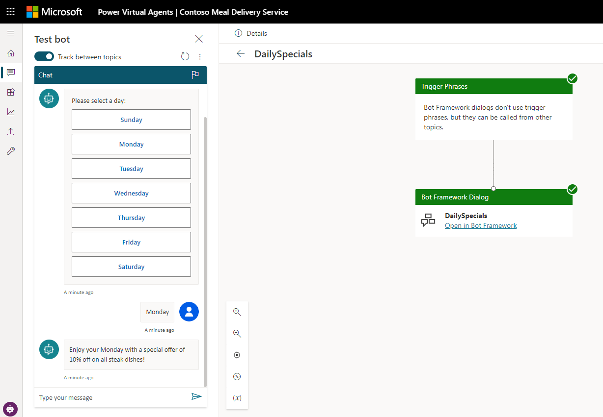

# Example 2 – Display a multi-select options list in Power Virtual Agents 

You can enhance your bot by developing custom dialogs with [Bot Framework Composer](/composer/) and then adding them to your Power Virtual Agents bot. 

In this example, you'll learn how to display a multi-select list in Power Virtual Agents by using Composer.

Before you begin, ensure you read [Extend your bot with Bot Framework Composer](advanced-bot-framework-composer.md) to understand how Composer integrates with Power Virtual Agents.


>[!IMPORTANT]
>Bot Framework Composer integration is not available to users who only have the [Teams Power Virtual Agents license](requirements-licensing-subscriptions.md). You must have a [trial](sign-up-individual.md) or full Power Virtual Agents license.


## Prerequisites

- See how to [Extend your bot with Bot Framework Composer](advanced-bot-framework-composer.md)
- Follow the instructions for [Example 1 - Show an Adaptive Card in Power Virtual Agents](advanced-bot-framework-composer-example1.md)
- [Introduction to Bot Framework Composer](/composer/introduction)
- [!INCLUDE [Medical and emergency usage](includes/pva-usage-limitations.md)]


## Display a multi-select options list 

Using Composer, you can create a multi-select options list to be used in your chatbot.

Open the Power Virtual Agents bot used in [Example 1](advanced-bot-framework-composer-example1.md) and select the **Open in Bot Framework Composer** option on the **Topics** page under **+ New topic** to open the bot in Composer. 

While on the **Create** tab in Composer add another Bot Framework dialog. Name your new dialog **DailySpecials** in Composer.

In your new **DailySpecials** dialog in Composer, go to **Manage properties** and select **Set a property** to create a new Composer property in the dialog.
Give this property the following name in the **Set a property** panel on the right:

```JSON
conversation.days_array
```
In the **Value** field in the **Set a property** panel, change the type to **\[\]** to indicate that this property is going to be an array. Enter the following data into the **Value** field to create an array populated with days of the week:

```JSON
["Sunday", "Monday", "Tuesday", "Wednesday", "Thursday", "Friday", "Saturday"]
```


Next, go to the **Bot Responses** tab in Composer and select **DailySpecials**. Select **Show code** and add the following template to the **Bot Responses** tab for **DailySpecials** to create daily offers for all the days of the week:

```JSON
# DailySpecials(day)
- SWITCH: ${day}
- CASE: ${0}
    - All tofu meals are 10% off on Sundays!
    - Every Sunday, all tofu entrees are 10% off.
- CASE: ${1}
    - All steak options are 10% off on Mondays!
    - Enjoy your Monday with a special offer of 10% off on all steak dishes!
- CASE: ${2}
    - All the chicken meal options are 10% off on Tuesdays!
    - Tuesday special is 10% off on all the chicken dishes!
  - CASE: ${3}
    - All the chicken and tofu meal options are 10% off on Wednesdays!
    - Wednesday special is 10% off on all the chicken and tofu dishes!
  - CASE: ${4}
    - On Thursdays, get a free delivery in Seattle, Bellevue, and Redmond on all orders over $80!
    - Thursday special is a free delivery on orders over $80 in Seattle, Bellevue, and Redmond.
- CASE: ${5} 
    - Friday special - get a 10% discount on all dishes and delivery is free on all orders over $80!
    - Every Friday, we offer 10% off on all meals and a free delivery on orders over $80!
- CASE: ${6}
    - On Saturdays, we have a free delivery on all orders over $50.
    - Free delivery on all orders over $50 on Saturdays!
- DEFAULT:
    - Holiday special - free delivery anywhere in Seattle, Bellevue and Redmond on orders over $70 today!
    - Holiday Delivery is on us if you are in Seattle, Bellevue and Redmond and your order is over $70 total!
```


Go back to the **Create** tab in Composer and select **BeginDialog** under **DailySecials**. 

Add a new prompt for user input to this dialog by selecting **Multi-choice** under the **Ask a question** menu option.


Enter the following for the **Text** prompt:
`Please select a day:`


Select the **User Input (Choice)** action. In the **Prompt with multi-choice** panel, under **User Input**, set **Property** to **conversation.day_choice**. 

Set **Output format** to **index** to return the index of the selected option instead of a value.


Next, scroll down the **Prompt with multi-choice** panel and set **List style** to **heroCard** to display our options list vertically. 

Select **Write an expression** for the **Array of choices** field and set it to use the **conversation.days_array** property we created.


You have created a multi-choice option list that is based on **conversation.days_array** and stores the user selection into the **conversation.day_choice** property.

You can use this **conversation.day_choice** property to display the daily special for the selected day. 

Select **Show code** and add a **Send a response** action to your **DailySpecials** dialog under the **User Input** action. Add the following expression in the **Language Generation** panel on the side:

```JSON
- ${DailySpecials(conversation.day_choice)}
```


Go to the **Create** tab in Composer and navigate to the Power Virtual Agents **main (root) dialog**. This dialog is the top-level read-only dialog in Composer that you created when you opened your bot in Composer. Choose the **Add new trigger** option on the actions menu.


Set the type of trigger to **Intent recognized** and name it **Specials**. Add the following trigger phrases for your intent and select **Submit**.

```JSON
-what specials do you have
-any special deals
-do you have discounts
```


A new trigger **Specials** will be created. Select **Begin a new dialog** under **Dialog management** to create a node that can call another dialog. Select to call **DailySpecials** in the **Begin a new dialog** panel on the side:


You are now ready to add your Composer content to your Power Virtual Agents bot. Go to the **Publish** tab in Composer and publish it to your Power Virtual Agents bot.

Once your new Composer content is successfully published, go to the Power Virtual Agents **Topics** page to verify that your new Composer content has been uploaded correctly. In your **Topics** list, you can see the new **Specials** and **DailySpecials** content that you have created in Bot Framework Composer.

>[!NOTE]
>You might need to refresh your **Topics** page in Power Virtual Agents to see the new content that has been uploaded from Composer. 


Make sure **Track between topics** is turned on, and test your new bot content by entering the following text in the **Test bot** pane in Power Virtual Agents to start a conversation:

- **Do you have any specials?**




[!INCLUDE[footer-include](includes/footer-banner.md)]
