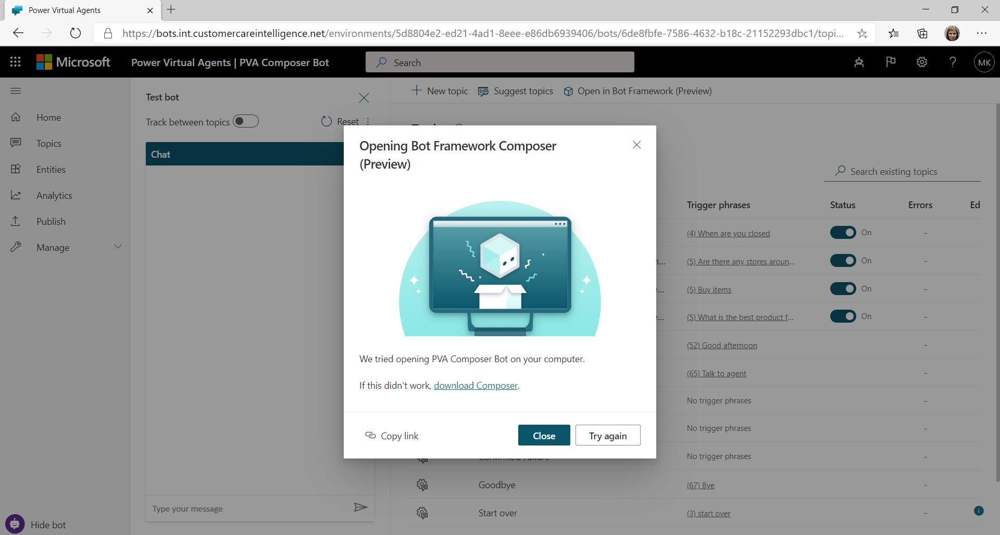
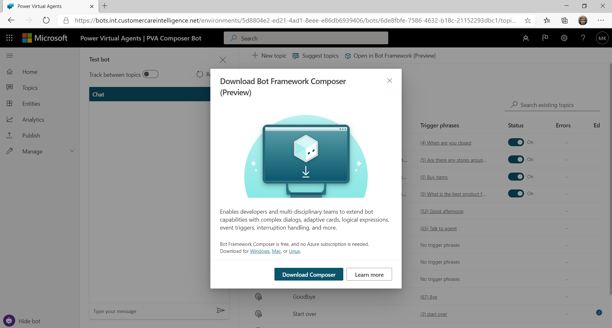
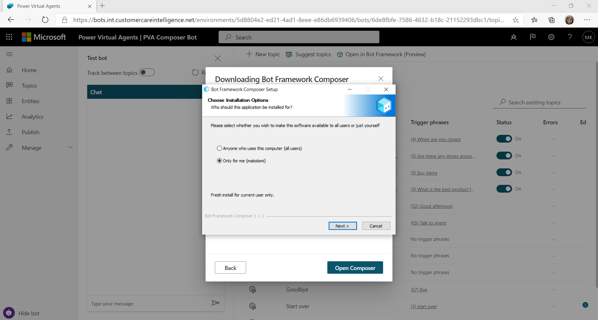
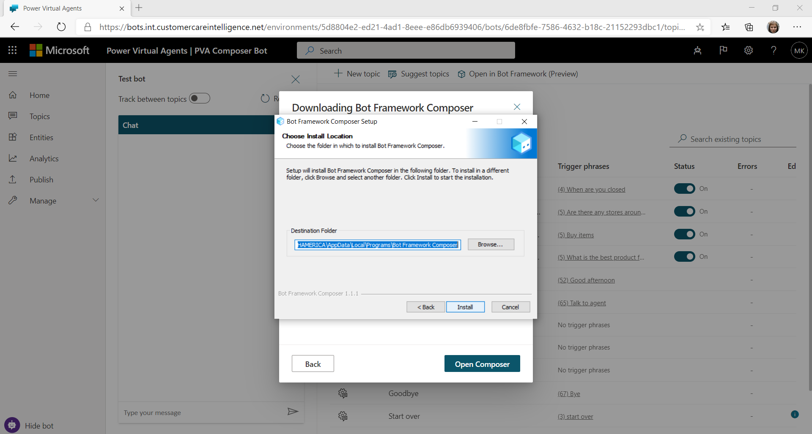
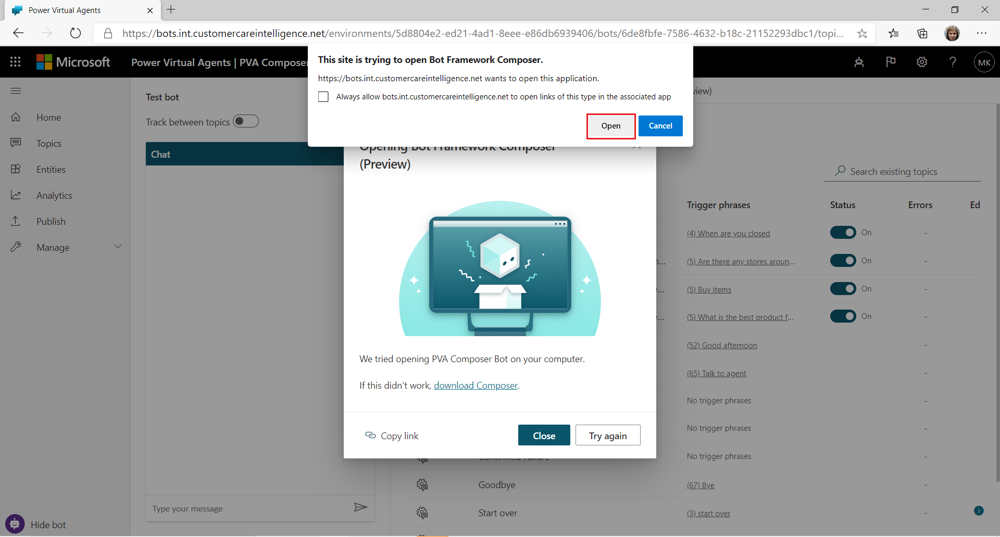
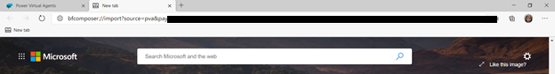
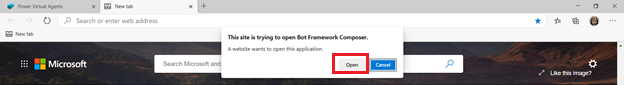

# Extend you bot with Bot Framework Composer
You can enhance your bot by developing custom dialogs using Bot Framework Composer tool and adding them to your Power Virtual agents bot.  Bot Framework Composer tool is integrated into Power Virtual Agents to allow developers and business users to build bots together.
Bot Framework Composer can extend your Power Virtual Agents bot with such Bot Framework functionality as Adaptive Dialogs, Language Generation (LG), Regular Expressions (RegEx), Adaptive Cards and more. 
Using Bot Framework Composer integrated with Power Virtual Agents, you will be able to access conversational memory and context, including the variables defined in Power Virtual Agents. You could create event-driven dynamic dialogs to handle interruptions, cancelations and context switching. Adding Adaptive Cards in Bot Framework Composer will enable you to display interactive elements like images and videos, forms and more in the bot. 
You can also use a variety of pre-build functions and expressions in Composer and define multiple variations of a phrase for the bot to select at random at runtime.
Custom dialogs added via Bot Framework Composer tool are deployed, hosted and executed together with the rest of Power Virtual Agents bot content and do not require any additional Azure hosting.

[!IMPORTANT]
Bot Framework Composer integration feature is not available to users who only have Teams Power Virtual Agents license. Bot Framework Composer integration feature is only included with a full Power Virtual Agents trial or Production license. 

## Prerequisites
[Learn more about what you can do with Power Virtual Agents](fundamentals-what-is-power-virtual-agents.md) 
[Introduction to Bot Framework Composer](https://docs.microsoft.com/en-us/composer/introduction)

## Access Bot Framework Composer from Power Virtual Agents Topics page
1.	Go to the **Topics** tab for the bot you want to edit.
2.	Select the **Open in Bot Framework Composer (Preview)** button on the top menu.

3.  Click on the button to open or download Bot Framework Composer.

## Download and Install Bot Framework Composer 
Using **Open in Bot Framework Composer (Preview)** will open a Bot Framework Composer info window in Power Virtual Agents. If you do not have Composer installed on your computer, you can do so from this window.

Clicking on **download Composer** link will lead you to a **Download confirmation** window where you can learn more about Composer, an open source Bot Framework development studio that can be used to extend Power Virtual Agents with custom dialogs.

Click on **Download Composer** button to start the download process. After your download is complete, click on the downloaded file to start the installation:

Go through the install wizard to install Bot Framework Composer on your computer:

Click **Next** to proceed with installation and select the location for Bot Framework Composer application. Then click on **Install** button to start the installation.

Unselect **Run Bot Framework Composer** button, since you will need to open Composer application from within Power Virtual Agents tobe able to use it with your bot. Then, click **Finish** button to close the installation wizard.

Go back to Power Virtual Agents **Topics** page. You can now click on **Open in Bot Framework Composer (Preview)** button to open your Bot Framework Composer. 

## Open Bot Framework Composer from Power Virtual Agents
You should always open Bot Framework Composer from within Power Virtual Agents bot i you plan to create content for Power Virtual Agents bots. This will ensure that Composer instance that opens contains all the necessary plugins needed for integration with Power Virtual Agents. 
You can open Composer from the **Topics** page in Power Virtual Agents using **Open in Bot Framework Composer (Preview)** button. Power Virtual Agents will attempt to launch your Composer application from the browser. You might need to grant your permission to do so:

>[!NOTE]
> In some cases, a firewall might be blocking some features in Composer and you might need to explicitly allow access.

Bot Framework Composer application window is now open. If you are opening Composer from this Power Virtual Agents for the first time, you need to specify the **Name** (alphanumeric, no spaces or special characters) for your Composer project.  You can skip this step if you already have a bot project for this bot my selecting **Cancel** in this step.

Your Power Virtual Agents bot is now open in Composer and you are ready to start developing.

In some cases, Power Virtual Agent might be unable to launch Composer application automatically. However, you can always launch it manually from your browser.
Use **Copy Link** feature to copy the link to the Composer.

Then, paste it in the new tab in your browser and press enter to launch Composer manually:

Give the browser permission to open Bot Framework Composer, if needed:

## Creating bot content for Power Virtual Agents in Composer
When opened from Power Virtual Agents bot, Bot Framework Composer application launches a bot project on you compter and loads up your bot content into it.
The **main (root) dialog** in your Composer project is the same as the project name you gave it. It corresponding to your Power Viurtal Agents bot content. In this example below, your **main (root) dialog** is **PVA_Composer_Bot**: 

There are few key guidliens to follow when using Composer, Bot Framework open-source visual authoring canvas, to create your bot content for Power Virtual Agents.  
•	You cannot edit Power Virtual Agents topics in Composer; this content is read-only in Composer. However, you can create and add content to Power Virtual Agents in Composer.

•	You can add new **Bot Framework triggers** of any kind to your **main (root) dialog**. However, the structure of **triggers** added to the **main (root) dialog** should be kept as simple as possible. **Send a reponse**, **Ask a question** or any actions that contain **Langauge Generation** cannot be used in **triggers** added to **main (root) dialog**. Doing so will result in validation errors and prevent your from publishing your Composer content to Power Virtual Agents.

•	You can create and new **Bot Framework dialogs** and add **events** and **triggers** of any kind to them. **Send a response**,**Ask a question** and **Langauge Generation** can be used in **triggers** that belong to the new **dialogs**

•	In **Bot Reponses** tab, the **main (root) dialog** section should be empty. Having any assets there will result in validation errors and prevent your from publishing your Composer content to Power Virtual Agents.

•	In **Bot Responses** tab, **All** section should be empty (i.e: **Common.lg** file should be empty). Having any assets there will result in validation errors and prevent your from publishing your Composer content to Power Virtual Agents.

•	All **Language Generation** and **Language Understanding** files should have the corresponding **dialogs**. For example, if you have only one **dialog** with name **dialog1**, then you can have **dialog1.en-us.lg** and **dialog.en-us.lu**, but you cannot have **extra.en-us.lg**.

•	The **main (root) dialog** in Composer should never be deleted, as it correspoonts to Power Virtual Agents bot. The **main (root) dialog** can have 0 or more **triggers**.

For a deep-dive on Bot Framework Composer **dialogs**, **events**, **trigers** and how to create advanced bot content with Bot Framework, please refer to the following resources:

[Bot Framework Composer dialogs](https://docs.microsoft.com/en-us/composer/concept-dialog) 
[Bot Framework Composer events and triggers](https://docs.microsoft.com/en-us/composer/concept-events-and-trigger) 
[Language Generation](https://docs.microsoft.com/en-us/composer/concept-language-generation) 
[Conversation flow and memory](https://docs.microsoft.com/en-us/composer/concept-memory) 

