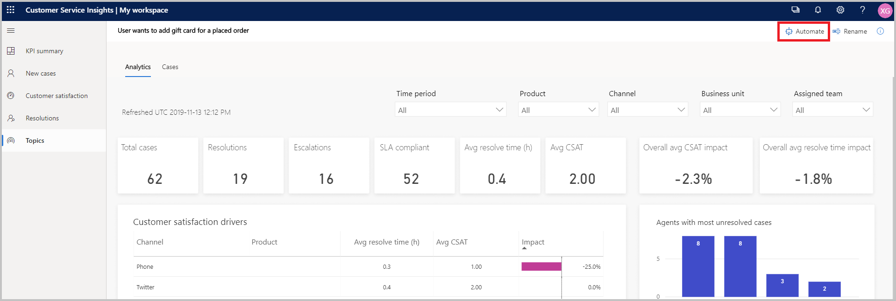
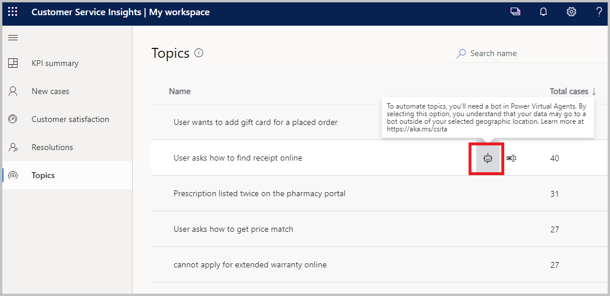

# Create bot topics from Customer Service Insights

If you use [Dynamics 365 Customer Service Insights](/dynamics365/ai/customer-service-insights/overview), you can automatically create new [topics](authoring-create-edit-topics.md) in Power Virtual Agents based on your existing [Customer Service Insights support topics](/dynamics365/ai/customer-service-insights/topics-page).

You should review [recommendations for identifying topics for automation](/dynamics365/ai/customer-service-insights/automate-topics#identify-topics-for-automation) in the Customer Service Insights documentation library before you begin.

## Prerequisite to automate topics

You must have the following to automate a topic from Customer Service Insights to Power Virtual Agents:

- A valid license to access Power Virtual Agents. Go to https://aka.ms/TryPVA for more information and to sign up for a trial. 

- A [bot created in Power Virtual Agents](authoring-first-bot.md).

## Automate topics from the topic details page

After reviewing topic details and identifying a candiate for automation, you can automate the topic right away from the topic details page:

1. In the topic details page, select **Automate** at the top. 

    

2. Customer Service Insights creates a new topic in Power Virtual Agents in a new browser tab. 

    The **Name** and **Trigger phrases** are prefilled from the topic you selected for automation. 
    
    Customer Service Insights prefills **Trigger phrases** with non-duplicated case titles from the most relevant cases (up to three cases). 

3. Review the topic name and trigger phrases, and follow the other steps in the [Create custom topics for your bot](/power-virtual-agents/getting-started-create-topics) article to complete the creation of your bot topic. 

## Automate topics from the Topics page
You can also automate topics from  the Topics page: hover over the topic you want to automate in the topic list, then select the **Automate** icon. 

