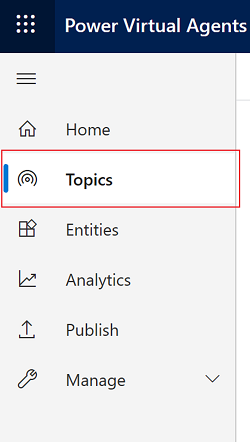
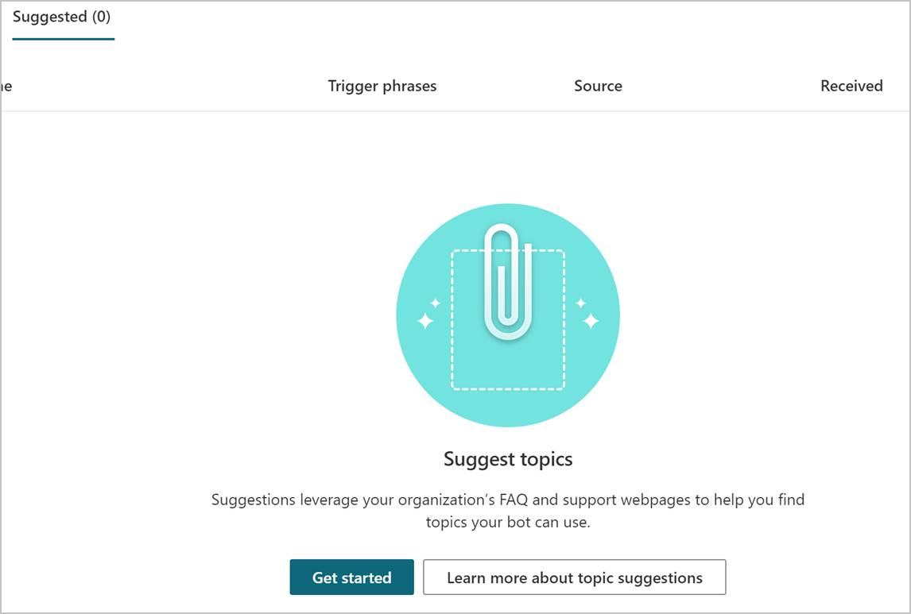
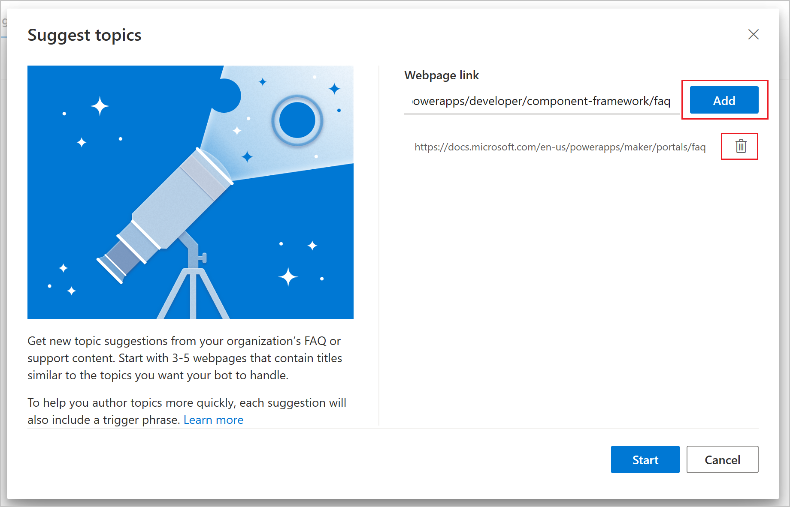
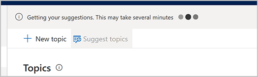
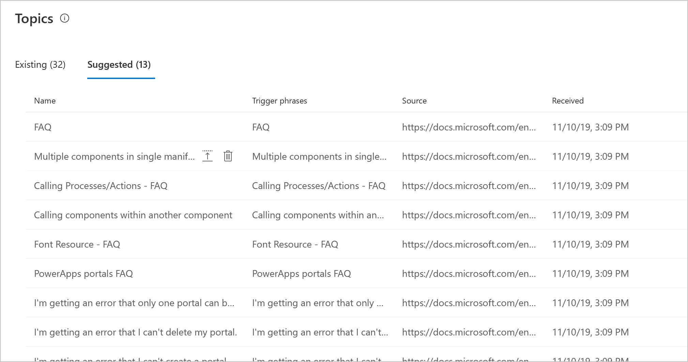
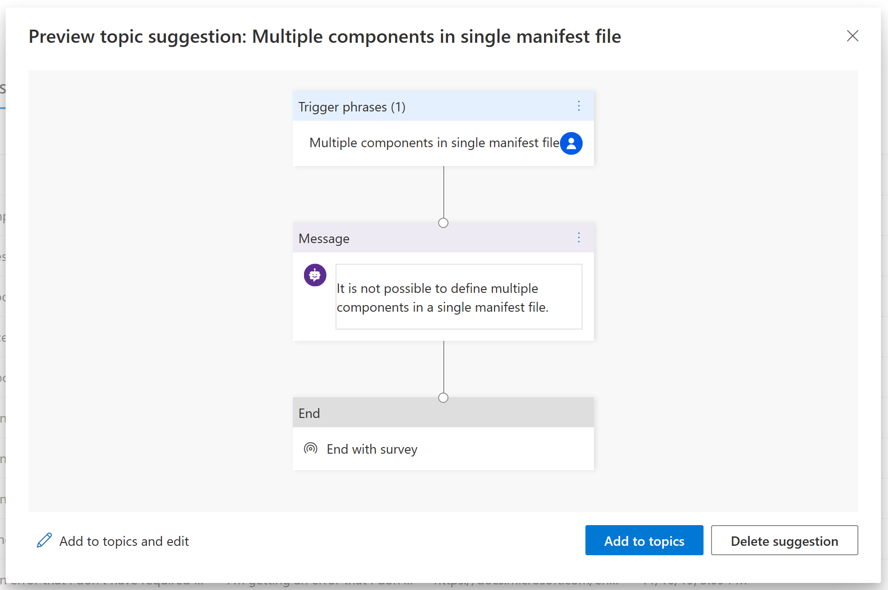
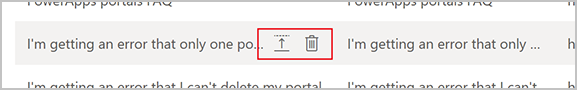
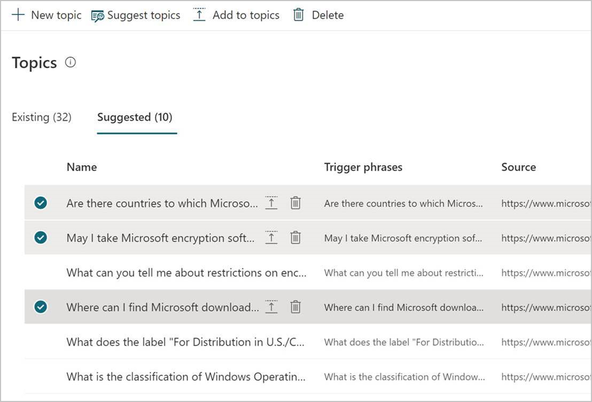
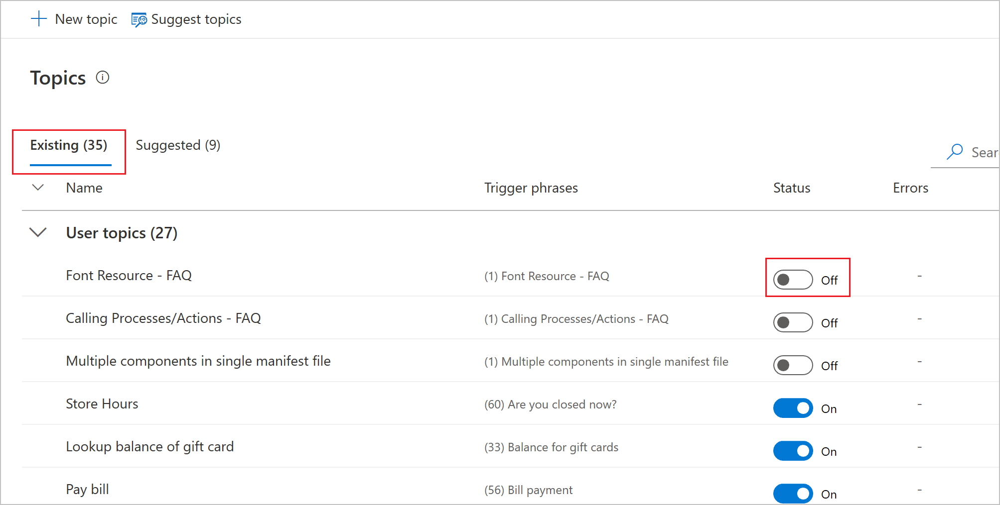

# Create topics from existing support content on the web

You can use content from existing webpages when creating a Power Virtual Agents bot. This is useful if you already have help or support content, such as FAQ pages or support sites. 

Rather than copying and pasting or manually re-creating this content, you can use AI-assisted authoring to automatically extract and insert relevant content from existing web content into your bot.

The AI determines the structure and content on a webpage, isolates content blocks that pertain to a support issue or question, and then classifies them into topics. Lastly, the AI identifies the [**Trigger phrase** and **Message** node](authoring-create-edit-topics.md) for each topic.

There are three main steps to using the feature: 

1. Use the **Suggest topics** command to extract content from FAQ or support pages.
2. Add the suggested topics to your bot.
3. Enable the topics.

You can [test the topics in the test chat](authoring-test-bot.md), but you'll need to [publish your bot for customers](publication-fundamentals-publish-channels.md) to see the latest changes.

>    
> [!VIDEO https://www.microsoft.com/en-us/videoplayer/embed/RE4mNOt]

## Prerequisites

- [!INCLUDE [Medical and emergency usage](includes/pva-usage-limitations.md)]

## Extract content from webpages

To get suggestions from webpages, you first need to extract suggestions for topics from the pages you want to use that contain support content.

After the extraction is complete, you'll be shown the suggested topics for further review. Suggested topics aren't automatically added to your bot, but you can [easily add them](#add-suggested-topics-to-an-existing-bot).

>[!IMPORTANT]
>The **Suggest topics** command is built to run on webpages that are in the form of FAQ pages or support sites. Other types of pages that don't have that structure might not work as expected.

**To extract content from existing webpages**

1. Select **Topics** on the side navigation pane.

    

2. Go to the **Suggested** tab. 

3. If it's the first time you're getting suggestions, the list of suggested topics will be blank. A link to **Get started** or **Learn more** appears instead.

    

4. Select **Get started** or **Suggest topics**. 

5. Enter each webpage you want to extract content from, and then select **Add**. The URLs must be secure (they must start with *https://*). If you add a page by mistake, you can remove it by selecting **Delete** .

    

7. When you're done adding pages, select **Start**. The process can take several minutes, depending on the complexity and number of webpages you added. The message "Getting your suggestions. This may take several minutes" appears at the top of the screen while the extraction is in progress.

    

>[!TIP]
>You can add multiple webpages, but we recommend that you include only a few at a time to keep the list of suggestions manageable.

>[!IMPORTANT]
>You won't be able to add more URLs while the **Suggest topics** command is running.

The tool provides explicit feedback about errors so that you can understand and address the issue. For example, you might be unable to extract content because the site you're referencing is down.

After you've successfully extracted content, a number of suggestions will appear. You can now review these suggestions to see what to add to your bot.

## Add suggested topics to an existing bot

After the extraction process has been completed, the topic suggestions appear on the **Suggested** tab. Review them individually to decide which ones you want to include in your bot. You can also just add suggestions without reviewing them. 

**To review suggestions and add them to your bot**

1. Select the name of the suggested topic.  

2. Review the trigger phrases and suggested **Message** node. (Each topic will end with a survey, so your customers can let you know whether they found it helpful.) You have the following three options for dealing with the topic:  

    a. To make edits to the topic, select **Add to topics and edit**. The topic will open, where you can [edit the trigger phrases or enter the authoring canvas](authoring-create-edit-topics.md) to make changes to the conversation flow. The topic will also be removed from the list of suggestions.  

    b. To directly add the suggested topic without making any changes, select **Add to topics**. The topic is added and saved, but you'll stay on the list of suggested topics. The topic will also be removed from the list of suggested topics.  

    c. To completely remove the suggestion, select **Delete suggestion**. The topic will be deleted from the list of suggested topics. Run the **Suggest topics** command again to restore it.  

    

1. In the suggested topics list, hover over the name of the suggested topic you want to add or delete. 

    1. To add the topic to your bot, select **Add to topics** . You won't see a preview of the topic, and the topic will be automatically removed from the list of suggested topics.

    
    
2. You can also add or delete multiple topic suggestions at a time. If you select multiple rows, you'll see options to **Add to topic** or **Delete**.

    

## Enable topics in your bot

Suggested topics are added to the **Existing** tab with their status set to **Off**. This way, topics won't be prematurely added to your bot.

**To enable topics for use**

1. Select **Topics** on the side navigation pane.

2. Go to the **Existing** tab. 

3. For each topic you want to enable, turn on the toggle under **Status**.

    

### See also

[Create your first bot](authoring-first-bot.md)  
[Create and edit topics](authoring-create-edit-topics.md)  
[Fundamentals - Publish your bot](publication-fundamentals-publish-channels.md)
