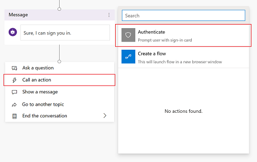
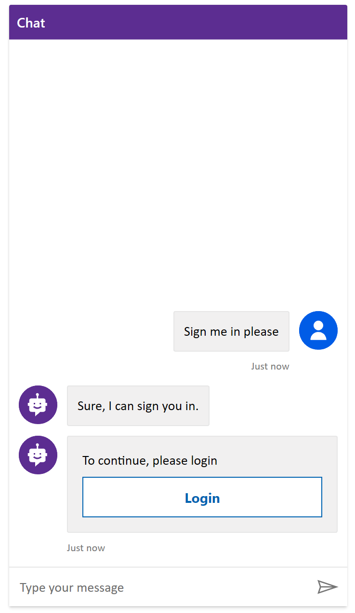

# Add end-user authentication to a Power Virtual Agents bot


Select the version of Power Virtual Agents you're using here:

> [!div class="op_single_selector"]
> - [Power Virtual Agents web app](advanced-end-user-authentication.md)
> - [Power Virtual Agents app in Microsoft Teams](teams/advanced-end-user-authentication-teams.md)

You can enable user authentication directly within a Power Virtual Agents bot conversation. User authentication means you can get a user's basic properties such as name and ID in bot variables, but also prompt a user to sign in using an authentication node, retrieve a user token for that user, and then use that token to retrieve the user's information from a back-end system. 

You can also configure single sign-on (SSO) so your users don't need to sign in manually.

> [!IMPORTANT] 
> Before using this feature, you must follow the [end-user authentication configuration instructions](configuration-end-user-authentication.md).

## Prerequisites

- [!INCLUDE [Medical and emergency usage](includes/pva-usage-limitations.md)]


## Authentication variables

If your bot is configured with either "Only for Teams" or "Manual" authentication options, you will have a set of authentication variables available in your topics. Check the [authentication configuration documentation](configuration-end-user-authentication.md) for more information on how to configure authentication in your bot.

The following table compares authentication variable availability by authentication configuration option:

| Authentication Variable | No Authentication | Only for Teams | Manual | 
| --- | :---: | :---: | :---: |
| ```UserDisplayName``` | :x: | :heavy_check_mark: | :heavy_check_mark: |
| ```UserID```          | :x: | :heavy_check_mark: | :heavy_check_mark: |
| ```IsLoggedIn```      | :x: | :x: | :heavy_check_mark: |
| ```AuthToken```       | :x: | :x: | :heavy_check_mark: |

#### UserDisplayName variable
The ```UserDisplayName``` variable contains the user's display name stored in the identity provider. You can use this variable to greet or refer to the end user without them having to explicitly tell it to the bot, making it more personalized.

This field value is obtained from the Azure Active Directory (Azure AD) ```name``` claim. For OAuth providers, this is the value stored in the ```name``` claim. Power Virtual Agents automatically extracts this field into the variable, so ensure you have ```profile``` as part of your authentication scope setup.

#### UserID variable
The ```UserID``` variable contains the user's ID stored in the identity provider. This value can be used by Power Automate flows to call APIs that take the UserID as a value.
This field value is obtained from the Azure AD ```sub``` claim. For OAuth providers, this is the value stored in the ```sub``` claim. Power Virtual Agents automatically extracts this field into the variable.

> [!WARNING]
> The ```UserDisplayName``` and ```UserID``` variables are not guaranteed to be filled, and might be empty strings depending on the user configuration in the identity provider. Test with a user from your identification provider to ensure your topics work correctly, even if these variables are empty.

#### IsLoggedIn variable

The ```IsLoggedIn``` variable indicates whether the user is signed in (either as a result of signing in or already being signed in, also known as the log-in success path) or not signed in (which would result in the log-in failure path).

```IsLoggedIn``` is a boolean-type variable containing the signed-in status of the user. You can use this variable to create branching logic in your topics that checks for a successful sign-in (for example, in the template already provided as part of adding the **Authenticate** node), or to opportunistically fetch user information only if the user is signed in.

#### AuthToken variable

The ```AuthToken``` variable contains the user's token, obtained after the user is signed in. You can pass this variable to [Power Automate flows](advanced-flow.md) so they can connect to back-end APIs and fetch the user's information, or to take actions on the user's behalf.

> [!WARNING] 
> Make sure you're passing the `AuthToken` variable only to trusted sources. It contains user authentication information, which, if compromised, could harm the user.

Don't use `AuthToken` inside **Message** nodes, or on flows that you don't trust. 

## Authentication when using "Only for Teams" configuration

If your authentication option is set to **Only for Teams**, you don't need to explicitly add authentication to your topics. In this configuration, any user in Microsoft Teams is automatically signed in via their Teams credentials and they don't need to explicitly sign in with an authentication card. If your authentication option is set to Manual, then you will need to add the authentication node (even for the Teams channel). 

> [!NOTE]
> If your authentication option is set to "Only for Teams", you don't have the option to explicitly add authentication to your topics.


## Add user authentication to a topic

**Insert the authentication node template:**

1. Go to the [**Topics page**](authoring-create-edit-topics.md) for the bot you want to edit.

1. Open the **Authoring canvas** for the topic you want to add the authentication template to.

1. Select the plus (**+**) icon to add a message node. Enter what the bot should say to indicate that a sign-on experience is about to occur.

    

1. Underneath the message node, select the plus (**+**) icon, select **Call an action**, and then select **Authenticate**. 

    

1. Once selected, a number of new nodes will be added automatically. These nodes include a parent **Authenticate** node, followed by nodes for both a success and a failure path. 

    
    
    >[!NOTE]
    >The **Authenticate** node is only available in the action picker at the end of a dialog tree (as a leaf node). It cannot be added in the middle of a dialog. Once added, other nodes can be added below it. 

### Authenticate node

The **Authenticate** node is where the user, if not already signed in, will be prompted with a sign-in card.




Once the user enters their username and password in the prompt (hosted by the identity provider), they might be prompted to enter a validation code, depending on the [channel](publication-fundamentals-publish-channels.md). Some channels, such as Microsoft Teams, do not require the user to enter a validation code.

Note that if your bot has [SSO](configure-sso.md) configured, the user will not be prompted to sign in.

Users are only prompted to sign in once during a conversation, even if they encounter another sign in card.


## AuthToken usage without an Authenticate node

The ```IsLoggedIn``` and ```AuthToken``` variables are available even if you don't use the template provided by the **Call an action** menu entry. If you pass the `AuthToken` variable without first having the user go through the **Authenticate** node, the user will be prompted to sign in at that step. 

Passing the `AuthToken` variable can be useful if you always expect the user to be signed in, or if your user is being redirected from a different topic. We suggest you use the template provided by the **Call an action** entry to treat cases where the user fails to sign in.

> [!NOTE] 
> If the user signs out in the middle of a conversation, they will be prompted to sign in again if the topic comes to a node that uses the ```AuthToken``` variable.


### Success path

The success path equates to where ```IsLoggedIn = True``` and accounts for when the user has successfully signed in (or was already signed in). 

If you have logic that uses the `AuthToken` variable (for example, to connect to a back-end system using a flow to retrieve a user's information), it should go under this path.

### Failure path
The failure path equates to any condition other than `IsLoggedIn = True`. In most cases the failure path occurs because the user failed to sign in, used the wrong password, or canceled the sign-in experience.

Add any logic you might want to treat this case. As an example, we have provided options for retrying or to [escalate to a live agent](advanced-hand-off.md). Customize the failure path's actions for your particular scenario and usage.


## Testing your topic

Make sure to [test your topic](authoring-test-bot.md) using a real user configured in your identity provider. Ensure both the sign-in success and failure paths are exercised, so there are no surprises if your user fails to sign in or there is an error with the identity provider's sign-in experience.
