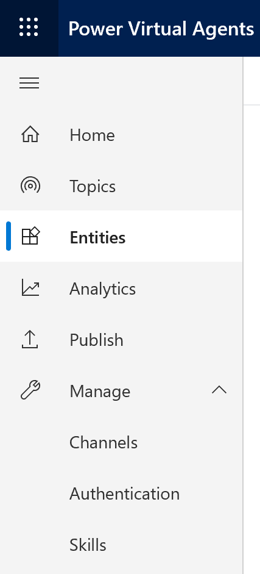
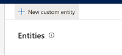
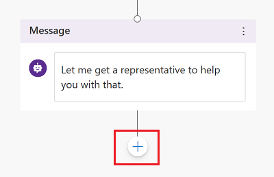
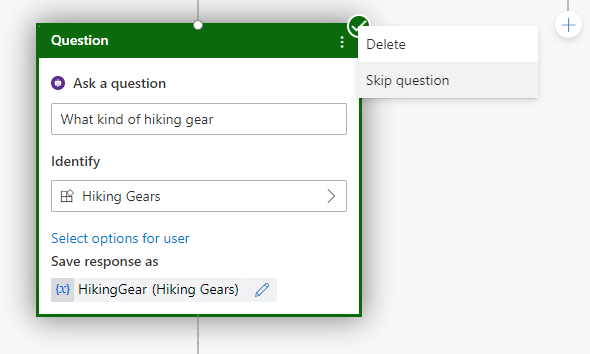

# Use entities and slot filling in Power Virtual Agents bots

Select the version of Power Virtual Agents you're using here:

> [!div class="op_single_selector"]
> - [Power Virtual Agents web app](advanced-entities-slot-filling.md)
> - [Power Virtual Agents app in Microsoft Teams](teams/advanced-entities-slot-filling-teams.md)

A big part of bot conversations in Power Virtual Agents is natural language understanding, which is the ability for the AI to understand a user's intent. For example, natural language understanding is involved when a user might say "I tried to use my gift card but it doesn't work" and the bot is able to route the user to the topic related to gift cards not working—even if that exact phrase isn't listed as a trigger phrase.

One fundamental aspect of natural language understanding is to identify *entities* in a user dialog. An entity can be viewed as an information unit that represents a certain type of a real-world subject, like a phone number, zip code, city, or even a person's name. 

>
> [!VIDEO https://www.microsoft.com/en-us/videoplayer/embed/RE4mTUN]
>

## Prerequisites

- [!INCLUDE [Medical and emergency usage](includes/pva-usage-limitations.md)]

## Prebuilt entities
Out of the box, Power Virtual Agents comes with a set of prebuilt entities, which represent the most commonly used stereotype information in real-world dialogs, such as age, colors, numbers, and names. 

With the knowledge granted by entities, a bot can smartly recognize the relevant information from a user input and save it for later use. 

To help understand that notion, the **Money** entity can be used as an example. 

1. In Power Virtual Agents, go to the **Entities** tab on the side navigation pane.

   

   You'll see a list of the prebuilt entities available. 

   .png)

1. Select the **Money** entity, which will open the details panel for the entity.

   .png)

Here you can see an explanation of this entity and the ways it can be used to look for information related to money or currency from a user's input.

For example, when a user inputs "It costs 1000 dollars", using this money entity the bot knows the "1000 dollars" represents the **money type** of information. When the bot extracts this entity and saves it to a variable, it will save "1000" as a number even though the surrounding information was text.

## Custom entities
The prebuilt entities cover commonly used information types, but on some occasions, such as when building a bot that serves a specific purpose, you'll need to teach the bot's language understanding model some domain-specific knowledge. 

For instance, let's say you want to build a bot for an outdoor store. In this case, you'll need to teach the bot to acknowledge the "outdoor gears product" category in a dialog. 
 
To do this, you need to create a custom entity. In this case, you can create an entity that gives the bot the knowledge of all outdoor product categories. 

1. In Power Virtual Agents, go to the **Entities** tab on the side navigation pane.

   

2. Select **New custom entity** on the main menu.

   

3. This opens the entity creation window. Enter a name for the entity.

   .png)

4. Provide the items that you want to be included in the entity; in this example, this is a list of outdoor product category names. You can do this by entering one item at a time in the **Enter item** input box to build out the full list. 

This panel also gives you a few other options. 

### Smart match

This option is part of the intelligence supported by the bot's language understanding model. It provides the flexibility to let the bot take in user input in a fuzzy way based on the list items given to the entity. 

Specifically, when this toggle is on, it lets the bot autocorrect misspellings and expands the matching logic semantically, such as automatically matching "softball" to "baseball". 

.png)

### Synonyms
This option allows you to manually expand the matching logic by adding synonyms. Smart match and synonyms seamlessly work together to make your bot even smarter. 

For example, for the "hiking" product category, you can add "trekking" and "mountaineering" as synonyms. For "Yoga", you can add "Pilates" as a synonym.

.png)

## Use entities in a conversation
Now that you've done the work of giving the bot the knowledge about outdoor gear by creating that product category entity and a few other custom entities, you can start to use them when constructing a bot conversation. 

1. Go to the [**Topics page**](getting-started-create-topics.md) for the bot you want to edit.

1. Open the authoring canvas for the topic you want to add an entity to.

1. Select the plus (**+**) icon and then select **Ask a question**. 

   

1. Under **Identify**, select the entity you created in [Custom entities](#custom-entities).

   .png)

1. You can also optionally select items to show as buttons. For example, if you'd like to show some categories as buttons for users to conveniently choose from as their input, you can simply choose **Select user options** and then pick them from the list that contains the items you added when you created the custom entity.

   .png)
    
   .png)

1. Name the variable for the output of the user's response, if necessary.

## Slot filling

Slot filling is a natural language understanding concept that means saving an extracted entity to an object. In Power Virtual Agents, slot filling means landing the extracted entity value into a variable.

We will continue to use the outdoor gear topic as an example, which is triggered by typing "I want to buy something" in the test chat. 

The topic is successfully triggered and the bot asks for the product category, also showing the button choices specified when authoring the **Ask a question** node. In the dialog tree, tracking between topics also shows the bot is running to the question node you just edited. 

.png)

A user can use the predefined choices by selecting one of the buttons. Alternatively, they can also type in something like "trekking" and see that it maps to "hiking", because those words were defined as synonyms. 

.png)

In tracking between topics, it shows the dialog is correctly routed to the path in which the product category value is "Hiking". You can inspect the variable value from the variable watch window at the bottom of the authoring canvas. In the watch window, it shows the variable value is "Hiking". 

Essentially, slot filling has happened by inserting the extracted entity "Hiking" into the variable `VarProductCategory`. 

.png)

You can also use what is known as "proactive slot filling" where the user can specify multiple pieces of information that map to multiple entities. The bot is able to understand what information belongs to which entity automatically. In cases where it is unsure of the intended mapping, it will prompt the user to be more specific by providing choices.

In this example, the user wrote "I want to buy some trekking gears". This includes both the trigger phrase that the user wants to buy gear and also provides a second piece of information—the actual type of gear. In this case, the bot fills in both the entity for buying gear, and for the type of gear.

.png)

In tracking between topics, you can see the bot takes in this user input, and intelligently skips the question node asking for the product category. 

The bot is always actively listening to the user input, remembering information upfront so it can skip unnecessary steps as appropriate.

Let's restart the testing again and try another case. In this round, you can add a couple more question nodes asking for things like the type of hiking gear as well as the price range (using the **Money** entity). 

This time when the product category question is presented, instead of telling the bot only the product category, the user can say "I want to buy a pair of hiking boots under $100". In this example, the bot is not only able to route to the correct hiking product category path, but also actively fill the slots asking for the type of hiking gear and the target price range information. 

.png)

Proactive slot filling can be manually controlled at the node level. If you'd like to always prompt for the question within a specific node, regardless of whether the slot has been filled from previous user responses, you can disable the **Skip question** option for that question node.

## Watch a deep dive video
> [!VIDEO https://www.microsoft.com/en-us/videoplayer/embed/RE4ncEw]

