# Add actions to a bot using Power Automate 

Select the version of Power Virtual Agents you're using here:

> [!div class="op_single_selector"]
> - [Power Virtual Agents web app](advanced-flow.md)
> - [Power Virtual Agents app in Microsoft Teams](teams/advanced-flow-teams.md)

You can enable your bot to perform an action by calling a Microsoft Power Automate flow. Flows can help you automate activities, or call backend systems. For example, you can use flows with [end-user authentication](advanced-end-user-authentication.md) to retrieve information about a user after they've signed in.

You call flows from within topics, as a discrete **Call an action** node. You can utilize flows that have already been created in your [Power Apps environment](environments-first-run-experience.md), or you can create a flow from within the Power Virtual Agents [authoring canvas](authoring-create-edit-topics.md).

>[!IMPORTANT]
>A flow can only be called from a topic located in the same [Microsoft Dataverse environment](/powerapps/maker/common-data-service/data-platform-intro) as your bot.
>Flows must also be in a solution in Power Automate. You can [move flows into solutions](#optionally-move-a-flow-from-default-solution-to-another-solution) so they are listed in the authoring canvas.

Flows typically use variables to input and output information. The variables can then be used in other nodes within the topic.

## Prerequisites

- [!INCLUDE [Medical and emergency usage](includes/pva-usage-limitations.md)]

## Create a new flow from the Power Virtual Agents authoring canvas 

1. Go to the [**Topics page**](authoring-create-edit-topics.md) for the bot you want to edit.

1. Open the authoring canvas for the topic from which you want to call a flow.

1. Select the plus (**+**) button below an existing node to add a new node. 

1. In the node selection window, select **Call an action**, and then select **Create a flow**. 

    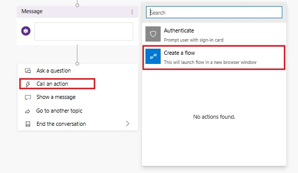

Using the **Create a flow** option opens a starter flow template in the [Power Automate portal](https://flow.microsoft.com/) in a separate tab.

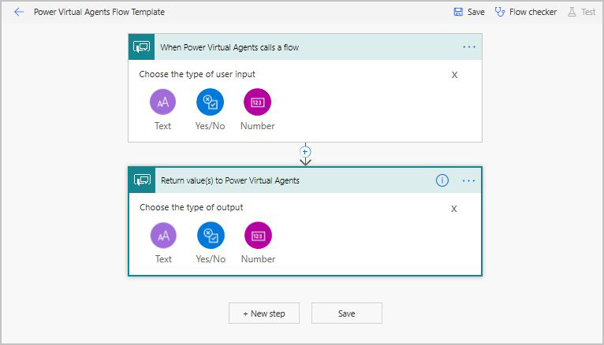

>[!NOTE]
>The Power Automate portal automatically opens in the same environment as the bot (using the same user credentials).

This template is an example of a flow that can be used by bots. To be suitable for bots, a Power Automate flow requires a special **Power Virtual Agents** trigger and response action: 

- Flow trigger:  **Power Virtual Agents**  

    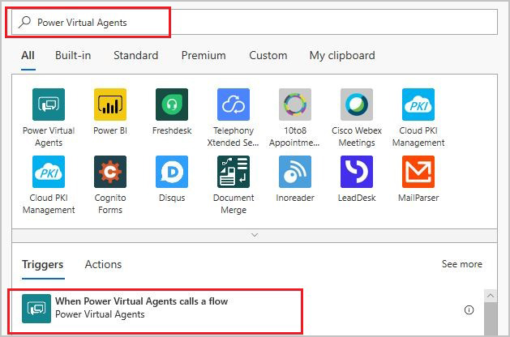

- Response action:  **Power Virtual Agents**  

    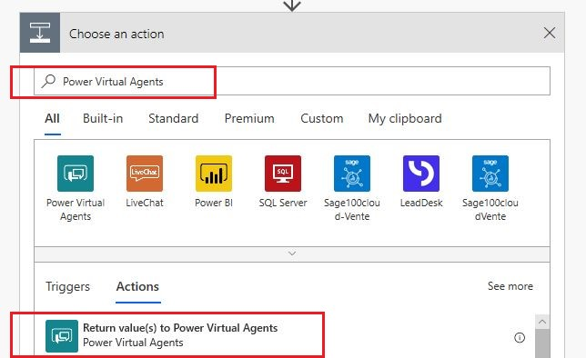

## Input and output parameters

There is no upper limit on how many input or output parameters Power Automate flow for a bot can have. Bots can use the following types of inputs and outputs with Power Automate flows:

- Number
- String
- Boolean

The following types are not supported:

- Object
- Date
- Timestamp
- List [String]
- List [Number]
- List [Boolean]
- List [Object]
- List [Date]
- List [Timestamp]

>[!NOTE]
>A bot is able to receive up to 1 MB of data from a Power Automate flow in a single action. There is no upper limit on the maximum size of data that a bot can pass to a Power Automate flow.

### Input parameters

To specify a flow to accept input parameters from a bot, select the **Add an input** option in the **Power Virtual Agents trigger** user interface, and then select the type a - `string`, `number`, or a `boolean`.

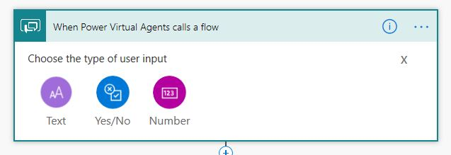

For example, you can select **Text** and **Number** to add the following input parameters to the flow:
- **String_Input** of type `string`
- **Number_Input** ot type `number` 

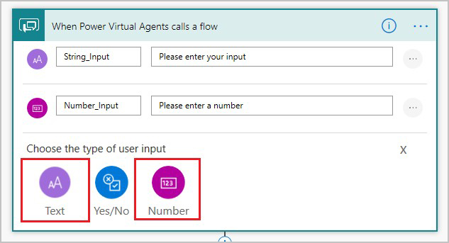

### Output parameters

To return output parameters to the bot that can be a `string`, `number`, or a `boolean`, select **Add an output** option in **Power Virtual Agents response** user interface, and then select the type for the output.

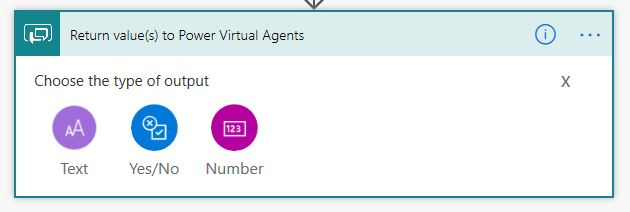

For example, you can select **Text** and **Number** to add the following output parameters to the flow and assign return values for them.
- **String_Output** of type `string`
- **Number_Output** ot type `number`

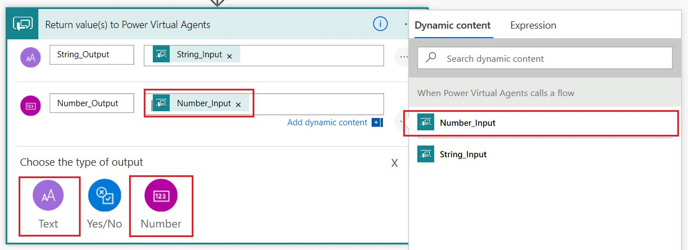

This example creates a fully functional flow that accepts two parameters, a `string` and a `number`, and returns them to a bot as outputs. 

Select **Save** to save your new flow.

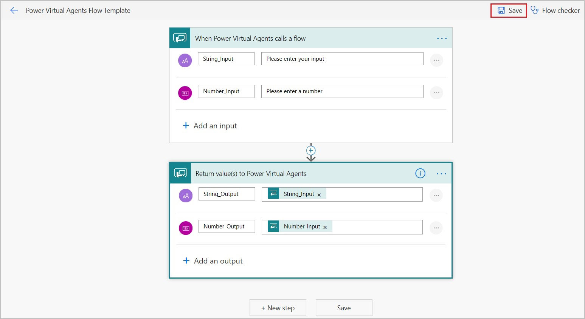

Your flow is saved to the **Default Solution** under the **Solutions** tab on the Power Automate portal.

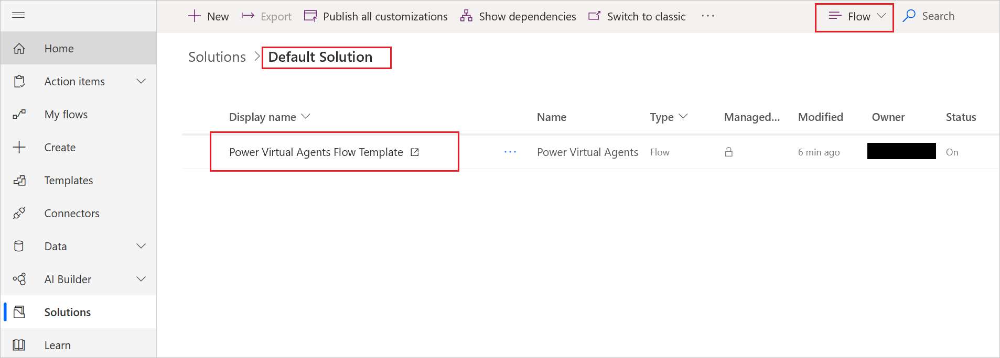

## Flows created from the Power Virtual Agents authoring canvas are immediately available to the bot

All flows created from the Power Virtual Agents authoring canvas are saved in a **Default Solution** in Power Automate. They can be used by your bots immediately.

In Power Virtual Agents, you can now see this new flow on the list of available actions when you use the **Call an action node** in the authoring canvas.

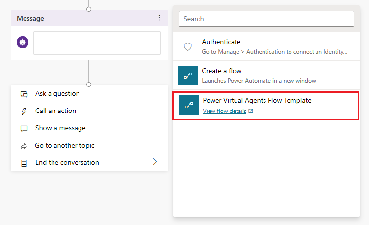

## Optionally move a flow from Default Solution to another solution

To be available to your bots, flows must be stored in a solution in Power Automate. If you do not want to use the **Default Solution** for this purpose, you can move your flows to another solution.

**Move flow to new or existing solution:**

1. On the Power Automate portal, go to the **Solutions** tab where you can see the available solutions. Use any of the existing solutions or create a new solution for your flows.

1. To create a new solution, select **New solution**.

    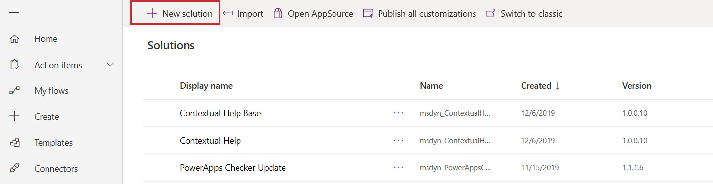

1. Give your new solution a name, select **CDS Default Publisher** in the **Publisher** field, enter a **Version** number, and then select **Create**. 

    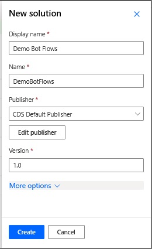

1. On the **Solutions** tab, go to the solution you want to use. Select **Add existing** to add a flow.

    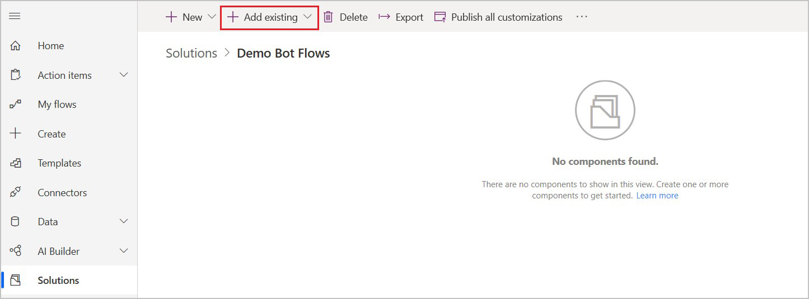

1. On the **Add existing flow** page, select the **From solutions** tab, and then select your flow. Select **Add** to add your flow to the solution.

    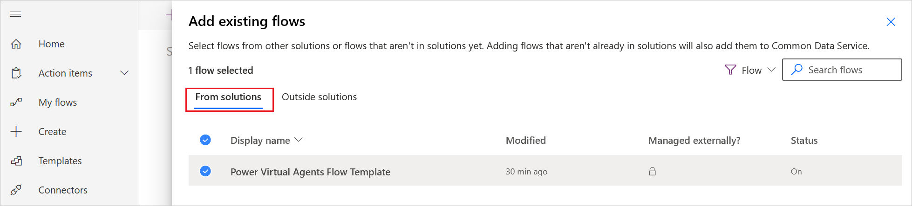
    
   To move a flow from **My flows** tab to a solution, select the **Outside solutions** option. Select **Add** to add your flow to the solution.

    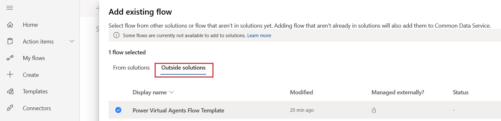
    

## Modify a flow on the Power Automate portal

You can rename and modify your flow on the Power Automate portal. For example, the flow you just created using the template can be updated to provide a weather forecast when called from a bot.

1. In Power Virtual Agents, you can open a flow by using the flow's **View flow details** link on the list of available actions when you use the **Call an action node** in the authoring canvas.

    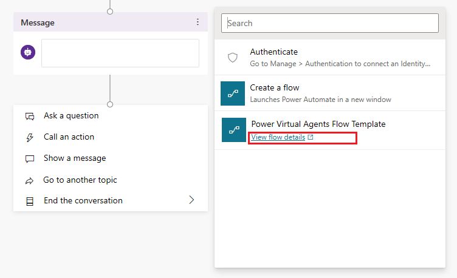

    If you want to update a flow that is already used in your dialog, the same **View flow details** link is available directly in the Action node.
 
    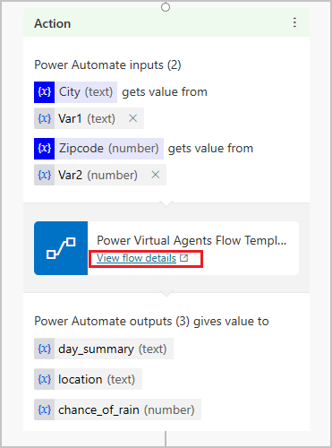
 
    Using the flow's **View flow details** link launches the Power Automate portal in a separate browser tab, and opens the flow in a **Details** page where you can modify it using the **Edit** command.

    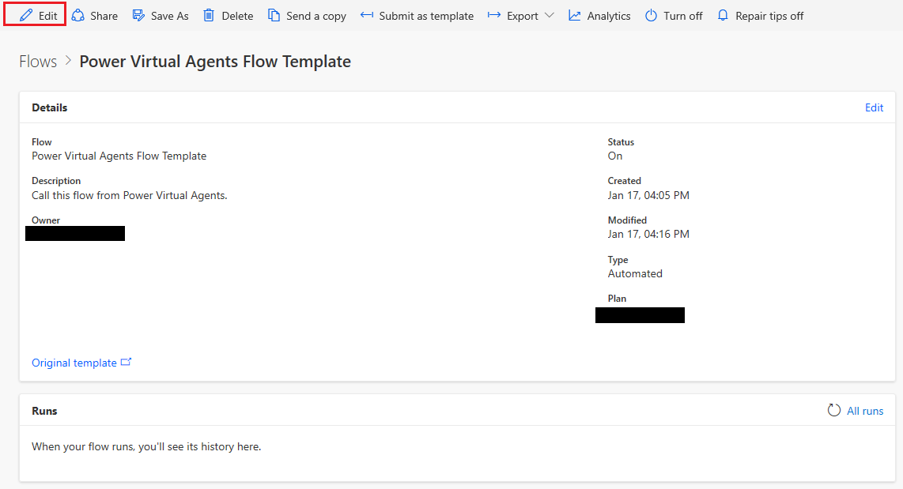

    If you want to open a flow on the Power Automate portal, go to the **Solutions** tab and then open your flow's solution. Use the flow's **Edit menu** to open the flow for editing.

    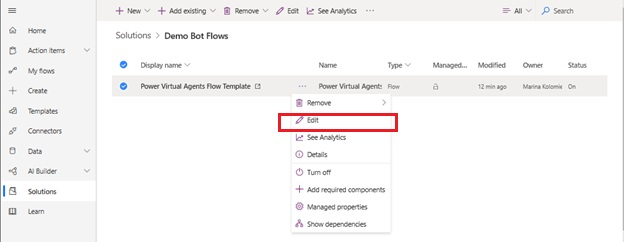

    
1.  Rename the flow to **Get weather forecast** and then add the following flow input parameters to **Power Virtual Agents** trigger:

    - City (String)
    - Zipcode (Number)

    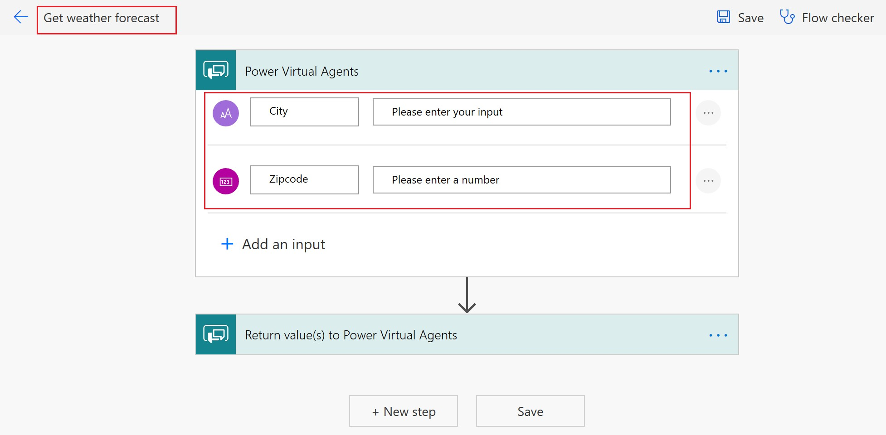

   

1. Choose **Add an action** to create a new action below the **Power Virtual Agents** trigger.

    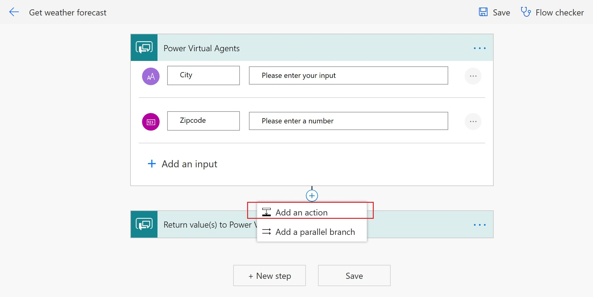

1. Enter **MSN weather** into the search box, and then select the **Get forecast for today** action from the list.

    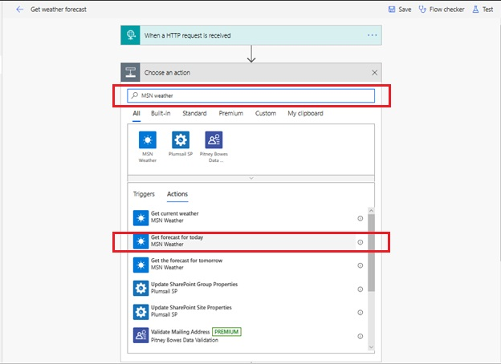

1. A new **MSN Weather Connector** is added to the flow. Under **Location**, select **Add dynamic content**. Select **City** and **Zipcode** from the list. 

    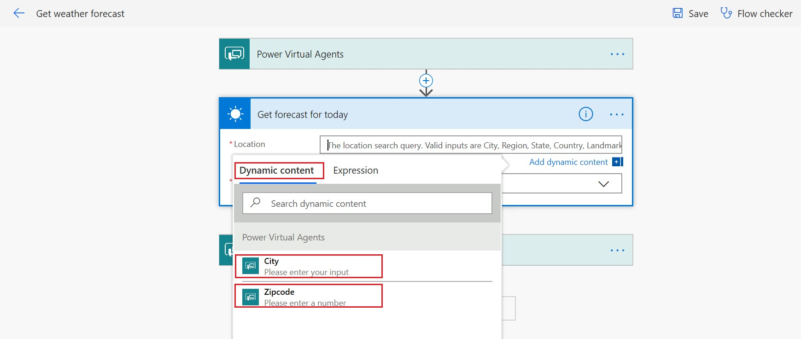

1. In the response node **Return value(s) to Power Virtual Agents**, add the output parameters that you want to return to the bot. **Save** your flow. 

    - day_summary (String)
    - location (String)
    - chance_of_rain (Number)

    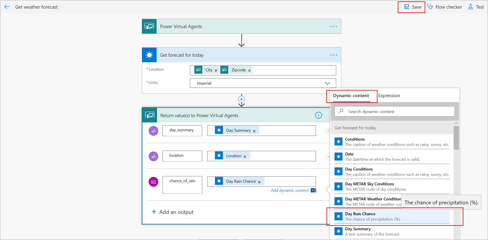

This flow is now ready to be used in your bots.

## Call a Power Automate flow as an action from a bot 

You can call a Power Automate flow from a bot topic using the **Call an action** node. You can then pass variables to the flow and receive flow outputs that can be used in a bot conversation.

These instructions use adding weather information to a flow as an example. If you haven't already, follow the steps under the [Modify a flow on the Power Automate portal](#modify-a-flow-on-the-power-automate-portal) section in this topic to create a weather forecast flow.

**Call a flow from within a topic:**

1. In Power Virtual Agents, go to the [**Topics page**](authoring-create-edit-topics.md) for the bot you want to edit.

1. Create a new topic, and name it **Get weather**. 

1. Add the following **trigger phrases**:

    - will it rain
    - today's forecast
    - get weather
    - what's the weather

1. Go to the **Authoring canvas** for the new topic.

    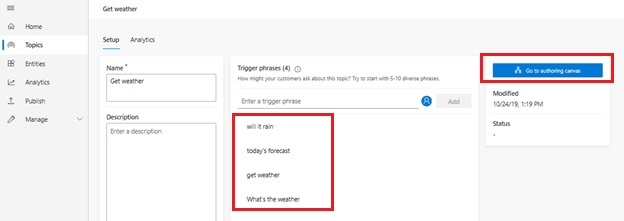

1. By default, a message node is created. Enter **I can help you with that** into the node, and then select the plus (**+**) button under it to add a new node. 

    

1. Add two new **Ask a question** nodes to ask users for the **City (String)** and **Zipcode (Number)** inputs.

    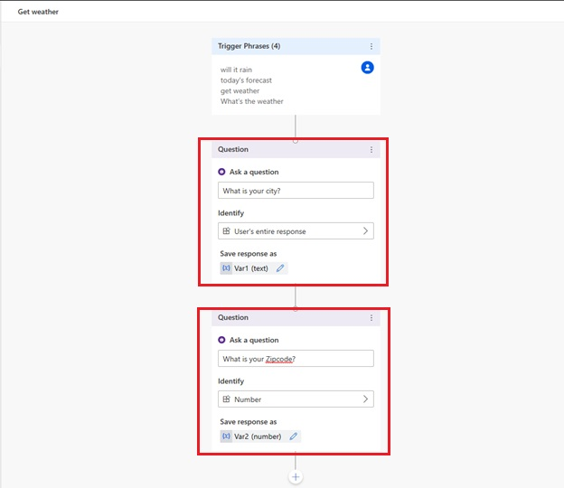

1. Select the plus (**+**) button under the question nodes to add a new node. In the node selection window, select **Call an action**, and then select the flow you created earlier called **Get weather forecast**. 

    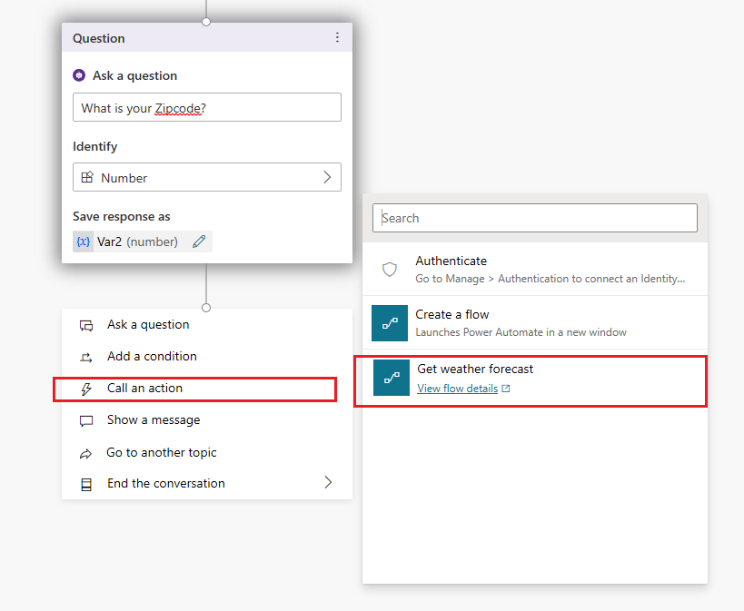

1. Map the flow input blocks to the output variables from the question nodes. **City (text)** gets its value from `Var1 (text)` and **Zipcode (number)** gets its value from `Var2 (number)`.

1. Under the flow's node, add a **Message** node and then enter a message that uses the flow's outputs. For example:

    **Today's forecast for `(x)location`:`{x}day_summary`. 
    Chance of rain is `{x}chance_of_rain`%**

    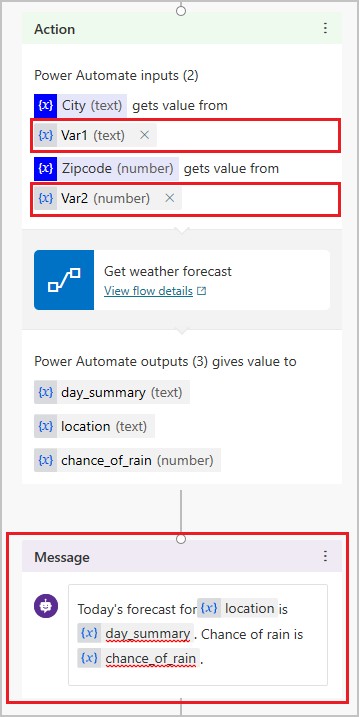

1. Select **Save** to save your topic. 

## Test your flow and topic

In the **Test chat** pane, start a conversation with the bot by typing in a trigger phrase for the topic that contains the flow.

Enter your city and zip code at the prompt to get today's weather forecast from the bot.

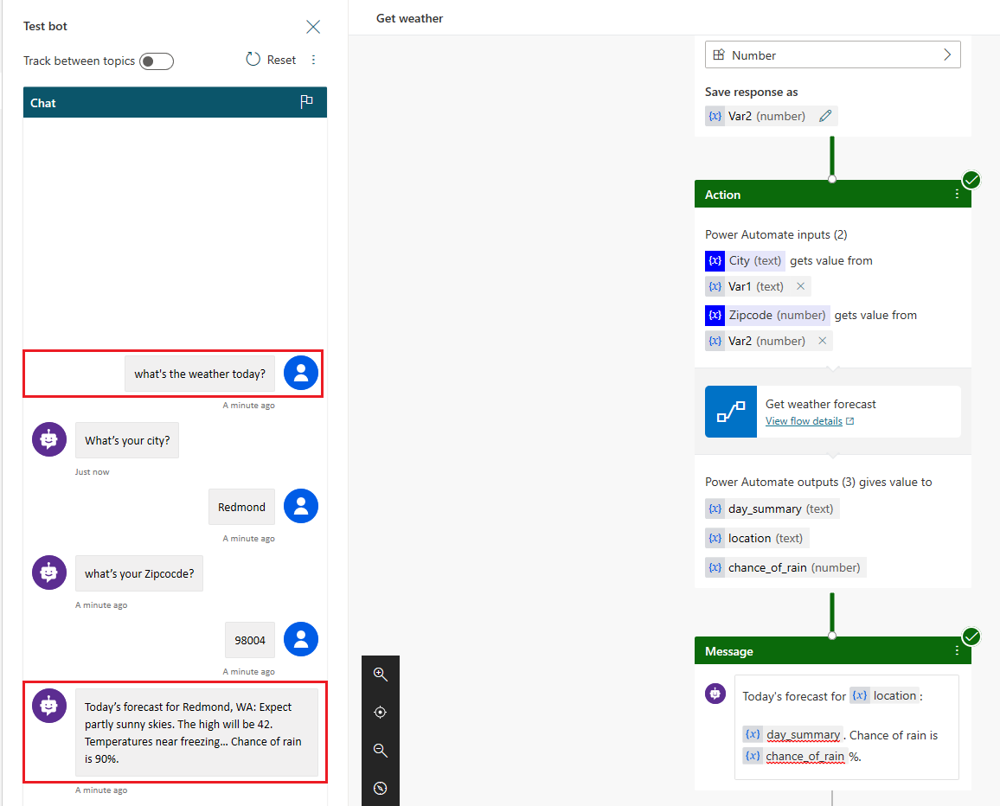

## Troubleshoot your bot

While testing your bot in the **Test chat** pane, you can use the **Save snapshot** command to get conversational diagnostics data. This data can help you troubleshoot issues, such as the bot not responding in the way you expect. 

>[!WARNING]
>The snapshot contains all of your bot content, which may include sensitive information.

1. At the top of the **Test chat** pane, select the menu icon (three vertical periods) and then **Save snapshot**.

    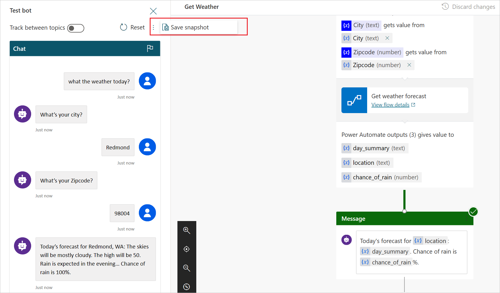

2. In the window that appears, select **Save**.

    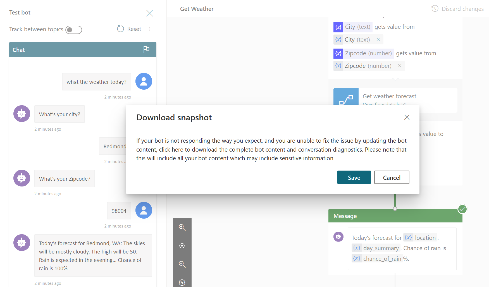

3. The bot's content and conversational diagnostics will be saved in a .zip archive file called *DSAT.zip*.

    

4. The *DSAT.zip* file contains two files: *botContent.json* and *dialog.json*. 

    1. *dialog.json* contains conversational diagnostics, including detailed descriptions of errors.

        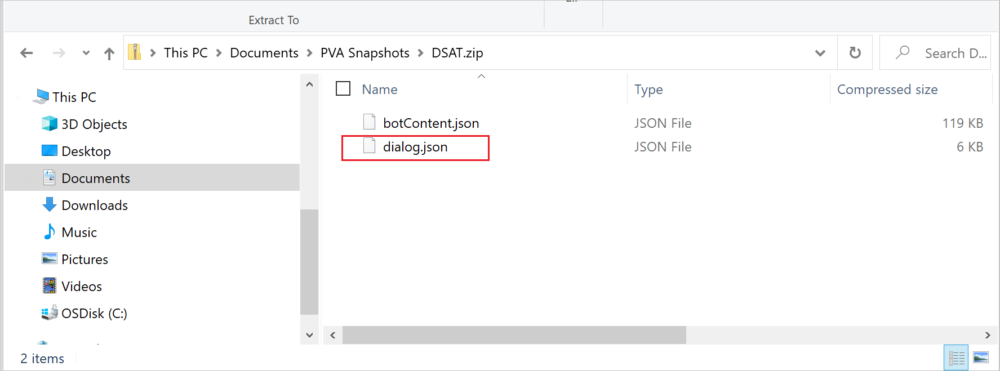

    1. *botContent.json* contains the bot's topics and other content, including entities and variables used in the bot.

You can help us improve Power Virtual Agents by flagging issues with the **Flag an issue** command on the test bot pane. This submits your conversation ID to Microsoft, which is a unique identifier that Microsoft uses to troubleshoot the issue of the conversation. Other information, such as that in the *DSAT.zip* file, is not sent when you flag an issue.

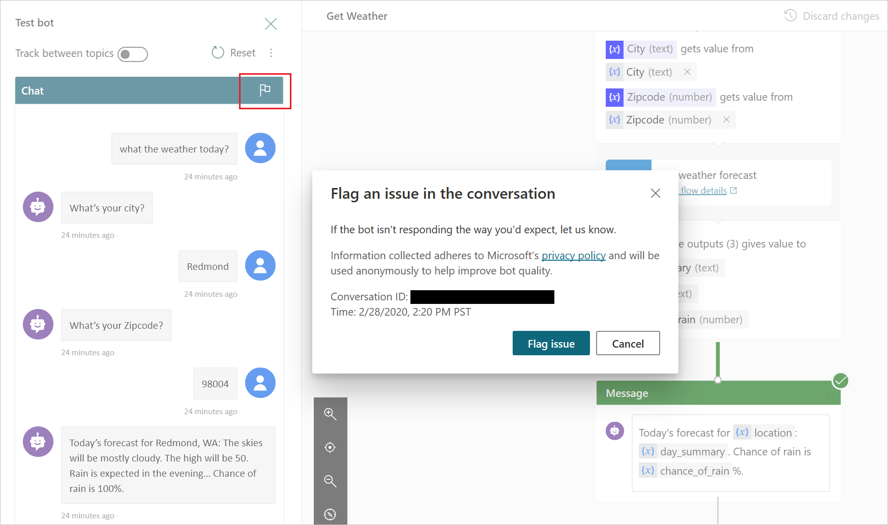

All information collected is anonymous and will be used to help improve bot quality.
