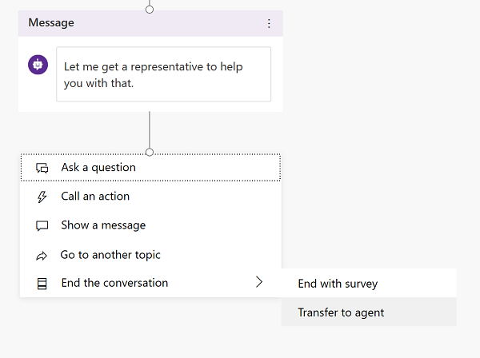

# Trigger hand-off to a live agent

With Power Virtual Agents, you can hand-off conversations to live agents seamlessly and contextually.

When you hand off a conversation, you share the full history of the conversation (the context) as well as all user-defined variables. This means live agents that are using any connected engagement hub can be notified that a conversation requires a live agent, see the context of the prior conversation, and resume the conversation.

For more information about how to configure hand-off with [Omnichannel for Customer Service](https://go.microsoft.com/fwlink/?linkid=2098992), see the [Configure hand-off to Omnichannel for Customer Service](configuration-hand-off-omnichannel.md) topic.
   
  > 
  > [!VIDEO https://www.microsoft.com/en-us/videoplayer/embed/RE4n4G1]
  >

>[!NOTE]
>You can choose to escalate a bot conversation without linking to an engagement hub:
>
>1. In the **Authoring canvas** for the topic you want to add an escalation option to, at the end of the topic, select the plus (+) icon to add a new node.
>2. Select **Go to another topic** and then **Escalate**.
>
>**Escalate** is a [system topic](authoring-create-edit-topics.md#use-system-and-sample-topics) that, by default, provides a simple message to a user if they ask for a human agent. 
>
>You can edit the topic to include a simple URL to a support website or ticketing system, or to include instructions for emailing or contacting support.

## Prerequisites

- You need a bot built with [Power Virtual Agents](https://aka.ms/TryPVA)
- You need to have an engagement hub that is being used by live agents, such as [Omnichannel for Customer Service](/dynamics365/omnichannel/try-channels), and you need to configure the connection, as described in [Configure hand-off to Omnichannel for Customer Service](configuration-hand-off-omnichannel.md).
- [!INCLUDE [Medical and emergency usage](includes/pva-usage-limitations.md)]

## Triggering hand-off to a live agent
Customers engaging with the bot can ask for a live agent at any point in the conversation. This can happen in two ways, with an implicit trigger or an explicit trigger.

Upon triggering the hand-off topic, Power Virtual Agents initiates hand-off to the configured engagement hub and sends over all conversation context to find the next best live agent to ramp them up so they can resume the conversation.

### Implicit triggers
In some instances, the bot may be unable to determine the intent of a customer's conversation. For example, the customer may be asking a specific question for which there is no [topic](getting-started-create-topics.md), or there is no matching option within a topic. 

In other instances, your customers may ask to be handed off to a live agent immediately. For example, customers may type "talk to agent" mid-way into a conversation.

When the bot detects this, it will automatically redirect the user to the [**Escalate** system topic](authoring-create-edit-topics.md). This is known as *implicit triggering*.

### Explicit triggers
When creating topics for your bot, you may determine that some topics require interaction with a human. This is known as *explicit triggering*. 

In these instances, you must add a **Transfer to agent** node into the topic.

This node lets you add a **Private message to agent**, which is sent to the connected engagement hub to help the live agent understand the history and context of the conversation.

>[!NOTE]
>Conversations that reach this node will be marked as **Escalated** sessions in [reporting analytics](getting-started-analytics.md).

**Add a **Transfer to agent** node into a topic:**

1. Go to the [**Topics page**](getting-started-create-topics.md) for the bot you want to edit.

1. Open the authoring canvas for the topic you want to add the **Transfer to agent** node to.

1. Click the plus (+) icon to add a message node. Enter what the bot should say to indicate that transferal to a live agent is about to occur.

    

1. Underneath the message node you just created, click the plus (+) icon, go to **End the conversation** and then select **Transfer to agent**

    

1. Enter an optional private message to the live agent in the **Transfer to agent** node. This can be useful if you have multiple topics with **Transfer to agent** nodes as the information is stored in the `va_AgentMessage` [context variable](#contextual-variables-available-upon-hand-off).

The topic will initiate a transfer to a live agent when this node is reached. You can test the hand-off by triggering the topic in the test canvas.

>[!NOTE]
>Once you add a **Transfer to agent** node into a conversation, each time you trigger hand-off your users will see a "No renderer for this activity" message on the demo website. This suggests the need to [customize your chat canvas](extend-custom-canvas-connect.md) to implement custom client-side code that brings in a human agent from your engagement hub into the conversation.

## Contextual variables available upon hand-off
Beyond providing an automated way for a conversation to be ported into an engagement hub, it's important to ensure that the best agent for a specific problem is engaged. To help route conversations to the most appropriate live agent there are a number of context variables that are also passed to the engagement hub. 

You can use these variables to automatically determine where the conversation should be routed. For example, you may have added **Transfer to agent** nodes to several different topics, and you want to route conversations related to certain topics to specific agents. 

The following table lists the context variables available by default.

| Context | Purpose | Example |
| ------- | ------- | ------- |
| `va_Scope` | Helps route escalations to a live agent | `"bot"` |
| `va_LastTopic` | Helps route escalations to a live agent and helps ramp-up a live agent | `"Return items"` |
| `va_Topics` | Helps ramp-up a live agent | `[ "Greetings", "Store Hours", "Return Item" ]` |
| `va_LastPhrases` | Helps route escalation to a live agent and helps ramp-up a live agent | `"Can I return my item"` |
| `va_Phrases` | Helps ramp-up a live agent | `["Hi", "When does store open", "Can I return my item" ] ` |
| `va_ConversationId` | Helps uniquely identify a bot conversation | `GUID` |
| `va_AgentMessage` | Helps ramp-up a live agent | `"Got a gift from: HandoffTest"` |
| `va_BotId` | Helps identify the bot that is handing off a conversation | `GUID` |
| `va_Language` | Helps route escalation to a live agent | `"en-us"` |
| All [user-defined topic variables](how-to-variables.md) | Helps ramp-up a live agent | `@StoreLocation = "Bellevue"` |

A customer may go through several topics prior to escalating. Power Virtual Agents gathers all contextual variables across topics and merges them before sending to the engagement hub. 

If there are topics with similarly named context variables, Power Virtual Agents promotes the most recently defined topic variable.

