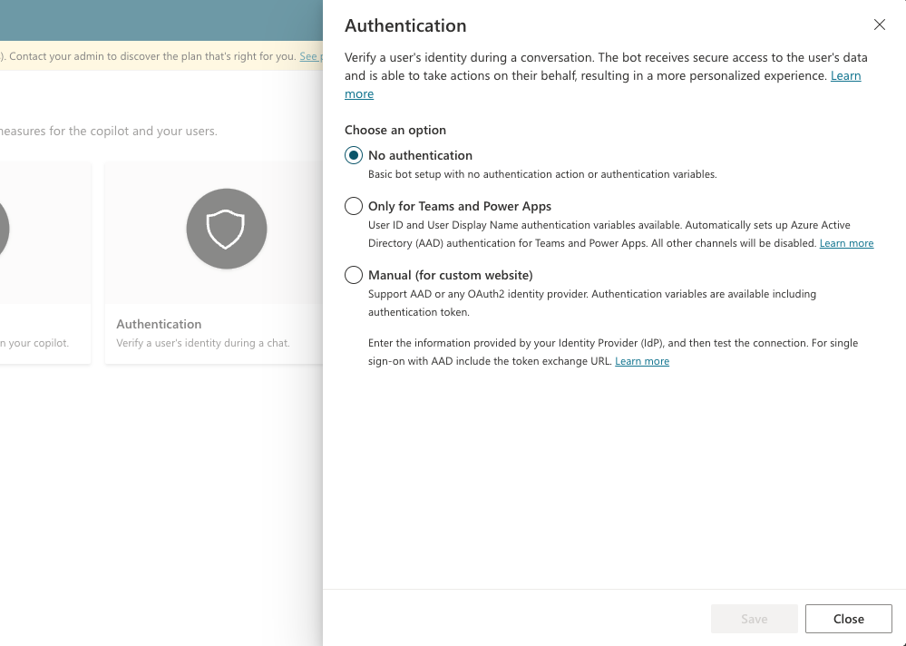
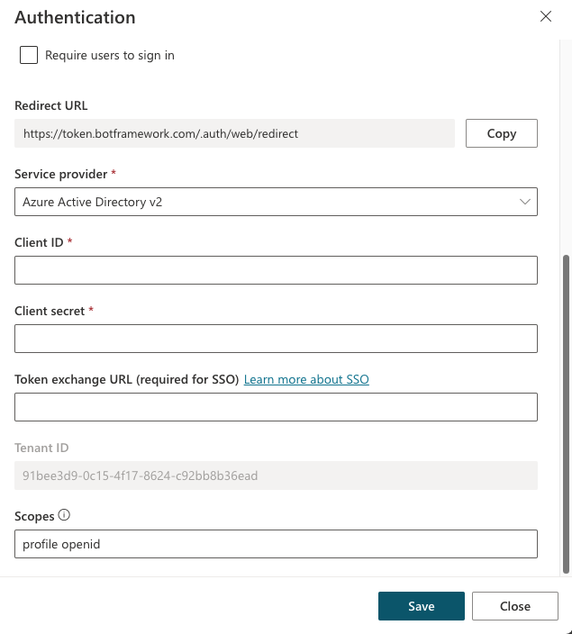

# Use plugin actions in Microsoft Copilot Studio (preview)

[!INCLUDE[pva-rebrand](includes/pva-rebrand.md)]

You can extend the capabilities of your copilot by adding one or more plugin actions. Plugin actions are used by your copilot to respond to users automatically, using [generative actions](./advanced-generative-actions.md), or you can call them explicitly from within a topic.

[!INCLUDE[preview-banner](~/../shared-content/shared/preview-includes/preview-banner.md)]

## Core plugin action types

Plugin actions are based on one of the following core action types:

- Prebuilt connector action
- Custom connector action
- Power Automate cloud flow
- Bot Framework Skill

> [!IMPORTANT]
> You can't use [conversational plugins created in Microsoft Copilot Studio](copilot-conversational-plugins.md) as plugin actions.

Each core action has additional information that describes its purpose, allowing the copilot to use GPT to generate questions. These questions are required to fill the inputs needed to perform the action. Therefore, you don't need to manually author question nodes to gather all inputs needed, such as the inputs on a flow. Inputs are handled for you during runtime.

Plugin actions can generate a contextual response to a user's query, using the results of the action. Alternatively, you can explicitly author a response for the plugin action.

> [!TIP]
> When using generated questions from a plugin action, inform your users that some of the conversation is generated by AI.
>
> For example, add an extra message in the start conversation [system topic](authoring-system-topics.md). This topic determines the message shown to your users when a new conversation starts.

## Add a plugin action

1. Open your copilot and select **Topics & Plugins** from the menu.
1. Select **+ Add**.
1. Select **Plugin action (preview)**.

   :::image type="content" source="media/advanced-plugin-actions/add-plugin-action.png" alt-text="Screenshot of the Microsoft Copilot Studio navigation pane with topics and the plugin action button highlighted.":::

1. In the **Add an action (preview)** wizard, search for a plugin action you want to use and select it.

   The default list shown has Power Automate Flows and custom connectors available within your environment. This list includes commonly used prebuilt connectors and Bot Framework Skills that are registered with your copilot. For more information, see [Create AI plugins for Microsoft Copilot (preview)](copilot-ai-plugins.md).

   :::image type="content" source="media/advanced-plugin-actions/wizard-start.png" alt-text="Screenshot of the first page in the plugin action wizard with the action type filter open.":::

   > [!IMPORTANT]
   > Some plugin actions created from AI Plugins, such as Dynamic Prompts and those based on Dataverse APIs, require [authentication](#enable-authentication-for-ai-plugins).

1. Configure the connection for the action.

   Depending on the plugin, your connection is automatically configured, as shown in the example. Alternatively, you're required to configure the connection if instructions are given in the wizard. Once your connection is successfully configured, select **Next**.

   :::image type="content" source="media/advanced-plugin-actions/wizard-connection.png" alt-text="Screenshot of the first page in the plugin action wizard on the connection page." lightbox="media/advanced-plugin-actions/wizard-connection.png":::

1. Review and [make changes to your plugin actions configuration](#making-changes-to-your-plugin-action-configuration) if needed. Select **Finish** to add the plugin action to your copilot.

   :::image type="content" source="media/advanced-plugin-actions/wizard-review.png" alt-text="Screenshot of the Review and finish popup within the wizard." lightbox="media/advanced-plugin-actions/wizard-review.png":::

## Call a plugin action

If you enabled [generative actions](./advanced-generative-actions.md), your plugin action is called automatically in response to a relevant user query.

Alternatively, you can [call a plugin action explicitly from within a topic](#calling-a-plugin-action-from-within-a-topic).

## Test your plugin action

Ask your copilot a relevant question, using the test chat. You can toggle (show or hide) the view for the chat pane at the bottom of the navigation menu.

Your copilot selects and runs your plugin action based on the name and description. You can author high quality descriptions, using the dedicated tracing mode to see which plugin actions your copilot selected from the [generative actions](advanced-generative-actions.md) page.

Alternatively, if you [added a plugin action to a topic](#calling-a-plugin-action-from-within-a-topic), you can test it by entering a message similar to one of the trigger phrases for that topic.

You can see a weather plugin action being tested in this screenshot:

:::image type="content" source="media/advanced-plugin-actions/weather-topic-test-plugin-action.png" alt-text="Screenshot of the plugin action being tested.":::

GPT-driven conversations can be more fluid than traditionally authored questions.  Users can answer more than one question in a single turn or fix values they entered previously.

In this example, you can see that the copilot user first chose to check the weather for **Orlando, FL** but then, at the confirmation stage, they indicated that they wanted to change their location to **Seattle**. This change to the input value can be done at any time, not just at the confirmation stage.

## Making changes to your plugin action configuration

There are many ways to configure your plugin action. On the final step of the plugin action wizard, called **Review and Finish**, you can make changes to your plugin action's configuration by clicking **Edit** next to the appropriate section.

### Action details

Here you can configure details about your action, including the **Model display name** and **Model description** for your plugin action. Usually, the name and description are prepopulated for you based on the action you selected.

On this page, you can select the **Ask the user before running this action** checkbox, which is useful for actions that make changes for a user, such as inserting or updating a record in a table.

### Inputs

The **Inputs** section allows you to manage the **Display name** and **Description** for each input on your action. The name and description help the copilot generate a question to the user. For example, a generated question for the location input could be, _What is the location you would like to check the weather for? You can enter a City, Region, State, Country, Landmark or Postal Code"_

You can change the **Identify as** option to a specific entity type, depending on the input being collected, which can help the copilot accurately extract a value from a user's response.

By default, each input is set to **Dynamically fill with the best option**. The copilot tries to populate the value from available context, such as extracting a value from the user's message. If no appropriate value is found, it generates a question to ask the user for a value. You can override an input with a value instead of asking the user. To override, change the **How will the bot fill this input?** dropdown to **Set as a value**, then enter a value. This value can be a literal value, an existing variable, or a Power Fx formula.

:::image type="content" source="media/advanced-plugin-actions/wizard-inputs.png" alt-text="Screenshot of the inputs section for plugin action configuration.":::

### Outputs

By default, your plugin action is configured to automatically generate a contextual response for a user, based on their query and the result of the action. For example, if a user asks, "What is the current temperature in London?", a contextual reply is generated using GPT, such as "The current temperature in London is 9 degrees Celsius."

Alternatively, you can choose to author a specific response for your plugin action to return. As with the confirmation editor, you can insert references to output variables from the action using the variable picker, as shown in this example.

:::image type="content" source="media/advanced-plugin-actions/wizard-outputs-response.png" alt-text="Screenshot of the output response editor with the variable picker open.":::

## Calling a plugin action from within a topic

You can call a plugin action explicitly from within a topic, similar to calling other action types like Power Automate Flows. Depending on your use case, you might use your Flow as part of a wider topic, which uses more nodes. Or, like in the weather example, adding a single plugin action node to a topic might be all you need.

To call a plugin action from within a topic:

1. In Microsoft Copilot Studio, go to the [**Topics page**](authoring-create-edit-topics.md) for the copilot you want to edit.

1. Create a new topic, and name it **Get weather**.

1. Add the following **Trigger phrases**:

    - will it rain
    - today's forecast
    - get weather
    - what's the weather

     :::image type="content" source="media/advanced-plugin-actions/weather-topic-trigger-phrases.png" alt-text="Screenshot of trigger phrases in a new topic.":::

1. Select **Add node** (**+**) and then select **Call an action**. Switch to the **Plugin actions (preview)** tab and then select the plugin action you created earlier, **Get weather forecast**.

    :::image type="content" source="media/advanced-plugin-actions/weather-topic-add-action.png" alt-text="Screenshot of new node menu open and the weather plugin action selected.":::

1. Your **plugin action (preview)** node is now added to your topic.

    :::image type="content" source="media/advanced-plugin-actions/weather-topic-node-added.png" alt-text="Screenshot of the new plugin action node in the topic.":::

1. Select **Save**.

### Overriding inputs when calling a plugin action from a Topic

By default, when your plugin action runs, your copilot generates questions for the user to populate the required inputs. However, you might want to override one or more inputs and provide an explicit value instead of asking the user. You can override in the [plugin action configuration](#making-changes-to-your-plugin-action-configuration) within the **Inputs** section. Or, you might override values only when your plugin action is used from a specific topic:

1. Select **Set value** on the node and choose the input you would like to override.

    :::image type="content" source="media/advanced-plugin-actions/weather-topic-select-input-override.png" alt-text="Screenshot of the list of inputs that are available to be overridden.":::

1. Enter the value for the input by typing a value, selecting a variable, or using a formula.

    :::image type="content" source="media/advanced-plugin-actions/weather-topic-overridden-input.png" alt-text="Screenshot of the units input having been overridden.":::

Now that this input is overridden, the copilot doesn't ask the user for a value.

## Enable authentication for AI Plugins

Some plugin actions, when created based on AI Plugins, require authentication to work correctly, such as Dynamic Prompt or others that call a Dataverse API.

Plugins are always run in the Microsoft Copilot runtime in the end-user context and can't be run unless authentication is enabled. Two types of authentication methods are supported:

- **Integrated authentication (Teams and Power Apps)**: This authentication setup can be employed if your copilot is in the Teams channel. The setup also works with embedded copilots in any Power Platform app that uses tokens built with the PPAPI standard.

- **Manual authentication (third-party bots)**: This authentication method involves the setup of an Entra ID connection.

To create a manual authentication connection:

1. Set up an [Entra ID app](advanced-end-user-authentication.md?tabs=preview#authentication-variables).

1. Set up [manual authentication on your Copilot Studio copilot](configuration-authentication-azure-ad.md).

1. Allow your app to use delegation to [fetch a token on behalf of the user](/power-apps/developer/data-platform/walkthrough-register-app-azure-active-directory). Be sure to add any necessary scopes.

