# Send proactive messages and cards in Microsoft Teams (Preview) 

 Power Automate Microsoft Teams connector section

**Salem has already** added the following into Known issues and limitations.

10\. Posting message or card via [Power Virtual Agents](fundamentals-what-is-power-virtual-agents.md) requires the recipient to have the bot installed in Microsoft Teams. Learn more about [notifying user in Microsoft Teams with proactive message](https://go.microsoft.com/fwlink/?linkid=2172720).

[!INCLUDE [Preview documentation notice](includes/cc-beta-prerelease-disclaimer.md)]

>[!IMPORTANT]
>This is a preview feature.
>Preview features aren't meant for production use and may have restricted functionality. These features are available before an official release so that customers can get early access and [provide feedback](https://powerusers.microsoft.com/t5/Forums/ct-p/pva_forums).

After you've [published your bot](publication-fundamentals-publish-channels.md) and [made the bot available to end users in Microsoft Teams](publication-add-bot-to-microsoft-teams.md), you can notify users ("recipients") in Microsoft Teams with proactive messages and [adaptive cards](https://adaptivecards.io). Proactive messages use Power Automate flows to deliver their content, and are useful in many scenarios, including:

-   Letting a recipient know that their earlier request has been completed. For example, the user's time-off request has been approved.

-   Providing reminders or news updates. For example, the bot could send a reminder message to complete online training.

-   Requesting information from a recipient. For example, the bot could use an adaptive card to collect the recipient's emergency contact information.

## Prerequisites

-   The bot must have been [published at least once](publication-fundamentals-publish-channels.md).
-   The bot must be [made available to end users in Microsoft Teams](publication-add-bot-to-microsoft-teams.md), and the end users must have the bot installed. The bot can't deliver the message to the recipient if:
    -   The recipient hasn't installed the bot in Microsoft Teams.
    -   The recipient has uninstalled the bot.
    -   The recipient has blocked the bot.
    -   The recipient doesn't have permission to chat with the bot - in which case you'll need to [share the bot with users](admin-share-bots.md).
-   [Power Automate](/power-automate/getting-started) flows used by the bot must be created in the same environment.
- [!INCLUDE [Medical and emergency usage](includes/pva-usage-limitations.md)]

>[!IMPORTANT]
>You can only send proactive messages to recipients who have installed the bot in Microsoft Teams.  
>Learn more on how to [make the bot available for end users to install in Microsoft Teams](publication-add-bot-to-microsoft-teams.md), or work with your admin to [pre-pin and install the bot](/microsoftteams/teams-app-setup-policies) for end users.

## Send proactive messages and adaptive cards in Teams

You will need to create a Power Automate flow to send proactive messages with your bot. You can create a new flow from:

- The [Power Virtual Agents authoring canvas](advanced-flow.md#create-a-new-flow-from-the-power-virtual-agents-authoring-canvas).
- The [Power Apps Teams app](/power-automate/teams/create-flows-power-apps-app).
- The [Power Automate maker portal](https://powerautomate.com/)'s solutions section of the environment.

Once you have a flow created, you can add a step to send proactive messages with the bot.

>[!NOTE]
>You can only send proactive messages with bots that are in the same environment as the Power Automate flow.

### Send a proactive message

In Power Automate, add the Microsoft Teams connector action **Post message in a chat or channel** at the step where you want to send a proactive message in your flow:

1.  Set the **Post as** field to **Power Virtual Agents (Preview)**.

2.  Set the **Post in** field to **Chat with bot**.

3.  Select the bot that you want the message to be posted from.

4.  Provide the recipient's name or email address. You can also use dynamic content if the recipient info comes from an earlier step in the flow.

5.  Compose the message you want to send.

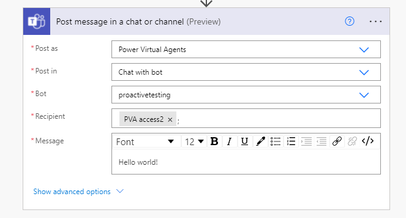

When the flow is run, the recipient will receive the proactive message from the bot in Microsoft Teams.

### Send a proactive adaptive card

In Power Automate, add the Microsoft Teams connector action **Post adaptive card in a chat or channel** at the step where you want to send card in your flow.

1.  Set the **Post as** field to **Power Virtual Agents (Preview)**.

2.  Set the **Post in** field to **Chat with bot**.

3.  Select the bot that you want the message to be posted from.

4.  Provide the recipient's name or email address. You can also use dynamic content if the recipient info comes from an earlier step in the flow.

5.  Provide the adaptive card JSON. See this [example JSON for a weather card](https://adaptivecards.io/samples/WeatherCompact.html).

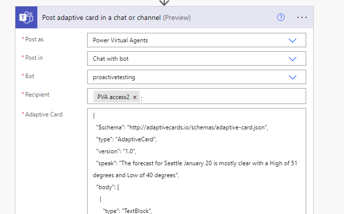

When the flow is run, the recipient will receive the adaptive card from the bot in Microsoft Teams.

### Send a proactive adaptive card and wait for a response

In Power Automate, add the Microsoft Teams connector action **Post adaptive card and wait for a response** at the step where you want to send card in your flow.

1.  Set the **Post as** field to **Power Virtual Agents (Preview)**.

2.  Set the **Post in** field to **Chat with bot**.

3.  Provide the adaptive card JSON. See this [example JSON for an input form](https://adaptivecards.io/samples/InputForm.html).

4.  Provide the update message that the recipient will see after providing their response.

5.  Provide the recipient's name or email address. You can also use dynamic content if the recipient info comes from an earlier step in the flow.

6.  Select the bot that you want the card to be posted from.

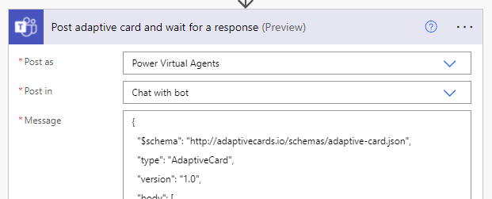

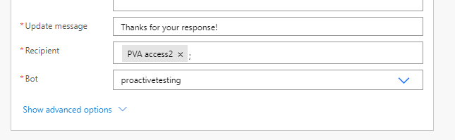

When the flow is run, the recipient will receive the adaptive card from the bot in Microsoft Teams that they can then provide a response to. 

You can use the response from the recipient as dynamic content for later steps in the flow. For example, you could store their responses in a database.

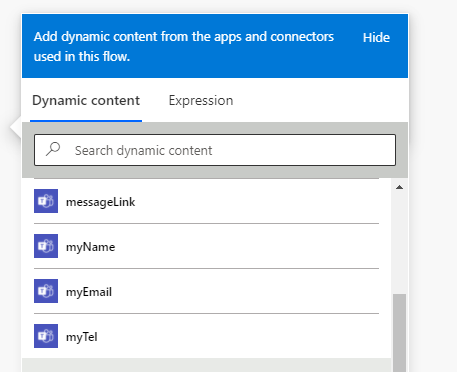

## Send proactive messages or cards to multiple recipients

Depending on the scenario, you may want to send the same proactive message or card to multiple recipients at once. 

This section contains examples for sending messages to multiple recipients.

>[!IMPORTANT]
>The prerequisites detailed in this topic apply to each recipient.  
>For example, you can send the same message to 10 recipients in one action. If three of the 10 recipients do not have the bot installed, then those three recipients won't receive the message.

### Send to teammates

In this example, the bot will send a reminder to the members of a team to complete their online training.

1.  Add the **Microsoft Teams** connector and select the **Get a team** action in your Power Automate flow.

2.  Select the team with the members that you want to send the message to.

3.  Add the **Office 365 Groups** connector and select the **List group members** action.

4.  In the **Group Id** field, select **Custom value**.

5.  Select **Team ID** from the dynamic content of the **Get a team** action.

6.  Add the **Microsoft Teams** connector and select the **Post message in a chat or channel** action.

7.  Select the bot that you want the card to be posted from.

8.  At the **Recipient** field, select the dynamic content **User Principle Name** from the **List group members** action.

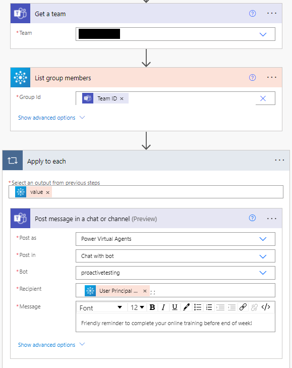

When the flow runs, each user in the team will receive the proactive message in a private chat with the bot.

### Send to a security group

In this example, the bot will send a reminder to a security group to complete their online training.

1.  Add the **Azure AD** connector and select the **Get group members** action in your Power Automate flow.

2.  Provide the Security group's GUID in the **Group Id** field.

3.  Add the **Microsoft Teams** connector and select the **Post message in a chat or channel** action.

4.  Select the bot that you want the card to be posted from.

5.  At the **Recipient** field, select the dynamic content **Group Members User Principle Name** from the **Get group members** action.

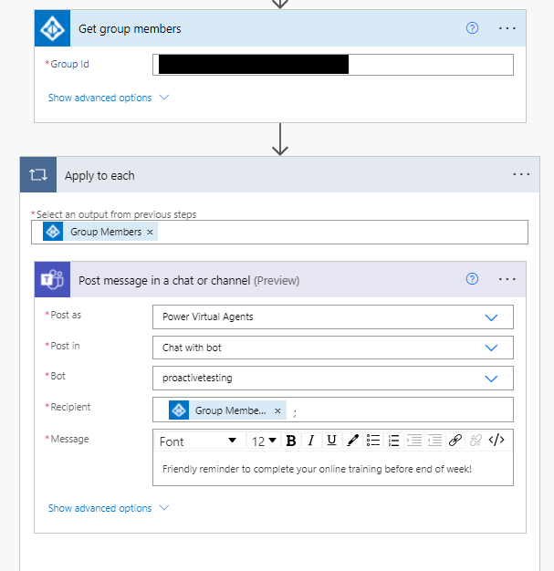

When the flow runs, each user in the security group will receive the proactive message in a private chat with the bot.

### Increase parallelism when sending to multiple recipients

Sometimes you may want to send a message or card to multiple recipients in parallel. For example, sending the same card to multiple recipients and waiting for responses from them. 

By increasing parallelism, the bot will send to more recipients in parallel without waiting for recipients who have received the card to respond, before sending to the next recipient.

1.  Select **. . .** from the **Apply to each** control and select **Settings**.

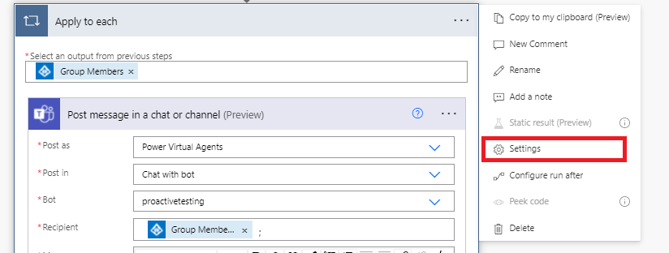

2.  Turn on **Concurrency control** and set the degree of parallelism.

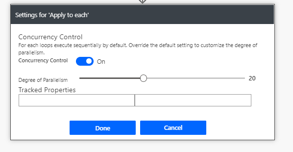

## Configure advanced options for proactive messages

Power Virtual Agents allows you to control detail behavior on your bot under **Show advanced options** in the Microsoft Teams connector.

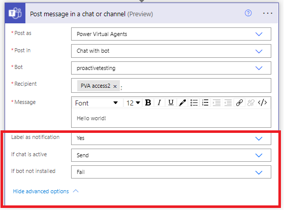

### Label sent message or card as a notification

**Label as notification** controls whether the message or card will have the text **Notification via** in front of the bot's name. Labeling the bot's response allows the recipient to identify the bot's response to their inquiry. 

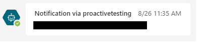

### When the recipient is currently in an active chat with the bot

Sometimes the bot might be sending a proactive message or card when the recipient is in an active conversation with the bot. 

You might want to postpone sending the proactive message or card until they have finished their conversation to not disrupt the conversation flow. 

The **If chat is active** field allows you to control the behavior:

- **Send:** the bot will send the proactive message or card as normal.

- **Don't send and succeed:** the bot won't send the proactive message or card when the recipient is in an active conversation. Status code **300** will be returned.

- **Don't send and fail:** the bot won't send the proactive message or card when the recipient is in an active conversation. The flow run will be marked as a failure.

### When the recipient hasn't installed the bot

The bot can only deliver messages or cards to recipients who have installed the bot in Microsoft Teams. Recipients may not want to install the bot or have uninstalled the bot. 

For lower importance messages or cards, you can set the flow run to be marked as succeeded even when the recipient doesn't have the bot installed. 

The **If bot not installed** field allows you to control the behavior:

- **Fail:** the flow run will be marked as a failure when the recipient hasn't installed the bot in Microsoft Teams.

- **Succeed with status code:** the flow run will be marked as succeeded even though the recipient can't receive the message or card because they haven't installed the bot. Status code **100** will be returned.

### Status code definition

You can use the returned status code to define different follow-up behaviors in your flow. For example, you could specify that the flow should try again over a period of time or log a record about the failure.

| Status code | Succeeded (boolean) | Description                                                                                       |
|-------------|---------------------|---------------------------------------------------------------------------------------------------|
| 200         | True                | Message or card is successfully delivered.                                                         |
| 100         | False               | Message or card couldn't be delivered because the recipient doesn't have the bot installed.          |
| 300         | False               | Message or card couldn't be delivered because the recipient is in an active conversation with the bot. |

## Known limitations

-   All proactive message and cards from Power Virtual Agents are subject to [limits on Power Automate](/power-automate/limits-and-config#throughput-limits) and [throttling limits of the Microsoft Teams connector](/connectors/teams/#limits).
-   All proactive message and cards won't be logged in conversation transcripts or [Analytics sessions](analytics-overview.md).
-   Proactive messages can only be posted to a personal chat with the bot.

