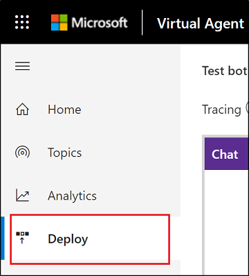
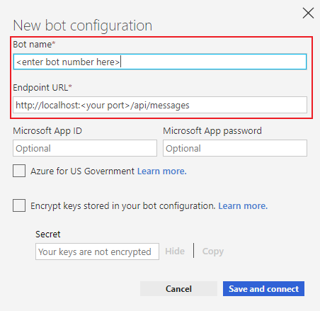

# Use a Microsoft Bot Framework bot with Power Virtual Agents

This article covers how to use the Microsoft Bot Framework dispatcher tool to integrate an existing bot with a Power Virtual Agents bot. It's intended for experienced IT professionals, such as IT admins or developers who have a solid understanding of developer tools, utilities, and integrated development environments (IDEs). 

* [Retrieve topics, utterances and secrets from your Power Virtual Agents bot](#retrieve-topics-and-utterances-from-your-bot)
* [Train the dispatcher custom model with your Power Virtual Agents topics](#train-the-dispatcher-custom-model-with-your-power-virtual-agents-topics)
* [Register and trigger your new dispatch endpoint in code](#register-and-trigger-your-new-dispatch-endpoint-in-code)
* [Deploy your bot and test the dispatcher](#deploy-your-bot-and-test-the-dispatcher)

## Prerequisites

  * Bot built using [Microsoft Bot Framework SDK v4](https://github.com/microsoft/botframework)
  * Understanding of [Microsoft Bot Framework's dispatch tool](https://docs.microsoft.com/azure/bot-service/bot-builder-tutorial-dispatch?view=azure-bot-service-4.0&tabs=csaddref%2Ccsbotconfig&preserve-view=true)
  * Understanding how to [test and debug bots using Bot Framework emulator](https://docs.microsoft.com/azure/bot-service/bot-service-debug-bot?view=azure-bot-service-4.0&preserve-view=true)
  * [!INCLUDE [Medical and emergency usage](includes/pva-usage-limitations.md)]


### Code samples and dependencies

Code snippets used in this document are available in these articles:

  * [Microsoft Bot Framework dispatch tool app sample](https://github.com/Microsoft/BotBuilder-Samples/tree/master/samples/csharp_dotnetcore/14.nlp-with-dispatch)
  * [Content converter](https://go.microsoft.com/fwlink/?linkid=2097857)
  * [Microsoft Bot Framework LUDown utility](https://github.com/microsoft/botbuilder-tools/tree/master/packages/Ludown)
  * [NuGet package manager](https://www.nuget.org/downloads)
  * .NET Core 2.2 runtime: [x86](https://dotnet.microsoft.com/download/thank-you/dotnet-sdk-2.2.300-windows-x86-installer) | [x64](https://dotnet.microsoft.com/download/thank-you/dotnet-sdk-2.2.300-windows-x64-installer)

## Retrieve topics and utterances from your Power Virtual Agents environment

You'll need to retrieve your Power Virtual Agents bot's content (topics and utterances), your tenant's endpoint, and the direct line secret.

### Retrieve bot ID and tenant ID from your bot

1.	In Microsoft Edge, select F12 to open DevTools. (Note: For other browsers, use comparable commands and functionality.)

2.	[Sign in to your Power Virtual Agents environment](https://powerva.microsoft.com) using your Azure Active Directory (Azure AD) credentials. 

3.	Go to the **Network** tab.
    >[!div class="mx-imgBorder"]
    >

4.	Filter and look for client requests.

5.	Copy the following details. 
    ```javascript
    signedInUserAccountInfo.defaultBot.aadTenantId
    signedInUserAccountInfo.defaultBot.id
    signedInUserAccountInfo.defaultBot.name
    ```
6.	Store the above information in a file. You will need it later.

### Retrieve topics and utterances from your bot

  1.	Export `BotContent` and `Annotations` from Microsoft Dataverse. [Review how to export data](https://docs.microsoft.com/power-virtual-agents/gdpr-export).
  
  2.  Download the zip file and unzip it to find two CSV files: `annotations.csv` and `msdynce_botcontents.csv`
  
### Convert the exported content to .LU format

1. Convert your bot content into .lu format using [our ContentConverter utility](https://go.microsoft.com/fwlink/?linkid=2097857).
   
   > [!NOTE]
   > You'll need to download, extract, and have dotnet core runtime to compile and run this utility.

2. Use the following command to compile and run this code sample.

    ```
    dotnet run -p ContentConverter.csproj -c Release -- -i <path to msdynce_botcontents.csv> -c <path to annotations.csv> -b <your bot id>
    ```

3. Convert the `Content.lu` file to LUIS JSON file format.

    ```
    ludown parse ToLuis --in Content.lu
    ```

## Train the dispatcher custom model with your Power Virtual Agents topics

Train and recreate the dispatcher app and add your exported topics and utterances with your existing Cognitive Service intents (for example, LUIS and/or QnA maker) using the dispatch tool. For more information, [follow the guidance in the dispatch tool tutorial](https://docs.microsoft.com/azure/bot-service/bot-builder-tutorial-dispatch?view=azure-bot-service-4.0&tabs=cs&preserve-view=true).

1.  Install the dispatch tool using the NuGet package manager.

    ```
    CMD> npm install -g botdispatch
    ```

2.  Add topics and utterances that you exported earlier using the Dispatch tool.

    ```
    CMD> dispatch add -type file -name l_dynamicsbot -f luis.json
    Enter required fields below.
    
    What name would you like for your dispatch:
    l_dynamicsbot
    What's your LUIS authoring key (from https://www.luis.ai/user/settings):
    <enter authoring key from URL above>
    What's your LUIS authoring region [westus, westeurope, australiaeast]:
    <pick your region: eg. westus>
    File: Content.lu added to l_dynamicsbot.dispatch
    ```

3.  Generate a dispatch model that contains exported topics and utterances.
    > [!NOTE] 
    > You'll need to re-train your dispatch model when more topics are added.

    ```
    CMD> dispatch create
    
    Exporting services for dispatch...
    Creating dispatch LUIS model json...
    Creating training data...
    Updating l_dynamicsbot model...
    Importing l_dynamicsbot model...
    Setting up intents to child services mapping for l_dynamicsbot...
    Add subscription key and publish child LUIS apps...
    Training l_dynamicsbot model...
    Publishing l_dynamicsbot model...
    Writing summary file ('test_prediction')...
    {
      "authoringRegion": "westus",
      "hierarchical": true,
      "useAllTrainingData": false,
      "dontReviseUtterance": false,
      "copyLuisData": true,
      "services": [
        {
          "path": "luis.json",
          "type": "file",
          "name": "l_dynamicsbot"
        }
      ],
      "serviceIds": [
        "1"
      ],
      "appId": "<REDACTED>",
      "authoringKey": "<REDACTED>",
      "version": "Dispatch",
      "region": "westus",
      "type": "dispatch",
      "name": "l_dynamicsbot"
    }
    Please review your dispatch model in ..\Summary.html
    ```

## Register and trigger your new dispatch endpoint in code

The following steps require you to add code that registers your new dispatch endpoint and trigger it whenever a user's utterance matches intent. We are using the [sample provided by the Microsoft Bot Framework](https://github.com/Microsoft/BotBuilder-Samples/tree/master/samples/csharp_dotnetcore/14.nlp-with-dispatch).

1.  Update `appsettings.json` in your dispatcher app to include the new endpoint for your Power Virtual Agents bot.
  
    ```csharp
    {
      "DynamicsBotId": "<Bot Id>",
      "DynamicsBotTenantId": "<Tenant Id>",
      "DynamicsBotName": "<Bot Name>",
      "DynamicsBotTokenEndpoint": "https://powerva.microsoft.com/api/botmanagement/v1/directline/directlinetoken",
    }
    ```

2.  Add a new `DynamicsBot` class to your project.

    ```csharp
    public class DynamicsBotService
    {
      private readonly HttpClient _httpClient;
    
      public DynamicsBotService(DynamicsBotEndpoint endpoint, string botName)
      {
        Endpoint = endpoint;
        BotName = botName;
        ChannelData = new DynamicsBotChannelData(endpoint.BotId, endpoint.TenantId);
        _httpClient = new HttpClient();
      }
    
      public string BotName { get; }
    
      public DynamicsBotChannelData ChannelData { get; }
      public DynamicsBotEndpoint Endpoint { get; }
    
      public async Task<string> GetTokenAsync()
      {
        var httpRequest = new HttpRequestMessage();
        httpRequest.Method = new HttpMethod("GET");
        httpRequest.RequestUri = Endpoint.TokenUrl;
        var response = await _httpClient.SendAsync(httpRequest);
        var responseStr = await response.Content.ReadAsStringAsync();
        return SafeJsonConvert.DeserializeObject<DirectLineToken>(responseStr).token;
      }
    }
    
    public class DynamicsBotChannelData
    {
      public DynamicsBotChannelData(string botId, string tenantId)
      {
          DynamicsBotId = botId;
          DynamicsTenantId = tenantId;
      }
      
      // DO NOT CHANGE property name
      [JsonProperty("cci_bot_id")]
      public string DynamicsBotId { get; }
      
      // DO NOT CHANGE property name
      [JsonProperty("cci_tenant_id")]
      public string DynamicsTenantId { get; }
    }
    
    public class DynamicsBotEndpoint
    {
      public DynamicsBotEndpoint(string botId, string tenantId, string tokenEndPoint)
      {
        BotId = botId;
        TenantId = tenantId;
        UriBuilder uriBuilder = new UriBuilder(tokenEndPoint);
        uriBuilder.Query = $"botId={BotId}&tenantId={TenantId}";
        TokenUrl = uriBuilder.Uri;
      }
    
      public string BotId { get; }
    
      public string TenantId { get; }
    
      public Uri TokenUrl { get; }
    }
    
    public class DirectLineToken
    {
      public string token { get; set; }
    }
    ```

3.  Add a reference to the Power Virtual Agents bot in the `IBotServices.cs` file.
  
    ```csharp
    public interface IBotService
    {
      LuisRecognizer Dispatch { get; }
      QnAMaker SampleQnA { get; }
      DynamicsBotService DynamicsBotService { get; }
    }
    ```
 
4. Update the BotServices constructor to start `DynamicsBotService` in the `BotServices.cs` file.

    ```csharp
    DynamicsBotService = new DynamicsBotService(new DynamicsBotEndpoint(
        configuration["DynamicsBotId"],
        configuration["DynamicsBotTenantId"],
        configuration["DynamicsBotTokenEndpoint"]),
        configuration["DynamicsBotName"]
    );
    ```
  
5.  Update `DispatchBot.cs` to add a trigger for the Power Virtual Agents bot on intent match.
  
    ```csharp
    private async Task ProcessDynamicsBotAsync(ITurnContext<Microsoft.Bot.Schema.IMessageActivity> turnContext, CancellationToken     cancellationToken)
    {
        var token = await _botService.DynamicsBotService.GetTokenAsync();
    
        using (var directLineClient = new DirectLineClient(token))
        {
            var conversation = await directLineClient.Conversations.StartConversationAsync();
            var conversationtId = conversation.ConversationId;
    
            var response = await directLineClient.Conversations.PostActivityAsync(conversationtId, new Microsoft.Bot.Connector.DirectLine.Activity()
            {
                Type = Microsoft.Bot.Connector.DirectLine.ActivityTypes.Message,
                From = new Microsoft.Bot.Connector.DirectLine.ChannelAccount { Id = "userId", Name = "userName" },
                Text = turnContext.Activity.Text,
                ChannelData = JObject.FromObject(_botService.DynamicsBotService.ChannelData),
                TextFormat = "plain",
                Locale = "en-Us",
            });
    
            Thread.Sleep(4000);
    
            var activities = await GetActivitiesAsync(directLineClient, conversationtId, _botService.DynamicsBotService.BotName);
    
            var activity = turnContext.Activity as Microsoft.Bot.Schema.Activity;
    
            await turnContext.SendActivitiesAsync(
                       activities
                       .Select(message =>
                       {
                           var reply = activity.CreateReply(message.Text);
                           reply.Attachments = message?.Attachments?.Select(a => new Microsoft.Bot.Schema.Attachment()
                           {
                               Content = a.Content,
                               ContentType = a.ContentType,
                               ContentUrl = a.ContentUrl
                           }).ToList();
    
                           reply.SuggestedActions = new Microsoft.Bot.Schema.SuggestedActions()
                           {
                               Actions = message?.SuggestedActions?.Actions?.Select(a => new Microsoft.Bot.Schema.CardAction()
                               {
                                   Title = a.Title,
                                   Value = a.Value,
                                   Type = a.Type,
                                   Image = a.Image
                               }).ToList(),
                           };
    
                           return reply;
                       })
                       .ToArray());
        }
    }
    
    private async Task<List<Microsoft.Bot.Connector.DirectLine.Activity>> GetActivitiesAsync(DirectLineClient directLineClient, string conversationtId, string botName)
    {
        ActivitySet response = null;
        List<Microsoft.Bot.Connector.DirectLine.Activity> result = new List<Microsoft.Bot.Connector.DirectLine.Activity>();
        string watermark = null;
    
        do
        {
            response = await directLineClient.Conversations.GetActivitiesAsync(conversationtId, watermark);
            watermark = response.Watermark;
    
            result = response?.Activities?.Where(x =>
              x.Type == Microsoft.Bot.Connector.DirectLine.ActivityTypes.Message &&
                string.Equals(x.From.Name, botName, StringComparison.Ordinal)).ToList();
    
            if (result != null && result.Any())
            { return result; }
    
            Thread.Sleep(1000);
        } while (response.Activities.Any());
    
        return result;
    }
    ```

6.  If you want your Power Virtual Agents bot to handle unmatched intents for a single fallback, update the method `DispatchToTopIntentAsync`.
  
    ```csharp
    case "l_dynamicsbot":
    case "None":
    default:
        await ProcessDynamicsBotAsync(turnContext, cancellationToken);
        break;
    ```

## Deploy your bot and test the dispatcher

You're ready to test your dispatcher to ensure seamless interaction between DynamicsBot and your other bots.

1.  [Publish your bot to a demo website](https://docs.microsoft.com/power-virtual-agents/publication-connect-bot-to-web-channels).    
    >[!div class="mx-imgBorder"]
    
  
2.  Build (Ctrl + Shift + B) and run (F5) your dispatcher app.
  
3.  Open the Bot Emulator where you add the name and endpoint to your bot.
    >[!div class="mx-imgBorder"]
    
