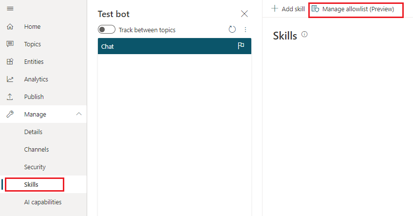
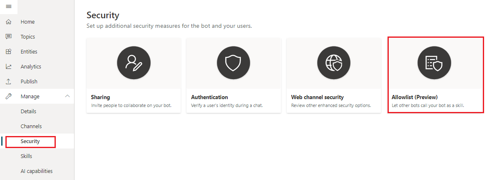
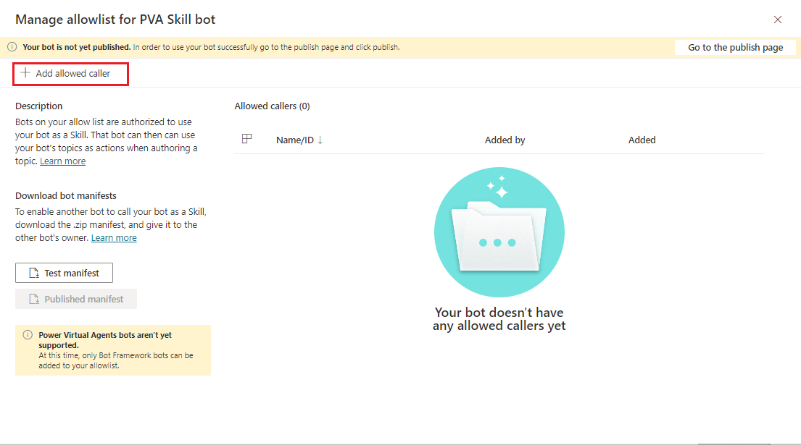

# Use Power Virtual Agents bot as a skill

You can use your Power Virtual Agents bot as a [skill](https://docs.microsoft.com/en-us/azure/bot-service/skills-conceptual?view=azure-bot-service-4.0) with Bot Framewoek bots. 
If you have already built and deployed Bot Framework bots in your organization, this feature will eenable you to extend their functionality by calling Power Virtual Agennts bots as skills.

>[!NOTE]
>This article is intended for system administrators or IT professionals who are familiar with [Bot Framework skills](/azure/bot-service/skills-conceptual?view=azure-bot-service-4.0&preserve-view=true).

>[!IMPORTANT]
>This feature is not available to users who only have the [Teams Power Virtual Agents license](requirements-licensing-subscriptions.md). You must have a [trial](sign-up-individual.md) or full Power Virtual Agents license.

## Prerequisites

- [Skills overview](https://docs.microsoft.com/en-us/azure/bot-service/skills-conceptual?view=azure-bot-service-4.0) 
- [Introduction to Bot Framework Composer](/composer/introduction)
- [Using Skills in Bot Framework Composer](https://docs.microsoft.com/en-us/composer/concept-skills)
- [!INCLUDE [Medical and emergency usage](includes/pva-usage-limitations.md)]

## Allow a Bot Framework bot to call your Power Virtual Agents bot as a skill
In order to sucessfully connect to your Power Vitual Agents bot and use it as a skill, Bot Framework bots must be explicitely added by their App ID to your bot's **Allowlist** in Power Virtual Agents first.
To add a Bot Framework bot to your Power Virtual Agent's **Allowlist**, go to **Manage** tab on the left and choose **Skills** page. Then, click on **Manage allowlist**.

Note that you can also get to your bot's **Allowlist** by using **Security** page under **Manage** tab.

By default, no bots are allowed to connect to your Power Virtual Agents bot and use it as a skill. To allow some bots to use your bot as a skill, you ust first add them to your bot's **Allowlist** by selecting **+ Add allowed caller** button on **Manage allowlist** page.

## Download your Power Virtual Agents bot skill manifest

## Connect to a Power Virtual Agents skill in Composer

## Test Power Virtual Agents bot as a skill for Bot Framework bots
(Test your skill)https://docs.microsoft.com/en-us/composer/how-to-connect-to-a-skill?tabs=v2x#test-in-the-emulator
