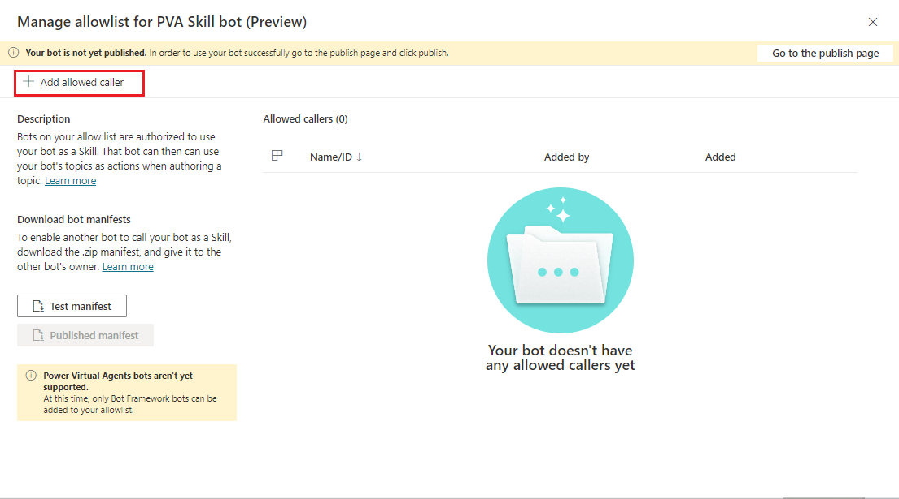
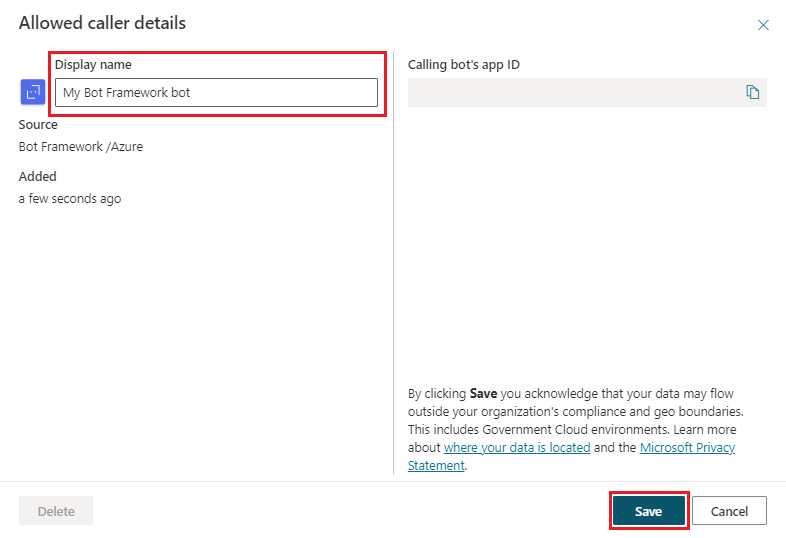

# Use Power Virtual Agents bot as a skill

You can use your Power Virtual Agents bot as a [skill](https://docs.microsoft.com/en-us/azure/bot-service/skills-conceptual?view=azure-bot-service-4.0) with Bot Framewoek bots. 
If you have already built and deployed Bot Framework bots in your organization, this feature will eenable you to extend their functionality by calling Power Virtual Agennts bots as skills.

>[!NOTE]
>This article is intended for system administrators or IT professionals who are familiar with [Bot Framework skills](/azure/bot-service/skills-conceptual?view=azure-bot-service-4.0&preserve-view=true).

>[!IMPORTANT]
>This feature is not available to users who only have the [Teams Power Virtual Agents license](requirements-licensing-subscriptions.md). You must have a [trial](sign-up-individual.md) or full Power Virtual Agents license.

## Prerequisites

- [Skills overview](https://docs.microsoft.com/en-us/azure/bot-service/skills-conceptual?view=azure-bot-service-4.0) 
- [Introduction to Bot Framework Composer](/composer/introduction)
- [Using Skills in Bot Framework Composer](https://docs.microsoft.com/en-us/composer/concept-skills)
- [!INCLUDE [Medical and emergency usage](includes/pva-usage-limitations.md)]

## Allow a Bot Framework bot to call your Power Virtual Agents bot as a skill
In order to sucessfully connect to your Power Vitual Agents bot and use it as a skill, Bot Framework bots must be explicitely added by their App ID to your bot's **Allowlist** in Power Virtual Agents first.
To add a Bot Framework bot to your Power Virtual Agent's **Allowlist**, go to **Manage** tab on the left and choose **Skills** page. Then, click on **Manage allowlist**.

Note that you can also get to your bot's **Allowlist** by using **Security** page under **Manage** tab.

By default, no bots are allowed to connect to your Power Virtual Agents bot and use it as a skill. To allow some bots to use your Power Visrual Agents bot as a skill, you must first add them to your bot's **Allowlist** by selecting **+ Add allowed caller** button on **Manage allowlist** page.

You can only add Bot Framework bots that are deployed in the same organization as the Power Virtual Agents bot that you want to use as a skill. Enter your Bot Frameworks bot's **App ID** and press **Next**.
>[!IMPORTANT]
>Power Virtual Agents cannot act as a skill for other Power Virtual Agents bots. Only **App IDs** that belong to Bot Framework bots can be added to Power Virtual Agents **Allowlist**. Trying to add a **App ID** that belongs to a Power Vietual Agent bot will result in error.

Power Vitual Agents will validate that Bot Framework **App ID** you have entered belongs to bot deolyed in the same organization. Then, you will be able to add a **Display name** to use on the **Allowlist** for this bot (this is optional). Click **Save** to save this **App ID** to your **Allowlist**.

The Bot Framework bot is now added to your **Allowlist** and it will be displayed by the **Dispaly name** (if you have enetered one) or by its **App ID**. You can **Delete** or **Edit** any bot on your **Allowlist** at any time.

## Download your Power Virtual Agents bot skill manifest
Every Power Virtual Agents bot can be used as a skill with Bot Framework bots, provided these Bot Framewoek bots have been added to **Allowlist** first. All Power Virtual Agents bots have a skill manifest, a JSON file that describes skill's name, interface and utterances (trigger phrases). The skill manifest is used by a Bot Framework bot to configure a connection to a Power Virtual Agents bot and leverage it as a skill at runtime.

Power Virtual Agents bot skill manifest provides all of the metadata required for a calling Bot Framewok bot to know when to trigger a skill via user utterance. Bot Framework bot can use the data in skill's manifest to identify when it needs to trigger a skill in response to a user utterance.

When a Bot Framework bot evaluates a user utterance and decides, based on the skill's manifest data, that it needs to be handled by a Power Virtual Agents skill bot, it will pass the entire user utterance to the Power virtual Agents bot to handle. Then, the Power Virtual Agents bot's NLU will match user uttrenace (trigger phrase) to a bot Topic and tigger this Power Virtual Agents Topic. Any Entities in the user utternace needed for slot-filling will also be extracted along the way.

## Connect to a Power Virtual Agents skill in Composer

## Test Power Virtual Agents bot as a skill for Bot Framework bots
(Test your skill)https://docs.microsoft.com/en-us/composer/how-to-connect-to-a-skill?tabs=v2x#test-in-the-emulator
