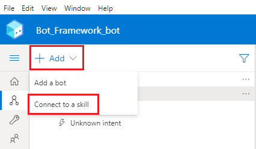

# Use a Power Virtual Agents bot as a skill

You can use your Power Virtual Agents bot as a [skill](/azure/bot-service/skills-conceptual?view=azure-bot-service-4.0&preserve-view=true) with Bot Framework bots. 

If you already have Bot Framework bots in your organization, you can call a Power Virtual Agents bot as a skill from within your Bot Framework bots.

When you add a Power Virtual Agents bot as a skill, the Bot Framework bot will determine if anything the bot user says matches [with any of the trigger phrases in the Power Virtual Agent's bot](authoring-create-edit-topics.md). 

If there is a match, the Bot Framework bot will invoke the Power Virtual Agents bot and pass the entire user utterance to it to extract any [entities](advanced-entities-slot-filling.md) and trigger a matching Power Virtual Agents topic.

>[!NOTE]
>This article is intended for system administrators or IT professionals who are familiar with [Bot Framework skills](/azure/bot-service/skills-conceptual?view=azure-bot-service-4.0&preserve-view=true).

>[!IMPORTANT]
>This feature is not available with the [Teams Power Virtual Agents license](requirements-licensing-subscriptions.md).  
>You must have a [trial](sign-up-individual.md) or full Power Virtual Agents license.

To set up your Power Virtual Agents bot as a skill:

1. You add the Bot Framework bot to the allowlist for the Power Virtual Agents bot.
2. You download the skill manifest for the Power Virtual Agents bot.
3. You use the downloaded skill manifest in Bot Framework Composer to create a connection between the bots.
3. You test the bot works as a skill by using the Bot Framework Emulator.

## Prerequisites

- [Understand how Bot Framework skills work](/azure/bot-service/skills-conceptual?view=azure-bot-service-4.0&preserve-view=true) 
- [Learn how to use Bot Framework Composer](/composer/introduction)
- [Learn how to use skills in Bot Framework Composer](/composer/concept-skills)
- [Get your Bot Framework bot's app ID](/azure/bot-service/bot-service-manage-overview#get-azure-bot-resource-app-id)
- [!INCLUDE [Medical and emergency usage](includes/pva-usage-limitations.md)]

## Add your Bot Framework bot to the allowlist for your Power Virtual Agents bot

Add the Bot Framework bot's app ID to the allowlist for the Power Virtual Agents bot that you want to use as a skill.

The Bot Framework and Power Virtual Agents bots must be deployed in the same tenant.

1. In Power Virtual Agents, expand the **Manage** section on the side navigation pane for the bot you want to use as a skill, and go to the **Skills** tab.

2. Select **Manage allowlist** on the top menu bar.

    :::image type="content" source="media/PVA-as-a-skill/Skill_ManageAllowlistMenu.png" alt-text="Screenshot highlighting the Manage, Skills, and Manage allowlist elements in the web portal.":::

    >[!TIP]  
    >You can also get to your bot's allowlist by going to the **Security** tab under **Manage** on the side navigation pane.
    >
    >:::image type="content" source="media/PVA-as-a-skill/Skill_ManageAllowlistSecurity.png" alt-text="Screenshot of the allowlist tile on the Security or Authentication page.":::

3. Select **+ Add allowed caller** on the **Manage allowlist for \<bot name\>** panel.

    :::image type="content" source="media/PVA-as-a-skill/Skill_AddAllowedCallers.png" alt-text="Highlight of the Add allowed called button at the top of the Manage allowlist flyout panel.":::

4. Enter your Bot Frameworks bot's [app ID](/azure/bot-service/bot-service-manage-overview#get-azure-bot-resource-app-id) and select **Next**.

    :::image type="content" source="media/PVA-as-a-skill/Skill_AddBotAppID.png" alt-text="Screenshot of the Add allowed caller dialog window.":::

    >[!TIP]
    >You can find your Bot Framework bot's app ID in Composer, in the **Development Resources** section under the **Configure** tab.  
    >  
    >:::image type="content" source="media/PVA-as-a-skill/Composer_BotAppID.png" alt-text="Composer - Bot App ID.":::

    >[!CAUTION]  
    >Power Virtual Agents cannot act as a skill for other Power Virtual Agents bots. 
    >
    >Only Bot Framework bots can be added to the Power Virtual Agents allowlist. Trying to add a bot app ID that belongs to a Power Virtual Agent bot will result in an error.

    Power Virtual Agents will validate the Bot Framework bot's app ID and confirm that it belongs to a bot deployed in the same tenant. 

5. You can optionally add a **Display name** for the bot you've added.

    :::image type="content" source="media/PVA-as-a-skill/Skill_AllowedCallerDisplayName.png" alt-text="Add a display name for the bot on the allowlist.":::

6. Select **Save** to add your bot to the allowlist.

The Bot Framework bot will be displayed by the **Display name** (if you entered one) or by its **App ID**. You can **Delete** or **Edit** it at any time from the **Manage allowlist for \<bot name\>** panel.

:::image type="content" source="media/PVA-as-a-skill/Skill_AllowedCallerAdded.png" alt-text="The manage allowlist panel showing a list of allowed bot.":::

## Download the bot skill manifest for your Power Virtual Agents bot

Bot Framework bots can use a Power Virtual Agents skill manifest to configure a connection to the bot that produced the manifest. 

All Power Virtual Agents bots have skill manifests, which are JSON files that describe a skill's name, interface, and trigger phrases.

By using the manifest, the Bot Framework bot will know when to trigger the Power Virtual Agents bot (for example, in response to something a user says to the bot).

Power Virtual Agents skill manifests are implemented according to [version 2.2 of the Bot Framework skill manifest schema](/azure/bot-service/skills-write-manifest#the-skill-manifest) and consist of *intents.lu* and *manifest.json* files.

When a Bot Framework bot decides, based on the manifest data, that what the user said should be handled by a Power Virtual Agents bot, it will pass the entire user utterance to it. Then, the Power Virtual Agents bot's own NLU will match this user utterance [to a Power Virtual Agents topic](authoring-create-edit-topics.md), extract any [entities needed for slot-filling](advanced-entities-slot-filling.md), and trigger the Power Virtual Agents topic.

All Power Virtual Agents skill manifests are automatically generated and updated. A Power Virtual Agents bot has two skill manifests: 

- **Test manifest**: Allows the Bot Framework bot to connect to the test version of your Power Virtual Agents bot. You can use the test manifest to validate changes in your skill before publishing it.  
    - The test manifest is immediately available for every newly created Power Virtual Agents bot.  
    It is automatically updated to reflect the changes every time you **save** bot content. 

- **Published manifest**: Allows the Bot Framework bot to connect to the published version of your Power Virtual Agents bot.  
    - The published manifest is only available for Power Virtual Agents bots that have been published at least once.  
    - It is automatically updated to reflect the changes every time you [**publish** your bot](publication-fundamentals-publish-channels.md#publish-the-latest-bot-content).

>[!NOTE]
> The **Published manifest** is not available in Power Virtual Agents bots that have never been published.  
>  
>To generate your bot's **Published manifest**, your need to [publish your Power Virtual Agents bot](publication-fundamentals-publish-channels.md). 

Both skill manifests can be found on **Manage allowlist** panel.
:::image type="content" source="media/PVA-as-a-skill/Skill_Manifest1.png" alt-text="Power Virtual Agents bot Manifests on the Manage Allowlist panel.":::

Additionally, you can find the skill manifests on the **Details** tab under the **Manage** section on the side navigation pane. The **Details** tab shows other metadata like **Environment ID**, **Tenant ID** and **Bot app ID**.

:::image type="content" source="media/PVA-as-a-skill/Skill_Manifest2.png" alt-text="Power Virtual Agents bot Manifests on Details page":::

Selecting either manifest will download them as a .zip file labelled *\<bot name\>_manifest* for the **Published manifest** or *\<bot name\>_test__manifest* for the **Test manifest**.

:::image type="content" source="media/PVA-as-a-skill/Manifests_Zip.png" alt-text="Power Virtual Agents - Downloaded Test and Published Manifests":::

>[!NOTE]
> System topics and Composer dialogs added to a Power Virtual Agents bot will not be included in the skill manifest. Only user-created topics and Composer intent triggers added to the bot will be added to the Power Virtual Agents bot skill manifest.

## Connect to a Power Virtual Agents skill in Composer

You can use Power Virtual Agents bot skill manifests to create a skill connection in your Bot Framework bot in Composer:

1. In a Bot Framework Composer project, select **+ Add** and then **Connect to a skill**.

    

2. On the **Add a skill** screen, select a Power Virtual Agents manifest .zip archive and then **Next**.

    

3. Select what Power Virtual Agents bot skill's topics you want to add to your Bot Framework bot and select **Next**.

    

4. Review and edit your Power Virtual Agents bot skill's trigger phrases and select **Next**.

    

5. Make sure the **Orchestrator** option is checked and select **Continue**.

    

6. Verify that the Power Virtual Agents skill is added to your Bot Framework bot correctly and a new trigger with your Power Virtual Agents bot's name is added to the project in Composer.

    

## Test you Power Virtual Agents bot as a skill with a Bot Framework bot

You can test that your Bot Framework bot is properly calling a Power Virtual Agents bot as a skill by using the [Bot Framework Emulator](/composer/how-to-connect-to-a-skill#test-in-the-emulator).

>[!IMPORTANT]
>Your Bot Framework bot must be added to the Power Virtual Agents bot's allowlist for the skill connection to work.

## Learn More

To learn more about developing in Bot Framework Composer and using skills, see these resources:
- [Skills overview](/azure/bot-service/skills-conceptual?view=azure-bot-service-4.0&preserve-view=true)
- [Skills manifest](/azure/bot-service/skills-write-manifest?view=azure-bot-service-4.0&preserve-view=true&tabs=v2-2)
- [Bot Framework Composer documentation](/composer/) 
- [Skills in Composer](/composer/concept-skills)
- [Connect to a remote skill in Composer](/composer/how-to-connect-to-a-skill?tabs=v2x)
- [Test your skill in Emulator](/composer/how-to-connect-to-a-skill?tabs=v2x#test-in-the-emulator)

[!INCLUDE[footer-include](includes/footer-banner.md)]
