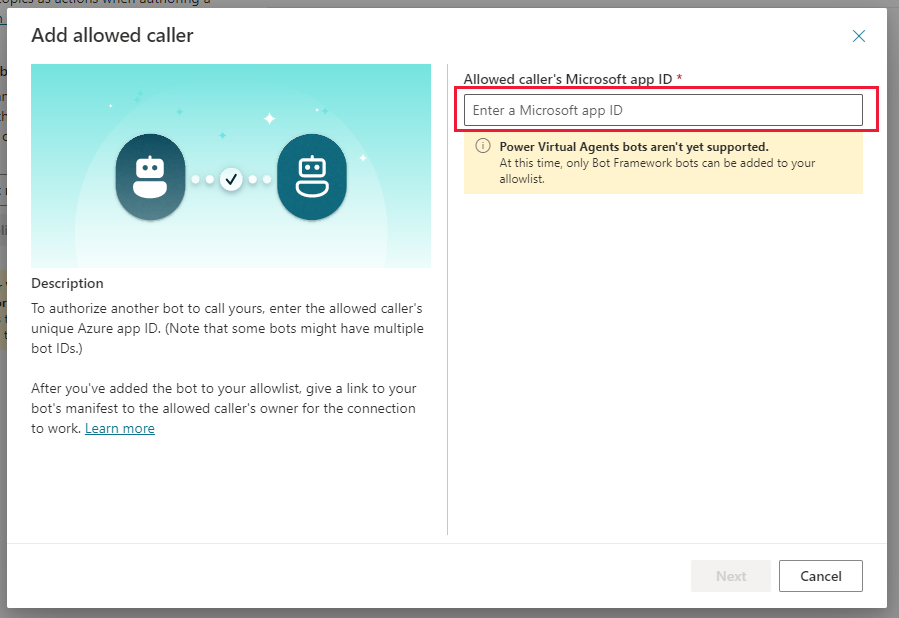
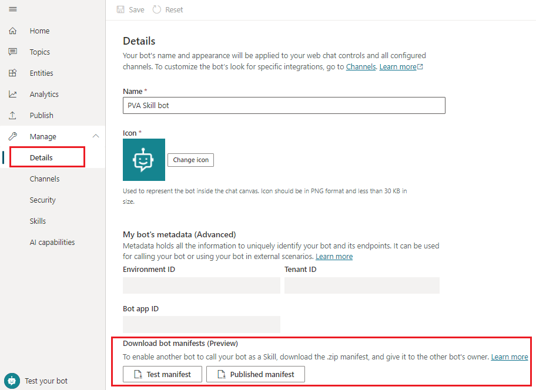

# Use Power Virtual Agents bot as a skill

You can use your Power Virtual Agents bot as a [skill](https://docs.microsoft.com/en-us/azure/bot-service/skills-conceptual?view=azure-bot-service-4.0) with Bot Framework bots. 
 If you have already built and deployed Bot Framework bots in your organization, this feature will enable you to extend their functionality by calling Power Virtual Agents bots as skills.

>[!NOTE]
>This article is intended for system administrators or IT professionals who are familiar with [Bot Framework skills](/azure/bot-service/skills-conceptual?view=azure-bot-service-4.0&preserve-view=true).

>[!IMPORTANT]
>This feature is not available to users who only have the [Teams Power Virtual Agents license](requirements-licensing-subscriptions.md). You must have a [trial](sign-up-individual.md) or full Power Virtual Agents license.

## Prerequisites

- [Skills overview](https://docs.microsoft.com/en-us/azure/bot-service/skills-conceptual?view=azure-bot-service-4.0) 
- [Introduction to Bot Framework Composer](/composer/introduction)
- [Using Skills in Bot Framework Composer](https://docs.microsoft.com/en-us/composer/concept-skills)
- [!INCLUDE [Medical and emergency usage](includes/pva-usage-limitations.md)]

## Allow a Bot Framework bot to call your Power Virtual Agents bot as a skill
To connect to your Power Virtual Agents bot and use it as a skill, Bot Framework bots must be added to your bot's **Allowlist** in Power Virtual Agents first. To add a Bot Framework bot to your Power Virtual Agents bot’s **Allowlist**, go to **Manage** tab on the left and choose **Skills** page. Then, click on **Manage allowlist**.

Note that you can also get to your bot's **Allowlist** by using **Security** page under **Manage** tab.

By default, no bots can use your Power Virtual Agents bot as a skill. To enable some Bot Framework bots to connect to your Power Virtual Agents bot and use it as a skill, add them to your bot's **Allowlist** by selecting **+ Add allowed caller** button on **Manage allowlist** panel.

Only the Bot Framework bots that are deployed in the same tenant as the Power Virtual Agents can be added to the **Allowlist**. Enter your Bot Frameworks bot's **App ID** and press Next.
>[!IMPORTANT]
>Power Virtual Agents cannot act as a skill for other Power Virtual Agents bots. Only Bot Framework bots can be added to Power Virtual Agents **Allowlist**. Trying to add a bot **App ID** that belongs to a Power Virtual Agent bot will result in error.

As a next step, Power Virtual Agents will validate that Bot Framework bot **App ID** you have entered is valid and belongs to bot deployed in the same tenant. Then, you will be able to add a **Display name** to use on the **Allowlist** for this bot (this is optional). 

The Bot Framework bot is now added to your **Allowlist** and it will be displayed by the **Dispaly name** (if you have entered one) or by its **App ID**. You can **Delete** or **Edit** it at any time.

## Download your Power Virtual Agents bot skill manifest
Every Power Virtual Agents bot can be used as a skill with Bot Framework bots (provided these Bot Framework bots have been added to Allowlist). All Power Virtual Agents bots have skill manifests, a JSON file that describes skill's name, interface, and skill's trigger phrases.Power Virtual Agents bot skill manifests are implemented accroding to [version 2.2](https://docs.microsoft.com/en-us/azure/bot-service/skills-write-manifest?view=azure-bot-service-4.0&tabs=v2-2) skill manifest schema.

Bot Framework bots can use Power Virtual Agents bot skill manifest to configure a skill connection to the bot that produced this manifest. At runtime, a Bot Framework bot can use the data in Power Virtual Agents bot skill's manifest to identify when it needs to trigger this skill in response to a user utterance.

When a Bot Framework bot decides, based on the manifest data, that a user utterance needs to be handled by a Power Virtual Agents skill bot, it will pass the entire user utterance to it. Then, the Power Virtual Agents skill bot's own NLU will match this user utterance to a Power Virtual Agents **Topic**, extract any **Entities** needed for slot-filling and trigger this Power Virtual Agents **Topic**.

All Power Virtual Agents skill manifests are automatically generated and updated. A Virtual Agents bot has 2 different skill manifests, **Test manifest** and **Published manifest**.

•	**Test manifest** -- allows to connect to the **Test** version of your Power Virtual Agents bot. The Test manifest is immediately available for every newly created Power Virtual Agents bot. It is automatically updated to reflect the changes every time you **Save** bot content. You can use the Test manifest to test out the changes in your skill with before **Publishing** them.
•	**Published manifest** -- allows to connect to the **Published** version of your Power Virtual Agents bot. The **Published manifest** is only available for Power Virtual Agents bots that have been **Published** at least once. It is automatically updated to reflect the changes every time you **Publish** your bot.

>[!NOTE]
> The **Published manifest** is not available in Power Virtual Agents bots that have never been **Published**.  To generate your bot's **Published manifest**, your need to [publish your Power Virtual Agents bot](https://docs.microsoft.com/en-us/power-virtual-agents/publication-fundamentals-publish-channels). 

Both Power Virtual Agents bot's skill manifests can be found on **Manage allowlist** panel.

Additionally, you can find Power Virtual Agents bot's skill manifests on **Details** page under **Manage** tab along other bot's metadata like **Environment ID**, **Tenant ID** and **Bot app ID**.

Click the buttons to download **Test manifest** or **Published manifest** as .zip archives.

**Test manifest** and **Published manifest** follow [version 2.2](https://docs.microsoft.com/en-us/azure/bot-service/skills-write-manifest?view=azure-bot-service-4.0&tabs=v2-2) of Bot Framework skill manifest schema and consist of **intents.lu** and **manifest.json** files.

## Connect to a Power Virtual Agents skill in Composer

You can use the Power Virtual Agents bot skill **Test manifest** or **Published manifest** that you have downloaded in a .zip archive to create a skill connection in your Bot Framework bot in Composer.

In Bot Framework Composer project, use **+ Add** button and choose **Connect to a skill** menu option.

On **Add a skill** screen, select a Power Virtual Agents manifest .zip archive and press **Next**.

Select what Power Virtual Agents bot skill's Topics you want to add to your Bot Framework bot and press **Next**.

Review and edit your Power Virtual Agents bot skill's Trigger Phrases and press **Next**.

Make sure the **Orchestrator** option is checked and press **Continue**.

Verify that Power Virtual Agents skill is added to your Bot Framework bot correctly and a new **trigger** with your Power Virtual Agents bot's name is added to the project in Composer.

>[!IMPORTANT]
>Your Bot Framework bot must be added to the Power Virtual Agents bot's **Allowlist** for the skill connection to work!

## Test Power Virtual Agents bot as a skill with a Bot Framework bot
You can test your Bot Framework bot calling a Power Virtual Agents bot as a skill by using [Emulator](https://docs.microsoft.com/en-us/composer/how-to-connect-to-a-skill?tabs=v2x#test-in-the-emulator).

Please make sure that your Bot Framework bot **App ID** is added to the Power Virtual Agents bot's **Allowlist** of your Power Virtual Agents bot first before testing. You can find your Bot Framework bot's **App ID** by going to **Configure** tab and selecting **Development Resources** section in Composer. 

## Learn More

To learn more about developing in Bot Framework Composer and using skills, see these resources:
- [Skills overview](https://docs.microsoft.com/en-us/azure/bot-service/skills-conceptual?view=azure-bot-service-4.0)
- [Skills manifest](https://docs.microsoft.com/en-us/azure/bot-service/skills-write-manifest?view=azure-bot-service-4.0&tabs=v2-2)
- [Bot Framework Composer documentation](/composer/) 
- [Tour of Composer](/composer/quickstart-tour-of-composer)
- [Tutorial: Create a new bot](/composer/tutorial/tutorial-create-bot)
- [Skills in Composer](https://docs.microsoft.com/en-us/composer/concept-skills)
- [Connect to a remote skill in Composer](https://docs.microsoft.com/en-us/composer/how-to-connect-to-a-skill?tabs=v2x)

[!INCLUDE[footer-include](includes/footer-banner.md)]
