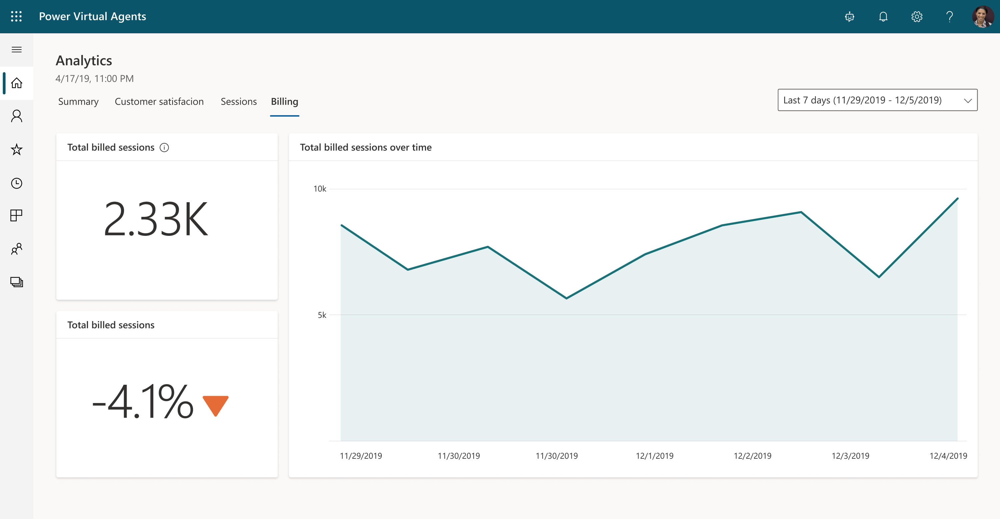

# View billed sessions for Power Virtual Agents in Teams

Select the version of Power Virtual Agents you're using here:

> [!div class="op_single_selector"]
> - [Power Virtual Agents web app](analytics-billed-sessions.md)
> - [Power Virtual Agents app in Microsoft Teams](teams/analytics-billed-sessions-teams.md)

When you purchase a Power Virtual Agents license, you gain capacity for the specified number of billed sessions. Power Virtual Agents pools this capacity across the entire tenant. 

The consumption of the capacity isn't reported at the tenant level, but can be seen for each individual bot. 

## Prerequisites

- [!INCLUDE [Medical and emergency usage](includes/pva-usage-limitations.md)]

## Find the number of billed sessions for your bot

1. In Power Virtual Agents, select **Analytics** from the side navigation pane.

1. Go to the **Billing** tab.

    

You can change the date range to filter the **Total billed sessions over time** chart. You can also see the total billed sessions and trend percentage next to the chart.

## Definition of a billed session

A *billed session* is an interaction between a customer and a bot, and represents one unit of consumption. 

The billed session begins when a user topic is triggered. More information: [Use system and sample topics section](authoring-create-edit-topics.md#use-system-and-sample-topics)

A session ends for one of the following reasons: 

- The user ends the chat session.  
    When the bot doesn't receive a new message for more than 30 minutes, the session is considered closed.

- The session is longer than 60 minutes.  
    The first message that occurs after 60 minutes starts a new session.

- The session has more than 100 turns. A *turn* is defined as one exchange between a user and the bot.  
    The one-hundred-and-first turn starts a new session. 

> [!NOTE]
> Sessions that use the [embedded test chat](authoring-test-bot.md) or that only leverage capabilities included with the Power Virtual Agents for Microsoft Teams plan don't count toward the billed sessions.
> The Billed Session report doesn't distinguish between the sessions included in the Power Virtual Agents for Microsoft Teams plan and those that are not. You might see an inflated number of billed sessions in the report.

## Frequently asked questions

### What's the difference between total sessions, engaged sessions, and billed sessions?

The number of **billed sessions** is used to measure capacity, and is allocated when you purchase a license. 

**Total sessions** and **engaged sessions** are metrics used to determine how efficient a bot is in addressing a user's questions. 

More information: [Analyze bot performance and usage in Power Virtual Agents](analytics-summary.md)

### Where can I see the total number of billed sessions for my organization?

Currently, you can only see billed sessions for a single bot.

### If I'm on a trial subscription but have some billed sessions, do I have to pay?

If you see billed sessions, it doesn't mean you'll be charged. For example, the [trial offer](sign-up-individual.md) provides you with a number of billed sessions.
