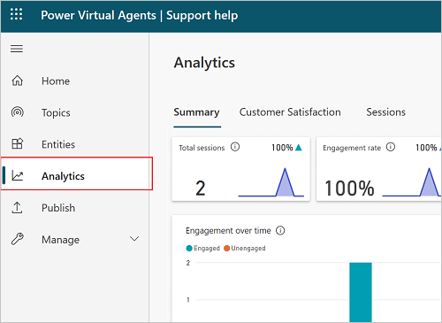

# Analysis in Power Virtual Agents

Select the version of Power Virtual Agents you're using here:

> [!div class="op_single_selector"]
> - [Power Virtual Agents web app](analytics-overview.md)
> - [Power Virtual Agents app in Microsoft Teams](teams/analytics-overview-teams.md)

Power Virtual Agents has a comprehensive set of analytics that show you the key performance indicators for your bot.

Multiple charts show you trends and usage for your bot's topics. These charts use AI to highlight the topics that have the greatest impact on your bot's performance.

>
> [!VIDEO https://www.microsoft.com/en-us/videoplayer/embed/RE4mNOu]
>

## Prerequisites

- [!INCLUDE [Medical and emergency usage](includes/pva-usage-limitations.md)]

## Analytics in Power Virtual Agents

The analytics section is divided into a number of pages to give you multiple ways to understand bot performance.

>[!NOTE]
>Although transcripts are available immediately, the analytics dashboards are updated every hour, so there will be some delay before you see all data.

#### View analytics

* In Power Virtual Agents, select **Analytics** on the side navigation pane.

### See also

Topic | Description
- | -
[Analyze bot performance and usage](analytics-summary.md) | Review overall analytics for your bots.
[Analyze customer satisfaction](analytics-csat.md) | Identify overall trends in customer satisfaction, and where satisfaction is falling behind.
[Analyze topic usage](analytics-topic-details.md) | See how individual topics are doing and how well they're working at resolving issues.
[Analyze session information](analytics-sessions.md) | Review and monitor how sessions are doing, including analytics from the topics triggered during a session.
[Analyze billed session information](analytics-billed-sessions.md) | Understand how sessions are being billed, based on their usage.
