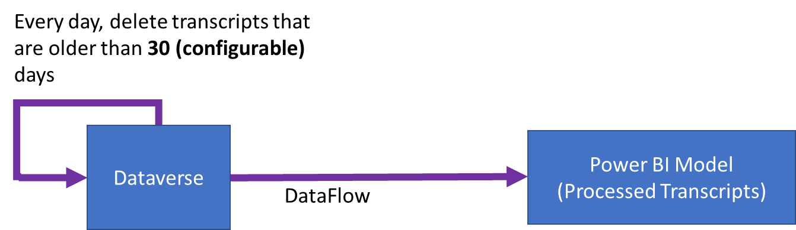
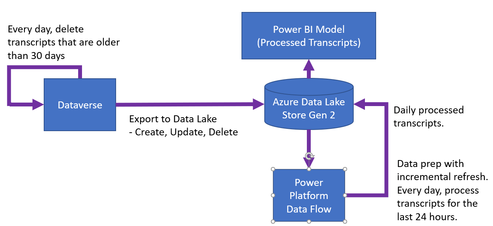
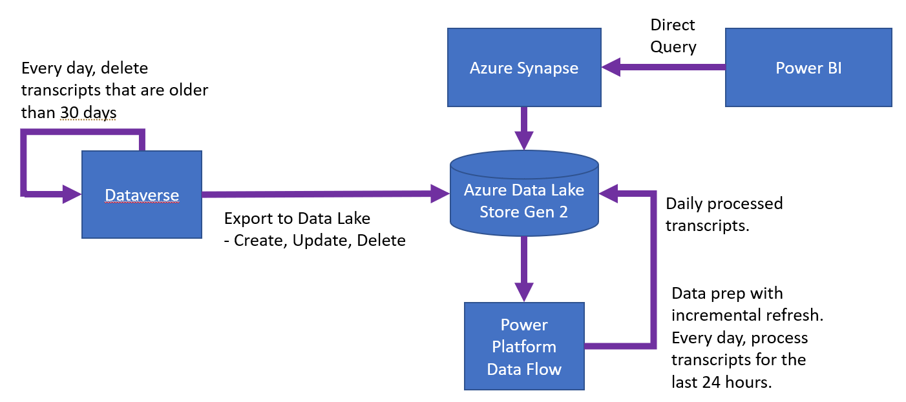

# Work with conversation transcripts

Conversation transcripts exported from Microsoft Dataverse contain a number of fields. The following are the most relevant to chatbots created with Power Virtual Agents:

| **Field**                     | **Description**                                                                                        |
|-------------------------------|--------------------------------------------------------------------------------------------------------|
| *Content*                     | The entire transcript in JSON format.                                                                  |
| *ConversationStartTime*       | The start time of the conversation (not the time the transcript record was written to the data store). |
| *Conversationtranscript*      | Unique identifier for entity instances.                                                                |
| *Metadata*                    | JSON that includes the *Bot Id*, *Tenant Id*, and*Bot Name*.                                          |
| *Name*                        | The name of the custom entity which is created from the *conversationid*, followed by*botid*.         |
| *bot\_conversationtranscript* | Conversation transcripts related to customer interactions with a chatbot.                              |
| *Created on*                  | Date and time when the transcript record was created.                                                  |

## Content field

The *Content* field is a raw log of all the activities users have with the bot. Common activity types include*message* and*event*:

-   *Message* activities represent content shown within a conversation.*Message* activities may contain text, speech, interactive cards, and binary or unknown attachments.

-   *Event* activities communicate programmatic information from a client or channel to a bot.

For more information on activity types, see the [Bot Framework Activity schema](https://github.com/Microsoft/botframework-sdk/blob/master/specs/botframework-activity/botframework-activity.md).

The following are some of the key fields you will find within the *Content* JSON:

| **Key** | **Description** |
|-------------------------|-------------------------|
| <em>Id</em> | Unique GUID to identify the activity object. |
| <em>valueType</em> | Indicator of the type of value stored in the activity. This indicator dictates what information is being provided by this activity. See [Common activity value types](#common-activity-value-types). |
| <em>timestamp</em> | Timestamp of when the activity was generated in Epoch format (number of seconds since midnight UTC Jan 1, 1970). |
| <em>type</em> | The type of activity (for example, <em>message</em>, <em>event</em>, <em>trace</em>). |
| <em>replyToId</em> | The ID of the activity that the current activity is responding to. |
| <em>from</em> | Contains fields "id" and "role": <ul> <li>"id" - the id of the invoker</li> <li>"role" - holds 0 or 1</li> </ul> <ul> <li>0 – activity is coming from bot</li> <li>1 – activity is coming from the user interacting with the bot</li> </ul> Notes: <blockquote> The "id" can be used to calculate the number of active users that are interacting with the bot, provided that the canvas is passing in a unique ID of the user. If the canvas does not pass an ID, a unique ID per conversation is passed. The ID is hashed before being written to the transcript for security and privacy considerations. </blockquote> |
| <em>channelId</em> | ID of where the activity is coming from (for example, <em>directline</em>, <em>msteams</em>, <em>facebook</em>). |
| <em>textFormat</em> | Format of the text (for example, <em>plain</em>, <em>markdown</em>). |
| <em>attachments</em> | Holds dynamic rich data associated with the activity (for example, <em>AdaptiveCards</em>, <em>HeroCards</em>, <em>Carousal data</em>) |
| <em>text</em> | The text for <em>message</em> activities. |
| <em>value</em> | Fields specific to the activity based on the value type, this is where most of the useful information exists. |
| <em>channeldata</em> | <ul> <li>Contains channel data:  for messages: <ul> <li><em>DialogTraceDetail</em></li> <li><em>DialogErrorDetail</em></li> <li><em>VariableDetail</em> <ul> <li>Contains the value assigned to a variable.</li> </ul></li> <li><em>CurrentMessageDetail</em></li> </ul></li> <li>for events: <ul> <li><em>cci_trace_id</em></li> <li><em>traceHistory</em></li> <li><em>enableDiagnostics</em></li> <li><em>clientTimestamp</em></li> <li><em>clientActivityId</em></li> </ul></li> </ul> |
| <em>name</em> | Name of the event activity (for example, <em>SetPVAContext</em>) |

### Common activity value types 

| **Activity value type** | **Description**                                                                                                                                                                 |
|-------------------------|---------------------------------------------------------------------------------------------------------------------------------------------------------------------------------|
| *ConversationInfo*      | Contains whether the conversation is from the Power Virtual Agents app's test pane (*isDesignMode*) and the locale of the conversation.                                         |
| *CSATSurveyRequest*     | User is presented with a customer satisfaction (CSAT) survey.                                                                                                                   |
| *CSATSurveyResponse*    | User responds to a CSAT survey.                                                                                                                                                 |
| *DialogRedirect*        | User is redirected to another topic.                                                                                                                                            |
| *ImpliedSuccess*        | User has reached a question node in the topic, where one of the conditions points to the "Confirmed Success" CSAT system topic or calls the "End of Conversation" system topic. |
| *intentCandidates*      | A topic was triggered from a list of options because of ambiguity in the trigger phrases.                                                                                       |
| *IntentRecognition*     | A topic was triggered directly by the user.                                                                                                                                     |
| *PRRSurveyRequest*      | The user was asked whether the topic answered their question from the "End of Conversation" topic                                                                               |
| *PRRSurveyResponse*     | The user's response to whether the topic answered their question from the "End of Conversation" topic                                                                           |
| *SessionInfo*           | Contains the type (*unengaged* or*engaged*), outcome (*Escalated*, *Resolved*, *Abandon*) and the turn count of the session.                                                   |
| *VariableAssignment*    | A value has been assigned to a variable.                                                                                                                                        |

To convert the ID of the dialog being redirected to, a user can [use the bot's content](https://docs.microsoft.com/en-us/power-virtual-agents/gdpr-export#export-the-bot-content).

## Building custom reports from conversation transcripts

There are a few approaches one can take to build custom reports form conversation transcripts based on the number of messages that need to be processed.?

### Lightweight approach

[Connect Power BI to Dataverse with a Power BI dataflow](https://github.com/microsoft/PowerVirtualAgentsSamples/tree/master/CustomAnalytics). No additional infrastructure is required and with every refresh all records will be retrieved from Dataverse.

| Pros | Cons |
|-------------------------|-------------------------|
| Easiest implementation. | Refresh time may increase as transcripts increase. High cost for storage within Dataverse.? |

### Standard Azure Data Lake Store approach

Export Dataverse data to Azure Data Lake Store.

This requires an Azure Storage account, but no other azure infrastructure.

Use a Power Platform dataflow to perform data prep on the transcripts and extract the data into a structured form.

Power BI refreshes data from the Dataflow and all compute infrastructure is managed by Power Platform amd Power BI. During every refresh, records for a certain day will be retrieved from Dataverse.

| Pros | Cons |
|-------------------------|-------------------------|
| Low storage cost in Azure Data Lake Store. Moderately simple implementation. No Azure Compute required. | Refresh time may increase as transcripts each day increase. |

### Azure Data Lake Store (ADLS) + Synapse approach

If data size in the Standard Azure Data Lake Store approach causes slow refreshes or other operational problems, you can use [Azure Synapse Analytics](https://azure.microsoft.com/en-us/services/synapse-analytics/) and integrate it [into Power BI](https://powerbi.microsoft.com/en-us/blog/announcing-azure-synapse-analytics-public-preview/).

| Pros | Cons |
|-------------------------|-------------------------|
| Refresh time is constant. Moderately simple implementation. Low storage cost in Azure Data Lake Store. | Compute cost for Azure Synapse. |

## Tips for getting the most out of your conversation transcripts

[Variables can be used to store data relevant to your bot content](#A) or bot user. Parsing out the variable and its value from the conversation transcript lets you filter or slice the data by the variable

In many places the conversation transcripts refer to content by its ID. For example, the ID of the topic that is being redirected to by the current topic is only referenced by its ID. To get the name of the topic, look up the name of the topic [from the bot content](https://docs.microsoft.com/en-us/power-virtual-agents/gdpr-export#export-the-bot-content).

[!INCLUDE[footer-include](includes/footer-banner.md)]