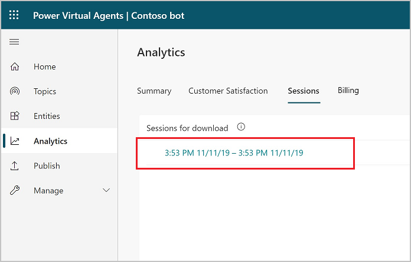

# Analyze session information in Power Virtual Agents

[!INCLUDE [cc-beta-prerelease-disclaimer](includes/cc-beta-prerelease-disclaimer.md)]

You can download up to seven days of sessions from the past 30 days. If your bot had a high number of sessions, they'll be broken down into multiple rows. Each row contains 2500 sessions. 

Click on each row to download the sessions for the specified timeframe.

The downloaded file contains the following information: 

- SessionID: A unique identifier per session. 

- StartDateTime: Time at which the session started. Entries are sorted by this column in descending order. 

- InitialUserMessage: First message typed by the user.

- TopicName: Name of the last authored topic that was triggered in this session. 

- ChatTranscript: Transcript of the session in the following format:
    - “User says”/“Bot says” structure
    - Conversation turns separated by semicolons 
   **Bot says** doesn't include the options presented to the user.
    
    Example: “User says: store hours; Bot says: Which store are you asking about?; User says: Bellevue; Bot says: Bellevue store is open from 10am to 7pm every day.;”

- SessionOutcome: Outcome of the session (Resolved, Escalated, Abandoned, Unengaged).

- TopicId: A unique identifier of the last authored topic triggered in this session. 
