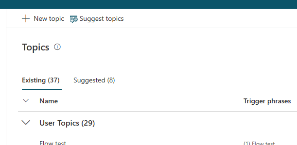

# Create and edit topics in your bot

In Power Virtual Agents, a topic defines a how a bot conversation plays out. 

You can author topics by customizing provided templates, create new topics from scratch, or [get suggestions from existing help sites](advanced-create-topics-from-web.md). 

A topic has trigger phrases - these are phrases, keywords, or questions that a user is likely to type that is related to a specific issue. 

The AI uses natural language understanding to parse what a customer actually types and find the most appropriate trigger phrase. 

For example, a user might type *Open hours* into your bot - the AI will be able to match that to the **Store hours** topic and begin a conversation that asks which store the customer is interested in, and then display the hours the store is open.

There are two parts to designing a topic: the topic's details, including its name and trigger phrases, and the bot conversation, which is defined by a series of nodes that you insert in the **Authoring canvas** for that topic.

You can see how the bot conversation works in practice by testing it in the **Test bot** pane. This lets you fine-tune the topic until you are ready to deploy it without having to exit the Power Virtual Agents portal.

## Create a topic

1. Go to the **Topics** tab on the side navigation pane to open the Topics page.

   

2. On the Topics page, select **New topic**.

   

   

3. Specify a name, description, and one or more trigger phrases for the topic.

    A trigger phrase is a phrase that a customer enters in the chat window to start a conversation with the bot. Once the conversation is started, the conversation follows the path you define. You can specify more than one trigger phrase for a topic. You can include punctuation in a trigger phrase, but it is best to use short phrases rather than long sentences.

    Select **Save topic** to add the topic to the topics list.

<<< INCLUDE IMAGE OF TOPIC DETAILS PAGE WITH SAVE HIGHLIGHTED >>>

## To design the topic's conversation path

1. Select **Go to authoring canvas** to open the conversation editor.

<<< INCLUDE IMAGE OF TOPIC DETAILS PAGE HIGHLIGHTING THE BUTTON  >>>

Power Virtual Agents opens the topic in the authoring canvas and displays the topic's trigger phrases. The authoring canvas is where you define the conversation path between a customer and the bot.

 <<< INCLUDE IMAGE OF AUTHORING CANVAS >>>
 
  As you define the topic's conversation path, you might want to expand the authoring canvas by hiding the test bot pane and side navigation pane. 
Zoom in and out of the design canvas by using the conversation editor's Zoom in and Zoom out buttons. Orient the current view of the conversation path within the conversation path as a whole by using the conversation editor's Mini-map button.

<<< INCLUDE SCREENSHOT OF THE CONTROLS ON BOTTOM LEFT OF THE AUTHORING CANVAS, HIGHLIGHT MINI MAP BUTTON >>>
 
2. Enter the bot's response to the trigger phrase in the **Message** box.

<<<< INCLUDE IMAGE OF MESSAGE NODE HIGHLIGHTED >>>>

3. To specify an additional response by the bot, select **+** to add a node, select **Show a message** to add a new Message node.

<<< INCLUDE IMAGE OF + CLICKED WITH OPTIONS EXPANDED >>>

   Then enter the additional response in the **Message** box.

4. To ask a question and get a response from the customer, select **Ask a question** in the options under the **+** to add a new node.    Enter the question text in the **Ask a question** box. 

<<< INCLUDE IMAGE OF ASK A QUESTION NODE ADDED >>>

   You can provide several options for the user’s response from the **Listen for** flyout. To understand more about the different options in this flyout, see [Using Entities](advanced-entities-greedy-slot-filling-virtual-agent.md).

<<< INCLUDE IMAGE OF THE LISTEN FOR FLYOUT EXPANDED >>>

   To give the customer a choice between different responses, select **Multiple choice options**.

  <<< INCLUDE IMAGE OF MULTIPLE CHOICE OPTIONS SELECTED >>>

   Then specify the options under **User options**. Add a couple options for the user to select from by clicking **+ New option** and entering the text of the option. Each option is presented as a multiple choice button to the user.

<<< INCLUDE IMAGE OF MULTIPLE CHOICE OPTIONS ADDED >>>

  The conversation editor creates separate paths in the conversation, depending on the customer's response. The conversation path leads the customer to the appropriate resolution for each user response.
  
<<< INCLUDE IMAGE OF THE FORKED TREE >>>

  You can save the user response in a variable to be used later. For more information on using variables, see [Use variables](authoring-variables-virtual-agent.md)

5. Add additional message nodes and user responses to complete the conversation path. Hover on the line between two nodes, and click on the **+** to add a new node.

6. To add a customer satisfaction survey at the end of a response that resolves the customer issue, select **End the conversation**, then select **End with survey**.

<<< INCLUDE IMAGE OF ENDING WITH SURVEY >>>

   Then select **Save** to save the conversation path.

As you design your topic's conversation path, you can use the **Test your bot** pane to see how the bot leads the customer through a conversation.

Note, you can have upto 1000 topics in a bot.

## To test the topic in the Test bot pane

1. To make sure you are using the most current bot content, select **Reset** at the top of the **Test bot** pane.

 <<< INCLUDE IMAGE OF THE TEST BOT PANE >>>

2. At the **Type your message** prompt at the bottom of the **Test bot** pane, enter a trigger phrase for the topic.

<<< INCLUDE IMAGE OF TYPE A MESSAGE BOX >>>

   The trigger phrase starts the topic's conversation. The **Test bot** pane displays the bot and user responses that you specified in the conversation editor.

 <<< INCLUDE IMAGE OF CONVERSATION IN PROGRESS IN TEST BOT PANE >>>
 
3. Continue the conversation path until you complete the conversation.

<< INCLUDE IMAGE OF SURVEY SHOWING AT THE END OF CONVERSATION IN TEST BOT PANE >>>

   If the conversation editor is open, you can select a response in the **Test bot** pane to navigate to the response in the conversation editor.

You can return to the conversation editor at any time to revise the topic's conversation path and continue to fine-tune the bot until you are ready to deploy it. For more information, see [Fundamentals - Publish your bot](publication-fundamentals-virtual-agent.md).

For more information on using the **Test bot** pane, see [Test your bot](authoring-test-bot-virtual-agent.md).

