# Create and edit topics in your Power Virtual Agents bot

Select the version of Power Virtual Agents you're using here:

> [!div class="op_single_selector"]
> - [Power Virtual Agents web app](authoring-create-edit-topics.md)
> - [Power Virtual Agents app in Microsoft Teams](teams/authoring-create-edit-topics-teams.md)

In Power Virtual Agents, a topic defines a how a bot conversation plays out. 

You can author topics by [customizing provided templates](authoring-template-topics.md), create new topics from scratch, or [get suggestions from existing help sites](advanced-create-topics-from-web.md). 

A topic has trigger phrases—these are phrases, keywords, or questions that a user is likely to type that is related to a specific issue —and conversation nodes—these are what you use to define how a bot should respond and what it should do.

The AI uses natural language understanding to parse what a customer actually types and find the most appropriate trigger phrase or node. 

For example, a user might type "Open hours" into your bot—the AI will be able to match that to the **Store hours** topic and begin a conversation that asks which store the customer is interested in, and then display the hours the store is open.

You can see how the bot conversation works in practice by testing it in the **Test bot** pane. This lets you fine-tune the topic until you are ready to deploy it without having to exit the Power Virtual Agents portal.

For bot and topic limits, see the [Quotas, limits, and configuration values](requirements-quotas.md) topic.

## Prerequisites

[!INCLUDE [Medical and emergency usage](includes/pva-usage-limitations.md)]

## Use system and sample topics

When you create a bot, a number of topics will be automatically created for you.

:::image type="content" source="media/topics-system.png" alt-text="Four lesson topics and a number of system topics are in the Topics list.":::

These are:
  
  - Four prepopulated **User Topics** that are titled as lessons. These [lesson topics](authoring-template-topics.md) can be used to help understand simple to complex ways of using nodes to create bot conversations.
  - A number of **System Topics**. These are prepopulated topics that you are likely to need during a bot conversation. We recommend you keep these and use them until you are comfortable with creating an end-to-end bot conversation.

You can edit both of these topic types in the same manner as for topics you create; however, you cannot delete them.

## Create a topic

1. Go to the **Topics** tab on the side navigation pane to open the topics page.

   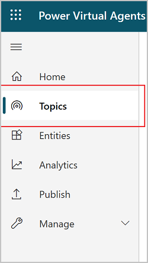

1. On the topics page, select **New topic**.

   

1. Specify a name, description, and one or more trigger phrases for the topic.

   A trigger phrase is a phrase that a customer enters in the chat window to start a conversation with the bot. Once the conversation is started, the conversation follows the path you define. You can specify more than one trigger phrase for a topic. You can include punctuation in a trigger phrase, but it is best to use short phrases rather than long sentences.

   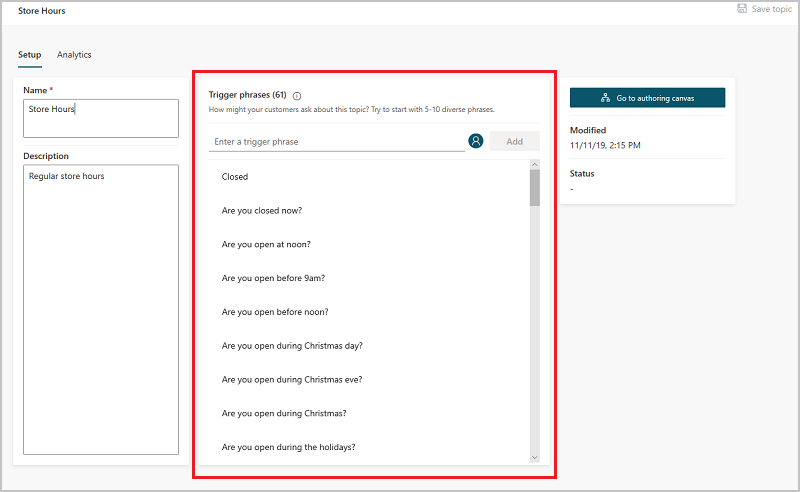

1. Select **Save topic** to add the topic to the topics list.

## Design the topic's conversation path

1. In the topic details for the topic you want to edit, select **Go to authoring canvas**.

   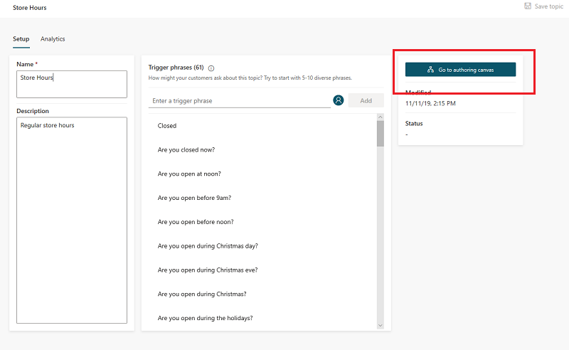

1. Power Virtual Agents opens the topic in the authoring canvas and displays the topic's trigger phrases. The authoring canvas is where you define the conversation path between a customer and the bot.

 
1. For existing or system topics, a number of nodes will automatically be created. You can edit these nodes just as you can for other nodes.

1. When you create a new topic, a **Trigger phrases** node and a blank **Message** node are inserted for you. 

1. You can add additional nodes by selecting the **Plus** (**+**) icon on the line or branch between or after a node.

   
   
1. You can also move or change the paths between a node by clicking and dragging the node anchor, which looks like a small circle on top of the node. When dragging, you'll see a dotted line indicating the original path. You can also double-click the anchor and then select the new place for the anchor (you won't see a dotted line).

    :::image type="content" source="media/move-anchor-node.png" alt-text="Screenshot of moving a node's anchor.":::

### Insert nodes

When adding a node, you can choose from several options. Each option has a specific node or nodes that will be inserted into the conversation path.

When adding a node after the **Trigger Phrases** node, or between **Message nodes**, you can:

- **Ask a question**
- **Call an action**
- **Show a message**
- **Go to another topic**

:::image type="content" source="media/topics-node-after-triggers.png" alt-text="Add nodes between existing nodes from the options.":::

After the last node, you can also:

- **End the conversation**

Additionally, you can **Add a condition** when inserting a node after a **Question** node.

#### Ask a question:

1. To have the bot ask a question and get a response from the user, select **+** to add a node, and then **Ask a question** to add a new **Question** node.

   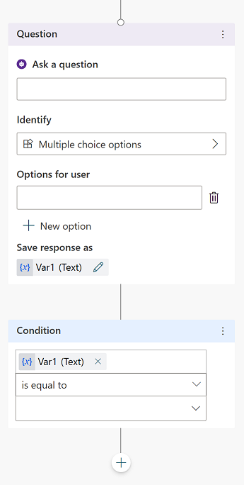

1. Enter the question phrase in the first text box, **Ask a question**.

1. You can choose from several options for the user's response in the **Identify** field. 
   
   These options determine what the bot should be listening for in the user's response. 
   
   For example, they could be multiple choice options, a number, or a specific string. 
   
   To understand more about the different options in this flyout, see [Use entities in a conversation](advanced-entities-slot-filling.md#use-entities-in-a-conversation).

1. Depending on what you choose in the **Identify** field, you can enter what options the user should have. 
   
   For example, if you select **Multiple choice options**, you can then enter the options the user can specify in the **Options for user** field. Each option is presented as a multiple choice button to the user, but users can also type in their answer in the bot.

   The conversation editor creates separate paths in the conversation, depending on the customer's response. The conversation path leads the customer to the appropriate resolution for each user response. You can add additional nodes to create branching logic, and specify what the bot should respond with for each variable.

1. You can [save the user response in a variable](authoring-variables.md) to be used later. 

> [!TIP]
> You can define synonyms for each option. This can help the bot to determine the correct option in case it isn't clear what the user's response should be mapped to.
> 1. Select the menu icon on the top of the **Question** node, and then select **Options for user**.
>
>    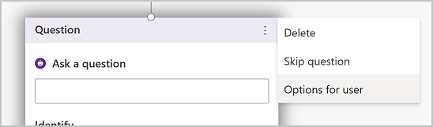
>
> 1. Select the **Synonyms** icon for the option you want to add additional keywords to. 
>
>    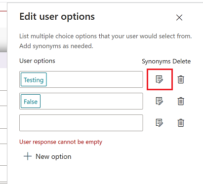
>
> 1. Add the keywords individually, and then once you're done, select **Done** to return to the **Authoring canvas**.

#### Call an action

You can [call Power Automate Flows](advanced-flow.md) and [insert authentication nodes](advanced-end-user-authentication.md) by selecting **Call an action**.
 

#### Show a message

1. To specify a response from the bot, select **+** to add a node, and then **Show a message** to add a new **Message** node.

1. Enter what you want the bot to say in the text box. You can apply some basic formatting, such as bold, italics, and numbering. 
   
   You can also [use variables that you have defined elsewhere](authoring-variables.md) in your bot conversation.

#### Redirect to another topic

1. To automatically have the bot move to a separate topic, select **+** to add a node, and then **Redirect to another topic**.

1. In the flyout menu, select the topic the bot should divert to. For example, you might want to send the user to a specific topic about the closure of a store if they ask about store hours for that store.

    :::image type="content" source="teams/media/topics-nodes-other-topic-flyout-teams.png" alt-text="Retirect to another topic node with options for other topics":::
    
When you insert a link to redirect to another topic, the bot will go through the conversation path for that topic. 

You can consider the redirected topic as a "subtopic". 

 

In the authoring canvas for the original topic, you can insert additional nodes under the subtopic's node.

When the path for the subtopic is finished, the bot will return to the original topic. The bot will then follow the nodes that are under the subtopic's node.

:::image type="content" source="media/authoring-create-edit-topics/authoring-subtopic-redirect.png" alt-text="Screenshot of the authoring canvas showing nodes under a redirected topic node.":::

If you redirect to any of the following [system topics](#use-system-and-sample-topics), however, the entire conversation will end:

- End of Conversation
- Confirmed Success
- Confirmed Failure
- Goodbye
- Escalate
- Start over (this will also reset any [global variables](authoring-variables-bot.md))

#### Passing variables between topics
When redirecting to other topics, you might want to pass values into variables in the destination topic or get variables back from it. This is especially useful when you already have information that the topic needs and don’t want to have the user answer the question again to obtain the information. This can also be helpful when refactoring and separating your topics into reusable components, and you want to pass variables across the topics.

>[!NOTE]
>Variable of type Custom Entity, Date Time, and Duration are not eligible to be passed between topics.  

##### Receive values from other topics
When a topic defines a variable (e.g., by a question node), the end user talking to the bot will be asked the question to fill in the variable’s value. If the value has already been acquired by the bot, there is no reason to ask the question again. For these cases, this variable can be defined as “Receive vales from other topics”. When other topics redirect to this topic, it can then pass a variable (or literal values) into this variable, and it will skip the question altogether. This leads to a seamless experience for the end user talking to the bot. 

To receive values from other topics, you need to set the variable's property following these steps:

1. Click on the variable you want to receive values from other topics 
2. In the **Variables properties** pane, click on **Receive values from other topics** under **Topic (limited scope)**

:::image type="content" source="teams/media/authoring-create-edit-topics/authoring-subtopic-pass-variable-properties-receive-input.png" alt-text="Screenshot of the authoring canvas showing variable properties pane with receive values selected.":::

3. Save the topic
4. Go to the other topic which you want to redirect to, and follow the steps in [Redirect to another topic](authoring-create-edit-topics.md#redirect-to-another-topic) to redirect to the correct topic
5. Click on **+ Add input for destionation topic**. 

:::image type="content" source="teams/media/authoring-create-edit-topics/authoring-subtopic-pass-variable-step1.png" alt-text="Screenshot of the authoring canvas showing adding input for destination topic.":::

6. Select the variable you want from the redirected topic you want to pass to

:::image type="content" source="teams/media/authoring-create-edit-topics/authoring-subtopic-pass-variable-step2.png" alt-text="Screenshot of the authoring canvas showing selection of topic from redirect topic.":::

7. In the dropdown, select the variable from the current topic you want to pass into the redirected topic

:::image type="content" source="teams/media/authoring-create-edit-topics/authoring-subtopic-pass-variable-step3.png" alt-text="Screenshot of the authoring canvas showing selection of variable from dropdown.":::

8. Once selected, the variable will be shown in the redirected node

:::image type="content" source="teams/media/authoring-create-edit-topics/authoring-subtopic-pass-variable-step4.png" alt-text="Screenshot of the authoring canvas showing variable being passed into redirect node.":::

##### Return values to original topics
When a topic asks a question (or otherwise obtains a variable from an action), this variable can be returned to the original topic that redirected to it. In this case, the variable becomes part of the original topic as well and can be used as any other variable. This helps the author construct the topic in a way that information obtained by the bot is used across topics. This also reduces the need for global variables.

To return a variable to the original topic, you need to set the variable's property following these steps:

1. Click on the variable you want to receive values from other topics 
2. In the **Variables properties** pane, click on **Return values to original topics** under **Topic (limited scope)**

:::image type="content" source="teams/media/authoring-create-edit-topics/authoring-subtopic-pass-variable-properties-return-value.png" alt-text="Screenshot of the authoring canvas showing variable properties pane with return values selected.":::

3. Save the topic
4. Go to the other topic which you want to redirect to, and follow the steps in [Redirect to another topic](authoring-create-edit-topics.md#Redirect-to-another-topic) to redirect to the correct topic
5. The variable that's being returned to the topic is shown in the redirected topic

:::image type="content" source="teams/media/authoring-create-edit-topics/authoring-subtopic-pass-variable-pass-receive.png" alt-text="Screenshot of the authoring canvas showing redirect topic with both values input and returned.":::

##### Using the variables pane
Alternativaly, you can also use the Variables pane to select the reveice/return status of multiple variables at once

1. Select the variables pane entry from the top bar

:::image type="content" source="teams/media/authoring-create-edit-topics/authoring-subtopic-pass-variable-variables-bar.png" alt-text="Screenshot of the authoring canvas showing variables pane button":::

2. Select the input / return options for the variable as appropriate

:::image type="content" source="teams/media/authoring-create-edit-topics/authoring-subtopic-pass-variable-variable-return-value.png" alt-text="Screenshot of the authoring canvas showing variable pane with two variables":::

##### Using literal values on variable inputs
When passing a variable into a topic, you can also pass literal values in the input instead of a variable. Type the value intended to be passed in directly into the redirect node input.

To pass a literal value, simply type the value you want to use as input instead of selecting a variable from the dropdown
:::image type="content" source="teams/media/authoring-create-edit-topics/authoring-subtopic-pass-variable-literal-value.png" alt-text="Screenshot of the authoring canvas showing literal input on an input variable in a redirect note":::
 

#### End the conversation

When you end the conversation, you can have a survey appear that asks the user if their question or issue was answered or resolved correctly. This information is collected under the [customer satisfaction analytics page](analytics-csat.md).

You can also have the conversation [handed over to a live agent](advanced-hand-off.md) if you're using a suitable customer service portal, such as Omnichannel for Customer Service.

1. At the end of a response that resolves the user's issue or answers the question, select **End the conversation**.

    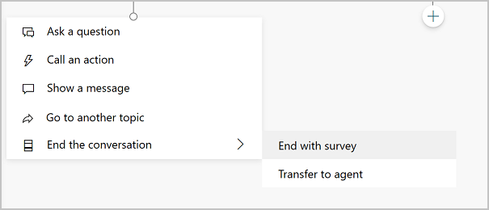

1. To end with a customer satisfaction survey, select **End with survey**.
    
    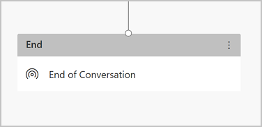

1. Select **Transfer To Agent** to insert a hand-off node that will link with your [configured hand-off product](configuration-hand-off-omnichannel.md). You can also enter a private message to the agent.

    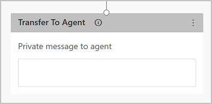

#### Add a condition

1. To add branching logic based on [variables](authoring-variables.md), select **+** to add a node, and then **Add a condition** and **Branch based on a condition**.

1. Choose the variable you want to use to determine if the bot conversation should branch at this point. For example, if you have set up [end-user authentication](advanced-end-user-authentication.md), then you might want to specify a different message if the user is signed on (which may have happened earlier in the conversation).

    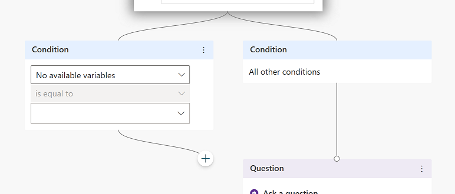

### Delete nodes

1. Select the menu icon on the top of the node's title.

1. Select **Delete**.

    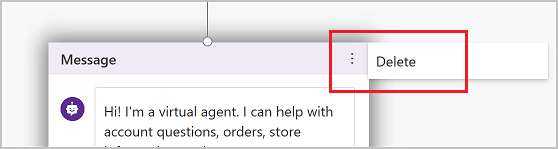

## Test and publish your bot

[Test your bot](authoring-test-bot.md) when you make changes to your topics, to ensure everything is working as expected.

Once you've finished designing and testing your bot, you can consider [publishing it to the web, mobile or native apps, or Microsoft Bot Framework channels](publication-fundamentals-publish-channels.md).

[!INCLUDE[footer-include](includes/footer-banner.md)]
